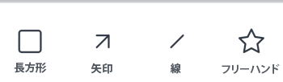
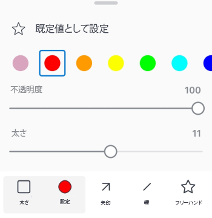
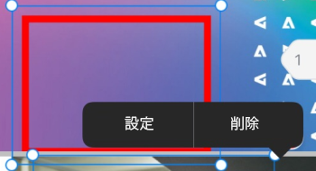

# での配達確認に対するコメント [!DNL iOS]

配達確認に対する既存のコメントを確認および解決し、新しいコメントや注釈を配達確認ドキュメントに追加できます。

配達確認に対するコメントへのアクセスは、 [!DNL Adobe Workfront]. 校正機能について詳しくは、 [の配達確認権限プロファイル [!DNL Workfront Proof]](../../../workfront-proof/wp-acct-admin/account-settings/proof-perm-profiles-in-wp.md).

>[!NOTE]
>
>配達確認の所有者が配達確認をロックした場合、配達確認に対するコメントを作成できません。 詳しくは、 [配達確認のロックとロック解除](../../../workfront-basics/mobile-apps/using-the-workfront-mobile-app/work-with-proofs-in-mobile-app.md#lock) 記事内 [の配達確認を確認し、決定する [!DNL Adobe Workfront] モバイルアプリ](../../../workfront-basics/mobile-apps/using-the-workfront-mobile-app/work-with-proofs-in-mobile-app.md).

## 配達確認の既存のコメントを確認

配達確認ドキュメントに対して行われたコメントを確認できます。 コメントには、コメントが参照するドキュメントの領域を呼び出すための図面が関連付けられている場合が多くあります。 図面には、矢印、線、長方形、ハイライト表示、フリーハンドの図面を含めることができます。

1. ドキュメント配達確認を開きます。 詳しくは、 [の配達確認を確認し、決定する [!DNL Adobe Workfront] モバイルアプリ](../../../workfront-basics/mobile-apps/using-the-workfront-mobile-app/work-with-proofs-in-mobile-app.md).
1. ドキュメントページでコメントアイコンを選択します  コメントと関連する図面および添付ファイルを開きます。

   コメントに複数の返信がある場合は、 **[!UICONTROL 返信の表示]** すべての返信を表示するには、またはコメントシートを上下にスワイプして、さらに多くの内容を表示します。

1. コメントに添付ファイルを表示するには、コメントのサムネールを選択します。 画面の指示に従って、添付ファイルをデバイスにダウンロードします。
1. コメントに返信するには、コメントの下のテキストボックスに回答を入力し、 **[!UICONTROL 送信]** アイコン .

### コメントリストを使用

1. すべてのコメントの一覧をページ番号順に表示するには、コメントアイコンを選択します  右上に

   未読のコメントの数がコメントアイコンに表示されます。  リスト内の未読のコメントは、青い点でマークされます。 添付ファイル付きのコメントには、紙のクリップアイコンが表示されます ![[!UICONTROL 添付ファイル] アイコン](assets/mobile-paper-clip-icon.png).

1. リストで個々のコメントを選択し、コメントとその関連図面をドキュメントページに表示します。
1. 「 X 」を選択してコメントリストを閉じ、配達確認に戻ります。

### コメントに対するアクションの実行

内 [!UICONTROL コメント] リストを使用すると、コメントの解決や既読としてのマークなど、様々な操作を実行できます。

1. コメントを選択：

   * 個々のコメントを押したまま選択します。
   * 選択 **[!UICONTROL 選択]** 右上に、各コメントの横にチェックボックスが表示されます。 次に、コメントのチェックボックスをタップするか、 **[!UICONTROL すべてを選択]** を左上に置きます。

1. 選択したコメントを解決するには、「 ![[!UICONTROL コメントを解決] アイコン](assets/mobile-resolvecomment-icon-30x30.png) をクリックします。

   一度に解決できるコメントは 1 つだけです。 コメントは、解決されたことを示す緑色のアイコンでマークされます。

   元のコメントはドキュメントに残ります。 コメントの解決は、元のコメントへの返信として表示されます。&quot;[!UICONTROL このスレッドは次の方法で解決されました： [名前].]&quot;

   解決されたコメントを選択し、「 **[!UICONTROL 取り消し]** アイコン

1. 選択したコメントを既読としてマークするには、 **[!UICONTROL 既読としてマーク]** アイコン  をクリックします。

   このオプションは、未読のコメントが選択されている場合にのみ使用できます。

1. 選択したコメントを削除するには、 **[!UICONTROL 削除]** アイコン  をクリックします。 次に、 **[!UICONTROL 削除]** をクリックして、コメントを完全に削除します。

## 配達確認に対するコメント

配達確認のコメントをドキュメントの特定の領域に関連付けることができます。 注釈を付ける領域を選択するには、描画ツールを使用します。

1. ドキュメント配達確認を開きます。 詳しくは、 [の配達確認を確認し、決定する [!DNL Adobe Workfront] モバイルアプリ](../../../workfront-basics/mobile-apps/using-the-workfront-mobile-app/work-with-proofs-in-mobile-app.md).
1. 配達確認画面の下部にあるツールバーから描画ツールを選択します。

   

   必要なツールが表示されない場合は、ツールバーを右にスクロールします。

1. 選択 **[!UICONTROL 設定]** ツール名の横に、色、不透明度、太さを定義します。 星形のアイコンを選択して、これらの選択をツールのデフォルト設定にします。

   

1. 配達確認ドキュメントに図形を描画します。 を選択します。 **[!UICONTROL 取り消し]** アイコン  をクリックして、図面を元に戻します。
1. （条件付き）図形を選択し、 **[!UICONTROL 設定]** シェイプ設定を編集するには、または **[!UICONTROL 削除]** をクリックして、シェイプを削除します。

   

1. 選択 **[!UICONTROL コメントを追加]**.
1. テキストボックスにコメントを入力します。
1. コメントに連絡先をタグ付けするには、@記号を入力するか、 ![[!UICONTROL 連絡先のタグ付け]](assets/mobile-tag-user-icon.png) @記号を追加するには、追加する連絡先の名前を入力し、ドロップダウンリストに表示されたら名前をクリックします。

   配達確認にコメントが追加されると、連絡先に電子メール通知が送信されます。

1. コメントに添付ファイルを追加するには、 ![[!UICONTROL 添付ファイル] アイコン](assets/mobile-paper-clip-icon.png). 選択 **[!UICONTROL ライブラリから選択]**, **[!UICONTROL 写真を撮る]**&#x200B;または **[!UICONTROL ドキュメントを選択]**&#x200B;をクリックし、プロンプトに従って、コメントにファイルまたは写真を添付します。

   添付ファイルを削除するには、サムネール画像の X をクリックします。

1. を選択します。 **[!UICONTROL 送信]** アイコン  をクリックして、コメントと図面を配達確認に追加します。
