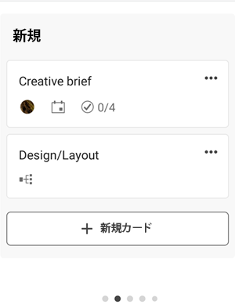
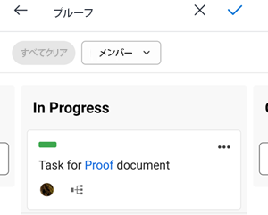

# [!DNL Adobe Workfront] [!UICONTROL ボード] モバイル用

[!DNL Adobe Workfront] [!UICONTROL ボード] は、列とカードを含む共有ボードにアクセスできるようにし、チームでの共同作業を可能にする柔軟なツールです。 ボードについて詳しくは、 [ボードの概要](/help/quicksilver/agile/boards-overview.md).

内 [!DNL Workfront] モバイルアプリの場合は、作成または追加されたすべてのボードが、のデスクトップバージョンで表示されます。 [!DNL Workfront]. モバイルアプリで新しいボードを作成することはできません。

デスクトップ版のボードの列とカードに加えた変更は、デスクトップ版のボードにも反映されます。

モバイルボードでフィードバックを提供するには、 **[!UICONTROL 送信]**  アイコンをクリックし、プロンプトに従って、任意のボードの上部に表示されます。

## ボードのリストを表示してフィルターします

1. 選択 [!UICONTROL **ボード**] をクリックすると、デスクトップバージョンの [!DNL Workfront].

   

1. ボードのリストを並べ替えたり、フィルター処理するには、 [!UICONTROL **その他のフィルター**].
1. 次のオプションから選択します。

   * 「フィルター」セクションで、「 [!UICONTROL **アーカイブ済み**] をクリックして、アーカイブされたボードをリストに表示します。 デフォルトでは、アクティブなボードのみが表示されます。
   * 「並べ替え」セクションで、「 [!UICONTROL **変更日**] または [!UICONTROL **名前**].
   * 「順序」セクションで、「 [!UICONTROL **昇順**] または [!UICONTROL **降順**] をクリックして、並べ替え順を定義します。

1. 選択 [!UICONTROL **適用**] または  をクリックしてフィルターを適用し、ボードのリストに戻ります。

   これらのオプションにいつでもアクセスして、変更したり、デフォルト設定に戻ることができます。

1. ボードを開くには、リストから選択します。

>[!NOTE]
>
>現時点では、のデスクトップバージョンからのボードのアーカイブまたは削除のみ実行できます。 [!DNL Workfront] [!UICONTROL ボード]（モバイルアプリからではなく）

## ボードコンテンツを表示

ボードを開くと、その列とカードが表示されます。 すべての列を表示するには水平方向にスクロールし、列内のすべてのカードを表示するには垂直方向にスクロールします。

別の列に移動するには、カードを選択したままにします。

ボードに取り込み口列が含まれている場合は、一番左の列として表示されます。 取り込みカラムのカードは、他のボードカラムに移動するまで編集できません。 カードを選択して、タスクまたはイシューを開くことができます。 取り込みカラムフィルタは、ボードのデスクトップバージョンで制御されます。 詳しくは、 [ボードに吸気柱を追加する](/help/quicksilver/agile/use-boards-agile-planning-tools/add-intake-column-to-board.md).

## 接続されたカードの使用

接続されたカードは、 [!DNL Workfront]. モバイルアプリでは、  アイコン 下の画像では、2 枚目のカードは接続されたカードです。

ある場所のカードについて、次のいずれかの詳細が更新されると、別の場所で自動的に更新されます。

* [!UICONTROL 名前]
* [!UICONTROL 説明]
* [!UICONTROL 割り当て先]
* [!UICONTROL ステータス]

例えば、モバイルアプリ内のボード上で接続されているカードの名前を更新すると、タスクやイシューでも更新されます。

1. カードを選択して、名前、説明、列、割り当て先、接続、ステータス、期限、推定、タグ、チェックリストの項目を確認します。 これらの詳細を編集すると、それらは自動的に保存されます。 X を選択してカードを閉じ、ボードに戻ります。

   >[!NOTE]
   >
   >カードで別のタグを選択することはできますが、モバイルアプリで新しいタグを作成することはできません。

1. （オプション）カードを削除するには、 [!UICONTROL **詳細**] メニュー  を選択し、 [!UICONTROL **削除**]. 次に、 [!UICONTROL **削除**] をクリックします。

## アドホックカードの使用

アドホックカードはWorkfrontのタスクやイシューには接続されません。 下の画像では、最初のカードがアドホックカードです。

1. カードを選択して、名前、説明、列、割り当て先、ステータス、期限、見積もり、タグ、チェックリストの項目を確認します。 これらの詳細を編集すると、それらは自動的に保存されます。 X を選択してカードを閉じ、ボードに戻ります。

   >[!NOTE]
   >
   >カードで別のタグを選択することはできますが、モバイルアプリで新しいタグを作成することはできません。

1. （オプション）新しいアドホックカードを追加するには、 [!UICONTROL **新しいカード**] カードを追加する列に、カード名を入力します。 詳細を追加するには、新しく追加したカードを選択します。

1. （オプション）カードをコピーするには、 [!UICONTROL **詳細**] メニュー  を選択し、 [!UICONTROL **コピー**].

1. （オプション）カードを削除するには、 [!UICONTROL **詳細**] メニュー  を選択し、 [!UICONTROL **削除**]. 次に、 [!UICONTROL **削除**] をクリックします。

## カードのチェックリスト項目を管理

チェックリスト項目は、アドホックカードと接続されたカードの両方で使用できます。

1. チェックリスト項目を追加するには、カードを開き、「 」を選択します。 [!UICONTROL **新しいチェックリスト項目**]. チェックリスト項目名を入力します。 カードのカウンターが更新されます。
1. （オプション）チェックリスト項目をコピーするには、カードを開き、 [!UICONTROL **詳細**] メニュー  をクリックし、を選択します。 [!UICONTROL **コピー**]. 項目のコピーがリストの下部に追加されます。
1. （オプション）チェックリスト項目を削除するには、カードを開き、 [!UICONTROL **詳細**] メニュー  をクリックし、を選択します。 [!UICONTROL **削除**].
1. チェックリスト項目を完了するには、カードを開き、項目名の横にあるチェックボックスを選択します。
項目が完了とマークされ、カードのカウンターが更新されて、完了したチェックリスト項目の数が表示されます。

## ボードでのフィルターと検索

特定のユーザーに割り当てられたカードを表示するボードをフィルタリングしたり、検索してボード上の特定のカードを見つけたりできます。

フィルターを適用すると、ボードにインジケーターが表示されます . フィルターアイコンを選択し、「 」を選択します。 [!UICONTROL **すべてクリア**] をクリックして、ボードからすべてのフィルターを削除します。

### 割り当て先によるボードのフィルタリング

1. フィルターと検索アイコンを選択します。 .
1. 選択 [!UICONTROL **メンバー**] カードを見たい人を選択します。 未割り当てのカードを表示することもできます。
1. 選択 [!UICONTROL **完了**] または .

### タグ ([!DNL iOS] のみ )

1. フィルターと検索アイコンを選択します。 .
1. 選択 [!UICONTROL **タグ**] をクリックし、表示するタグを選択します。
1. 選択 [!UICONTROL **完了**].

### ボードでの検索

1. フィルターと検索アイコンを選択します。 .
1. ボックスに検索語を入力し、「 」を選択します。 [!UICONTROL **完了**] または .

   タイトルに検索語を含むカードがすべて表示されます。
「 X 」を選択して検索をクリアします。

   
