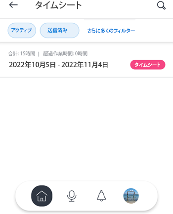
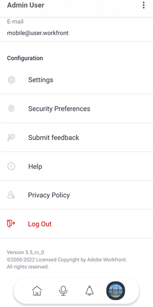

# [!DNL Android] 向け [!DNL Adobe Workfront]

[!DNL Adobe Workfront] アプリを使用すると、任意の [!DNL Android] デバイスで作業にアクセスできます。[!DNL Workfront] モバイルアプリは、[!DNL Android] 5.0 以降を実行している携帯電話およびタブレットにインストールして使用できます。

モバイルアプリへのログインについて詳しくは、[ [!DNL Adobe Workfront]](../../../workfront-basics/manage-your-account-and-profile/managing-your-workfront-account/log-in-to-workfront.md) へのログインの記事で、[ [!DNL Workfront]  モバイルアプリへのログイン](../../../workfront-basics/manage-your-account-and-profile/managing-your-workfront-account/log-in-to-workfront.md#log)の節を参照してください。

## [!UICONTROL ホーム]

[!UICONTROL ホーム]エリアでは、自分に割り当てられたタスク、イシュー、承認で直接作業できます。アプリの[!UICONTROL ホーム]エリアでは、次の操作を実行できます。

<table style="table-layout:auto"> 
 <col> 
 <col> 
 <tbody> 
  <tr> 
   <td> 
    <ul> 
     <li>タスクとイシューに関する作業を開始する</li> 
     <li>タスクとイシューを [!UICONTROL Done] としてマークする</li> 
     <li>タスクおよびイシューを再割り当て</li> 
     <li>[!UICONTROL Commit Date]の変更</li> 
    </ul> </td> 
   <td> 
    <ul> 
     <li>タスクとイシューのステータスを更新</li> 
     <li>更新エリアに投稿</li> 
     <li>ドキュメントを表示</li> 
     <li>写真を添付</li> 
     <li> 
リクエストまたはクイックタスクを作成
 
メモ：ホームで作成されたクイックタスクは、プロジェクトを割り当てる場合を除き、個人のタスクです。
 </li> 
    </ul> </td> 
  </tr> 
 </tbody> 
</table>

詳しくは、モバイルアプリの[[!UICONTROL ホーム]エリアウィジェット](../../../workfront-basics/mobile-apps/using-the-workfront-mobile-app/home-area-widgets-mobile.md)および[[!UICONTROL 自分の作業]セクション](../../../workfront-basics/mobile-apps/using-the-workfront-mobile-app/my-work-section-mobile.md)を参照してください。

## [!UICONTROL ボード]

[!UICONTROL ボード]エリアでは、[!DNL Workfront] ボードにアクセスできます。

詳しくは、モバイル用 [[!DNL Adobe Workfront] [!UICONTROL Boards] ](/help/quicksilver/workfront-basics/mobile-apps/using-the-workfront-mobile-app/mobile-boards.md)を参照してください。

## [!UICONTROL プロジェクト]

[!UICONTROL プロジェクト]エリアでは、自分が所有するプロジェクトと自分が所属しているプロジェクトを操作および管理できます。アプリの[!UICONTROL プロジェクト]エリアでは、次の操作を実行できます。

<table style="table-layout:auto"> 
 <col> 
 <col> 
 <tbody> 
  <tr> 
   <td> 
    <ul> 
     <li>プロジェクトのステータスを更新する</li> 
     <li>重要なプロジェクトの詳細を表示</li> 
     <li>[!UICONTROL Updates] エリアに投稿</li> 
     <li>タスク、イシュー、リクエストをプロジェクトに変換</li> 
    </ul> </td> 
   <td> 
    <ul> 
     <li>プロジェクトのタスクとイシューを操作</li> 
     <li>ドキュメントを表示</li> 
     <li>写真を添付</li> 
     <li> 
クイックタスクを作成
 
メモ：プロジェクトで作成されたタスクは、自分が属しているプロジェクトに自動的に割り当てられます。 
 </li> 
    </ul> </td> 
  </tr> 
 </tbody> 
</table>

## [!UICONTROL 承認]

[!UICONTROL 承認]エリアでは、自分に割り当てられた承認やデリゲートされた承認を表示および承認できます。[!UICONTROL 承認]エリアでは、以下を承認できます。

<table style="table-layout:auto">
 <col>
 <col>
 <tbody>
  <tr>
   <td>
    <ul>
     <li>作業（タスクとイシュー）</li>
     <li>ドキュメント</li>
     <li>プルーフ </li>
    </ul> </td>
   <td>
    <ul>
     <li>タイムシート</li>
     <li>アクセスリクエスト</li>
    </ul> </td>
  </tr>
 </tbody>
</table>

承認について詳しくは、[ [!DNL Adobe Workfront]  モバイルアプリ内の承認](../../../workfront-basics/mobile-apps/using-the-workfront-mobile-app/approvals-in-mobile-app.md)を参照してください。

プルーフのレビューと承認について詳しくは、[ [!DNL Adobe Workfront] モバイルアプリ](../../../workfront-basics/mobile-apps/using-the-workfront-mobile-app/work-with-proofs-in-mobile-app.md)でプルーフをレビューして決定を参照してください。

## [!UICONTROL 通知]

[!UICONTROL 通知]エリアでは、作業中のアプリ内通知を表示し、応答することができます。

>[!NOTE]
>メモの内容全体が表示テキストのないハイパーリンクである場合を除き、ハイパーリンクは更新通知では使用できません。

## [!UICONTROL リクエスト]

[!UICONTROL リクエスト]エリアでは、リクエストの詳細を表示できます。アプリの[!UICONTROL リクエスト]エリアでは、次の操作を実行できます。

<table style="table-layout:auto">
 <col>
 <col>
 <tbody>
  <tr>
   <td>
    <ul>
     <li>リクエストを再割り当てする</li>
     <li>イシューのステータスを更新する</li>
     <li>優先度を調整する</li>
    </ul> </td>
   <td>
    <ul>
     <li>更新エリアに投稿</li>
     <li>ドキュメントを表示</li>
     <li>写真を添付</li>
     <li>リクエストをドラフトとして保存する</li>
    </ul> </td>
  </tr>
 </tbody>
</table>

## [!UICONTROL タイムシート]

[!UICONTROL タイムシート]エリアでは、タイムシートの詳細を表示できます。アプリのタイムシートエリアでは、次の操作を実行できます。

* [!UICONTROL 更新]エリアに投稿
* 時間タイプを調整する
* 記録した時間を変更する
* タイムシートにコメントを入力する
* タイムシートを閉じる

## [!UICONTROL お気に入り]

[!UICONTROL お気に入り]メニューから既存の項目にアクセスし、お気に入りメニューに新しい項目を追加できます。

## [!UICONTROL 連絡先]

[!UICONTROL 連絡先]エリアでは、社内のすべてのユーザーの連絡先情報を表示できます。

## [!UICONTROL 構成]

[!UICONTROL 設定]エリアでは、次の操作を実行できます。

* 設定を管理する
* 割り当てられたチームを表示する
* セキュリティの環境設定を指定する
* フィードバックを送信
* ヘルプコンテンツにアクセスする
* ログアウト

## [!UICONTROL 仮想アシスタント]

仮想アシスタントでは、音声コマンドを使用して次のタスクを実行できます。

* [!UICONTROL 表示してください]
* [!UICONTROL 削除]
* [!UICONTROL 検索対象]
* [!UICONTROL コマンドで手伝ってください]

仮想アシスタントについて詳しくは、[Adobe  [!DNL Workfront]  モバイルアプリ仮想アシスタント](../../../workfront-basics/mobile-apps/using-the-workfront-mobile-app/wf-mobile-virtual-assistant.md)を参照してください。

## [!UICONTROL ピン留め]

[!UICONTROL ピン]エリアを使用すると、web ブラウザーから保存した仮想アシスタントのコマンドとピンにアクセスできます。

仮想アシスタントについて詳しくは、[Adobe  [!DNL Workfront]  モバイルアプリ仮想アシスタント](../../../workfront-basics/mobile-apps/using-the-workfront-mobile-app/wf-mobile-virtual-assistant.md)を参照してください。
