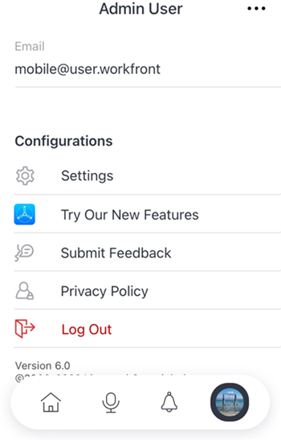
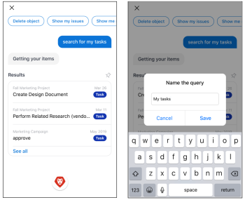

# [!DNL Adobe Workfront] の [!DNL iOS]

この [!DNL Adobe Workfront] アプリを使用すると、任意の [!DNL iOS] デバイス。 をインストールして、 [!DNL Workfront] iOS 10 以降を実行する携帯電話およびタブレットでのモバイルアプリ。 専用 [!DNL Workfront] モバイルアプリは、 [!DNL iPhone] そして [!DNL iPad].

モバイルアプリへのログインについて詳しくは、 [にログインします。 [!UICONTROL Workfront] モバイルアプリ](../../../workfront-basics/manage-your-account-and-profile/managing-your-workfront-account/log-in-to-workfront.md#log) 記事内 [にログインします。 [!DNL Adobe Workfront]](../../../workfront-basics/manage-your-account-and-profile/managing-your-workfront-account/log-in-to-workfront.md).

## [!UICONTROL ホーム]

この [!UICONTROL ホーム] 「 」領域では、割り当てられたタスク、問題および承認を直接操作できます。 次の [!UICONTROL ホーム] 領域では、次の操作を実行できます。

<table style="table-layout:auto"> 
 <col> 
 <col> 
 <tbody> 
  <tr> 
   <td> 
    <ul> 
     <li>タスクと問題に関する作業を開始する</li> 
     <li>タスクと問題を [!UICONTROL 完了 ] としてマーク</li> 
     <li>タスクと問題の再割り当て</li> 
     <li>[!UICONTROL コミット日 ] の変更</li> 
    </ul> </td> 
   <td> 
    <ul> 
     <li>タスクと問題ステータスを更新</li> 
     <li>「更新」領域に投稿</li> 
     <li>ドキュメントを表示</li> 
     <li>写真を添付</li> 
     <li> 
リクエストまたはクイックタスクの作成
 
注意：自宅で作成されたクイックタスクは、プロジェクトを割り当てる場合を除き、個人のタスクです。
 </li> 
    </ul> </td> 
  </tr> 
 </tbody> 
</table>

詳しくは、 [[!UICONTROL ホーム] 領域ウィジェット](../../../workfront-basics/mobile-apps/using-the-workfront-mobile-app/home-area-widgets-mobile.md) および [[!UICONTROL マイワーク] モバイルアプリのセクション](../../../workfront-basics/mobile-apps/using-the-workfront-mobile-app/my-work-section-mobile.md).

## [!UICONTROL ボード]

この [!UICONTROL ボード] 領域で、 [!DNL Workfront] ボード。

詳しくは、 [[!DNL Adobe Workfront] [!UICONTROL Boards] モバイル用](/help/quicksilver/workfront-basics/mobile-apps/using-the-workfront-mobile-app/mobile-boards.md).

## [!UICONTROL プロジェクト]

この [!UICONTROL プロジェクト] 領域を使用すると、 [!UICONTROL プロジェクト] 自分が所有しているプロジェクトと、自分が所有しているプロジェクト。 アプリのプロジェクト領域では、次の操作を実行できます。

<table style="table-layout:auto"> 
 <col> 
 <col> 
 <tbody> 
  <tr> 
   <td> 
    <ul> 
     <li>プロジェクトステータスの更新</li> 
     <li>重要なプロジェクトの詳細を表示</li> 
     <li>[!UICONTROL 更新 ] 領域に投稿</li> 
     <li>タスク、イシュー、リクエストをプロジェクトに変換する</li> 
    </ul> </td> 
   <td> 
    <ul> 
     <li>プロジェクトタスクと問題の操作</li> 
     <li>ドキュメントを表示</li> 
     <li>写真を添付</li> 
     <li> 
クイックタスクを作成
 
注意：プロジェクトで作成されたタスクは、自分のプロジェクトに自動的に割り当てられます。 
 </li> 
    </ul> </td> 
  </tr> 
 </tbody> 
</table>

## 承認

この [!UICONTROL 承認] 領域では、表示と承認が可能です [!UICONTROL 承認] 割り当てられた、または委任されたユーザー 承認領域から、次の項目を承認できます。

<table style="table-layout:auto">
 <col>
 <col>
 <tbody>
  <tr>
   <td>
    <ul>
     <li>作業（タスクと問題）</li>
     <li>ドキュメント</li>
     <li>プルーフ </li>
    </ul> </td>
   <td>
    <ul>
     <li>タイムシート</li>
     <li>アクセス要求</li>
    </ul> </td>
  </tr>
 </tbody>
</table>

承認について詳しくは、 [内の承認 [!DNL Adobe Workfront] モバイルアプリ](../../../workfront-basics/mobile-apps/using-the-workfront-mobile-app/approvals-in-mobile-app.md).

配達確認のレビューと承認について詳しくは、 [の配達確認を確認し、決定する [!DNL Adobe Workfront] モバイルアプリ](../../../workfront-basics/mobile-apps/using-the-workfront-mobile-app/work-with-proofs-in-mobile-app.md).

## [!UICONTROL 通知]

この [!UICONTROL 通知] 領域では、作業中のアプリ内通知を表示し、応答することができます。

>[!NOTE]
>メモの内容全体が表示テキストのないハイパーリンクでない限り、ハイパーリンクは更新通知では使用できません。

## [!UICONTROL リクエスト]

この [!UICONTROL リクエスト] 領域では、リクエストの詳細を表示できます。 次の [!UICONTROL リクエスト] 領域では、次の操作を実行できます。

<table style="table-layout:auto">
 <col>
 <col>
 <tbody>
  <tr>
   <td>
    <ul>
     <li>リクエストの再割り当て</li>
     <li>ステータスの更新</li>
     <li>優先度を調整</li>
    </ul> </td>
   <td>
    <ul>
     <li>[!UICONTROL 更新 ] 領域に投稿</li>
     <li>ドキュメントを表示</li>
     <li>写真を添付</li>
     <li>リクエストをドラフトとして保存</li>
    </ul> </td>
  </tr>
 </tbody>
</table>

## タイムシート

この [!UICONTROL タイムシート] 「領域」では、タイムシートの詳細を表示できます。 内 [!UICONTROL タイムシート] 領域では、次の操作を実行できます。

* 次に投稿： [!UICONTROL 更新] 領域
* 時間タイプの調整
* ログに記録した時刻を変更します
* タイムシートにコメントを入力
* タイムシートを閉じる

## [!UICONTROL お気に入り]

お気に入りメニューから既存の項目にアクセスし、新しい項目を [!UICONTROL お気に入り] メニュー

## [!UICONTROL 連絡先]

この [!UICONTROL 連絡先] 「 」領域では、社内のすべてのユーザの連絡先情報を表示できます。

## [!UICONTROL 構成]

この [!UICONTROL 設定] 「 」領域では、次の操作を実行できます。

* 設定を管理
* 割り当てられたチームを表示
* セキュリティ環境設定の設定
* フィードバックを送信
* ヘルプコンテンツにアクセス
* ログアウト

## 仮想アシスタント

仮想アシスタントでは、音声コマンドを使用して次のタスクを実行できます。

* [!UICONTROL 表示]
* [!UICONTROL 削除]
* [!UICONTROL 検索対象]
* [!UICONTROL コマンドを使用する]

仮想アシスタントの詳細については、 [[!DNL Adobe Workfront] モバイルアプリ仮想アシスタント](../../../workfront-basics/mobile-apps/using-the-workfront-mobile-app/wf-mobile-virtual-assistant.md).

## [!UICONTROL ピン留め]

この [!UICONTROL ピン留め] area を使用すると、保存した仮想アシスタントのコマンドとピンに Web ブラウザからアクセスできます。

仮想アシスタントの詳細については、 [Adobe Workfront mobile app virtual assistant](../../../workfront-basics/mobile-apps/using-the-workfront-mobile-app/wf-mobile-virtual-assistant.md).
