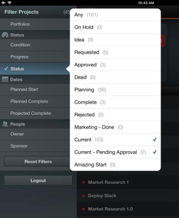

# のプロジェクトリストをフィルター [!DNL Adobe Workfront View]

デフォルトでは、 [!DNL Adobe Workfront View] には、 [!UICONTROL すべてのプロジェクト] リスト [!DNL Workfront]そのため、表示するためにアクセスできるすべてのプロジェクトが、ステータスに関係なく一覧表示されます。

プロジェクトのリストは、 [!DNL Workfront View] をクリックして、自分に関連するプロジェクトのみを表示します。 フィルターを適用した後、プロジェクトリストは次回ログインするまで、または変更されるまで、フィルターされたままになります。

## アクセス要件

次のアクセス権を [!DNL Workfront] この記事の手順を実行するには、次の手順に従います。

<table style="table-layout:auto"> 
 <col> 
 </col> 
 <col> 
 </col> 
 <tbody> 
  <tr> 
   <td role="rowheader"><strong>[!DNL Adobe Workfront] plan*</strong>/td&gt; 
   <td> 
任意
 </td> 
  </tr> 
  <tr> 
   <td role="rowheader"><strong>[!DNL Adobe Workfront] ライセンス*</strong></td> 
   <td> 
[!UICONTROL Review] 以降
 </td> 
  </tr> 
 </tbody> 
</table>

&#42;ご利用のプラン、ライセンスの種類、アクセス権を確認するには、 [!DNL Workfront] 管理者。

## フィルター [!UICONTROL プロジェクト] リスト [!UICONTROL Workfront View]

1. のプロジェクトのリストに移動します。 [!DNL Workfront] モバイルアプリを表示します。
1. リストの左上にあるリストアイコンをタップします。\
   使用可能なフィルターのリストが表示されます。\
   

1. 次のフィルターから選択します。

   * [!UICONTROL Portfolio]:プロジェクトを表示する特定のポートフォリオを選択します。
   * [!UICONTROL 条件]:特定の [!UICONTROL 条件].
   * [!UICONTROL 進行状況]:特定の [!UICONTROL 進捗状況ステータス].
   * ステータス：特定の [!UICONTROL ステータス].
   * [!UICONTROL 計画開始]:選択すると、 [!UICONTROL 計画開始日] 次の時間枠内：

      * 過去 3 か月
      * 過去 2 か月
      * 過去 1 か月
      * 過去 2 週間
   * [!UICONTROL 計画完了]:選択すると、 [!UICONTROL 計画完了日] 次の時間枠：

      * 2 週間
      * 1 か月
      * 2 か月
      * 3 か月
   * [!UICONTROL 推定完了]:選択すると、 [!UICONTROL 予定完了日] 次の時間枠：

      * 2 週間
      * 1 か月
      * 2 か月
      * 3 か月
   * [!UICONTROL 所有者]:特定の所有者に割り当てられたプロジェクトを表示する場合に選択します。
   * [!UICONTROL スポンサー]:特定のプロジェクトに割り当てられたプロジェクトを表示する場合に選択します [!UICONTROL スポンサー].

1. プロジェクトのリストの任意の場所をタップして、リストアイコンを閉じます。
