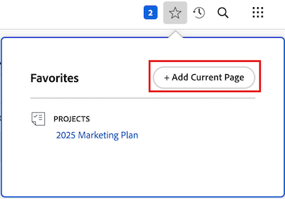

# お気に入りの表示と管理

<!-- Audited: 5/2025 -->

[!UICONTROL お気に入り]メニューを使用すると、項目に素早くアクセスできます。項目は、削除するまで[!UICONTROL お気に入り]メニューに残ります。お気に入りメニューには、最大 40 個の項目を設定できます。

## アクセス要件

+++ 展開すると、この記事の機能のアクセス要件が表示されます。

<table style="table-layout:auto"> 
 <col> 
 </col> 
 <col> 
 </col> 
 <tbody> 
  <tr> 
   <td role="rowheader">Adobe Workfront パッケージ</td> 
   <td> 
任意
 </td> 
  </tr> 
  <tr> 
   <td role="rowheader">Adobe Workfront プラン</td> 
   <td> 

      
投稿者以上

      
リクエスト以上</td> 
  </tr> 
 </tbody> 
</table>

この表の情報について詳しくは、[Workfront ドキュメントのアクセス要件](/help/quicksilver/administration-and-setup/add-users/access-levels-and-object-permissions/access-level-requirements-in-documentation.md)を参照してください。

+++

## お気に入りを表示

以前お気に入りに追加した項目を表示するには、次の手順を実行します。

1. **[!UICONTROL ページの右上隅にある]** お気に入り  お気に入りアイコン [!DNL Adobe Workfront] をクリックします。

1. **お気に入り**&#x200B;リストで、表示する項目をクリックします。

## 項目をお気に入りに追加

最近使用した項目または現在のページを[!UICONTROL お気に入り]メニューに追加できます。

* [最近使用した項目をお気に入りに追加](#add-recent-items-as-a-favorite)
* [現在の項目をお気に入りに追加](#add-the-current-item-as-a-favorite)

### 最近使用した項目をお気に入りに追加

1. 新しい **[!UICONTROL エクスペリエンスの任意のページの右上隅にある]** 最近  最近アイコン [!DNL Adobe Workfront] をクリックします。
1. お気に入りとして保存する項目のインラインで星をクリックします。 **お気に入り**&#x200B;メニューに最近使用した項目。

   

### 現在の項目をお気に入りに追加

1. お気に入りに追加するページに移動します。
1. ページの右上隅にある「**[!DNL Favorites]** 気に入り  「現在のページを追加 **[!UICONTROL をクリックし]** す。

   

   >[!NOTE]
   >
   >お気に入りとして既に追加したオブジェトの&#x200B;**[!UICONTROL お気に入り]**&#x200B;アイコンをクリックすると、そのオブジェクトは[!UICONTROL お気に入り]メニューから削除されます。\
   >

## [!UICONTROL お気に入り]メニューから項目を削除

1. **[!UICONTROL ページの右上隅にある]** お気に入り  お気に入りアイコン [!DNL Workfront] をクリックします。

1. お気に入りとして削除する項目の上にポインタを合わせて、隣にある「**X**」をクリックします。

   または

   お気に入りとして削除するページ上にある場合は、オブジェクト名の横にある **[!UICONTROL お気に入り]** アイコン  をクリックして、**お気に入り** メニューから削除します。
