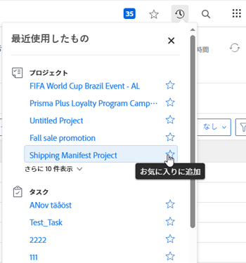
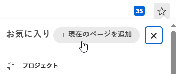
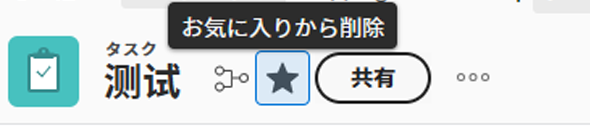

# お気に入りの表示と管理

この [!UICONTROL お気に入り] メニューを使用すると、項目にすばやくアクセスできます。 項目は [!UICONTROL お気に入り] メニューに表示されます。 お気に入りメニューには、最大 40 個の項目を設定できます。

## アクセス要件

この記事の手順を実行するには、次のアクセス権が必要です。

<table style="table-layout:auto"> 
 <col> 
 </col> 
 <col> 
 </col> 
 <tbody> 
  <tr> 
   <td role="rowheader"><strong>[!DNL Adobe Workfront] 計画*</strong></td> 
   <td> 
任意
 </td> 
  </tr> 
  <tr> 
   <td role="rowheader"><strong>[!DNL Adobe Workfront] ライセンス*</strong></td> 
   <td> 
[!UICONTROL リクエスト ] 以降
 </td> 
  </tr> 
 </tbody> 
</table>

&#42;保有するプランやライセンスの種類を確認するには、 [!DNL Workfront] 管理者。

## お気に入りを表示

以前お気に入りに追加した項目を表示するには、次の手順を実行します。

1. 次をクリック： **[!UICONTROL お気に入り]** アイコン  の右上隅に [!DNL Adobe Workfront] ページ。

1. 内 [!UICONTROL お気に入り] リストで、表示する項目をクリックします。

## 項目をお気に入りに追加

最近使用した項目または現在のページを [!UICONTROL お気に入り] メニュー

* [最近使用した項目をお気に入りに追加](#add-recent-items-as-a-favorite)
* [現在の項目をお気に入りに追加](#add-the-current-item-as-a-favorite)

### 最近使用した項目をお気に入りに追加

1. 次をクリック： **[!UICONTROL 最近]** アイコン ![[!UICONTROL 最近]](assets/recents-icon-40x43.png) 新しい [!DNL Adobe Workfront] エクスペリエンス。
1. お気に入りとして保存する最近の項目の上にマウスポインターを置き、星印をクリックします。

   最近使用した項目が [!UICONTROL お気に入り] メニュー

   右上の X をクリックして、リストを閉じます。

   

### 現在の項目をお気に入りに追加

1. お気に入りに追加するページに移動します。
1. 次をクリック： **[!DNL Favorites]** アイコン  の右上隅に [!DNL Workfront] ページ、「 **[!UICONTROL 現在のページを追加]**.

   

   右上の X をクリックして、リストを閉じます。

   または

   次をクリック： **[!UICONTROL お気に入り]** アイコン  をクリックします。

   >[!NOTE]
   >
   >この **[!UICONTROL お気に入り]** お気に入りとして既に追加したオブジェクトのアイコンをクリックすると、そのオブジェクトは [!UICONTROL お気に入り] メニュー\
   >

## 項目を [!UICONTROL お気に入り] メニュー

1. 次をクリック： **[!UICONTROL お気に入り]** アイコン  の右上隅に [!DNL Workfront] ページ。

1. お気に入りとして削除する項目の上にマウスポインターを置いて、 **X** 隣に

   または

   お気に入りとして削除するページ上にいる場合は、 **[!UICONTROL お気に入り]** アイコン  [ お気に入り ] メニューから削除するオブジェクト名の横に表示されます。
