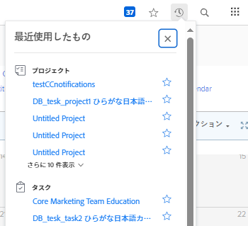

# 最近使用した項目を表示

この [!UICONTROL 最近] メニューは上部のナビゲーションバーにあります。 このメニューには、最近表示されたプロジェクト、レポート、ダッシュボード、タスク、問題などが表示されます。

## アクセス要件

この記事の手順を実行するには、次のアクセス権が必要です。

<table style="table-layout:auto"> 
 <col> 
 </col> 
 <col> 
 </col> 
 <tbody> 
  <tr> 
   <td role="rowheader"><strong>[!DNL Adobe Workfront] 計画*</strong></td> 
   <td> 
任意
 </td> 
  </tr> 
  <tr> 
   <td role="rowheader"><strong>[!DNL Adobe Workfront] ライセンス*</strong></td> 
   <td> 
[!UICONTROL リクエスト ] 以降
 </td> 
  </tr> 
 </tbody> 
</table>

&#42;保有するプランやライセンスの種類を確認するには、 [!DNL Workfront] 管理者。

## 最近使用した項目を表示

1. 次をクリック： **[!UICONTROL 最近]** アイコン ![[!UICONTROL 最近]](assets/recents-icon-40x43.png) をクリックします。

   

   各オブジェクトタイプでは、最近表示した最後の項目のうち、最大 5 つを表示できます。

1. （オプション）最近使用した項目の一覧を展開するには、 **[!UICONTROL さらに表示]** オブジェクトタイプの最後の項目のすぐ下に、表示された過去 10 項目を表示します。 リストを展開して、オブジェクトタイプごとに最大 20 個の項目を表示できます。
1. 右上の X をクリックして、リストを閉じます。

最近使用した項目をお気に入りに登録する方法については、 [お気に入りの表示と管理](../../../workfront-basics/navigate-workfront/recent-and-favorites/view-and-manage-favorites.md).
