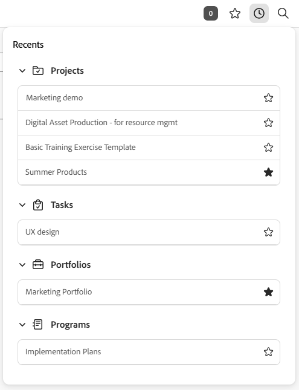

# 最近のアイテムの表示

[!UICONTROL 最近]のメニューは上部のナビゲーションバーにあります。 このメニューには、最近表示されたプロジェクト、レポート、ダッシュボード、タスク、イシューなどが表示されます。過去2週間以内に閲覧されたオブジェクトのみが、オブジェクトタイプごとに最大20個まで含まれ、最新の表示順に一覧表示されます。

## アクセス要件

+++ 展開すると、この記事の機能のアクセス要件が表示されます。

<table style="table-layout:auto"> 
 <col> 
 </col> 
 <col> 
 </col> 
 <tbody> 
  <tr> 
   <td role="rowheader">Adobe Workfront パッケージ</td> 
   <td> 
任意
 </td> 
  </tr> 
  <tr> 
   <td role="rowheader">Adobe Workfront プラン</td> 
   <td> 
   
コントリビューター以上
 
   
リクエスト以上
 </td> 
  </tr> 
 </tbody> 
</table>

この表の情報について詳しくは、[Workfront ドキュメントのアクセス要件](/help/quicksilver/administration-and-setup/add-users/access-levels-and-object-permissions/access-level-requirements-in-documentation.md)を参照してください。

+++

## 最近のアイテムの表示

1. 任意のページの右上隅にある&#x200B;**[!UICONTROL 最近]**&#x200B;のアイコン ![[!UICONTROL 最近]](assets/recents-icon-40x43.png) をクリックします。

   

   各オブジェクトタイプには、最近表示したアイテムが最後から 5 つまで表示されています。

1. （オプション）最近使用したアイテムのリストを広げるには、オブジェクトタイプの最後の項目のすぐ下にある「**[!UICONTROL さらに表示]**」をクリックすると、その前に表示された 10 アイテムが表示されます。 リストを広げると、オブジェクトタイプごとに最大 20 アイテムまで表示できます。

最近のアイテムをお気に入りに登録する方法については、[お気に入りの表示と管理](../../../workfront-basics/navigate-workfront/recent-and-favorites/view-and-manage-favorites.md)を参照してください。
