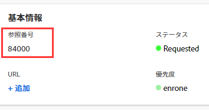

# オブジェクトの参照数を使用

In [!DNL Adobe Workfront]の場合、項目はオブジェクトとして識別されます。 オブジェクトはデータベースに対応し、データと項目の関連付けに使用されます。

Workfrontは、オブジェクトの作成時に、次の各オブジェクトに一意の参照番号を自動的に割り当てます。

* プロジェクト
* タスク
* 問題
* ドキュメント

参照番号は、同じ名前のタスクなど、他の類似した 2 つのオブジェクトを区別する場合に便利です。 参照番号を検索し、レポートに含めることができます。

>[!IMPORTANT]
>
>* [!DNL Workfront] では、すべての顧客とすべてのオブジェクトに対して、参照番号を連続して割り当てます。 例えば、タスクを作成する場合、 [!DNL Workfront] 参照番号00005を割り当てる場合があります。 別の顧客が次にプロジェクトを作成する場合、そのプロジェクトには次に使用可能な参照番号 ( 例：00006) が表示されます。 次にイシューを作成すると、そのイシューには参照番号00007などが送信される場合があります。
>* 内のオブジェクトの参照番号の順序は制御できません [!DNL Workfront]. シーケンスは、常にデータベースによって制御されます。
>

## オブジェクトの参照番号の表示

タスクとタスクに関する参照番号は、デフォルトで表示されます。 また、 [!DNL Workfront] をクリックして、他のタイプのオブジェクトの参照番号を表示します。

* [タスクと問題の参照番号を表示](#view-reference-numbers-for-tasks-and-issues)
* [他のオブジェクトの参照番号を表示](#view-reference-numbers-for-other-objects)
* [レポートでの参照番号の表示](#view-reference-numbers-in-reports)

### タスクと問題の参照番号を表示

タスクまたはイシューを表示する場合は、参照番号がデフォルトで表示されます。  参照番号を確認するには、 **[!UICONTROL タスクの詳細]** または **[!UICONTROL 問題の詳細]** 左のパネルで、 **[!UICONTROL 基本情報]** の節を参照してください。

### 他のオブジェクトの参照番号を表示

オブジェクトの参照番号を表示するには、カスタムビューを作成するか、既存のビューを修正して、 [!UICONTROL 参照番号] フィールドをビューの列に追加します。 例えば、 [!UICONTROL プロジェクト] 「表示」は、すべてのプロジェクトの参照番号を表示します。

ビューを作成または変更する方法については、 [表示の概要 ( [!DNL Adobe Workfront]](../../../reports-and-dashboards/reports/reporting-elements/views-overview.md).

### レポートでの参照番号の表示

レポート内のオブジェクトの参照番号を表示するには、 [!UICONTROL 参照番号] 」列をレポートに追加します。

レポートに列を追加する方法について詳しくは、 [カスタムレポートの作成](../../../reports-and-dashboards/reports/creating-and-managing-reports/create-custom-report.md).

## 参照番号によるオブジェクトの検索

[!DNL Workfront] を使用すると、参照番号でオブジェクトを検索できます。

オブジェクトの参照番号を **[!UICONTROL 検索]** 「 」フィールドで、「 **[!UICONTROL 入力]**.

Workfrontでの検索について詳しくは、 [検索 [!DNL Adobe Workfront]](../../../workfront-basics/navigate-workfront/search/search-workfront.md).
