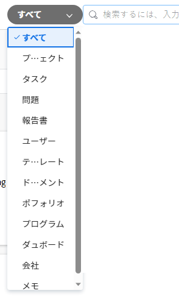
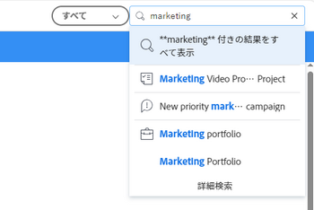
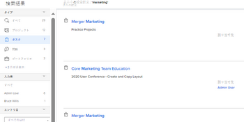
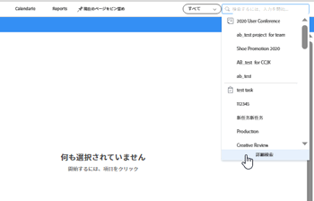
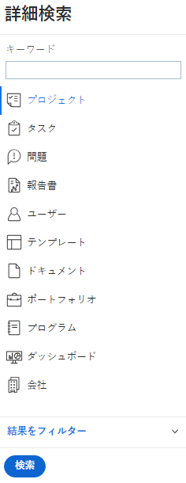

# 検索 [!DNL Adobe Workfront]

項目は [!DNL Adobe Workfront] 正確な位置を覚えられない場合に検索することで

次の項目が表示されます。 [!UICONTROL 検索] ボックスを使用して、 [!DNL Workfront].

オブジェクトを検索で見つけるには、そのオブジェクトを表示する権限が必要です。 このため、検索結果はユーザーによって異なります。

## アクセス要件

+++ このセクションを展開して、この記事の手順を実行するために必要なアクセス権を表示します。

<table style="table-layout:auto"> 
 <col> 
 <col> 
 <tbody> 
  <tr> 
   <td role="rowheader"><strong>[!DNL Adobe Workfront] 計画*</strong></td> 
   <td> 
任意
 </td> 
  </tr> 
  <tr> 
   <td role="rowheader"><strong>[!DNL Adobe Workfront] ライセンス*</strong></td> 
   <td> 
リクエスト以上
 </td> 
  </tr> 
  <tr> 
   <td role="rowheader"><strong>アクセスレベル設定*</strong></td> 
   <td> 
[!UICONTROL 表示 ]：オブジェクトのタイプへのアクセス 
 
注意：まだアクセス権がない場合は、 [!DNL Workfront] 管理者（アクセスレベルに追加の制限を設定している場合） を参照してください。 [!DNL Workfront] 管理者はアクセスレベルを変更できます。詳しくは、 <a href="../../../administration-and-setup/add-users/configure-and-grant-access/create-modify-access-levels.md" class="MCXref xref">カスタムアクセスレベルの作成または変更</a>.
</td> 
  </tr> 
  <tr> 
   <td role="rowheader"><strong>オブジェクト権限</strong></td> 
   <td> 
オブジェクトを検索で見つけるには、そのオブジェクトを表示する権限が必要です。
 
追加のアクセス権のリクエストについて詳しくは、 <a href="../../../workfront-basics/grant-and-request-access-to-objects/request-access.md" class="MCXref xref">オブジェクトへのアクセスのリクエスト </a>.
 </td> 
  </tr> 
 </tbody> 
</table>

&#42;ご利用のプラン、ライセンスの種類、アクセス権を確認するには、 [!DNL Workfront] 管理者。

+++

## 検索について

* [[!UICONTROL 検索に使用できるオブジェクト]](#objects-available-for-search)
* [[!UICONTROL 検索に使用できるフィールド]](#fields-available-for-search)

### 検索に使用できるオブジェクト

Workfrontでは、次のオブジェクトを検索できます。

* プロジェクト
* タスク
* 問題
* レポート
* ユーザー
* テンプレート
* ドキュメント
* ポートフォリオ
* プログラム
* ダッシュボード
* 会社
* メモ

### 検索に使用できるフィールド

検索に使用できるフィールドは、検索のタイプに基づいています。基本または [!UICONTROL 詳細検索].

* **基本検索**:基本検索でオブジェクトを検索する場合は、 [!DNL Workfront] 次のフィールドで、お使いのキーワードを含む可能性のあるテキストを検索します。

   * オブジェクト名
   * 説明
   * カスタムデータフィールド
   * 更新
   * ドキュメント名（特定のドキュメント検索と基本検索）

   での基本検索の詳細 [!DNL Workfront]を参照してください。 [基本検索](#basic-search) 」を参照してください。

* **[!UICONTROL 詳細検索]**:内 [!UICONTROL 詳細検索]を使用する場合、基本検索で使用できないフィールドを検索するフィルターを設定できます。 したがって [!UICONTROL 詳細検索] オブジェクト内の任意のフィールドを検索できます。

   詳しくは、 [!UICONTROL 詳細検索]を参照してください。 [詳細検索](#advanced-search) 」を参照してください。

>[!NOTE]
>
>を実行するには [!UICONTROL 詳細検索]を選択する場合は、 [!UICONTROL 詳細検索] 」オプションを使用します。 基本検索を絞り込んで [!UICONTROL 詳細検索].

## の制限事項の理解 [!DNL Workfront] 検索

を使用する際は、次の制限事項を考慮してください。 [!UICONTROL 検索] in [!DNL Workfront]:

* 検索では大文字と小文字が区別されません
* [!DNL Workfront] 入力ミスが正しくないか、理解していない
* 検索範囲 [!DNL Workfront] ワイルドカードはサポートされていません
* 検索範囲 [!DNL Workfront] は部分的な単語検索をサポートしますが、部分文字列検索はサポートしていません。\
   例えば、検索キーワード「stand」を指定すると、「standard」という単語を含む結果は返されますが、「understand」という単語を含む結果は返されません。

## 複数の単語を検索

検索に複数の単語を含め、[ 検索 ] ボックスのすべての単語に一致するオブジェクトのみを検索する場合は、任意の順序で単語を入力できます。

例えば、「Marketing Demo」（引用符なし）を検索すると、次の名前のオブジェクトが検索されます。

* マーケティングデモ
* デモマーケティング
* 1 月の市場分析デモ

また、名前に「Marketing」、説明に「Demo」を持つオブジェクトも検索します。

ただし、 [!UICONTROL 検索] 表示される検索結果を調整するためのボックス：

<table style="table-layout:auto"> 
 <col> 
 <col> 
 <tbody> 
  <tr> 
   <td>引用符を含める</td> 
   <td> 
ダブルクォーテーションマーク内で正しい順序で単語を入力すると、完全に一致するオブジェクトのみを検索できます。 例えば、「Marketing Demo」（引用符付き）を検索すると、次の名前のオブジェクトが検索されます。
 
    <ul> 
     <li> マーケティングデモ</li> 
     <li> 1 月のマーケティングデモ</li> 
     <li>マーケティングデモプラン</li> 
    </ul> 
ただし、この検索では、「Demo Marketing」という名前のオブジェクトは見つかりません。
 </td> 
  </tr> 
  <tr> 
   <td>OR を含める</td> 
   <td> 
単語を「OR」（引用符なし）で接続すると、[!UICONTROL 検索 ] ボックスで、単語の 1 つ以上に一致するオブジェクトのみを検索できます。 これらの単語は、任意の順序で入力できます。 たとえば、「Marketing OR Demo」（引用符なし）を検索すると、次の名前のオブジェクトが検索されます。
 
    <ul> 
     <li> 市場分析デモ</li> 
     <li>1 月の市場分析デモ</li> 
     <li>デモ</li> 
     <li>市場分析</li> 
    </ul> 
注意：「OR」はすべて大文字にする必要があります。 それ以外の場合は、検索するフレーズ内の別の単語として解釈されます。
 </td> 
  </tr> 
  <tr> 
   <td>AND を含める</td> 
   <td> 
単語を「AND」（引用符なし）で接続すると、[!UICONTROL 検索 ] ボックスで、すべての単語に一致するオブジェクトのみを検索できます。 これらの単語は、任意の順序で入力できます。 例えば、「Marketing AND Demo」（引用符なし）を検索すると、次の名前のオブジェクトが検索されます。
 
    <ul> 
     <li>マーケティングデモ</li> 
     <li>デモマーケティング</li> 
     <li>1 月の市場分析デモ</li> 
    </ul> 
注意：「AND」はすべて大文字にする必要があります。 それ以外の場合は、検索するフレーズ内の別の単語として解釈されます。 同様に、「&amp;」（引用符なし）を含めると、アンパサンド文字を含むオブジェクトのみが検索されます。
 </td> 
  </tr> 
 </tbody> 
</table>

## で検索を使用 [!DNL Workfront]

[!DNL Workfront] には、次の 2 種類の検索があります。基本および詳細。 名前や説明など、共通のオブジェクトフィールドでキーワードを検索する場合は、基本検索を使用します。 用途 [!UICONTROL 詳細検索] フィルタを使用して他のオブジェクトフィールドを検索する場合。

* [基本検索](#basic-search)
* [詳細検索](#advanced-search)

### 基本検索

基本検索では、システム内のすべてのオブジェクト、または一度に 1 つのオブジェクト（プロジェクトなど）でキーワードを検索できます。 [!DNL Workfront] その後、いくつかの特定のフィールドでこれらのキーワードを検索します。 その後、 [!DNL Workfront].

基本検索で検索された特定のフィールドのリストについては、 [検索に使用できるフィールド](#fields-available-for-search) 」を参照してください。

>[!NOTE]
>
>を実行するには [!UICONTROL 詳細検索]を選択する場合は、 [!UICONTROL 詳細検索] 」オプションを使用します。 基本検索を絞り込んで [!UICONTROL 詳細検索].

* [基本検索の実行](#perform-a-basic-search)
* [基本検索の絞り込み](#refine-a-basic-search)

#### 基本検索の実行

基本検索は、次のいずれかの方法で実行できます。

* システム内のすべてのオブジェクト（一般検索）。
* 一度に 1 つのオブジェクトに対して（オブジェクト固有の検索）。

基本検索を実行するには、次の手順に従います。

1. 虫眼鏡  をクリックします。 また、 **[!UICONTROL ALT + /]** または **[!UICONTROL オプション+ /]** 開く [!UICONTROL 検索] メニュー

1. （オプション）特定のオブジェクトを検索するには、 **[!UICONTROL すべて]** ドロップダウンメニューから、検索するオブジェクトを選択します。

   

1. 内 **[!UICONTROL 検索]** 」ボックスに、検索する情報を入力します。\
   検索されるフィールドの詳細 [!DNL Workfront]を参照してください。 [検索について](#understand-search).\
   \
   検索バーに入力し始めると、 [!DNL Workfront] は閲覧履歴に基づいてレコメンデーションをおこない、検索しているキーワードを青色でハイライトします。

1. 探している項目が [!UICONTROL typeahead] メニューで、クリックします。

   または

   押す **[!UICONTROL 入力]** 包括的な検索を実行する。 この検索では、最近表示された項目ではなく、データベース全体に対してクエリを実行します。

   この [!UICONTROL 検索結果] ページのスライドが左から開き、前のページのほとんどをカバーします。

   一般検索を実行した場合は、 [!DNL Workfront] 検索されたフィールドの検索語に一致するオブジェクトの結果を返します。 [検索について](#understand-search). 検索に一致するオブジェクトがリストに表示されます。

   >[!NOTE]
   >
   >検索された項目のリストに、単語のバリエーションが表示される場合があります。\
   >例えば、「marketing」を検索すると、名前に「marketing」または「market」を含むオブジェクトが表示されます。

1. （オプション）生成された検索結果が多すぎる場合は、 [基本検索の絞り込み](#refine-a-basic-search).
1. （オプション）検索の前に閲覧していたページに戻るには、 **[!UICONTROL 閉じる]** をクリックします。

>[!NOTE]
>
>この [!UICONTROL 検索結果] ページは、フォーカスがある場合にのみ開いたままになります。 ページから離れた場所をクリックするか、別のページを開くと、 [!UICONTROL 検索結果] ページ。

#### 基本検索の絞り込み

基本検索を実行した後 ( [[!UICONTROL 基本検索の実行]](#perform-a-basic-search) — 検索を絞り込むことができます。

検索結果の左側にあるツールバーを使用して、探している情報を絞り込みます。

検索を絞り込むには：

1. （条件付き）一般検索を実行した場合、検索対象のオブジェクトを、結果の左上にあるオブジェクトのリストから選択します。
1. 検索結果の左側にあるツールバーで、検索に表示されるオブジェクトに使用可能なフィールドを見つけます。\
   各フィールドの値は、各フィールドに対して最大 10 個の値（カウント順）で表示されます。
1. 結果のリストを短くするには、使用可能なフィールドの内部をクリックします。\
   選択した項目は青色でハイライト表示され、選択しなかったフィールド値は非表示になります。\
   新しい値を選択するごとに、結果が動的に適切に更新されます。\
   

1. （オプション）選択した値をクリックすると、選択が解除され、各フィールドのすべての値が再度表示されます。

### [!UICONTROL 詳細検索]

[!UICONTROL 詳細検索] では、基本検索で使用できないフィールドとフィルターを使用して検索できます。 例えば、特定の優先度またはドキュメント所有者名を持つプロジェクトを検索できます。

>[!NOTE]
>
>を実行するには [!UICONTROL 詳細検索]を選択する場合は、 [!UICONTROL 詳細検索] 」オプションを使用します。 基本検索を絞り込んで [!UICONTROL 詳細検索].

* [用途 [!UICONTROL 詳細検索]](#use-advanced-search)

#### 用途 [!UICONTROL 詳細検索]

以下を使用できます。 [!UICONTROL 詳細検索] 特定の条件に基づいて検索をフィルタリングする場合。\
このタイプの検索は、オブジェクトに関連付けられたキーワードを覚えていないが、そのオブジェクトに関する特定の情報 ( 例：プロジェクトの優先順位、ドキュメントの所有者名など )。

詳細検索を実行するには、次の手順に従います。

1. ( [!DNL Workfront]、 **[!UICONTROL 検索]** アイコン . この [!DNL Search] メニューが表示されます。

1. の下部に [!UICONTROL 検索] メニュー、クリック **[!UICONTROL 詳細検索]**.\
   \
   この [!UICONTROL 詳細検索] ページのスライドが右から開き、前のページのほとんどをカバーします。

1. 検索するオブジェクトのタイプを選択します。\
   **[!UICONTROL プロジェクト]** はデフォルトで選択されています。

   

1. （オプション）リストの上部にあるフィールドにキーワードを入力します。
1. （オプション）「 **[!UICONTROL 結果のフィルター]** 特定のフィールドタイプに基づいて検索結果をフィルタリングするには、リストからフィールドを選択します。 必要に応じて、フィールドの値も選択します。\
   または\
   新しいフィルターを追加します。

1. クリック **[!UICONTROL 検索]**.\
   検索に一致する項目のリストが [!UICONTROL 詳細検索] ツールバー。

1. （オプション）検索の前に閲覧していたページに戻るには、 **[!UICONTROL 閉じる]** をクリックします。

>[!NOTE]
>
>この [!UICONTROL 検索結果] ページは、フォーカスがある場合にのみ開いたままになります。 ページから離れた場所をクリックするか、別のページを開くと、 [!UICONTROL 検索結果] ページ。
