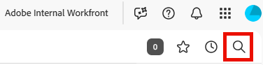
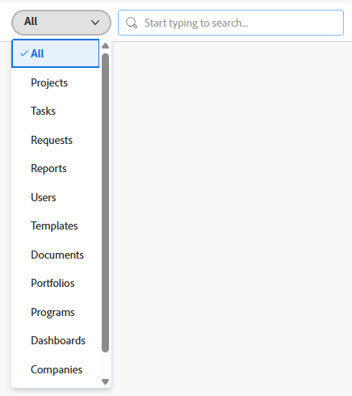
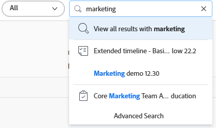
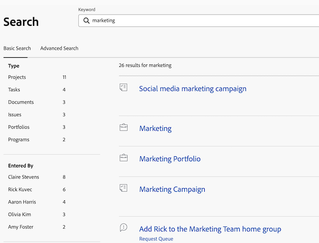
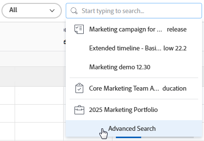
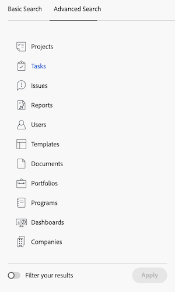

# [!DNL Adobe Workfront] での検索

<!-- Audited: 5/2025 -->

[!DNL Adobe Workfront]のアイテムは、正確な場所を覚えていない場合に検索することで、簡単に見つけることができます。

[!DNL Workfront] 内のページの右上に「[!UICONTROL 検索]」ボックスがあります。

オブジェクトを検索で見つけるには、そのオブジェクトを表示する権限が必要です。 そのため、検索結果はユーザーによって異なります。

## アクセス要件

+++ 展開すると、この記事の機能のアクセス要件が表示されます。

<table style="table-layout:auto"> 
 <col> 
 <col> 
 <tbody> 
  <tr> 
   <td role="rowheader">Adobe Workfront パッケージ</td> 
   <td> 
任意
 </td> 
  </tr> 
  <tr> 
   <td role="rowheader">Adobe Workfront プラン</td> 
   <td> 
コントリビューター以上

   
リクエスト以上 

   </td> 
  </tr> 
  <tr> 
   <td role="rowheader">アクセスレベル設定</td> 
   <td>[!UICONTROL View] オブジェクト/td&gt;の種類へのアクセス 
  </tr> 
  <tr> 
   <td role="rowheader">オブジェクト権限</td> 
   <td>オブジェクトを検索で見つけるには、そのオブジェクトを表示する権限が必要です。</td> 
  </tr> 
 </tbody> 
</table>

詳しくは、[Workfront ドキュメントのアクセス要件](/help/quicksilver/administration-and-setup/add-users/access-levels-and-object-permissions/access-level-requirements-in-documentation.md)を参照してください。

+++

## 検索について

### 検索に使用できるオブジェクト

Workfront では次のオブジェクトを検索できます。

* プロジェクト
* タスク
* イシュー
* レポート
* ユーザー
* テンプレート
* ドキュメント
* ポートフォリオ
* プログラム
* ダッシュボード
* 会社
* メモ

### 検索に使用できるフィールド

検索に使用できるフィールドは、検索のタイプ（基本または[!UICONTROL 詳細検索]）に基づいています。

* **基本検索**：基本検索でオブジェクトを検索する際、[!DNL Workfront]は次のフィールドにキーワードが含まれている可能性のあるテキストを検索します。

   * オブジェクト名
   * 説明
   * カスタムデータフィールド
   * アップデート
   * ドキュメント名（特定のドキュメント検索および基本検索でのドキュメント名）

  [!DNL Workfront]での基本検索について詳しくは、この記事の次の節を参照してください：[基本検索](#basic-search)。

* **[!UICONTROL 詳細検索]**: [!UICONTROL 詳細検索]では、基本検索で使用できないフィールドを検索するためのフィルターを設定できます。 そのため、[!UICONTROL 詳細検索]を使用するとオブジェクト内の任意のフィールドを検索できます。

  [!UICONTROL 高度な検索]について詳しくは、この記事の次の節を参照してください：[高度な検索](#advanced-search)。

>[!NOTE]
>
>[!UICONTROL 詳細検索]を実行するには、検索を始める前に[!UICONTROL 詳細検索]オプションを選択する必要があります。 基本検索を[!UICONTROL 詳細検索]に絞り込むことはできません。

## [!DNL Workfront] 検索の制限事項について

[!DNL Workfront] で[!UICONTROL 検索]を使用する際は、次の制限事項を考慮してください。

* 検索では大文字と小文字は区別されません。
* [!DNL Workfront]がタイプミスを修正または理解していません。
* [!DNL Workfront]で検索中は、ワイルドカードをサポートしていません。
* [!DNL Workfront]での検索は、部分的な単語検索をサポートしていますが、部分文字列検索はサポートしていません。

  例えば、検索キーワード「stand」を指定すると、「standard」という単語を含む結果は返されますが、「understand」という単語を含む結果は返されません。

## 複数の単語を検索

検索に複数の単語を含め、検索ボックスのすべての単語に一致するオブジェクトのみを検索する場合、任意の順序で単語を入力できます。

例えば、「Marketing Demo」を検索する（実際の検索時には引用符を使用しない）と、次の名前のオブジェクトが検索されます。

* マーケティングデモ
* デモマーケティング
* 1 月の市場分析デモ

また、名前に「Marketing」、説明に「Demo」を持つオブジェクトも検索します。

ただし、[!UICONTROL 検索]ボックスで次の操作を行い、表示される検索結果を調整することができます。

<table style="table-layout:auto"> 
 <col> 
 <col> 
 <tbody> 
  <tr> 
   <td>引用符を含める</td> 
   <td> 
二重引用符内で正しい順序で単語を入力すると、完全に一致するオブジェクトのみを検索できます。 例えば、「"Marketing Demo"」を検索（検索時に引用符を使用）すると、次の名前のオブジェクトが検索されます。
 
    <ul> 
     <li> マーケティングデモ</li> 
     <li> January Marketing Demo</li> 
     <li>市場デモプラン</li> 
    </ul> 
ただし、この検索では、「デモ市場」という名前のオブジェクトは見つかりません。
 </td> 
  </tr> 
  <tr> 
   <td>OR を含める</td> 
   <td> 
単語を「OR」（引用符なし）でつなげると、[!UICONTROL Search] ボックスで、単語の 1 つ以上に一致するオブジェクトのみを検索できます。 これらの単語は順序に関係なく入力できます。 例えば、「市場 OR デモ」（引用符なし）を検索すると、次の名前のオブジェクトが検索されます。
 
    <ul> 
     <li> 市場分析デモ</li> 
     <li>1 月の市場分析デモ</li> 
     <li>デモ</li> 
     <li>市場分析</li> 
    </ul> 
メモ：「OR」はすべて大文字にする必要があります。 そうしないと、検索するフレーズ内の別の単語として解釈されます。
 </td> 
  </tr> 
  <tr> 
   <td>AND を含める</td> 
   <td> 
単語を「AND」（引用符なし）で接続すると、[!UICONTROL Search] ボックスで、すべての単語に一致するオブジェクトのみを検索できます。 これらの単語は順序に関係なく入力できます。 例えば、「市場 AND デモ」（引用符なし）を検索すると、次の名前のオブジェクトが検索されます。
 
    <ul> 
     <li>マーケティングデモ</li> 
     <li>デモマーケティング</li> 
     <li>1 月の市場分析デモ</li> 
    </ul> 
メモ：「AND」はすべて大文字にする必要があります。 そうしないと、検索するフレーズ内の別の単語として解釈されます。 同様に、「&amp;」（引用符なし）を含めると、アンパサンド文字を含むオブジェクトのみが検索されます。
 </td> 
  </tr> 
 </tbody> 
</table>

## [!DNL Workfront] で検索を使用

[!DNL Workfront]には、基本と高度な検索の2種類があります。 名前や説明などの一般的なオブジェクトフィールドでキーワードを検索する場合は、基本検索を使用します。 フィルターを使用して他のオブジェクトフィールドを検索する場合は、[!UICONTROL 詳細検索]を使用します。

* [基本検索](#basic-search)
* [詳細検索](#advanced-search)

### 基本検索

基本検索では、システム内のすべてのオブジェクトまたは一度に1つのオブジェクト（プロジェクトなど）でキーワードを検索できます。 [!DNL Workfront] はそれから、いくつかの特定のフィールドでこれらのキーワードを検索します。 その後に、[!DNL Workfront] によって選ばれたその他のオブジェクト固有のフィールドに基づいて、検索結果を絞り込むことができます。

基本検索で検索される特定のフィールドのリストについては、この記事の次の節を参照してください。[検索可能なフィールド &#x200B;](#fields-available-for-search)。

>[!NOTE]
>
>[!UICONTROL 詳細検索]を実行するには、検索を始める前に[!UICONTROL 詳細検索]オプションを選択する必要があります。 基本検索を[!UICONTROL 詳細検索]に絞り込むことはできません。

* [基本検索の実行](#perform-a-basic-search)
* [基本検索の絞り込み](#refine-a-basic-search)

#### 基本検索の実行

基本検索は、次のいずれかの方法で実行できます。

* システム内のすべてのオブジェクトに対して（一般検索）。
* 一度に 1 つのオブジェクトに対して（オブジェクト固有の検索）。

基本検索を実行するには、次の手順に従います。

1. ページの右上隅にある虫眼鏡をクリックします。

1. （オプション）特定のオブジェクトを検索するには、ドロップダウンメニューの「**[!UICONTROL すべて]**」をクリックして、検索するオブジェクトを選択します。

   

1. **[!UICONTROL 検索]** ボックスで、検索する情報の入力を開始します。
[!DNL Workfront]で検索されるフィールドについて詳しくは、この記事の次の節を参照してください：[検索について](#understand-search)。
   

   検索バーで入力を始めると、[!DNL Workfront] は、閲覧履歴に基づいてレコメンデーションを行い、検索しているキーワードを青色でハイライト表示します。

1. 検索している項目が[!UICONTROL 先行入力]メニューに表示された場合は、その項目をクリックします。

   または

   キーボードのReturn キー（Mac）または[!UICONTROL Enter キー（Windows）を押して、包括的な検索を実行します。 &#x200B;]この検索では、最近閲覧した項目ではなく、データベース全体に対してクエリを実行し、**検索** ページを開きます。

   一般検索を実行した場合、[!DNL Workfront] は、検索対象のフィールド内の検索語に一致するオブジェクトの結果を返します（[検索について](#understand-search)に記載）。 検索に一致するオブジェクトがリストに表示されます。

   >[!NOTE]
   >
   >見つかった項目のリストに、単語のバリエーションが表示される場合があります。
   >例えば、「marketing」を検索すると、名前に「marketing」または「market」を含むオブジェクトが表示されます。

1. （オプション）検索の結果が多すぎる場合は、[基本検索の調整](#refine-a-basic-search)の説明に従って検索を調整します。

#### 基本検索の絞り込み

基本検索を実行した後、検索を絞り込むことができます。

検索結果の左側にあるツールバーを使用して、探している情報を絞り込みます。

検索を絞り込むには、次の操作を実行します。

1. （条件付き）一般検索を実行した場合、検索対象のオブジェクトを、結果の左上にあるオブジェクトのリストから選択します。
1. 検索結果の左側にあるツールバーの検索に表示されるオブジェクトに使用できるフィールドを探します。 各フィールドの値は、フィールドごとに最大 10 個の値が、カウント数の順に表示されます。
1. 使用可能なフィールドのいずれかをクリックして、結果のリストを短縮します。 選択した項目は青でハイライト表示され、選択しなかった項目は非表示になります。
新しい値を選択するごとに、右側の結果が動的に更新されます。

   

1. （オプション）選択した値をクリックすると、選択が解除され、各フィールドのすべての値が再び表示されます。

### [!UICONTROL 詳細検索]

[!UICONTROL 詳細検索]を使用すると、基本検索で使用できないフィールドとフィルターを使用して検索できます。 例えば、特定の優先度またはドキュメント所有者名を持つプロジェクトを検索できます。

>[!NOTE]
>
>[!UICONTROL 詳細検索]を実行するには、検索を始める前に「[!UICONTROL 詳細検索]」オプションを選択する必要があります。 基本検索を[!UICONTROL 詳細検索]に絞り込むことはできません。

* [[!UICONTROL 詳細検索]を使用してください。](#use-advanced-search)

#### [!UICONTROL 詳細検索]を使用

[!UICONTROL 詳細検索]を使用して、特定の条件に基づいて検索をフィルターできます。\
このタイプの検索は、オブジェクトに関連付けられたキーワードを思い出せないが、そのオブジェクトに関する特定の情報（プロジェクトの優先度、ドキュメント所有者の名前など）を知っている場合に役立ちます。

詳細検索を実行するには、次の手順に従います。

1. [!DNL Workfront]の任意のページの右上隅で、**[!UICONTROL 検索]** アイコン をクリックします。 **検索** メニューが表示されます。

1. **検索** メニューの下部にある「**[!UICONTROL 詳細検索]**」をクリックします。 **検索** ページが開き、**詳細検索** タブがデフォルトで選択されています。

   

1. 検索するオブジェクトのタイプを選択します。 **[!UICONTROL タスク]**&#x200B;がデフォルトで選択されています。

   

1. （オプション）リストの上部にあるフィールドにキーワードを入力します。
1. （オプション）検索結果を絞り込むには、**[!UICONTROL 検索結果を絞り込む]**&#x200B;から&#x200B;**上**&#x200B;に切り替えて、フィルターを作成して検索を絞り込みます。 終了したら「**適用**」をクリックします。

1. 「**[!UICONTROL 検索]**」をクリックします。 検索に一致する項目のリストが、**[!UICONTROL 詳細検索]**&#x200B;ツールバーの右側に表示されます。
