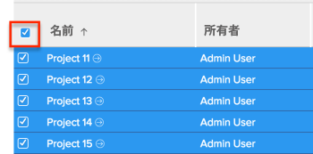

# クイックフィルターをリストに適用する

<!--
{{highlighted-preview}}
-->

オブジェクトのリストでクイックフィルタを使用すると、重要な項目だけを見つけるのに役立つので、簡単にレビュー、更新、他のユーザーとの共有を行うことができます。

>[!IMPORTANT]
>
>検索語を含む項目は、クイックフィルターを使用して検索できます。この項目が画面に物理的に表示されたか、ページの下部までスクロールした後に表示されるかを指定できます。 ブラウザの検索機能を使用すると、画面に物理的に表示される項目のみを検索できます。 リストに複数のページが含まれる場合、クイックフィルターは、表示されないページ上の項目を見つけられません。

クイックフィルターを保存する場合は、代わりに、リストの永続的なフィルターを作成することをお勧めします。\
でフィルターを作成する方法について詳しくは、 [!DNL Adobe Workfront]（記事を参照） [フィルターの概要 ( [!DNL Adobe Workfront]](../../../reports-and-dashboards/reports/reporting-elements/filters-overview.md).

現在、クイックフィルターは次の領域で使用できます

次の項目を除く、すべてのリストで一時クイックフィルタを使用できます。

* この [!UICONTROL レポート] 領域
* ドキュメントリストとレポート
* 複数 [!UICONTROL 設定] 領域
   >[!NOTE]
   >
   >クイックフィルターは、次の設定領域で使用できます。 [!UICONTROL グループ], [!UICONTROL チーム], [!UICONTROL 会社], [!UICONTROL スケジュール], [!UICONTROL レイアウトテンプレート]、および [!UICONTROL カスタムForms].

リストにクイックフィルターを適用する際は、次の点を考慮してください。

* キーワードを使用して、リストのビューに表示される任意のフィールドをフィルタリングできます。 これには、カスタムフィールドや、 [!UICONTROL 先行タスク], [!UICONTROL 割り当て], [!UICONTROL 割り当て] および [!UICONTROL ステータス], [!UICONTROL 承認者] および [!UICONTROL ステータス]など
* リストのグループが折りたたまれている場合、クイックフィルターを使用すると、自動的に展開されます。 クイックフィルターを削除すると、グループ化が再度折りたたまれます。
* グループ化では、適用されたクイックフィルターや、リスト上のオブジェクトに対する変更に関係なく、元のリストの集計情報が保持されます。
* クイックフィルターは一時的です。 リストのグループ化、表示、フィルターまたは並べ替えを変更すると、クイックフィルター条件が削除されます。
* クイックフィルターは保存できません。 フィルターを保存して再度使用する場合は、リストの永続的なフィルターを作成することを検討してください。
* リストに複数のグループがあり、クイックフィルターで 1 つのグループ内の項目が見つかった場合は、そのグループのみが、見つかった項目と共に表示されます。 その他のグループはすべて非表示になります。
* タスクまたはサブタスクのリストでは、クイックフィルタの結果が表示されると、タスク階層が削除されます。

## アクセス要件

この記事の手順を実行するには、次のアクセス権が必要です。

<table style="table-layout:auto"> 
 <col> 
 <col> 
 <tbody> 
  <tr> 
   <td role="rowheader"><b>[!DNL Adobe Workfront] 計画*</b></td> 
   <td> 
任意
 </td> 
  </tr> 
  <tr> 
   <td role="rowheader"><b>[!DNL Adobe Workfront] ライセンス*</b></td> 
   <td> 
[!UICONTROL リクエスト ] 以降
 </td> 
  </tr> 
  <tr> 
   <td role="rowheader"><b>アクセスレベル設定*</b></td> 
   <td> 
リストが存在する領域へのアクセスを表示
 
例えば、プロジェクトにクイックフィルターを適用するには、[!UICONTROL ビュー ] でプロジェクトにアクセスできる必要があります。
 
注意：まだアクセス権がない場合は、 [!DNL Workfront] 管理者（アクセスレベルに追加の制限を設定している場合） を参照してください。 [!DNL Workfront] 管理者は、 <a href="../../../administration-and-setup/add-users/configure-and-grant-access/create-modify-access-levels.md" class="MCXref xref">カスタムアクセスレベルの作成または変更</a>.
 </td> 
  </tr> 
  <tr> 
   <td role="rowheader"><b>オブジェクト権限</b></td> 
   <td> 
[!UICONTROL 表示 ]
 
追加のアクセス権のリクエストについて詳しくは、 <a href="../../../workfront-basics/grant-and-request-access-to-objects/request-access.md" class="MCXref xref">オブジェクトへのアクセスのリクエスト </a>.
 </td> 
  </tr> 
 </tbody> 
</table>

&#42;ご利用のプラン、ライセンスの種類、アクセス権を確認するには、 [!DNL Workfront] 管理者。

## クイックフィルターをリストに適用する

1. クイックフィルターをサポートするリストまたはレポートに移動し、 **[!UICONTROL クイックフィルター] アイコン**  」と入力します。

   または

   オペレーティングシステムまたはブラウザーに応じて、標準の QWERTY キーボードを使用する場合は、次のコマンドを押してクイックフィルターを起動します。

   * Alt + F キー ( [!DNL Windows] コンピュータ
   * ALT/Option+F（の場合） [!DNL Mac] コンピュータ

      >[!TIP]
      >
      >Ctrl + F キーまたは Command + F キーを押すと、クイックフィルタの横にツールチップが表示され、これらのコマンドについての通知が表示されます。 このコマンドは、クイックフィルタ検索ボックスにも表示されます。

1. 内 **[!UICONTROL ページをフィルター]** 」ボックスに、フィルターに使用するキーワードを入力します。

   現在リストのビューに表示されている任意の単語を使用できます。

   >[!NOTE]
   >
   >リストの別のページに表示される可能性のある単語を使用した場合、クイックフィルターは結果を見つけられません。

   検索条件に一致する項目のリストは、入力に応じて動的にリストに表示され、その他の項目はすべて非表示になります。 検索で使用したキーワードは、すべてのスタンドアロンフィールドと複雑なフィールドで黄色でハイライト表示されます。 複雑なフィールドの例としては、共有列や次のいずれかがあります。 [!UICONTROL 割り当て], [!UICONTROL 割り当て] および [!UICONTROL ステータス], [!UICONTROL 完了率], [!UICONTROL 先行タスク], [!UICONTROL 承認者とステータス], [!UICONTROL リソースマネージャ], [!UICONTROL カテゴリ], [!UICONTROL 条件], [!UICONTROL 条件の更新]など

1. （オプション）クイックフィルターで見つかった項目を一括編集するには、次の手順を実行します。

   1. リスト内の項目をすべて選択するか、複数選択して、「 **[!UICONTROL 編集]** をクリックして、項目を一括編集します。
   1. 編集が完了したら、 **[!UICONTROL 変更を保存]**.

1. （オプション）クイックフィルターで見つかった項目をエクスポートするには、リスト内の項目のすべてまたは複数を選択し、 **[!UICONTROL 書き出し]**.

   

   >[!NOTE]
   >
   >クイックフィルター検索で見つかった項目のみが、選択したファイルにエクスポートされます。 リストを書き出す前に項目を選択しない場合、完全なフィルターなしリストが書き出されます。\
   >詳しくは、 [リストのエクスポート](../../../workfront-basics/navigate-workfront/use-lists/export-lists.md).

1. （オプション）フィルターを適用した結果を消去するには、 **[!UICONTROL クイックフィルター]** アイコンをクリックします。\
   または\
   ページを更新します。
