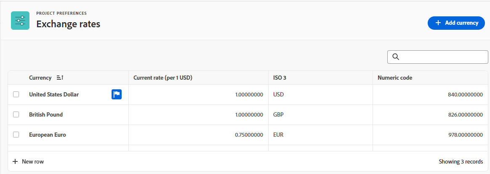
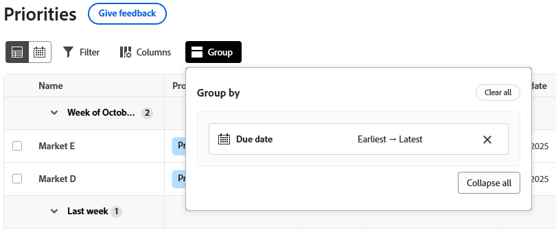

# 拡張リストの使用

Adobe Workfrontの一部の領域では、拡張リストを利用できます。 これらのリストは、リスト項目を表示するために表形式を使用し、標準のリストとは異なるルックアンドフィールを持ちます。 フィルタリング、グループ化、列の管理、検索など、ビューの管理も強化されています。

標準リストについては、[Adobe Workfrontでのリストの概要 ](/help/quicksilver/workfront-basics/navigate-workfront/use-lists/view-items-in-a-list.md) を参照してください。

>[!NOTE]
>
>必要なデータを表示しやすいように、各拡張リストを異なる方法で設定することができます。 すべてのリストがこの記事で説明されているすべての機能を使用するわけではありません。また、一部のリストには、そのリストにのみ適用される特殊な機能が含まれている場合があります。

## アクセス要件

+++ 展開すると、この記事の機能のアクセス要件が表示されます。

<table style="table-layout:auto">
 <col> 
 <col>
 <tbody> 
  <tr> 
   <td>Adobe Workfront パッケージ</td> 
   <td>
任意
</td> 
  </tr> 
  <tr> 
   <td>Adobe Workfront プラン</td> 
   <td>
   
投稿者以上

   
リクエスト以上
</td>
  </tr>
 </tbody> 
</table>

詳しくは、[Workfront ドキュメントのアクセス要件](/help/quicksilver/administration-and-setup/add-users/access-levels-and-object-permissions/access-level-requirements-in-documentation.md)を参照してください。

+++

## 拡張リストを使用するオブジェクト

以下に、拡張リスト形式を使用するWorkfront オブジェクトリストの種類と、オブジェクトを表示する権限がある場合にデフォルトで表示される領域の一部を示します。

>[!NOTE]
>
>このリストは包括的なものではありません。それぞれのオブジェクトリストは、レポートまたはダッシュボードにも表示できます。例えばプロジェクトレポートや、プロジェクトレポートを含むダッシュボードには、プロジェクトのリストも表示されます。

| Workfrontリスト | オブジェクトリストの場所 |
|--- |--- |
| 優先度 | <ul><li>ホーム /左側のメニューで優先度アイコンを選択します</li><li>メインメニュー/優先度</li></ul> |
| リクエストのリスト | <ul><li>リクエスト （新規エクスペリエンスのみ）</li><li>ホームのマイリクエストウィジェット</li></ul> |
| 「設定」のステータス、優先度、重要度および為替レートのリスト | <ul><li>設定/ プロジェクト環境設定/ ステータス</li><li>設定/ プロジェクト環境設定/優先度</li><li>設定/ プロジェクト環境設定/重要度</li><li>「設定」 > 「プロジェクト作業環境」 > 「換算レート」</li></ul> |

## 拡張リストの項目の追加と編集

拡張リストの設定に応じて、項目をリストに追加する方法は 2 とおりあります。

* リストの上のボタンをクリックします。 このオプションを選択すると、情報を入力して保存するダイアログが開きます。
* リストの下部にある「**新しい行**」をクリックします。 このオプションを選択すると、テーブルに新しい行が追加され、各セルに情報が入力されます。

  拡張リストでは、次のフィールドタイプをサポートしています。

   * テキスト
   * 数値
   * 通貨
   * 日付
   * 日時
   * 単一/複数選択のドロップダウン
   * 先行入力
   * 段落
   * 担当者（1 人または複数）
   * カラーピッカー

  セルを編集する場合、各フィールドタイプには独自の編集オプションがあります。

リストの項目を編集するには、編集するセルをダブルクリックして情報を入力します。 一部のセルは読み取り専用です。

## 強化されたリストでのアクションバーと詳細メニューの使用

拡張リストの項目の横にあるチェックボックスをオンにすると、画面の下部にアクションバーが表示され、その項目に対して実行できるアクションが表示されます。 一部のアクションは、そのリストに固有で、他のリストには表示されない場合があります。

>[!NOTE]
>
>異なる拡張リストを使用すると、1 つの項目を選択したり、一括編集（複数の項目を選択）したり、項目を選択しないことがあります。

アクション バーのボタンをクリックすると、リスト アイテムの表示、アイテムの削除、アイテムの編集などのアクションを実行できます。

選択した項目で使用できるアクションがない場合、アクションバーには「使用できるアクションがありません」と表示されます。

**詳細** メニューは、リスト項目の主フィールドの横にカーソルを合わせたときに表示される 3 ドットメニューです。 （プライマリフィールドはテーブルの一番左の列です。）

メニューをクリックして、項目の追加のアクションを表示します。 一部のアクションは、そのリストに固有で、他のリストには表示されない場合があります。

## 拡張リストの列のカスタマイズ

一部の拡張リストでは、列の表示と非表示を切り替えたり、列を並べ替えたりすることができます。

1. リストの上にある **列** をクリックします。

   

1. リストの列の表示/非表示を切り替えるには、を使用します。
1. 列を並べ替えるには、「**ドラッグ**」アイコンをクリックし、列を目的の場所に移動します。 列を移動すると、リストは自動的に変更されます。

   >[!NOTE]
   >
   >プライマリフィールドは、テーブルの一番左の列です。 最初の位置に固定され、その列を変更することはできません。 列数が多い場合、プライマリフィールドは左側に固定され、水平方向にスクロールすると常に表示されます。
   >
   >フィールド名の横にあるアイコンは、テキストや日付フィールドなどのフィールドタイプを示します。

   列が非表示の場合、「**列**」ボタンにインジケーターが表示されます。 列を並べ替えても、インジケーターは表示されません。

   

## 拡張リストへのビューの適用

ビューは、リストに適用できる列の配置とフィルターのパーソナライズされたセットです。 新しいビューを作成したり、既存のビューを編集することができます。

ビューを適用するには、「**表示**」ドロップダウンをクリックし、リストに適用するビューを選択します。

新しいビューを作成するには：

1. **表示** ドロップダウンをクリックし、「**新しい表示**」を選択します。
1. ビューの名前を入力し、[**作成**] をクリックします。
1. （任意）列の非表示、表示、並べ替えを行います。 詳細については、「[ 拡張リストの列をカスタマイズする ](#customize-columns-in-an-enhanced-list)」を参照してください。
1. （任意）リスト項目をフィルタリングしてグループ化します。 詳しくは、[ 拡張リストの項目のフィルタリングとグループ化 ](#filter-and-group-items-in-an-enhanced-list) を参照してください。

   ビューに対する変更は自動的に保存され、ビューを使用するすべてのユーザーに変更内容が表示されます。

   次回このビューを適用するときには、列とフィルタの設定は設定内容のままになります。

## 拡張リストの項目のフィルタリングとグループ化

フィルターを使用すると、リストに表示する情報の量を減らすことができます。 リスト上のオブジェクトをグループ化し、特定の条件に基づいて領域に分割します。

### フィルターの使用

1. リストの上にある **フィルター** をクリックします。
1. 「フィルター」ボックスで、「**条件を追加**」をクリックします。
1. フィルターするフィールドを選択します。
1. 「次のいずれかを含む」、「次のいずれも含まない」、「次より前」、「次より後」などのフィルター修飾子を選択します。 修飾子のオプションは、フィルタリングに使用するフィールドのタイプによって異なります。
1. フィールド値（1 つまたは複数）を選択します。 フィルタリングするフィールドタイプに応じて、リストから項目を選択したり、項目を検索したり、カレンダーを使用して日付範囲を選択したりするように求められる場合があります。

   

   フィルターはリストに自動的に適用されます。

1. 「**条件の追加**」をクリックして、OR ステートメントとして別の条件をフィルターに追加します。
1. フィルターを適用したら、「**フィルター**」オプションを再度開いて、フィルターオプションを変更したり、すべてのフィルターをクリアしたりできます。

   フィルターがリストに適用されると、インジケーターが **フィルター** ボタンに表示されます。

   

### グループ化の使用

1. リストの上にある **グループ** をクリックします。
1. グループ化を選択してリストを整理します。

   

1. グループ化を適用した場合、グループ オプションを再度開いて、すべてのグループ化を一度に折りたたんだり展開したり、グループ化を別のフィールドでグループ化するように変更したり、すべてのグループ化をクリアしたりできます。

   

   リストにグループ化を適用すると、「**グループ**」ボタンにインジケーターが表示されます。

   

## 拡張リストでの並べ替えと検索

個々の列を並べ替えるには、列に移動して下矢印をクリックします。 列名の横にあるアイコンは、その列の値と並べ替えの方向でリストが並べ替えられていることを示します。

>[!NOTE]
>
>一部の列は、並べ替え可能ではない可能性があります。

グループ内で作業を並べ替えるには、**グループ** を開き、昇順または降順で並べ替えるかどうかを選択します。

検索するには、リストの上の検索フィールドに検索語句を入力します。 入力すると、結果がリストでハイライト表示されます。

