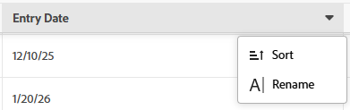
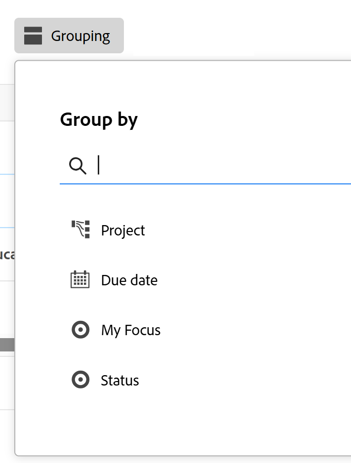

# 拡張リストの使用

{{preview-fast-release-general}}

Adobe Workfrontの一部の領域では、拡張リストを利用できます。 これらのリストは、リスト項目を表示するために表形式を使用し、標準のリストとは異なるルックアンドフィールを持ちます。 フィルタリング、グループ化、列の管理、検索など、ビューの管理も強化されています。

標準リストについては、[Adobe Workfrontでのリストの概要 &#x200B;](/help/quicksilver/workfront-basics/navigate-workfront/use-lists/view-items-in-a-list.md) を参照してください。

>[!NOTE]
>
>必要なデータを表示しやすいように、各拡張リストを異なる方法で設定することができます。 すべてのリストがこの記事で説明されているすべての機能を使用するわけではありません。また、一部のリストには、そのリストにのみ適用される特殊な機能が含まれている場合があります。

## アクセス要件

+++ 展開すると、この記事の機能のアクセス要件が表示されます。

<table style="table-layout:auto">
 <col> 
 <col>
 <tbody> 
  <tr> 
   <td>Adobe Workfront パッケージ</td> 
   <td>
任意
</td> 
  </tr> 
  <tr> 
   <td>Adobe Workfront プラン</td> 
   <td>
   
コントリビューター以上

   
リクエスト以上
</td>
  </tr>
 </tbody> 
</table>

詳しくは、[Workfront ドキュメントのアクセス要件](/help/quicksilver/administration-and-setup/add-users/access-levels-and-object-permissions/access-level-requirements-in-documentation.md)を参照してください。

+++

## 拡張リストを使用するオブジェクト

以下に、拡張リスト形式を使用するWorkfront オブジェクトリストの種類と、オブジェクトを表示する権限がある場合にデフォルトで表示される領域の一部を示します。

>[!NOTE]
>
>このリストは包括的なものではありません。それぞれのオブジェクトリストは、レポートまたはダッシュボードにも表示できます。例えば、要求レポートや要求レポートを含むダッシュボードには、要求のリストも表示されます。

| Workfrontリスト | オブジェクトリストの場所 |
| --- | --- |
| 優先度 | <ul><li>ホーム /左側のメニューで優先度アイコンを選択します</li><li>メインメニュー/優先度</li></ul> |
| リクエストのリスト | <ul><li>リクエスト （新規エクスペリエンスのみ）</li><li>ホームのマイリクエストウィジェット</li></ul> |
| 「設定」のステータス、優先度、重要度および為替レートのリスト | <ul><li>設定/ プロジェクト環境設定/ ステータス</li><li>設定/ プロジェクト環境設定/優先度</li><li>設定/ プロジェクト環境設定/重要度</li><li>「設定」 > 「プロジェクト作業環境」 > 「換算レート」</li></ul> |
|  報告書の一覧  |  報告書（**共有可能なフォルダーを使用** を有効にする必要があります）  |

## 拡張リストへの項目の追加

表示している拡張リストに応じて、次のいずれかの操作を行います。

1. リストの右上にある青いボタンをクリックします。 このオプションを選択すると、情報を入力できるダイアログが開きます。 データは、テーブルの新しい行として保存されます。

   または

1. リストの下部にある「**新しい行**」をクリックします。 このオプションを選択すると、テーブルに新しい行が追加されます。 セル内をダブルクリックして、情報を入力します。 各セルは、リスト項目のフィールドを表します。 フィールドは、リストに表示される前に存在する必要があります。

   拡張リストでは、次のフィールドタイプをサポートしています。

   * テキスト
   * 数値
   * 通貨
   * 日付
   * 日時
   * 単一/複数選択のドロップダウン
   * 先行入力
   * 段落
   * 担当者（1 人または複数）
   * カラーピッカー

   >[!NOTE]
   >
   >フィールドタイプごとに独自の編集オプションがあります。 一部のフィールドは読み取り専用です。

## アクションバーを使用した項目の編集

拡張リストのアクションバーを使用して、リスト内の項目を編集できます。 すべてのアクションバーに同じオプションが含まれるわけではありません。 また、一部のリストでは項目を選択できず、アクションバーも使用できない場合があります。

1. 拡張リスト内の項目の横にあるチェックボックスをオンにします。

   アクションバーが画面の下部に表示されます。

   >[!NOTE]
   >
   >編集するリストに応じて、アクションバーを使用する項目を 1 つ以上選択できます。

1. バーのアクションをクリックして項目を編集します。 選択できるアクションの例を次に示します。

   * 表示
   * 編集
   * 削除

   選択した項目で使用できるアクションがない場合、アクションバーには「使用できるアクションがありません」と表示されます。

   

1. リスト項目のプライマリフィールドにマウスポインターを置き、**その他** メニュー  をクリックして、追加のアクションを表示します。 一部のアクションは、そのリストに固有です。

   >[!TIP]
   >
   >プライマリフィールドは、リストの最初の列に表示されます。

   

## 列をカスタマイズ

拡張リストで表示しているオブジェクトに応じて、リスト内の列を非表示、表示、または並べ替えることができます。

1. リストの上にある **列** をクリックします。

   

1. リストの列の表示/非表示を切り替えるには、を使用します。
1. 列を並べ替えるには、**ドラッグ** アイコン  アイコンをクリックし、列を目的の場所に移動します。 列を移動すると、リストは自動的に変更されます。

   >[!NOTE]
   >
   >プライマリフィールドは、リストの最初の列です。 最初の位置に固定され、その列を変更することはできません。 列数が多い場合、プライマリフィールドは左側に固定され、水平方向にスクロールすると常に表示されます。
   >
   >フィールド名の横にあるアイコンは、テキストや日付フィールドなどのフィールドタイプを示します。

   列が非表示の場合、「**列**」ボタンにインジケーターが表示されます。 列を並べ替えても、インジケーターは表示されません。

   

### 列名を変更

一部の列では、列タイトルにカスタマイズした名前を保存できます。

1. 列の上にマウスポインターを置き、下矢印をクリックして「名前を変更 **を選択し** す。

   

1. **名前を変更** ダイアログで、「**カスタムラベル**」フィールドに列の名前を入力し、「**保存**」をクリックします。

   新しい列名がリストに表示されます。

## 列マネージャーを使用した列の追加と削除

一部の拡張リストで **列マネージャー** を使用すると、リスト上の列を簡単に追加および削除できます。 Workfrontに列として既に存在しているシステムフィールドとカスタムフィールドの両方を、拡張リストに追加またはリストから削除できます。

列の追加と削除：

1. テーブルの右上隅にある「+」アイコンをクリックして、「**列マネージャー** ボックスを開きます。
1. 「**利用可能**」列で既存のオブジェクトフィールドを検索し、フィールド名の右側にある「+」をクリックして、「**選択済み**」列に追加します。
1. **選択済み** 列のフィールドの右側にある「–」をクリックすると、リストから削除できます。

   >[!NOTE]
   >
   >一部のフィールドは、固定されていて削除できない場合があります。

   <!-- Add info about Properties and KPIs when something gets released with those options -->

1. 「**保存**」をクリックします。

   

   選択した内容に応じて、リストの列が更新されます。

## 拡張リスト要素の更新

次の要素は、拡張リストのコンポーネントです。

* 表示：リスト内の列、フィルター、グループをプリセット設定で定義します。
* フィルター：リストに表示する情報量を制限します
* グループ化：共通フィールドに従ってリスト項目を整理します
* 並べ替え：特定のフィールドで指定した順序に従って、リストの項目を整列します
* 検索：検索キーワードを使用して項目をすばやく検索します

### ビューの適用と作成

>[!NOTE]
>
>すべての拡張リストに、このセクションで説明するすべての要素があるわけではありません。

ビューを適用または作成するには：

1. **表示** ドロップダウンをクリックし、既存の表示を選択してリストに適用します

   または

   **新規ビュー** をクリックして作成します。

1. （条件付き）新しいビューを追加するには、ビューの名前を入力して、「**作成**」をクリックします。
1. （任意）列の非表示、表示、並べ替えを行います。 詳細については、「[&#x200B; 拡張リストの列をカスタマイズする &#x200B;](#customize-columns-in-an-enhanced-list)」を参照してください。
1. （任意）リストをフィルタリングします。 詳しくは、「[&#x200B; 拡張リスト内の項目のフィルタリング &#x200B;](#filter-items-in-an-enhanced-list)」を参照してください。
1. （オプション）リストの項目をグループ化します。 詳しくは、[&#x200B; 拡張リストの項目のグループ化 &#x200B;](#group-items-in-an-enhanced-list) を参照してください。

   ビューの変更は自動的に保存されます。 次回このビューを適用するときには、列とフィルタの設定は設定内容のままになります。

### 拡張リストの項目のフィルタリング

>[!NOTE]
>
>すべての拡張リストに、このセクションで説明するすべての要素があるわけではありません。

フィルターを使用すると、リストに表示する情報の量を減らすことができます。

1. リストの上にある **フィルター** をクリックします。
1. 「フィルター」ボックスで、「**条件を追加**」をクリックします。
1. フィルターするフィールドを選択します。
1. 「次のいずれかを含む」、「次のいずれも含まない」、「次より前」、「次より後」などのフィルター修飾子を選択します。 修飾子のオプションは、フィルタリングに使用するフィールドのタイプによって異なります。
1. フィールド値（1 つまたは複数）を選択します。 フィルタリングするフィールドタイプに応じて、リストから項目を選択したり、項目を検索したり、カレンダーを使用して日付範囲を選択したりするように求められる場合があります。

   

   フィルターはリストに自動的に適用されます。

   >[!TIP]
   >
   >現在のユーザーワイルドカードを適用するには、フィールド値として **Me （logged in user）** を選択します。 その後、フィルターはリストを表示しているユーザーに適用されます。 このワイルドカードは、値がユーザーであるフィールドで使用できます。

1. 「**条件を追加**」をクリックして、別の条件をフィルターに追加します。

   AND または OR コネクタによって複数のフィルターを結合できます。

1. フィルターを適用したら、「**フィルター**」オプションを再度開いて、フィルターオプションを変更したり、すべてのフィルターをクリアしたりできます。

   フィルターがリストに適用されると、インジケーターが **フィルター** ボタンに表示されます。

   

### 拡張リストの項目のグループ化

>[!NOTE]
>
>すべての拡張リストに、このセクションで説明するすべての要素があるわけではありません。

リスト上のオブジェクトをグループ化し、特定の条件に基づいて領域に分割します。

Workfrontには、限られた数の定義済みグループが用意されており、それらを変更することはできません。

1. リストの上にある **グループ** をクリックします。
1. グループ化を選択してリストを整理します。

   

1. **すべて折りたたむ** をクリックすると、すべてのグループ化が折りたたまれたリストが表示されます。 デフォルトのオプションでは、すべてのグループ化が展開されたリストが表示されます。
1. グループ化を適用した場合、グループ オプションを再度開いて、すべてのグループ化を一度に折りたたんだり展開したり、グループ化を別のフィールドでグループ化するように変更したり、すべてのグループ化をクリアしたりできます。

   

   リストにグループ化を適用すると、「**グループ**」ボタンにインジケーターが表示されます。

   

### 拡張リストでの並べ替え

>[!NOTE]
>
>すべての拡張リストに、このセクションで説明するすべての要素があるわけではありません。

個々の列を並べ替えるには：

1. 列の上にマウスポインターを置き、下矢印をクリックして「**並べ替え**」を選択します。

   列名の横にあるアイコンは、その列の値と並べ替えの方向でリストが並べ替えられていることを示します。

   >[!NOTE]
   >
   >リストによっては、一部の列を並べ替えできないことがあります。

   

グループ内で作業を並べ替えるには：

1. **グループ** をクリックし、適用されたグループ化の行に移動して、並べ替えドロップダウンをクリックして、昇順または降順を選択します。

   

### 拡張リストでの検索

>[!NOTE]
>
>すべての拡張リストに、このセクションで説明するすべての要素があるわけではありません。

1. リストの右上隅の [ 検索 ] ボックスに、検索条件として使用するキーワードを入力します。 入力すると、結果がリストでハイライト表示されます。

   

   >[!NOTE]
   >
   >すべてのリスト項目のすべての列が検索されます。 リストが長い場合、スクロールして表示する必要がある項目が検索に含まれます。 リストをフィルタリングすると、現在表示されている内容のみが検索されます。

### ビューを共有

>[!NOTE]
>
>すべての拡張リストに、このセクションで説明するすべての要素があるわけではありません。

**表示** ドロップダウンに、表示のカテゴリが 3 つ表示される場合があります。

* **システムビュー**：システム管理者が割り当てたビュー。 システムビューは共有できません。
* **共有ビュー**：他のユーザーによってあなたと共有されたビュー。
* **マイビュー**：自分が作成し、他のユーザーと共有できるビュー。 他のユーザー、チーム、グループとビューを共有できます。

ビューを共有すると、すべてのビュー要素（列、フィルター、グループ）が含まれます。

ビューを共有するには：

1. **表示** ドロップダウンで、共有する **マイ表示** 内の表示にポインタを合わせ、**詳細** メニュー  をクリックして、**共有** をクリックします。
1. 共有ダイアログで、ビューを共有するユーザー、チーム、グループ、会社または担当業務の名前を入力し、表示されたらリストから選択します。

   次の権限を受信者に付与できます。

   * **表示**：ユーザーは、ビューをリストに適用できますが、共有することはできません。

      ビューアクセスのユーザーがビューを更新すると、これらの変更はユーザーの個人環境設定に保存されます。 （ユーザーの **共有ビュー** の）ビュー名に青い点が付いている場合は、個人用の更新がビューに適用されていることを示します。

   * **管理**：ユーザーは、ビューの名前変更、共有、削除、およびビューの要素の編集を行うことができます。

      管理アクセス ユーザーがビューに変更を加えると、ビューを共有しているすべてのユーザーが、ビューがリストに適用される際に更新を確認できます。

1. 「**保存**」をクリックします。

    ユーザーとビューを共有してそのアクセスを削除すると、そのビューはユーザーの **共有ビュー** から削除されます。 ユーザーのアクセス権が削除されるときに、そのユーザーが共有ビューをリストに適用していた場合は、システムのデフォルトビューが適用されます。

### ビューのコピー

>[!NOTE]
>
>すべての拡張リストに、このセクションで説明するすべての要素があるわけではありません。

編集する権限がないビューが共有されている場合は、そのビューをコピーして新しい名前で保存できます。 ビューをコピーするには、まずビューに変更を加える必要があります。

1. 表示ドロップダウンで、設定を変更しコピーする **共有表示** 内の表示にポインタを合わせ、「詳細 **」メニュー** 「詳細」メニュー  環境設定と共にコピー **をクリックします**。

   新規ビューが自動的に作成されます。 コピーしたビューの名前は次のパターンに従います。`Original view name (copy)` また、ビューの **マイビュー** セクションに表示されます。

   このビューの所有者です。ビューの名前変更、編集、共有、または削除を行うことができます。 元のビューの所有者がそのビューへの共有アクセス権を削除した場合でも、共有された元のビューをコピーして作成したビューにアクセスできます。

   >[!NOTE]
   >
   >**環境設定を使用してコピー** オプションは、共有されているビューに変更を加えた場合にのみ使用できます。

### ビューのリセット

>[!NOTE]
>
>すべての拡張リストに、このセクションで説明するすべての要素があるわけではありません。

編集する権限を持たないビューが共有されている場合、そのビューを更新すると、元のビューに戻すことができます。

1. **表示** ドロップダウンで、リセットする **共有表示** 内の表示にポインタを合わせ、**詳細** メニュー  をクリックしてから、**デフォルトにリセット** をクリックします。

   ビュー要素（列、フィルター、グループ）は、共有されていた元の設定にリセットされます。

   >[!NOTE]
   >
   >**デフォルトにリセット** オプションは、共有されているビューに変更を加えた場合にのみ使用できます。

   

