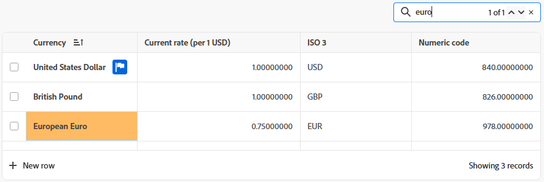

# 拡張リストの使用

Adobe Workfrontの一部の領域では、拡張リストを利用できます。 これらのリストは、リスト項目を表示するために表形式を使用し、標準のリストとは異なるルックアンドフィールを持ちます。 フィルタリング、グループ化、列の管理、検索など、ビューの管理も強化されています。

標準リストについては、[Adobe Workfrontでのリストの概要 ](/help/quicksilver/workfront-basics/navigate-workfront/use-lists/view-items-in-a-list.md) を参照してください。

>[!NOTE]
>
>必要なデータを表示しやすいように、各拡張リストを異なる方法で設定することができます。 すべてのリストがこの記事で説明されているすべての機能を使用するわけではありません。また、一部のリストには、そのリストにのみ適用される特殊な機能が含まれている場合があります。

## アクセス要件

+++ 展開すると、この記事の機能のアクセス要件が表示されます。

<table style="table-layout:auto">
 <col> 
 <col>
 <tbody> 
  <tr> 
   <td>Adobe Workfront パッケージ</td> 
   <td>
任意
</td> 
  </tr> 
  <tr> 
   <td>Adobe Workfront プラン</td> 
   <td>
   
投稿者以上

   
リクエスト以上
</td>
  </tr>
 </tbody> 
</table>

詳しくは、[Workfront ドキュメントのアクセス要件](/help/quicksilver/administration-and-setup/add-users/access-levels-and-object-permissions/access-level-requirements-in-documentation.md)を参照してください。

+++

## 拡張リストを使用するオブジェクト

以下に、拡張リスト形式を使用するWorkfront オブジェクトリストの種類と、オブジェクトを表示する権限がある場合にデフォルトで表示される領域の一部を示します。

>[!NOTE]
>
>このリストは包括的なものではありません。それぞれのオブジェクトリストは、レポートまたはダッシュボードにも表示できます。例えば、要求レポートや要求レポートを含むダッシュボードには、要求のリストも表示されます。

| Workfrontリスト | オブジェクトリストの場所 |
|--- |--- |
| 優先度 | <ul><li>ホーム /左側のメニューで優先度アイコンを選択します</li><li>メインメニュー/優先度</li></ul> |
| リクエストのリスト | <ul><li>リクエスト （新規エクスペリエンスのみ）</li><li>ホームのマイリクエストウィジェット</li></ul> |
| 「設定」のステータス、優先度、重要度および為替レートのリスト | <ul><li>設定/ プロジェクト環境設定/ ステータス</li><li>設定/ プロジェクト環境設定/優先度</li><li>設定/ プロジェクト環境設定/重要度</li><li>「設定」 > 「プロジェクト作業環境」 > 「換算レート」</li></ul> |

## 拡張リストへの項目の追加

表示している拡張リストに応じて、次のいずれかの操作を行います。

1. リストの右上にある青いボタンをクリックします。 このオプションを選択すると、情報を入力できるダイアログが開きます。 データは、テーブルの新しい行として保存されます。

   または

1. リストの下部にある「**新しい行**」をクリックします。 このオプションを選択すると、テーブルに新しい行が追加されます。 セル内をダブルクリックして、情報を入力します。 各セルは、リスト項目のフィールドを表します。 フィールドは、リストに表示される前に存在する必要があります。

   拡張リストでは、次のフィールドタイプをサポートしています。

   * テキスト
   * 数値
   * 通貨
   * 日付
   * 日時
   * 単一/複数選択のドロップダウン
   * 先行入力
   * 段落
   * 担当者（1 人または複数）
   * カラーピッカー

   >[!NOTE]
   >
   >フィールドタイプごとに独自の編集オプションがあります。 一部のフィールドは読み取り専用です。

## アクションバーを使用した項目の編集

拡張リストのアクションバーを使用して、リスト内の項目を編集できます。 すべてのアクションバーに同じオプションが含まれるわけではありません。 また、一部のリストでは項目を選択できず、アクションバーも使用できない場合があります。

1. 拡張リスト内の項目の横にあるチェックボックスをオンにします。

   アクションバーが画面の下部に表示されます。

   >[!NOTE]
   >
   >編集するリストに応じて、アクションバーを使用する項目を 1 つ以上選択できます。

1. バーのアクションをクリックして項目を編集します。 選択できるアクションの例を次に示します。

   * 表示
   * 編集
   * 削除

   選択した項目で使用できるアクションがない場合、アクションバーには「使用できるアクションがありません」と表示されます。

   

1. リスト項目のプライマリフィールドにマウスポインターを置き、**その他** メニュー  をクリックして、追加のアクションを表示します。 一部のアクションは、そのリストに固有です。

   >[!TIP]
   >
   >プライマリフィールドは、リストの最初の列に表示されます。

   

## 列をカスタマイズ

拡張リストで表示しているオブジェクトに応じて、リスト内の列を非表示、表示、または並べ替えることができます。

1. リストの上にある **列** をクリックします。

   

1. リストの列の表示/非表示を切り替えるには、を使用します。
1. 列を並べ替えるには、**ドラッグ** アイコン  アイコンをクリックし、列を目的の場所に移動します。 列を移動すると、リストは自動的に変更されます。

   >[!NOTE]
   >
   >プライマリフィールドは、リストの最初の列です。 最初の位置に固定され、その列を変更することはできません。 列数が多い場合、プライマリフィールドは左側に固定され、水平方向にスクロールすると常に表示されます。
   >
   >フィールド名の横にあるアイコンは、テキストや日付フィールドなどのフィールドタイプを示します。

   列が非表示の場合、「**列**」ボタンにインジケーターが表示されます。 列を並べ替えても、インジケーターは表示されません。

   

## 列マネージャーを使用した列の追加と削除

一部の拡張リストで **列マネージャー** を使用すると、リスト上の列を簡単に追加および削除できます。 Workfrontに列として既に存在しているシステムフィールドとカスタムフィールドの両方を、拡張リストに追加またはリストから削除できます。

列の追加と削除：

1. テーブルの右上隅にある「+」アイコンをクリックして、「**列マネージャー** ボックスを開きます。
1. 「**利用可能**」列で既存のオブジェクトフィールドを検索し、フィールド名の右側にある「+」をクリックして、「**選択済み**」列に追加します。
1. **選択済み** 列のフィールドの右側にある「–」をクリックすると、リストから削除できます。

   >[!NOTE]
   >
   >一部のフィールドは、固定されていて削除できない場合があります。

   <!-- Add info about Properties and KPIs when something gets released with those options -->

1. 「**保存**」をクリックします。

   

   選択した内容に応じて、リストの列が更新されます。

## ビューを含むデータを拡張リストで表示

ビューは、リストに適用できる列の配置とフィルターのパーソナライズされたセットです。 新しいビューを作成したり、既存のビューを編集することができます。

### ビューの適用と作成

ビューを適用するには、「**表示**」ドロップダウンをクリックし、リストに適用するビューを選択します。

新しいビューを作成するには：

1. **表示** ドロップダウンをクリックし、「**新しい表示**」を選択します。
1. ビューの名前を入力し、[**作成**] をクリックします。
1. （任意）列の非表示、表示、並べ替えを行います。 詳細については、「[ 拡張リストの列をカスタマイズする ](#customize-columns-in-an-enhanced-list)」を参照してください。
1. （任意）リスト項目をフィルタリングしてグループ化します。 詳しくは、[ 拡張リストの項目のフィルタリングとグループ化 ](#filter-and-group-items-in-an-enhanced-list) を参照してください。

   ビューに対する変更は自動的に保存され、ビューを使用するすべてのユーザーに変更内容が表示されます。

   次回このビューを適用するときには、列とフィルタの設定は設定内容のままになります。

### ビューを共有

**表示** ドロップダウンに、表示のカテゴリが 3 つ表示される場合があります。

* **システムビュー**：システム管理者が割り当てたビュー。
* **共有ビュー**：他のユーザーによってあなたと共有されたビュー。
* **マイビュー**：自分が作成し、他のユーザーと共有できるビュー。 他のユーザー、チーム、グループとビューを共有できます。

ビューを共有するには：

1. **表示** ドロップダウンで、共有する **マイビュー** 内の表示にポインタを合わせ、表示されたら 3 ドットメニューをクリックします。
1. 「**共有**」を選択します。
1. 共有ダイアログで、ビューを共有するユーザー、チーム、またはグループの名前を入力し、表示されたらリストから選択します。

   次の権限を受信者に付与できます。

   * **表示**：ユーザーは、ビューをリストに適用できますが、共有することはできません。
   * **管理**：ユーザーはビューの名前を変更し、他のユーザーと共有して削除できます。

1. 「**保存**」をクリックします。

## 項目のフィルタリングとグループ化

フィルターを使用すると、リストに表示する情報の量を減らすことができます。 リスト上のオブジェクトをグループ化し、特定の条件に基づいて領域に分割します。

### フィルターの使用

1. リストの上にある **フィルター** をクリックします。
1. 「フィルター」ボックスで、「**条件を追加**」をクリックします。
1. フィルターするフィールドを選択します。
1. 「次のいずれかを含む」、「次のいずれも含まない」、「次より前」、「次より後」などのフィルター修飾子を選択します。 修飾子のオプションは、フィルタリングに使用するフィールドのタイプによって異なります。
1. フィールド値（1 つまたは複数）を選択します。 フィルタリングするフィールドタイプに応じて、リストから項目を選択したり、項目を検索したり、カレンダーを使用して日付範囲を選択したりするように求められる場合があります。

   

   フィルターはリストに自動的に適用されます。

   >[!TIP]
   >
   >現在のユーザーワイルドカードを適用するには、フィールド値として **Me （logged in user）** を選択します。 その後、フィルターはリストを表示しているユーザーに適用されます。 このワイルドカードは、値がユーザーであるフィールドで使用できます。

1. 「**条件の追加**」をクリックして、OR ステートメントとして別の条件をフィルターに追加します。
1. フィルターを適用したら、「**フィルター**」オプションを再度開いて、フィルターオプションを変更したり、すべてのフィルターをクリアしたりできます。

   フィルターがリストに適用されると、インジケーターが **フィルター** ボタンに表示されます。

   

### グループ化の使用

1. リストの上にある **グループ** をクリックします。
1. グループ化を選択してリストを整理します。

   

1. グループ化を適用した場合、グループ オプションを再度開いて、すべてのグループ化を一度に折りたたんだり展開したり、グループ化を別のフィールドでグループ化するように変更したり、すべてのグループ化をクリアしたりできます。

   

   リストにグループ化を適用すると、「**グループ**」ボタンにインジケーターが表示されます。

   

## 拡張リストでの並べ替えと検索

個々の列を並べ替えるには：

1. 列に移動し、下矢印をクリックします。

   列名の横にあるアイコンは、その列の値と並べ替えの方向でリストが並べ替えられていることを示します。

   >[!NOTE]
   >
   >リストによっては、一部の列を並べ替えできないことがあります。

   

グループ内で作業を並べ替えるには：

1. **グループ** をクリックし、昇順または降順で並べ替えるかどうかを選択します。

   

検索するには：

1. 検索語句をリスト上部の検索フィールドに入力します。 入力すると、結果がリストでハイライト表示されます。

   
