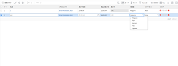

# [!DNL Adobe Workfront] のリスト内のインライン編集項目

オブジェクトがリストまたはレポートに表示されるときは、オブジェクトをインラインで編集できます。リストまたはレポートに表示されるオブジェクトの情報を編集すると、オブジェクトは直ちに更新されます。

オブジェクトに添付されていないカスタムフォームに含まれるフィールドをインライン編集すると、カスタムフォームは自動的にオブジェクトに追加されます。フィールドが複数のカスタムフォーム上に存在する場合は、最も新しく更新されたカスタムフォームがオブジェクトに添付されます。

リストについて詳しくは、[ のリストの基本を学ぶ [!DNL Adobe Workfront]](../../../workfront-basics/navigate-workfront/use-lists/view-items-in-a-list.md)を参照してください。

[!DNL Adobe Workfront] ではリストまたはレポートに表示されるほとんどのオブジェクトはインラインで編集できますが、次のような制限があります。

* 計算されたフィールドや計算である [!DNL Workfront] ビルトインフィールドは編集できません。
* リスト内のオブジェクトに直接関連付けられているフィールドのみを編集できます。リスト内のオブジェクトに関連付けられたオブジェクトに属するフィールドは編集できません。\
   例えば、タスクレポートでタスクのステータスは編集できますが、同じレポートでタスクが関連付けられているプロジェクトの名前は編集できません。プロジェクトの名前は、プロジェクトレポートでのみ編集できます。
* リストのビューにデフォルトの通貨が表示されていない場合、フィールドはインライン編集できません。\
   デフォルトの通貨の表示については、[独自の為替レートを使用した財務データレポートの作成](../../../reports-and-dashboards/reports/creating-and-managing-reports/create-financial-data-reports-unique-exchange-rates.md)記事の[独自の通貨を使用したレポートの編集](../../../reports-and-dashboards/reports/creating-and-managing-reports/create-financial-data-reports-unique-exchange-rates.md#editing-reports-with-unique-currencies)節を参照してください。

* リストに表示されるフラグとアイコンは編集できません。

## アクセス要件

この記事の手順を実行するには、次のアクセス権が必要です。

<table style="table-layout:auto"> 
 <col> 
 <col> 
 <tbody> 
  <tr> 
   <td role="rowheader"><strong>[!DNL Adobe Workfront] プラン*</strong></td> 
   <td> 
任意
 </td> 
  </tr> 
  <tr> 
   <td role="rowheader"><strong>[!DNL Adobe Workfront] ライセンス*</strong></td> 
   <td> 
[!UICONTROL Review] 以降
 </td> 
  </tr> 
  <tr> 
   <td role="rowheader"><strong>アクセスレベル設定*</strong></td> 
   <td> 
リストが含まれるエリアへの [!UICONTROL Edit] アクセス権
 
例えば、プロジェクト内のタスクをインライン編集するには、プロジェクトへの [!UICONTROL Edit] アクセス権が必要です。
 
メモ：まだアクセス権がない場合は、アクセスレベルに追加の制限が設定されているか [!DNL Workfront] 管理者に確認してください。 [!DNL Workfront] 管理者がアクセスレベルを変更する方法に関して詳しくは、<a href="../../../administration-and-setup/add-users/configure-and-grant-access/create-modify-access-levels.md" class="MCXref xref">カスタムアクセスレベルの作成または変更</a>を参照してください。
 </td> 
  </tr> 
  <tr> 
   <td role="rowheader"><strong>オブジェクト権限</strong></td> 
   <td> 
[!UICONTROL Manage]
 
また、カスタムフィールド、ステータスなど、特定のフィールドを編集する権限が必要です。
 
追加のアクセス権のリクエストについて詳しくは、<a href="../../../workfront-basics/grant-and-request-access-to-objects/request-access.md" class="MCXref xref">オブジェクトへのアクセス権のリクエスト</a>を参照してください。
 </td> 
  </tr> 
 </tbody> 
</table>

&#42;ご利用のプラン、ライセンスタイプまたはアクセス権を確認するには、[!DNL Workfront] 管理者にお問い合わせください。

## オブジェクトをインラインで編集

1. インライン編集するオブジェクトのリストに移動します。

   リストには、リスト内のオブジェクトに関連付けられたオブジェクトに属するオブジェクトまたはフィールドに属するフィールドが表示されます。

1. 編集するオブジェクトを見つけ、リスト内の任意のフィールド内をクリックします。

   >[!TIP]
   >
   >複数のページがある場合は、次を使用してオブジェクトを特定できます。
   >
   >   
   >   
   >   * **ページネーション**：戻る矢印と進む矢印をクリックして、ページ間を移動します。\
   >     リストの右下隅にある[!UICONTROL ページネーション]リストをスクロールすると、エリアは固定状態のままになります。
   >   * **クイックフィルター**：フィルターアイコンをクリックするか、Alt + F キーを押してクイックフィルターを開き、テキストを入力して、入力したテキストを含む項目のみを表示します。\
   >     クイックフィルターはリストツールバーにあります。詳しくは、[クイックフィルターのリストへの適用](../../../workfront-basics/navigate-workfront/use-lists/apply-quick-filter-list.md)を参照してください。

   フィールドが編集可能な場合は、リストに表示されるフィールドとその他すべてのフィールドが編集可能なセルに変わります。

   

1. このセル内の情報を編集し、[!UICONTROL Enter] キーを押します。

   >[!NOTE]
   >
   >カスタムフィールドを書式設定を許可するように設定している場合は、更新されたリストのフィールドをインライン編集する際に、テキストを太字、斜体または下線にできます。\
   >カスタムフィールドの書式設定については、[カスタムフォームの作成または編集](../../../administration-and-setup/customize-workfront/create-manage-custom-forms/create-or-edit-a-custom-form.md)を参照してください。\
   >更新されたリストについては、[リストの基本を学ぶ [!DNL Adobe Workfront]](../../../workfront-basics/navigate-workfront/use-lists/view-items-in-a-list.md)の「更新されたリストと従来のリストの違い」の節を参照してください。

1. [!UICONTROL Tab] キーを押して、次の編集可能なセルに移動します。
1. （条件付き）編集内容を保存できず、セルが赤で囲まれている場合は、フィールド内をクリックして、セルの横に表示される検証メッセージを確認し、適切な更新を行います。

   最も一般的に、この問題は、誤った形式が使用されている場合や、必須フィールドが空白のままの場合に発生します。

1. すべてのセルの変更が終了したら、[!UICONTROL Enter] をクリックして変更を保存します。
