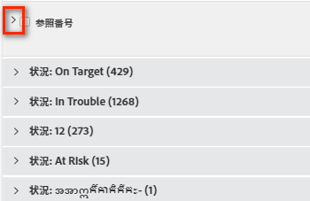
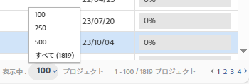

# リストの表示方法を変更

[!DNL Adobe Workfront] では、リストの表示方法をカスタマイズできます。対象のリストを表示している他のユーザーには、変更は反映されません。

次のカスタマイズを行うことができます。

* 表示する項目の数
* 列の幅や順序
* グループ化を展開するか折りたたむか

>[!NOTE]
>
>[!DNL Workfront] からログアウトしたり、ブラウザーを閉じたりすると、上記の表示変更は元に戻ります。また、これらの変更は 8 時間後に元に戻る場合もあります。

上記の一時的なカスタマイズに加えて、リストを並べ替える基準となる列を調整することもできます。この調整は、ログアウトしたりブラウザーを閉じた後でも [!DNL Workfront] に保持されます。ただし、リストのビューで他のユーザーが並べ替えオプションを編集した場合、以前の並べ替えの選択は保持されません。

リストに表示される情報の変更については、[レポート要素：フィルター、ビューおよびグループ化](../../../reports-and-dashboards/reports/reporting-elements/reporting-elements-filters-views-groupings.md)を参照してください。

## アクセス要件

この記事の手順を実行するには、次のアクセス権が必要です。

<table style="table-layout:auto"> 
 <col> 
 <col> 
 <tbody> 
  <tr> 
   <td role="rowheader"><strong>[!DNL Adobe Workfront] プラン*</strong></td> 
   <td> 
任意
 </td> 
  </tr> 
  <tr> 
   <td role="rowheader"><strong>[!DNL Adobe Workfront] ライセンス*</strong></td> 
   <td> 
[!UICONTROL Request] 以降
 </td> 
  </tr> 
  <tr> 
   <td role="rowheader"><strong>アクセスレベル設定*</strong></td> 
   <td> 
リストが表示されているエリアへの[!UICONTROL View]アクセス権
 
例えば、プロジェクトのビューを変更するには、プロジェクトへの[!UICONTROL View]アクセス権が必要です。
 
メモ：それでもアクセスできない場合は、アクセスレベルに追加の制限が設定されていないかどうかを [!DNL Workfront] 管理者にお問い合わせください。 [!DNL Workfront] 管理者がユーザーのアクセスレベルを変更する方法については、<a href="../../../administration-and-setup/add-users/configure-and-grant-access/create-modify-access-levels.md" class="MCXref xref">カスタムアクセスレベルの作成または変更</a>を参照してください。
 </td> 
  </tr> 
  <tr> 
   <td role="rowheader"><strong>オブジェクト権限</strong></td> 
   <td> 
リストに適用されるビューに対する[!UICONTROL View]権限またはそれ以上
 
追加のアクセス権のリクエストについて詳しくは、<a href="../../../workfront-basics/grant-and-request-access-to-objects/request-access.md" class="MCXref xref">オブジェクトへのアクセス権のリクエスト</a>を参照してください。
 </td> 
  </tr> 
 </tbody> 
</table>

&#42;ご利用のプラン、ライセンスタイプまたはアクセス権を確認するには、[!DNL Workfront] 管理者にお問い合わせください。

## リストの表示方法を変更

1. 変更する [!DNL Workfront] のリストに移動します。

   <!--
   
 
   <MadCap:conditionalText data-mc-conditions="QuicksilverOrClassic.Draft mode">
   By default, groupings are collapsed.
   </MadCap:conditionalText>
     

   -->

1. （オプションおよび条件付き）リスト内のグループ化が折りたたまれていて、詳細を表示したい場合は、目的のグループ化をクリックしてリストを展開し、リストに含まれる情報を表示します。

   または

   すべてのグループ化を展開するには、列ヘッダーのチェックボックスの右にある矢印をクリックします。

   

1. （オプションおよび条件付き）画面に特定の数の項目を表示する場合は、画面の右下隅にある&#x200B;**[!UICONTROL 表示中]**&#x200B;ドロップダウンメニューから、**100**、**250**、**500**、**[!UICONTROL すべて]**&#x200B;または **2000** 項目の表示を選択します。

   

   >[!TIP]
   >
   >デフォルトでは、更新されたリストには 2,000 個の項目が表示され、従来のリストには 100 個の項目が表示されます。リストに 2,000 個を超える項目が含まれている場合、すべての項目を 1 ページ上に表示することはできません。
   >
   >
   >書式設定されたテキストフィールドがオブジェクトに含まれる大きなリストの場合に最高のパフォーマンスを得るには、この数を 250 に制限することをお勧めします。
   >
   >
   >2 つのリストタイプについて詳しくは、[ [!DNL Adobe Workfront]](../../../workfront-basics/navigate-workfront/use-lists/view-items-in-a-list.md) のリストの基本を学ぶの記事で[更新されたリストと従来のリストの違い](../../../workfront-basics/navigate-workfront/use-lists/view-items-in-a-list.md#updated)の節を参照してください。

   リストの結果はページ分割され、選択された数の項目がページごとに表示されます。前向きおよび後向きの矢印をクリックするか、特定のページを選択すると、他のページの結果にアクセスできます。

1. 列の幅を変更するには、2 つの列を区切る線の上にポインタを合わせ、クリックして目的の幅までドラッグします。

   列のサイズは、ブラウザーでキャッシュをクリアするか、手動で再びサイズを変更するまでは、変更された幅のままです。

1. リスト内の列を並べ替えるには、列ヘッダーにポインタを合わせて手のひらツールを表示したあと、クリックして目的の表示位置まで列をドラッグします。

   列の位置は、ページを更新するまで保存されます。\
   リスト内の列の幅と順序のカスタマイズについて詳しくは、[列の幅と順序の変更](../../../reports-and-dashboards/reports/reporting-elements/modify-column-width-order.md)の記事を参照してください。

1. リストの並べ替え順序を調整するには、列ヘッダーをクリックして選択し、キーボードの Command キー（[!DNL Mac] の場合）または Ctrl キー（[!DNL Windows] の場合）を押したまま、追加の列ヘッダーを最大 2 つ選択して、それらの列で並べ替えます。

   リストは選択した各列を基準に、選択した順序で並べ替えられます。

   リストに加えた変更はすべて即座に保存されます。

   >[!NOTE]
   >
   >[!UICONTROL 設定]の[!UICONTROL グループ]エリアでグループを並べ替えている場合、リストの並べ替え方法を変更しても、グループとそのサブグループの階層ビューは分割されません。サブグループは親グループと一緒に留まります。リストは上位レベルのグループから順に並べ替えられます。次に、それぞれの親グループの下で、同じレベルにあるサブグループのリストがまとめて並べ替えられます。
