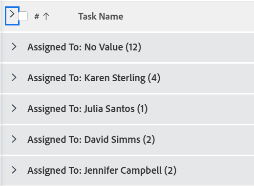

# リストの表示方法を変更する

In [!DNL Adobe Workfront]を使用すると、リストの表示方法をカスタマイズできます。 リストを表示している他のユーザーには、変更は表示されません。

次のカスタマイズを行うことができます。

* 表示する項目の数
* 列の幅または順序
* グループを展開するか折りたたむか

>[!NOTE]
>
>上記で行った変更は、 [!DNL Workfront] または、ブラウザーを閉じます。 これらの変更は、8 時間の期間が経過した後で元に戻すこともできます。

上の一時的なカスタマイズに加えて、リストの並べ替え順の列を調整することもできます。 [!DNL Workfront] は、ブラウザーをログアウトまたは閉じた後も保持されます。 ただし、リストの表示で他のユーザーが並べ替えオプションを編集した場合、以前の並べ替えの選択は保持されません。

リストに表示される情報の変更について詳しくは、 [レポート要素：フィルター、ビュー、グループ化](../../../reports-and-dashboards/reports/reporting-elements/reporting-elements-filters-views-groupings.md).

## アクセス要件

この記事の手順を実行するには、次のアクセス権が必要です。

<table style="table-layout:auto"> 
 <col> 
 <col> 
 <tbody> 
  <tr> 
   <td role="rowheader"><strong>[!DNL Adobe Workfront] 計画*</strong></td> 
   <td> 
任意
 </td> 
  </tr> 
  <tr> 
   <td role="rowheader"><strong>[!DNL Adobe Workfront] ライセンス*</strong></td> 
   <td> 
[!UICONTROL リクエスト ] 以降
 </td> 
  </tr> 
  <tr> 
   <td role="rowheader"><strong>アクセスレベル設定*</strong></td> 
   <td> 
[!UICONTROL 表示 ] リストが存在する領域へのアクセス
 
例えば、プロジェクトのビューを変更するには、[!UICONTROL ビュー ] でプロジェクトにアクセスできる必要があります。
 
注意：まだアクセス権がない場合は、 [!DNL Workfront] 管理者（アクセスレベルに追加の制限を設定している場合） を参照してください。 [!DNL Workfront] 管理者は、 <a href="../../../administration-and-setup/add-users/configure-and-grant-access/create-modify-access-levels.md" class="MCXref xref">カスタムアクセスレベルの作成または変更</a>.
 </td> 
  </tr> 
  <tr> 
   <td role="rowheader"><strong>オブジェクト権限</strong></td> 
   <td> 
リストに適用されるビューに対する [!UICONTROL ビュー ] 以上の権限
 
追加のアクセス権のリクエストについて詳しくは、 <a href="../../../workfront-basics/grant-and-request-access-to-objects/request-access.md" class="MCXref xref">オブジェクトへのアクセスのリクエスト </a>.
 </td> 
  </tr> 
 </tbody> 
</table>

&#42;ご利用のプラン、ライセンスの種類、アクセス権を確認するには、 [!DNL Workfront] 管理者。

## リストの表示方法を変更する

1. のリストに移動します。 [!DNL Workfront] 変更する

   <!--
   
 
   <MadCap:conditionalText data-mc-conditions="QuicksilverOrClassic.Draft mode">
   By default, groupings are collapsed.
   </MadCap:conditionalText>
     

   -->

1. （オプションおよび条件付き）リスト内のグループが折りたたまれ、詳細を表示する場合は、目的のグループをクリックしてリストを展開し、リストに表示される情報を表示します。

   または

   すべてのグループを展開するには、列見出しのチェックボックスの右にある矢印をクリックします。

   

1. （オプションおよび条件付き）画面に特定の数の項目を表示する場合は、 **[!UICONTROL 表示中]** 画面の右下隅にあるドロップダウンメニューから、「表示」を選択します。 **100**, **250**, **500**, **[!UICONTROL すべて]**&#x200B;または **2000 年** 項目。

   

   >[!TIP]
   >
   >デフォルトでは、更新されたリストには 2,000 個の項目が表示され、レガシーリストには 100 個の項目が表示されます。 リストに 2,000 個を超える項目が含まれている場合、すべての項目を 1 ページに表示することはできません。
   >
   >
   >オブジェクトに書式設定されたテキストフィールドが含まれる大きなリストで最高のパフォーマンスを得るには、この数を 250 に制限することをお勧めします。
   >
   >
   >2 つのリストタイプの詳細については、「 [更新済みリストと従来のリストの違い](../../../workfront-basics/navigate-workfront/use-lists/view-items-in-a-list.md#updated) 記事内 [のリストの基本を学ぶ [!DNL Adobe Workfront]](../../../workfront-basics/navigate-workfront/use-lists/view-items-in-a-list.md).

   リストの結果はページ分割され、選択したページあたりの項目数が表示されます。 前後の矢印をクリックするか、特定のページを選択すると、他のページの結果にアクセスできます。

1. 列の幅を変更するには、2 列を区切る線の上にマウスを移動し、クリックして目的の幅にドラッグします。

   列のサイズは、ブラウザーでキャッシュをクリアするか、再び手動でサイズ変更するまで変更されます。

1. リスト内の列を並べ替えるには、列見出しの上にマウスを移動して手のひらツールを表示し、クリックして列を表示する位置にドラッグします。

   列の位置は、ページを更新するまで保存されます。\
   リスト内の列の幅と順序のカスタマイズの詳細については、「 [列の幅と順序を変更する](../../../reports-and-dashboards/reports/reporting-elements/modify-column-width-order.md).

1. リストの並べ替え順を調整するには、列見出しをクリックして選択し、Cmd キーを押したままにします ( [!DNL Mac]) または Ctrl キー ( [!DNL Windows]) をクリックし、最大 2 つの追加の列ヘッダーを選択して並べ替えます。

   リストは、選択した列ごとに、選択した順序で並べ替えられます。

   リストに加えた変更はすべて即座に保存されます。

   >[!NOTE]
   >
   >グループを [!UICONTROL グループ] 領域 [!UICONTROL 設定]リストの並べ替え方法を変更した場合、グループとサブグループの階層ビューは分割されず、サブグループは親グループに留まります。 リストは、最上位のグループで最初に並べ替えられます。 次に、各親グループの下で、同じレベルにあるサブグループのリストが並べ替えられます。
