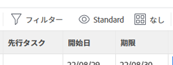
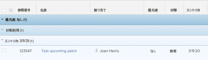

# のリストの基本を学ぶ [!DNL Adobe Workfront]

<!--
{{highlighted-preview}}
-->

オブジェクトのリストは、 [!DNL Adobe Workfront] を使用して、開始日と期限、割り当てられたユーザー、およびそれらに関連付けられているその他のオブジェクトなど、ユーザーに関する情報を取得できます。

次に、 [!DNL Workfront]:

* リストは 5 分ごとに自動的に更新され、システム内の他のユーザーが別の場所で更新している情報を更新します。
* の一部の領域 [!DNL Workfront] は、既定のオブジェクトリストで事前設定されています。

   これらの事前設定済みリストのほとんどはカスタマイズできます。

* A [!DNL Workfront] 管理者は、カスタムリストを作成して、様々な領域に適用できます [!DNL Workfront].

   システムレベルのリストの作成の詳細については、「 [デフォルトのフィルター、ビュー、グループを作成、編集および共有します](../../../administration-and-setup/set-up-workfront/configure-system-defaults/create-and-share-default-fvgs.md).

## アクセス要件

この記事の手順を実行するには、次のアクセス権が必要です。

<table style="table-layout:auto"> 
 <col> 
 <col> 
 <tbody> 
  <tr> 
   <td role="rowheader"><strong>[!DNL Adobe Workfront] 計画*</strong></td> 
   <td> 
任意
 </td> 
  </tr> 
  <tr> 
   <td role="rowheader"><strong>[!DNL Adobe Workfront] ライセンス*</strong></td> 
   <td> 
[!UICONTROL リクエスト ] 以降
 </td> 
  </tr> 
  <tr> 
   <td role="rowheader"><strong>アクセスレベル設定*</strong></td> 
   <td> 
[!UICONTROL 表示 ] 以降では、フィルター、表示、グループにアクセスできます
 
[!UICONTROL 設定 ] 領域の項目の場合、項目または [!UICONTROL システム管理者 ] アクセスレベルの管理者アクセス権が必要です。
 
注意：まだアクセス権がない場合は、 [!DNL Workfront] 管理者（アクセスレベルに追加の制限を設定している場合） を参照してください。 [!DNL Workfront] 管理者は、 <a href="../../../administration-and-setup/add-users/configure-and-grant-access/create-modify-access-levels.md" class="MCXref xref">カスタムアクセスレベルの作成または変更</a>.
 </td> 
  </tr> 
  <tr> 
   <td role="rowheader"><strong>オブジェクト権限</strong></td> 
   <td> 
[!UICONTROL 表示 ] 以上の権限（共有へのアクセス権を持つ）
 
追加のアクセス権のリクエストについて詳しくは、 <a href="../../../workfront-basics/grant-and-request-access-to-objects/request-access.md" class="MCXref xref">オブジェクトへのアクセスのリクエスト </a>.
 </td>
  </tr> 
 </tbody> 
</table>

ご利用のプラン、ライセンスの種類、アクセス権を確認するには、 [!DNL Workfront] 管理者。

## オブジェクトリスト

以下に、 [!DNL Workfront] およびオブジェクトの表示権限を持っている場合にデフォルトで表示される領域の一部です。

>[!NOTE]
>
>* このリストは包括的ではありません。 これらの各オブジェクトリストは、レポートまたはダッシュボードにも表示できます。 例えば、プロジェクトレポートや、プロジェクトレポートを含むダッシュボードにも、プロジェクトのリストが表示されます。
>* このリストで「select」とは、名前の左にあるチェックボックスではなく、項目の名前をクリックする必要があることを意味します。

<table style="table-layout:auto"> 
 <col> 
 <col> 
 <thead> 
  <tr> 
   <th><strong>[!DNL Workfront] リスト</strong></th> 
   <th><strong>オブジェクトリストの場所</strong></th> 
  </tr> 
 </thead> 
 <tbody> 
  <tr> 
   <td>ポートフォリオのリスト</td> 
   <td> 
    <ul> 
     <li> 
[!UICONTROLPortfolio]
 </li> 
    </ul> </td> 
  </tr> 
  <tr> 
   <td>プログラムのリスト</td> 
   <td> 
    <ul> 
     <li> 
[!UICONTROLPortfolio] /[!UICONTROL ポートフォリオを選択 ] /[!UICONTROL プログラム ]
 </li> 
     <li data-mc-conditions="QuicksilverOrClassic.Quicksilver"> 
[!UICONTROL プログラム ]
 </li> 
    </ul> </td> 
  </tr> 
  <tr> 
   <td>プロジェクトのリスト</td> 
   <td> 
    <ul> 
     <li> 
[!UICONTROL プロジェクト ]
 </li> 
     <li> 
[!UICONTROLPortfolio] /[!UICONTROL ポートフォリオを選択 ] /[!UICONTROL プロジェクト ]
 </li> 
     <li> 
[!UICONTROLPortfolio] /[!UICONTROL ポートフォリオを選択 ] /[!UICONTROL プログラム ] /[!UICONTROL プログラムを選択 ] /[!UICONTROL プロジェクト ]
 </li> 
    </ul> </td> 
  </tr> 
  <tr> 
   <td>タスクのリスト</td> 
   <td> 
    <ul> 
     <li> 
[!UICONTROL プロジェクト ] /[!UICONTROL プロジェクトを選択 ] / [!UICONTROL タスク ]
 </li> 
     <li> 
[!UICONTROL プロジェクト ] /[!UICONTROL プロジェクトを選択 ] /[!UICONTROL タスク ] /[!UICONTROL タスクを選択 ] /[!UICONTROL サブタスク ]
 </li> 
     <li> 
[!UICONTROL プロジェクト ] /[!UICONTROL プロジェクトを選択 ] /[!UICONTROL タスク ] /[!UICONTROL タスクを選択 ] / [!UICONTROL 先行タスク*]
 </li> 
    </ul> </td> 
  </tr> 
  <tr> 
   <td>問題のリスト</td> 
   <td> 
    <ul> 
     <li> 
[!UICONTROL プロジェクト ] / [!UICONTROL プロジェクトを選択 ] /[!UICONTROL 問題 ]
 </li> 
     <li> 
[!UICONTROL プロジェクト ] /[!UICONTROL プロジェクトを選択 ] /[!UICONTROL タスク ] /[!UICONTROL タスクを選択 ] / [!UICONTROL タスク ]
 </li> 
     <li> 
[!UICONTROL プロジェクト ] /[!UICONTROL プロジェクトを選択 ] /[!UICONTROL タスク ] /[!UICONTROL タスクを選択 ] /[!UICONTROL サブタスク ] /[!UICONTROL タスクを選択 ] /[!UICONTROL タスクを選択 ]
 </li> 
    </ul> </td> 
  </tr> 
  <tr> 
   <td>レポートのリスト</td> 
   <td> 
    <ul> 
     <li> 
  [!UICONTROL レポート ]  
 </li> 
    </ul> </td> 
  </tr> 
  <tr> 
   <td>ダッシュボードのリスト</td> 
   <td> 
    <ul> 
     <li> 
[!UICONTROL ダッシュボード ]
 </li> 
    </ul> </td> 
  </tr> 
  <tr> 
   <td>反復のリスト</td> 
   <td> 
    <ul> 
     <li> 
[!UICONTROL チーム ] / [!UICONTROL 反復 ]
 </li> 
    </ul> </td> 
  </tr> 
  <tr> 
   <td>ユーザーのリスト</td> 
   <td> 
    <ul> 
     <li> 
[!UICONTROL ユーザー ]
 </li> 
    </ul> </td> 
  </tr> 
  <tr> 
   <td>ドキュメントのリスト</td> 
   <td> 
    <ul> 
     <li> 
[!UICONTROL ドキュメント ]
 </li> 
     <li> 
[!UICONTROLPortfolio] /[!UICONTROL ポートフォリオを選択 ] / [!UICONTROL ドキュメント ]
 </li> 
     <li> 
[!UICONTROLPortfolio] / [!UICONTROL ポートフォリオを選択 ] /[!UICONTROL プログラム ] /[!UICONTROL プログラムを選択 ] /[!UICONTROL ドキュメント ]
 </li> 
     <li> 
[!UICONTROL プロジェクト ] /[!UICONTROL プロジェクトを選択 ] /[!UICONTROL ドキュメント ]
 </li> 
     <li> 
[!UICONTROL プロジェクト ] /[!UICONTROL プロジェクトを選択 ] /[!UICONTROL タスク ] /[!UICONTROL タスクを選択 ] / [!UICONTROL ドキュメント ]
 </li> 
     <li> 
[!UICONTROL プロジェクト ] / [!UICONTROL プロジェクトを選択 ] / [!UICONTROL 問題 ] /[!UICONTROL 問題を選択 ] / [!UICONTROL ドキュメント ]
 </li> 
    </ul> </td> 
  </tr> 
  <tr> 
   <td>タイムシートのリスト</td> 
   <td> 
    <ul> 
     <li> 
[!UICONTROL タイムシート ] s &gt; [!UICONTROL すべてのタイムシート ]*
 </li> 
    </ul> </td> 
  </tr> 
  <tr> 
   <td>請求率のリスト</td> 
   <td> 
    <ul> 
     <li> 
[!UICONTROL プロジェクト ] /[!UICONTROL プロジェクトを選択 ] /[!UICONTROL 請求率*]
 </li> 
    </ul> </td> 
  </tr> 
  <tr> 
   <td>請求レコードのリスト</td> 
   <td> 
    <ul> 
     <li> 
[!UICONTROL プロジェクト ] / [!UICONTROL プロジェクトを選択 ] / [!UICONTROL 請求レコード ]
 </li> 
    </ul> </td> 
  </tr> 
  <tr> 
   <td>リスクのリスト</td> 
   <td> 
    <ul> 
     <li> 
[!UICONTROL プロジェクト ] /[!UICONTROL プロジェクトを選択 ] /[!UICONTROL リスク ]
 </li> 
    </ul> </td> 
  </tr> 
  <tr> 
   <td>費用のリスト</td> 
   <td> 
    <ul> 
     <li> 
[!UICONTROL プロジェクト ] /[!UICONTROL プロジェクトを選択 ] /[!UICONTROL 費用 ]
 </li> 
     <li> 
[!UICONTROL プロジェクト ] / [!UICONTROL プロジェクトを選択 ] /[!UICONTROL タスク ] /[!UICONTROL タスクを選択 ] /[!UICONTROL 費用 ]
 </li> 
    </ul> </td> 
  </tr> 
  <tr> 
   <td>時間エントリのリスト</td> 
   <td> 
    <ul> 
     <li> 
[!UICONTROL プロジェクト ] &gt; [!UICONTROL プロジェクトを選択 ]
 </li> 
     <li> 
[!UICONTROL プロジェクト ] /[!UICONTROL プロジェクトを選択 ] /[!UICONTROL タスク ] /[!UICONTROL タスクを選択 ] /[!UICONTROL 時間 ]
 </li> 
     <li> 
[!UICONTROL プロジェクト ] &gt;[!UICONTROL プロジェクトを選択 ] &gt; [!UICONTROL 問題 ] &gt; [!UICONTROL 問題を選択 ] &gt; [!UICONTROL 問題を選択 ] &gt; [!UICONTROL 時間 ]
 </li>
    </ul> </td> 
  </tr>
  <tr> 
   <td class="preview">カスタムフォームのリスト</td> 
   <td> 
    <ul> 
     <li class="preview"> 
[!UICONTROL 設定 ] &gt; [!UICONTROL カスタムForms]

     <!--Remove the following note box when this goes to Production. Or do this when the Preview highlighting becomes available.-->
     
<b>注意</b>:現在、これはプレビュー環境でのみ使用できます
 </li> 
    </ul> </td> 
  </tr> 
  <tr> 
    <td>グループまたはサブグループのリスト</td> 
   <td> 
    <ul> 
     <li> 
[!UICONTROL 設定 ] &gt; [!UICONTROL グループ ]
 </li>
     <li> 
[!UICONTROL 設定 ] /[!UICONTROL グループ ] /[!UICONTROL 親グループを選択 ] /[!UICONTROL サブグループ ] </li> 
    </ul> </td> 
  </tr> 
  <tr> 
   <td>チームのリスト</td> 
   <td> 
    <ul> 
     <li> 
[!UICONTROL 設定 ] &gt; [!UICONTROL チーム ]
 </li> 
    </ul> </td> 
  </tr>
  <tr> 
   <td>会社のリスト</td> 
   <td> 
    <ul> 
     <li> 
[!UICONTROL 設定 ] /[!UICONTROL 会社 ]
 </li> 
    </ul> </td> 
  </tr>
  <tr> 
   <td>スケジュールのリスト</td> 
   <td> 
    <ul> 
     <li> 
[!UICONTROL 設定 ] &gt; [!UICONTROL スケジュール ]
 </li> 
    </ul> </td> 
  </tr>
  <tr> 
   <td>レイアウトテンプレートのリスト</td> 
   <td> 
    <ul> 
     <li> 
[!UICONTROL 設定 ] &gt; [!UICONTROL レイアウトテンプレート ]
 </li> 
    </ul> </td> 
  </tr>
 </tbody> 
</table>

指定した領域でリストをカスタマイズすることはできません。 A [!DNL Workfront] 管理者は、システムレベルでカスタマイズされたリストを作成できます。また、アクセスレベルでレポートの編集が可能な場合は、このオブジェクトのレポートを作成できます。

## リスト要素

リストには、形式と表示される情報を定義する特定の要素が含まれます。 デフォルトで使用可能な複数のシステムリスト要素を検索できます。 また、必要に応じて、カスタム要素を作成することもできます。

>[!NOTE]
>
>新しいフィルター、表示またはグループ化をリストから選択した場合、次の場所からログアウトしても、選択内容は保持されます。 [!DNL Workfront] または、ブラウザーを閉じます。

リストの要素を次に示します。

<table style="table-layout:auto"> 
 <col> 
 <col> 
 <thead> 
  <tr> 
   <th><strong>要素</strong></th> 
   <th><strong>説明</strong></th> 
  </tr> 
 </thead> 
 <tbody> 
  <tr> 
   <td><strong>[!UICONTROL フィルター ]</strong></td> 
   <td> 
フィルターは、指定した条件に基づいて、不要な情報をリストから除外します。 
 
詳しくは、 <a href="../../../reports-and-dashboards/reports/reporting-elements/filters-overview.md" class="MCXref xref">フィルターの概要 ( [!DNL Adobe Workfront]</a>.
 </td> 
  </tr> 
  <tr> 
   <td><strong>[!UICONTROL 表示 ]</strong></td> 
   <td> 
ビューは、画面に表示するフィールド（列）を定義します。
 
詳しくは、 <a href="../../../reports-and-dashboards/reports/reporting-elements/views-overview.md" class="MCXref xref">表示の概要 ( [!DNL Adobe Workfront]</a>.
 </td> 
  </tr> 
  <tr> 
   <td><strong>[!UICONTROL グループ化 ]</strong></td> 
   <td> 
グループ化では、指定した基準に基づいて、リスト上のオブジェクトが領域で分割されます。
 
例えば、リスト内の問題は、ステータス別または優先度別にセクションに表示されます。
 
標準のグループ化では、最大 3 つのレイヤーのグループ化を設定できます。テキストモードでグループ化を設定する場合は、4 つ目のレイヤーを追加できます。
 
グループ化について詳しくは、 <a href="../../../reports-and-dashboards/reports/reporting-elements/groupings-overview.md" class="MCXref xref">でのグループ化の概要 [!DNL Adobe Workfront]</a>.
 
テキストモードについて詳しくは、 <a href="../../../reports-and-dashboards/reports/text-mode/understand-text-mode.md" class="MCXref xref">テキストモードの概要</a>.
 </td> 
  </tr> 
 </tbody> 
</table>

これらの要素は、デフォルトで各リストの上部に表示されます。 固定されており、リストをスクロールしても移動しません。 各要素を識別するアイコンの上にマウスを移動します。

次の領域でリスト要素をカスタマイズし、他のユーザーと共有できます。

* セクションにあるシステムのデフォルトリスト [のリストの基本を学ぶ [!DNL Adobe Workfront]](#default-workfront-lists) この記事では、
* 自分と共有されているレポート

リストの構成要素は、レポートの構成要素と同じです。

リストおよびレポートの構築要素の作成およびカスタマイズについて詳しくは、 [レポート要素：フィルター、ビュー、グループ化](../../../reports-and-dashboards/reports/reporting-elements/reporting-elements-filters-views-groupings.md).

## リストアクション

リストでは、次の操作を実行できます。

<table style="table-layout:auto"> 
 <col> 
 <col> 
 <thead> 
  <tr> 
   <th><strong>アクション</strong></th> 
   <th><strong>情報</strong></th> 
  </tr> 
 </thead> 
 <tbody> 
  <tr> 
   <td><strong>インライン編集</strong> </td> 
   <td> 
リスト内のオブジェクトとその情報を直接編集します。
 
詳しくは、 <a href="../../../workfront-basics/navigate-workfront/use-lists/inline-edit-objects.md" class="MCXref xref">のリスト内のインライン編集項目 [!DNL Adobe Workfront]</a>.
 </td> 
  </tr> 
  <tr data-mc-conditions="QuicksilverOrClassic.Quicksilver"> 
   <td><strong>[!UICONTROL 概要 ] での更新</strong> </td> 
   <td> 
[!UICONTROL Summary] パネルを使用して、プロジェクトレベルのタスクと問題を更新します。
 
ヒント：「概要」は、すべてのオブジェクトに対して使用できるわけではなく、タスクレポートや問題レポートでは使用できません。
 
詳しくは、 <a href="../../../workfront-basics/the-new-workfront-experience/summary-overview.md" class="MCXref xref">概要の概要</a>.
 </td> 
  </tr> 
  <tr> 
   <td><strong>リスト表示のカスタマイズ</strong> </td> 
   <td> 
リストの外観、列の配置、項目の並べ替え順、表示する項目数をカスタマイズします。
 
注意：ページに表示する項目数に加えた変更は、ログアウト時に元に戻されます。 [!DNL Workfront] または、ブラウザーを閉じます。 また、8 時間の期間が経過すると、変更が元に戻る場合もあります。
 
詳しくは、 <a href="../../../workfront-basics/navigate-workfront/use-lists/modify-list-display.md" class="MCXref xref">リストの表示方法を変更する</a>.
 </td> 
  </tr> 
  <tr> 
   <td><strong>クイックフィルター</strong> </td> 
   <td> 
クイックフィルタを適用すると、重要な項目だけを検索して、簡単に確認、更新、他のユーザーとの共有を行うことができます。
 
重要：検索語を含む項目は、クイックフィルターを使用して検索できます。この項目は、画面に表示されるか、ページの下までスクロールした後に表示されるかを選択できます。 ブラウザの検索機能を使用すると、既に画面に表示されている項目のみを検索できます。 リストに複数のページがある場合、クイックフィルターは現在のページの項目のみを検索します。
 
詳しくは、 <a href="../../../workfront-basics/navigate-workfront/use-lists/apply-quick-filter-list.md" class="MCXref xref">クイックフィルターをリストに適用する</a>.
 </td> 
  </tr> 
  <tr> 
   <td><strong>書き出し</strong> </td> 
   <td> 
オブジェクトのリストを書き出す [!DNL Workfront]. リストに 2,000 個を超える項目が含まれている場合、1 ページですべての項目を確認するには、リストを書き出すしか方法がありません。
 
リストの書き出しについて詳しくは、 <a href="../../../workfront-basics/navigate-workfront/use-lists/export-lists.md" class="MCXref xref">リストのエクスポート</a>. 書き出し形式と制限について詳しくは、 <a href="../../../reports-and-dashboards/reports/creating-and-managing-reports/export-data.md" class="MCXref xref">データを書き出し</a>.
 </td> 
  </tr> 
 </tbody> 
</table>

### リストツールバー

次の表に、ツールバーで使用できるアイコンの多くを示し、クリックしたときの動作を示します。

<table style="table-layout:auto"> 
 <col> 
 <col> 
 <col> 
 <tbody> 
  <tr> 
   <td><strong>アイコン</strong></td> 
   <td><strong>説明</strong></td> 
   <td><strong>クリック時</strong></td> 
  </tr> 
  <tr> 
   <td>  </td> 
   <td>[!UICONTROL 項目またはユーザーを追加 ]</td> 
   <td>新しい項目やユーザーの追加を含む、その他のオプションを開きます。</td> 
  </tr> 
  <tr> 
   <td>  </td> 
   <td>[!UICONTROL 上にタスクを挿入 ]</td> 
   <td> 
選択したタスクの上にタスクを挿入します。
 
これは、タスクに対してのみ使用できます。 
 </td> 
  </tr> 
  <tr> 
   <td>  </td> 
   <td>[!UICONTROL 下にタスクを挿入 ]</td> 
   <td> 
選択したタスクの下にタスクを挿入します。
 
これは、タスクに対してのみ使用できます。 
 </td> 
  </tr> 
  <tr> 
   <td>  </td> 
   <td>[!UICONTROL 編集 ]</td> 
   <td>選択した項目を編集します。</td> 
  </tr> 
  <tr> 
   <td>  </td> 
   <td>[!UICONTROL コピー ]</td> 
   <td>選択した項目をコピーします。</td> 
  </tr> 
  <tr> 
   <td>  </td> 
   <td>[!UICONTROL 削除 ]</td> 
   <td>選択した項目を削除します。</td> 
  </tr> 
  <tr> 
   <td>  </td> 
   <td>[!UICONTROL 追加先 ]</td> 
   <td> 
ダイアログボックスを開き、選択したイシューをイテレーションに追加します。
 
これは、問題が発生した場合にのみ使用できます。
 </td> 
  </tr> 
  <tr> 
   <td>  </td> 
   <td>[!UICONTROL 共有 ]</td> 
   <td>選択した項目を共有します。</td> 
  </tr> 
  <tr> 
   <td>  </td> 
   <td>[!UICONTROL タスクのインデントとアウトデント ] </td> 
   <td> 
選択したタスクをインデントまたはアウトデントします。 
 
これは、タスクに対してのみ使用できます。 
 </td> 
  </tr> 
  <tr> 
   <td></a> </td> 
   <td>[!UICONTROL 詳細 ]</td> 
   <td>選択した項目の追加のオプションを開きます。</td> 
  </tr> 
  <tr> 
   <td> 
  
 </td> 
   <td> 
[!UICONTROL クイックフィルター ] 
 </td> 
   <td> 
クイックフィルター検索ボックスを開いて、表示されたリスト内の項目を検索します。
 </td> 
  </tr> 
  <tr> 
   <td>  </td> 
   <td>[!UICONTROL 書き出し ]</td> 
   <td>リストをPDF、Excel またはタブ区切りファイルにエクスポートします。</td> 
  </tr> 
  <tr> 
   <td>  </td> 
   <td>[!UICONTROL Agile View]</td> 
   <td>アジャイルビューにリストを表示します。 これは、タスクに対してのみ使用できます。</td> 
  </tr> 
  <tr> 
   <td>  </td> 
   <td>[!UICONTROL ガントチャート ]</td> 
   <td> 
[!UICONTROL ガントチャート ] ビューで一覧を表示します。
 
これは、プロジェクトとタスクに対してのみ使用できます。
 </td> 
  </tr> 
  <tr data-mc-conditions=""> 
   <td>  
  
 </td> 
   <td>[!UICONTROL フィルター ] ドロップダウンメニュー</td> 
   <td> 
フィルターのリストと、フィルターを管理するための追加のオプション（フィルターの作成を含む）を表示します。 
 
小さい画面では、フィルター名がフィルターアイコンに置き換えられます。 「[!UICONTROL すべて ]」以外のフィルターを適用すると、フィルターアイコンに青い点が表示されます。
 </td> 
  </tr> 
  <tr data-mc-conditions=""> 
   <td>  
  
 </td> 
   <td>[!UICONTROL 表示 ] ドロップダウンメニュー</td> 
   <td> 
ビューのリストと、ビューを管理するための追加のオプション（ビューの作成を含む）を表示します。 
 
小画面では、ビュー名が [!UICONTROL ビュー ] アイコンに置き換えられます。 「[!UICONTROL Standard]」以外のビューを適用すると、[!UICONTROL View] アイコンに青い点が表示されます。
 </td> 
  </tr> 
  <tr data-mc-conditions=""> 
   <td>  
  
 </td> 
   <td>[!UICONTROL グループ化 ] ドロップダウンメニュー</td> 
   <td> 
グループのリストと、グループを管理するための追加のオプション（グループの作成を含む）を表示します。 
 
小画面では、グループ名が [!UICONTROL グループ化 ] アイコンに置き換えられます。 「[!UICONTROL Nothing]」以外のグループ化を適用すると、[!UICONTROL Grouping] アイコンに青い点が表示されます。
 </td> 
  </tr> 
  <tr data-mc-conditions=""> 
   <td>  </td> 
   <td> 
[!UICONTROL プランモード ]
 </td> 
   <td> 
加えた変更をタスクリストに自動で保存するか、手動で保存するかを選択します。 
 
リスト内のタスクの編集について詳しくは、 <a href="/help/quicksilver/manage-work/tasks/manage-tasks/edit-tasks-in-a-list.md" class="MCXref xref">リスト内のタスクの編集</a>. 
 
これは、タスクに対してのみ使用できます。
 </td> 
  </tr> 
  <tr> 
   <td>  </td> 
   <td>[!UICONTROL 概要 ]</td> 
   <td> 
選択した項目の [!UICONTROL 概要 ] ボックスの表示/非表示を切り替えます。
 
これは、タスクとタスクに対してのみ使用できます。
 
新しい [!DNL Adobe Workfront] エクスペリエンス： <a href="/help/quicksilver/workfront-basics/the-new-workfront-experience/summary-overview.md" class="MCXref xref">概要の概要</a>.
 </td> 
  </tr> 
  <tr> 
   <td>  </td> 
   <td>[!UICONTROL 削除 ]</td> 
   <td>リストから何かを削除します。 例えば、グループまたはサブグループのメンバーシップを管理するグループ管理者は、 <a href="/help/quicksilver/administration-and-setup/manage-groups/create-and-manage-groups/view-and-manage-a-groups-memberships.md" class="MCXref xref">グループのメンバーシップを表示および管理する</a>.</td> 
  </tr> 
  <tr> 
   <td>  </td> 
   <td>[!UICONTROL Comment] /[!UICONTROL Update]</td> 
   <td> 
コメントを入力するか、更新します。
 </td> 
  </tr> 
 </tbody> 
</table>

## リストとレポートの違い

リストとレポートは、両方とも、オブジェクトの種類に関する情報を含むグリッドです。

次の表に、リストとレポートの類似点と相違点を示します。

<table style="table-layout:auto"> 
 <col> 
 <col> 
 <col> 
 <thead> 
  <tr> 
   <th><strong>機能</strong> </th> 
   <th><strong>リスト</strong> </th> 
   <th><strong>レポート</strong> </th> 
  </tr> 
 </thead> 
 <tbody> 
  <tr> 
   <td> 
誰でも作成できます
 </td> 
   <td>✓* </td> 
   <td> </td> 
  </tr> 
  <tr> 
   <td> 
a のみ [!DNL Workfront] 管理者と [!UICONTROL Plan] ライセンスを持つユーザーは、作成できます
 </td> 
   <td> </td> 
   <td>✓**</td> 
  </tr> 
  <tr> 
   <td> 
デフォルトのセットは次の場所から利用できます。 [!DNL Workfront]
 </td> 
   <td>✓</td> 
   <td>✓</td> 
  </tr> 
  <tr> 
   <td> 
標準モードでカスタマイズ可能
 </td> 
   <td>✓</td> 
   <td>✓</td> 
  </tr> 
  <tr> 
   <td> 
テキストモードでカスタマイズ可能
 </td> 
   <td>✓</td> 
   <td>✓</td> 
  </tr> 
  <tr> 
   <td> 
他のユーザーと共有できます
 </td> 
   <td>✓</td> 
   <td>✓</td> 
  </tr> 
  <tr> 
   <td> 
システム全体で共有できます
 </td> 
   <td>✓</td> 
   <td> ✓ </td> 
  </tr> 
  <tr> 
   <td> 
システム外で共有できます
 </td> 
   <td> </td> 
   <td>✓ </td> 
  </tr> 
  <tr> 
   <td> 
.pdf, [!DNL Excel]、およびタブ区切り形式
 </td> 
   <td>✓</td> 
   <td> ✓ </td> 
  </tr> 
  <tr> 
   <td> 
E メールでの配信スケジュールを設定できます
 </td> 
   <td> </td> 
   <td>✓ </td> 
  </tr> 
  <tr> 
   <td> 
レイアウトテンプレートに追加できます
 </td> 
   <td>✓</td> 
   <td> </td> 
  </tr> 
  <tr> 
   <td> 
カスタムセクションに追加できます 
 </td> 
   <td> </td> 
   <td>✓</td> 
  </tr> 
  <tr> 
   <td> 
ダッシュボードに追加できます
 </td> 
   <td> ✓*** </td> 
   <td>✓</td> 
  </tr> 
  <tr> 
   <td> 
プロンプトを使用して、表示内容をカスタマイズできます
 </td> 
   <td> </td> 
   <td>✓</td> 
  </tr> 
  <tr> 
   <td> 
グラフに表示できます
 </td> 
   <td> </td> 
   <td>✓</td> 
  </tr> 
  <tr> 
   <td> 
インライン編集オブジェクトを含めることができます
 </td> 
   <td>✓</td> 
   <td>✓</td> 
  </tr> 
 </tbody> 
</table>

フィルター、ビューおよびグループを作成するには、それらに対するアクセス権が必要です。 詳しくは、 [フィルター、ビューおよびグループに対するアクセス権の付与](../../../administration-and-setup/add-users/configure-and-grant-access/grant-access-fvg.md).

フィルター、ビュー、グループに加えて、レポート、ダッシュボード、カレンダーにアクセスしてそれらを作成できる必要があります。 詳しくは、 [レポート、ダッシュボード、カレンダーへのアクセス権の付与](../../../administration-and-setup/add-users/configure-and-grant-access/grant-access-reports-dashboards-calendars.md).

ダッシュボードに配置されるレポートのリストは、レポートの作成者がリスト要素をダッシュボードに表示するように設定している場合にのみカスタマイズできます。

>[!NOTE]
>
>レポートを作成して最初にダッシュボードに追加しないと、リストをダッシュボードに追加できません。

レポートの作成について詳しくは、 [カスタムレポートの作成](../../../reports-and-dashboards/reports/creating-and-managing-reports/create-custom-report.md). カスタムセクションの作成について詳しくは、 [カスタムタブまたはセクションの作成](../../../workfront-basics/manage-your-account-and-profile/configuring-your-user-profile/create-custom-tabs.md).

## 更新済みリストと従来のリストの違い

には 2 種類のリストがあります [!DNL Workfront]:

* レガシーリスト

   

* 更新されたリスト

   

両方のタイプのリストが [!DNL Adobe Workfront].

「 [!DNL Adobe Workfront] は、次の点を除き、更新されたリストです。

* リスト [!UICONTROL 設定] 領域
* リスト [!UICONTROL レポート] 領域

次の表に、 [!DNL Workfront]:

<!--
 [Legacy does not equal Classic. Legacy lists appear in NWE and Classic. Updated lists appear in NWE and Classic.]
-->

<table style="table-layout:auto"> 
 <col> 
 <col> 
 <tbody> 
  <tr> 
   <td><b>レガシーリスト</b></td> 
   <td><b>更新されたリスト</b></td> 
  </tr> 
  <tr> 
   <td> 
従来のフォント、列ヘッダー、青いグループ化のカラースキーム
 </td> 
   <td> 
フォント、列ヘッダー、グレーグループ化のカラースキームを更新しました
 </td> 
  </tr> 
  <tr> 
   <td> 
インライン編集に時間がかかる
 </td> 
   <td> 
インライン編集を高速化
 </td> 
  </tr> 
  <tr> 
   <td> 
表示 <strong>100</strong> デフォルトの項目
 </td> 
   <td> 
表示 <strong>すべて</strong> または <strong>2000 年</strong> デフォルトの項目
 </td> 
  </tr> 
  <tr> 
   <td> 
リスト内の項目を検索するには、Ctrl + F キーを使用します
 </td> 
   <td> 
クイックフィルターを使用して、大きなリスト内の情報をすばやく見つける
 
リストでのクイックフィルターの使用について詳しくは、 <a href="../../../workfront-basics/navigate-workfront/use-lists/apply-quick-filter-list.md" class="MCXref xref">クイックフィルターをリストに適用する</a>.
 </td> 
  </tr> 
  <tr> 
   <td>リッチテキスト書式を持つカスタムフィールドをインライン編集することはできません。</td> 
   <td> 
カスタムフィールドの書式設定を持つテキストは、太字、斜体、下線、箇条書き、段落番号、ハイパーリンク、ブロック引用符を使用できるように設定できます。
 
詳しくは、 <a href="../../../administration-and-setup/customize-workfront/create-manage-custom-forms/create-or-edit-a-custom-form.md" class="MCXref xref">カスタムフォームの作成または編集</a>.
 </td> 
  </tr> 
  <tr> 
   <td>条件付き書式により、リスト内のリンクのテキストの色を変更できます</td> 
   <td>リスト内のリンクにテキストの色の変更を適用できません</td> 
  </tr> 
 </tbody> 
</table>
