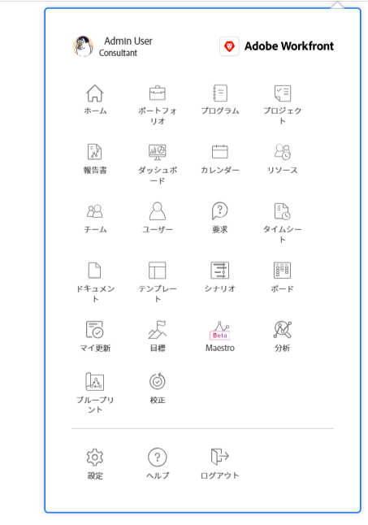
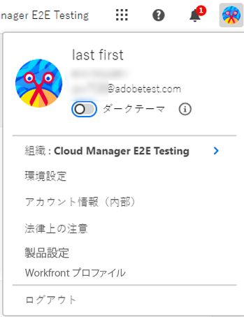

# [!DNL Adobe Unified Experience] の [!DNL Workfront]

へのアクセス [!DNL Workfront] 経由 [!DNL Adobe Experience Cloud] を使用すれば、すべての [!DNL Adobe] アプリケーション。 単一の ID 管理では、複数の URL やログイン ID を使用せずに、1 つの場所でログインできます。

## アクセス要件

この記事の手順を実行するには、次のアクセス権が必要です。

<table style="table-layout:auto"> 
 <col> 
 <col> 
 <tbody> 
  <tr> 
   <td role="rowheader"><strong>[!DNL Adobe Workfront] 計画*</strong></td> 
   <td> 
任意
 </td> 
  </tr> 
  <tr> 
   <td role="rowheader"><strong>[!DNL Adobe Workfront] ライセンス*</strong></td> 
   <td> 
[!UICONTROL リクエスト ] 以降
 </td> 
  </tr> 
 </tbody> 
</table>

&#42;ご利用のプラン、ライセンスの種類、アクセス権を確認するには、 [!DNL Workfront] 管理者。

## 前提条件

組織のインスタンス ( [!DNL Workfront] は、 [!DNL Adobe Business Platform] / [!DNL Adobe Admin Console].

のオンボーディングに関するご質問がある場合は、 [!DNL Adobe Admin Console]を参照し、 [[!DNL Adobe Unified Experience] FAQ](/help/quicksilver/workfront-basics/navigate-workfront/workfront-navigation/unified-experience-faq.md/).

## にログインします。 [!DNL Adobe Experience Cloud]

1. ブラウザーウィンドウを開き、に移動します。 <https://experience.adobe.com>.
1. の [!UICONTROL ログイン] 画面、電子メールアドレスを入力して、 **[!UICONTROL 続行]**.

   ![ログイン先 [!DNL Adobe Experience Cloud]](assets/aec-login-page.png)

## アクセス [!DNL Workfront]

ログイン後 [!DNL Adobe Experience Cloud]を選択すると、 [!DNL Workfront] 上部のナビゲーション領域の組織切り替えボタンをクリックして、アクセス権を持つ組織と環境。 を選択します。 [!DNL Workfront] 作業する組織または環境。 環境には、 [!UICONTROL プレビュー] および [!UICONTROL サンドボックス] （組織で使用されている場合）。

![表示 [!DNL Workfront] 組織と環境](assets/aec-view-all-orgs.png)

>[!NOTE]
>
>に初めてログインしたとき [!DNL Adobe Experience Cloud]の場合、デフォルトでは、アルファベット順のリストの最初の組織に設定されます。 次回ログインしたときは、組織は最後に訪問した組織にデフォルトで設定されます。

[!DNL Workfront] が [!DNL Adobe Experience Cloud] アクセス権のある製品。 次を選択できます。 [!DNL Workfront] ( [!DNL Experience Cloud] ホームページを開くか、製品切り替えボタンを使用します。  アプリケーションをいつでも変更できます。

![選択 [!DNL Workfront] アプリにアクセスする](assets/aec-product-switcher.png)

## 移動 [!DNL Workfront]

以下を使用： [!UICONTROL メインメニュー] アイコン  の左側に [!DNL Workfront] ナビゲーションバーを使用して、アクセス権のある任意のページに移動します。 「 」で使用できるオプション [!UICONTROL メインメニュー] は次のものに依存します。

* **レイアウトテンプレート設定**:方法を学ぶには [!DNL Workfront] 管理者が [!UICONTROL メインメニュー] レイアウトテンプレートから、 [のカスタマイズ [!UICONTROL メインメニュー] レイアウトテンプレートの使用](/help/quicksilver/administration-and-setup/customize-workfront/use-layout-templates/customize-main-menu.md).
* **ライセンスの種類**:異なるライセンスタイプのデフォルト設定については、 [ナビゲーションについて [!UICONTROL レビュー]-license ユーザ](/help/quicksilver/workfront-basics/navigate-workfront/workfront-navigation/reviewer-global-navigation-bar.md) または [ナビゲーションについて [!UICONTROL 作業]-license ユーザ](/help/quicksilver/workfront-basics/navigate-workfront/workfront-navigation/worker-global-navigation-bar.md).

## プロファイルと環境設定にアクセスする

上部のナビゲーション領域のプロフィール画像をクリックすると、プロフィールおよび環境設定オプションにアクセスできます。

このメニューでは、次の操作を実行できます。

* 選択 **[!UICONTROL ダークテーマ]** フォーマット [!DNL Adobe Experience Cloud].
* 設定 **[!UICONTROL 環境設定]** 対象 [!DNL Adobe Experience Cloud]（プライマリ言語とセカンダリ言語の環境設定を含む）
* 次にアクセス： **[!UICONTROL [!DNL Workfront]プロファイル]**. プロファイルに移動したら、「 **[!UICONTROL 詳細]** メニュー  を選択し、 **[!UICONTROL 編集]**. プロファイルについて詳しくは、 [設定を行う](/help/quicksilver/workfront-basics/manage-your-account-and-profile/configuring-your-user-profile/configure-my-settings.md).
* **[!UICONTROL ログアウト]** Adobe Experience Cloud

## パスワードを管理

>[!NOTE]
>
>パスワードを変更すると、すべてのユーザーのパスワードが変更されます [!DNL Adobe Experience Cloud] アプリケーション。

パスワードはで管理されていません [!DNL Workfront].

組織が別のアプリケーションを使用してパスワードを管理している場合、そのプロバイダを通じてパスワードを変更します。

パスワードが [!DNL Adobe]の場合は、パスワードアカウントでAdobeを変更できます。

[パスワードの変更については、この記事をAdobeしてください。](https://helpx.adobe.com/manage-account/using/change-or-reset-password.html){target="_blank"}

パスワードの変更について詳しくは、管理者にお問い合わせください。
