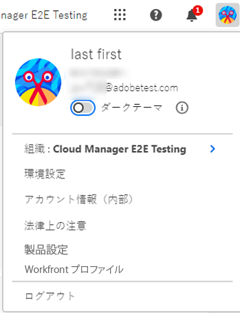

# [!DNL Workfront] 向け [!DNL Adobe Unified Experience]

<!--Audited: 10/2024-->

[!DNL Adobe Experience Cloud] を介して [!DNL Workfront] にアクセスすると、すべての [!DNL Adobe] アプリケーションを管理するためのシームレスで統一されたエクスペリエンスが得られます。単一の Identity Managemen により、複数の URL やログイン ID を必要とせずに、1 つの場所でログインできます。

## アクセス要件

+++ 展開すると、この記事の機能のアクセス要件が表示されます。 

<table style="table-layout:auto"> 
 <col> 
 <col> 
 <tbody> 
  <tr> 
   <td role="rowheader"><strong>Adobe Workfront パッケージ</strong></td> 
   <td> 
任意
 </td> 
  </tr> 
  <tr> 
   <td role="rowheader"><strong>Adobe Workfront プラン</strong></td> 
   <td> 
コントリビューター以上
 
   
リクエスト以上
 </td> 
  </tr> 
 </tbody> 
</table>

詳しくは、[Workfront ドキュメントのアクセス要件](/help/quicksilver/administration-and-setup/add-users/access-levels-and-object-permissions/access-level-requirements-in-documentation.md)を参照してください。

+++

## 前提条件

組織の[!DNL Workfront]のインスタンスは、[!DNL Adobe Business Platform]または[!DNL Adobe Admin Console]にオンボーディングする必要があります。

[!DNL Adobe Admin Console] のオンボーディングに関するご質問がある場合は、[[!DNL Adobe Unified Experience] FAQ](/help/quicksilver/workfront-basics/navigate-workfront/workfront-navigation/unified-experience-faq.md/) を参照してください。

## Identity Management方式（IMS）

Adobe Unified Experience Managerへの移行の一環として、Adobe Identity Management Systemを使用してユーザーを認証するようになりました。 つまり、Workfrontに直接ログインするのではなく、Adobeを通じてWorkfrontにログインします。 Adobe IMSを行うには、Workfront管理者がWorkfrontではなくAdobe Admin Consoleでユーザー管理を行う必要があります。

Adobe Unified ExperienceでWorkfrontにログインする方法について詳しくは、この記事の「[Adobe Experience Cloudにログイン &#x200B;](#log-in-to-adobe-experience-cloud)」を参照してください。

Adobe Admin Consoleでのユーザー管理について詳しくは、[Adobe Admin Consoleでのユーザーの管理](/help/quicksilver/administration-and-setup/add-users/create-and-manage-users/admin-console.md)を参照してください。

## [!DNL Adobe Experience Cloud] にログインする

1. ブラウザーウィンドウを開き、<https://experience.adobe.com> に移動します。
1. [!UICONTROL **ログイン**]&#x200B;画面で、メールアドレスを入力して、「**[!UICONTROL 続行]**」をクリックします。

   ![[!DNL Adobe Experience Cloud]](assets/aec-login-page.png)にログインする

>[!NOTE]
>
>Workfrontを開いているページでブラウザータブセッションが期限切れになり、別のブラウザータブでアクティブなWorkfront セッションがある場合は、期限切れのタブをリロードしてWorkfront ページを再度開くことができます。

## [!DNL Workfront] にアクセス

[!DNL Adobe Experience Cloud] にログインすると、上部のナビゲーションエリアにある組織スイッチャーをクリックして、アクセスできるすべての [!DNL Workfront] 組織と環境を表示できます。作業する [!DNL Workfront] の組織または環境を選択します。組織で使用されている場合、環境には[!UICONTROL プレビュー]と[!UICONTROL サンドボックス]が含まれる可能性があります。

![&#x200B; [!DNL Workfront] の組織と環境を表示 &#x200B;](assets/aec-view-all-orgs.png)

>[!NOTE]
>
>初めて [!DNL Adobe Experience Cloud] にログインすると、組織はデフォルトでアルファベット順リストの最初の組織に設定されます。次回ログインすると、最後にアクセスした組織がデフォルトで設定されます。

[!DNL Workfront] は、アクセスできる [!DNL Adobe Experience Cloud] 製品のリストに表示されます。[!DNL Experience Cloud] ホームページのクイックアクセスメニューで [!DNL Workfront] を選択するか、製品スイッチャー  を使用していつでもアプリケーションを変更できます。

![&#x200B; [!DNL Workfront] を選択してアプリケーションにアクセス &#x200B;](assets/aec-product-switcher.png)

## [!DNL Workfront] をナビゲートする

[!UICONTROL &#x200B; ナビゲーションバーの左側にある] メインメニュー メインメニューアイコン [!DNL Workfront]を使用して、アクセスできるページに移動します。 [!UICONTROL メインメニュー]で使用できるオプションは、以下に依存します。

* **レイアウト テンプレートの設定**：[!DNL Workfront]管理者がレイアウトテンプレートから[!UICONTROL メインメニュー]を変更する方法については、[レイアウトテンプレート](/help/quicksilver/administration-and-setup/customize-workfront/use-layout-templates/customize-main-menu.md)を使用して、[!UICONTROL メインメニュー]をカスタマイズする方法を参照してください。
* **ライセンスタイプ**：様々なライセンスタイプのデフォルト設定について詳しくは、「[Light[!UICONTROL &#x200B; – ライセンスユーザー]のナビゲーションについて」または「](/help/quicksilver/workfront-basics/navigate-workfront/workfront-navigation/reviewer-global-navigation-bar.md)Work[&#x200B; – ライセンスユーザー[!UICONTROL 」のナビゲーションについて説明してください。]](/help/quicksilver/workfront-basics/navigate-workfront/workfront-navigation/worker-global-navigation-bar.md)

## プロファイルと環境設定にアクセスする

上部のナビゲーションエリアにあるAdobe アカウントメニュー（プロフィール画像）をクリックすると、プロファイルと環境設定オプションにアクセスできます。

このメニューでは、次の操作を実行できます。

* [!DNL Adobe Experience Cloud] の&#x200B;**[!UICONTROL ダークテーマ]**&#x200B;の書式を選択します。
* メイン言語とサブ言語の環境設定を含む、[!DNL Adobe Experience Cloud] の&#x200B;**[!UICONTROL 環境設定]**&#x200B;を設定します。
  >[!NOTE]
  >
  >日付の設定は、プライマリ言語の設定に基づいています。 例えば、**英語（米国）**&#x200B;を選択するとMM/DD/YYYY形式で日付が表示され、**英語（英国）**&#x200B;を選択するとDD/MM/YYYY形式で日付が表示されます。
* **[!UICONTROL [!DNL Workfront]のプロファイル]**&#x200B;にアクセスします。プロファイルにアクセスしたら、**[!UICONTROL 詳細]** メニューをクリックし、**[!UICONTROL 編集]**&#x200B;を選択します。 プロファイルについて詳しくは、[個人設定を行う](/help/quicksilver/workfront-basics/manage-your-account-and-profile/configuring-your-user-profile/configure-my-settings.md)を参照してください。
* Adobe Experience Cloud の&#x200B;**[!UICONTROL ログアウト]**

## パスワードを管理する

>[!NOTE]
>
>パスワードを変更すると、すべての [!DNL Adobe Experience Cloud] アプリケーションのパスワードが変更されます。

パスワードは [!DNL Workfront] では管理されません。

組織が別のアプリケーションを使用してパスワードを管理している場合、そのプロバイダーを通じてパスワードを変更します。

パスワードが [!DNL Adobe] によって管理されている場合は、アドビアカウントのパスワードを変更できます。

[Adobeのパスワードを変更する場合は、この記事を参照してください。](https://helpx.adobe.com/manage-account/using/change-or-reset-password.html){target="_blank"}

パスワードの変更について詳しくは、管理者にお問い合わせください。

