# のプロジェクト、タスクおよび発行日の概要 [!DNL Adobe Workfront]

<!--

(NOTE: consider expanding on this article with ALL dates for PTIs - Hand off dates, Approval Dates, etc) 

-->

この記事では、 [!DNL Adobe Workfront]. ここに含まれる画像は、Workfrontで日付が表示される例で、完全なものではありません。 日付を表示する領域が他にもあります。 すべての日付は、プロジェクト、タスク、タスクのレポートとリストにも表示されます。

レポートとリストについて詳しくは、次の記事を参照してください。

* [のリストの基本を学ぶ [!DNL Adobe Workfront]](../../../workfront-basics/navigate-workfront/use-lists/view-items-in-a-list.md)
* [レポートの概要](../../../reports-and-dashboards/reports/reporting/get-started-reports-workfront.md)

プロジェクト、タスク、およびタスクの各フィールドについて詳しくは、 [用語集 [!DNL Adobe Workfront] 用語](../../../workfront-basics/navigate-workfront/workfront-navigation/workfront-terminology-glossary.md).

## [!UICONTROL 計画開始日]

The [!UICONTROL 計画開始日] は、プロジェクト、タスク、またはタスクが開始される予定の日付です。

に応じて [!UICONTROL タスクの制約]に含まれていない場合は、 [!UICONTROL 計画開始日] タスクの に応じて [!UICONTROL スケジュールモード] プロジェクトの [!UICONTROL 計画開始日] プロジェクトの

詳しくは、 [プロジェクトの概要 [!UICONTROL 計画開始日]](../../../manage-work/projects/planning-a-project/project-planned-start-date.md).

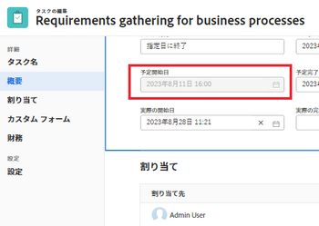

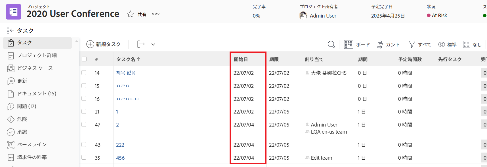

## [!UICONTROL 計画完了日]

The [!UICONTROL 計画完了日] または [!UICONTROL 期限] 日付：プロジェクト、タスク、またはタスクが完了する予定の日付です。

に応じて [!UICONTROL タスクの制約]に含まれていない場合は、 [!UICONTROL 計画完了日] タスクの に応じて [!UICONTROL スケジュールモード] プロジェクトの [!UICONTROL 計画完了日] プロジェクトの

The [!UICONTROL 計画完了日] の一部の領域では、期限としてが日付として表示されます [!DNL Workfront].

詳しくは、次の記事を参照してください。

* [タスクの概要 [!UICONTROL 計画完了日]](../../../manage-work/tasks/task-information/task-planned-completion-date.md)
* [プロジェクトを設定 [!UICONTROL 計画完了日]](../../../manage-work/projects/planning-a-project/project-planned-completion-date.md)
* [問題の概要 [!UICONTROL 計画完了日]](../../../manage-work/issues/issue-information/issue-planned-completion-date.md)

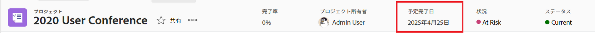

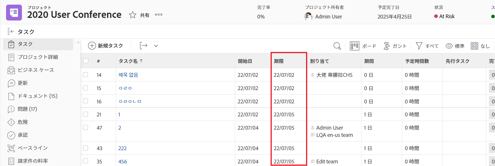

## [!UICONTROL 入力日]

The [!UICONTROL 入力日] は、プロジェクト、タスク、またはイシューがWorkfrontで作成された日付です。

The [!UICONTROL 入力日] は、プロジェクト、タスクまたは問題のタイムラインに影響しませんが、追跡とレポートの目的で重要です。 [!DNL Workfront] を自動生成します [!UICONTROL 入力日] オブジェクトを作成した後、手動で編集することはできません。

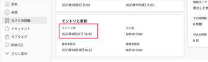

## [!UICONTROL 実際の開始日]

The [!UICONTROL 実際の開始日] は、ユーザーが実際にプロジェクト、タスクまたはイシューで作業を開始した日付です。 The [!UICONTROL 実際の開始日] プロジェクト、タスクまたはイシューを作成すると、は空になります。

タスクやイシューで作業を開始するタイミングを手動で指定するか、 [!UICONTROL 実際の開始日] タスクまたは問題のステータスが次の値から変更されたときに自動的に入力されます： [!UICONTROL 新規] から [!UICONTROL 処理中] または [!UICONTROL 完了]. The [!UICONTROL 実際の開始日] プロジェクトの最初のタスクが開始する日付と一致します。

>[!TIP]
>
>The [!UICONTROL 実際の開始日] 一致しない可能性があります [!UICONTROL 計画開始日] プロジェクト、タスク、またはタスクの予定日よりも後か早く作業を開始できる可能性があるためです。

詳しくは、 [プロジェクトの概要 [!UICONTROL 実際の開始日]](../../../manage-work/projects/planning-a-project/project-actual-start-date.md).

>[!NOTE]
>
>The [!UICONTROL 開始日] タスクまたは固定日付制約は、 [!UICONTROL 計画開始日] 仕事の [!UICONTROL 実際の開始日]. これにより、 [!UICONTROL 計画開始日] を指定した日付に設定します。 The [!UICONTROL 実際の開始日] は、 [!UICONTROL 計画開始日]（前述のように）

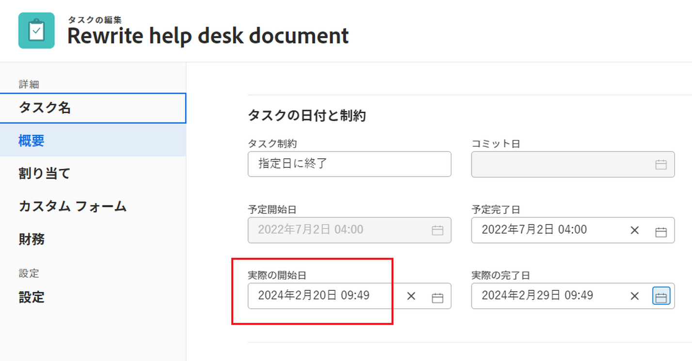

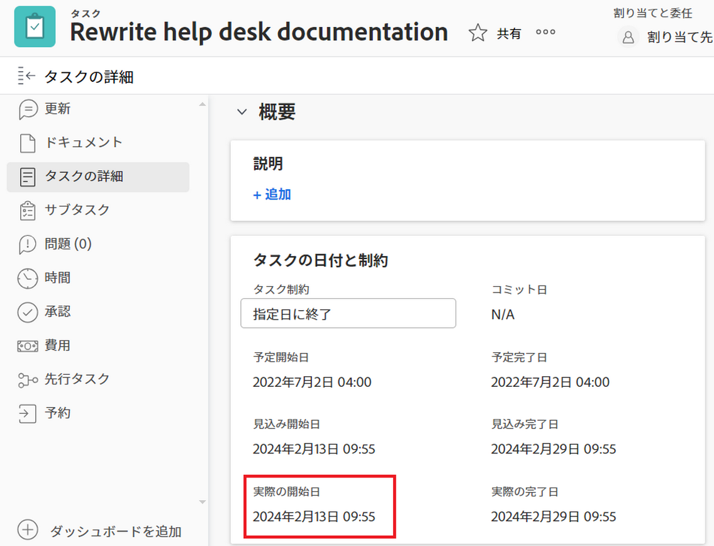

## [!UICONTROL 実際の完了日]

The [!UICONTROL 実際の完了日] は、ユーザーが実際にプロジェクト、タスクまたはイシューを完了した日付です。 The [!UICONTROL 実際の完了日] プロジェクト、タスクまたはイシューを作成すると、は空になります。

タスクやイシューに対して作業が完了するタイミングを手動で指定するか、 [!UICONTROL 実際の完了日] 次のいずれかが発生すると、が自動的に設定されます。

* プロジェクト、タスクまたは問題のステータスが [!UICONTROL 完了], [!UICONTROL 閉じる]または [!UICONTROL 解決済み].
* タスクまたはプロジェクトの完了率は 100%です。

The [!UICONTROL 実際の完了日] の日付は、プロジェクトの最後のタスクを完了した日付と一致します。

>[!TIP]
>
>The [!UICONTROL 実際の完了日] が次の値と一致しない可能性があります： [!UICONTROL 計画完了日].

詳しくは、 [プロジェクトの概要 [!UICONTROL 実際の完了日]](../../../manage-work/projects/planning-a-project/project-actual-completion-date.md).

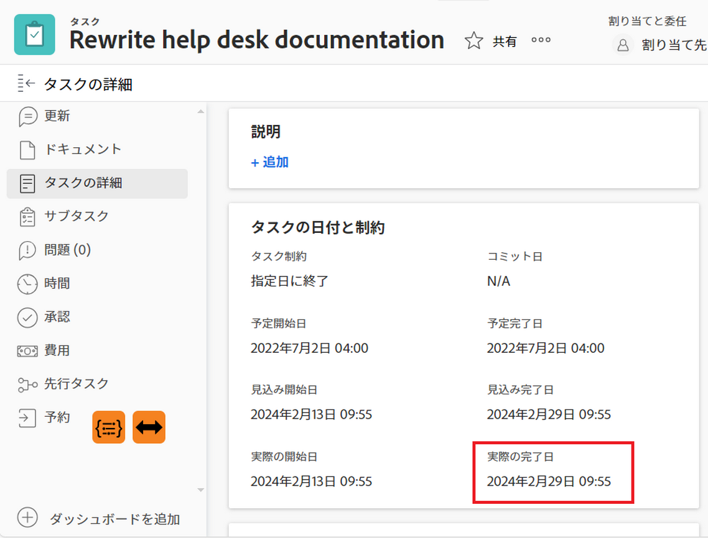

## [!UICONTROL コミット日]

The [!UICONTROL コミット日] は、タスクまたはイシューに割り当てられたユーザーがタスクまたはイシューを完了するためにコミットする日付です。 これは、 [!UICONTROL 計画完了日]作業を担当するユーザーのみが提供する完了日のより現実的な推定です。 詳しくは、 [[!UICONTROL コミット日] 概要](../../../manage-work/projects/updating-work-in-a-project/overview-of-commit-dates.md).

>[!NOTE]
>
>の変更 [!UICONTROL コミット日] 影響を及ぼす [!UICONTROL 予定完了日] しかし、そうではない [!UICONTROL 計画完了日] タスクまたはイシューの名前を指定します。 プロジェクトマネージャーは、担当者が [!UICONTROL コミット日] を更新するには、 [!UICONTROL 計画完了日] タスクまたはイシューの名前を指定します。

## [!UICONTROL 予定開始日]

The [!UICONTROL 予定開始日] は、プロジェクト、タスクまたはイシューがリアルタイムで実行される日付で、すべての遅延が考慮されます。 これは、プロジェクト、タスク、または問題に対する開始日が、 [!UICONTROL 計画開始日]. The [!UICONTROL 計画開始日] 遅延や過去の日付は考慮されません。

最初にプロジェクトを計画するとき、 [!UICONTROL 計画開始日] そして [!UICONTROL 予定開始日] タスクとプロジェクトのタスクは同じです。 遅延が発生したり、タスクが早く完了したりする可能性があるので、 [!UICONTROL 予定開始日] ～とは異なる [!UICONTROL 計画開始日].

タスクの場合、 [!UICONTROL 予定開始日] また、 [!UICONTROL 計画開始日] 先行タスクの 1 人が予定より遅れているとき

>[!TIP]
>
>次の項目を表示すると、 [!UICONTROL 予定開始日] の値を含める必要があります。

詳しくは、 [プロジェクトの概要 [!UICONTROL 予定開始日]](../../../manage-work/projects/planning-a-project/project-projected-start-date.md).

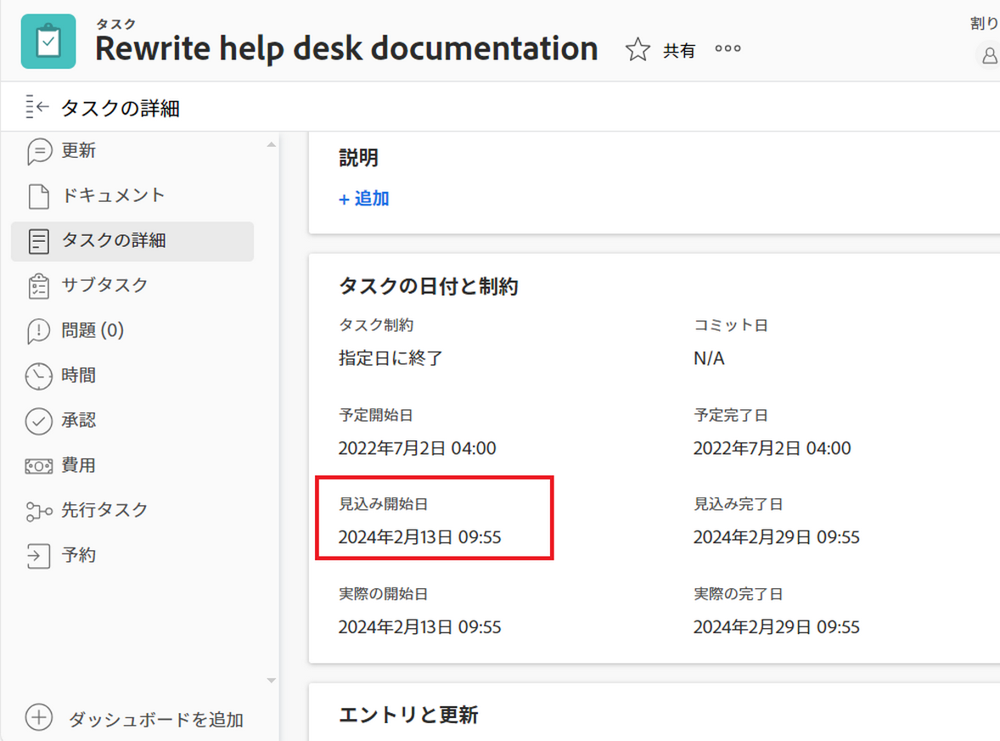

## [!UICONTROL 予定完了日]

The [!UICONTROL 予定完了日] は、プロジェクト、タスク、またはイシューが完了する日時を示すリアルタイムの計算指標です。 プロジェクト、タスク、またはタスクが「完了」とマークされると、 [!UICONTROL 予定完了日] 次の日付に変更： [!UICONTROL 実際の完了日].

すべてがスムーズに進み、計画通りに進む場合 [!UICONTROL 予定完了日] は、 [!UICONTROL 計画完了日]. それ以外の場合は、先行タスクの遅延により、 [!UICONTROL 予定完了日] ～とは違うかもしれない [!UICONTROL 計画完了日].

詳しくは、 [の概要 [!UICONTROL 予定完了日] プロジェクト、タスク、問題に関する情報](../../../manage-work/projects/planning-a-project/project-projected-completion-date.md).

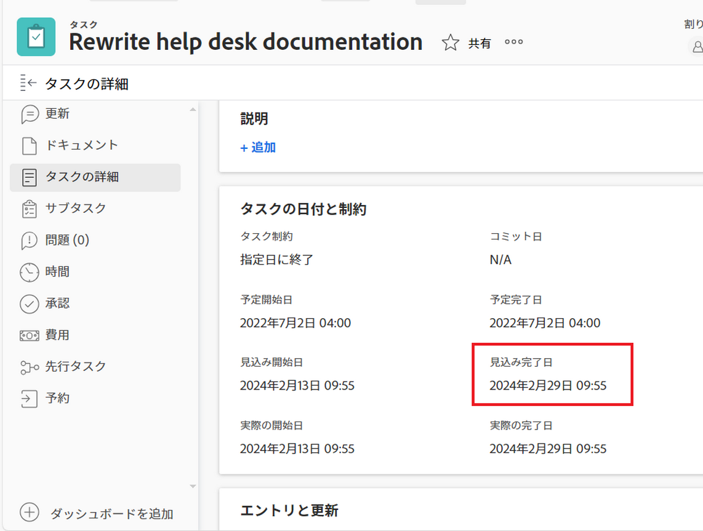

## [!UICONTROL 時間入力日]

プロジェクト、タスクおよびタスクの時間を記録して、プロジェクト、タスクまたはタスクに費やした実際の時間（時間単位）を示す場合、ログに記録する時間が [!UICONTROL 実際の時間] プロジェクト、タスクまたはタスクの数を示します。

時刻をログに記録する日付は、 [!UICONTROL 時間入力日] 時間エントリのフィールド。 一部の時間のリストおよびレポートでは、時間入力日が日付として表示されます。

>[!TIP]
>
>The [!UICONTROL 時間入力日] 次とは異なる [!UICONTROL 入力日] この場合、時間ログが作成された日付ではなく、時間を関連付ける日付になります。

Workfrontの次の領域で、時間をログに記録して表示できます。

* のログと表示時間 [!UICONTROL プロジェクト], [!UICONTROL タスク]または [!UICONTROL 問題の更新] セクションまたは [!UICONTROL 時間] 」セクションに入力します。 ログに時刻を記録する際に、 [!UICONTROL 時間] 「 」セクションでは、「時間入力日」と、時間が属するユーザーを手動で指定できます。

  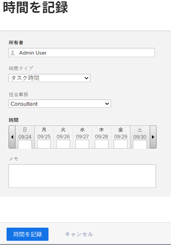

  詳しくは、 [ログ時間](../../../timesheets/create-and-manage-timesheets/log-time.md).

  >[!TIP]
  >
  >親タスクやプロジェクトではなく、作業タスクや問題に関する時間を記録することをお勧めします。 作業タスクにログオンした時間は、親タスクとプロジェクトにロールアップされます。 [!UICONTROL 実際の時間] 親タスクとプロジェクト用。 ログオンした問題の時間は、 [!UICONTROL 実際の時間] プロジェクトの。

* タスクまたはイシューの更新ストリームに時間を記録します。

  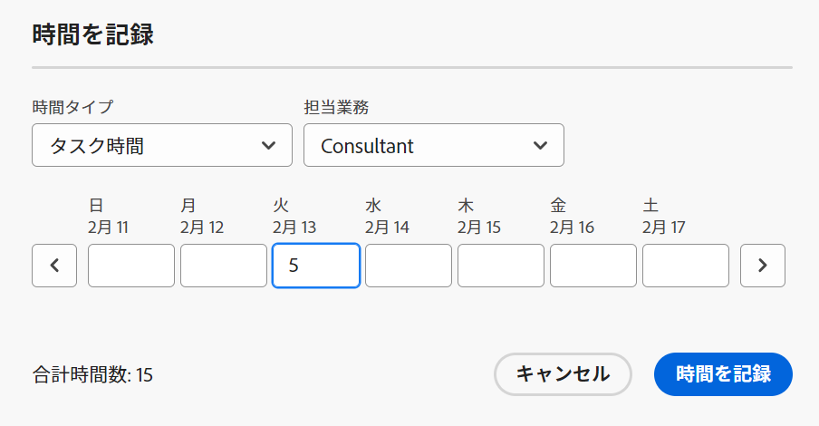

* 次を表示： [!UICONTROL 時間入力日] （時間レポートおよびリスト）

  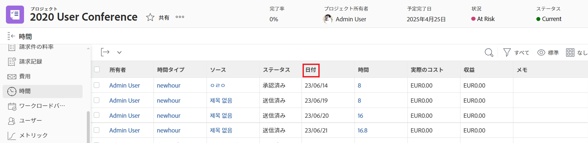
