# [!DNL Workfront] のプロジェクト、タスクおよびイシューの日付の概要

<!-- Audited: 05/2024 -->

<!--consider expanding on this article with ALL dates for PTIs - Hand off dates, Approval Dates, etc-->

<!-- there are dates below that need definition - ask Product-->

この記事では、[!DNL Adobe Workfront] のプロジェクト、タスクおよびイシューに関連する最も一般的な日付の定義を示します。 ここに含まれる画像は、Workfront での日付の表示場所の例であり、すべてを網羅しているわけではありません。 日付が表示されるエリアは他にもあります。 すべての日付は、プロジェクト、タスク、イシューのレポートとリストにも表示されます。

レポートとリストについて詳しくは、次の記事を参照してください。

* [&#x200B; [!DNL Adobe Workfront] のリストの基本を学ぶ](../../../workfront-basics/navigate-workfront/use-lists/view-items-in-a-list.md)
* [レポートの基本を学ぶ](../../../reports-and-dashboards/reports/reporting/get-started-reports-workfront.md)

プロジェクト、タスク、問題の各フィールドについて詳しくは、[用語集 [!DNL Adobe Workfront] 用語集](../../../workfront-basics/navigate-workfront/workfront-navigation/workfront-terminology-glossary.md)を参照してください。

## [!UICONTROL 実際の開始日]

[!UICONTROL 実際の開始日]は、ユーザーがプロジェクト、タスクまたはイシューで実際に作業を開始する日付です。 [!UICONTROL 実際の開始日]は、プロジェクト、タスクまたはイシューを作成すると空になります。

タスクまたはイシューの作業がいつ開始されたかを手動で指定できます。または、またはタスクまたはイシューのステータスが「[!UICONTROL 新規]」から「[!UICONTROL 処理中]」または「[!UICONTROL 完了]」に変更された際、[!UICONTROL 実際の開始日]が自動的に入力されます。 プロジェクトの[!UICONTROL 実際の開始日]は、プロジェクトの最初のタスクが開始する日付と一致します。

>[!TIP]
>
>ユーザーが予定日より遅くまたは早く作業を開始するため、プロジェクト、タスク、またはイシューの[!UICONTROL 実際の開始日]が[!UICONTROL 予定開始日]と一致しない場合があります。

詳しくは、[プロジェクトの概要[!UICONTROL 実際の開始日]](../../../manage-work/projects/planning-a-project/project-actual-start-date.md)を参照してください。

>[!NOTE]
>
>[!UICONTROL 開始日指定]タスクまたは固定日付制約は、タスクの[!UICONTROL 実際の開始日]ではなく、[!UICONTROL 予定開始日]に影響します。 これにより、[!UICONTROL 予定開始日]を指定の日付に更新します。 [!UICONTROL 実際の開始日]は、前述のとおり、[!UICONTROL 予定開始日]とは別にアップデートします。

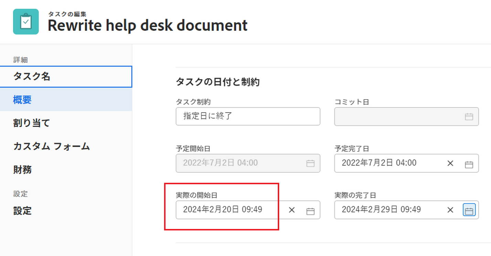

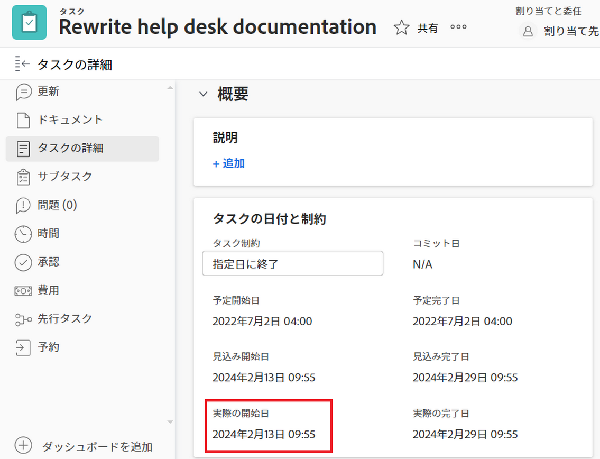

## [!UICONTROL 実際の完了日]

[!UICONTROL 実際の完了日]は、ユーザーがプロジェクト、タスクまたはイシューを実際に完了する日付です。 [!UICONTROL 実際の完了日]は、プロジェクト、タスクまたはイシューを作成すると、空になります。

タスクまたは問題の作業が完了するタイミングを手動で指定できます。または、次のいずれかが発生すると、[!UICONTROL 実際の完了日]が自動的に入力されます。

* プロジェクト、タスクまたはイシューのステータスが[!UICONTROL 完了]、[!UICONTROL クローズ]または[!UICONTROL 解決済み]に変更されます。
* タスクまたはプロジェクトの完了率は 100%です。

プロジェクトの[!UICONTROL 実際の完了日]は、プロジェクトの最後のタスクが完了した日付と一致します。

>[!TIP]
>
>[!UICONTROL 実際の完了日]が[!UICONTROL 予定完了日]と一致しない場合があります。

詳しくは、[プロジェクトの概要[!UICONTROL 実際の完了日]](../../../manage-work/projects/planning-a-project/project-actual-completion-date.md)を参照してください。

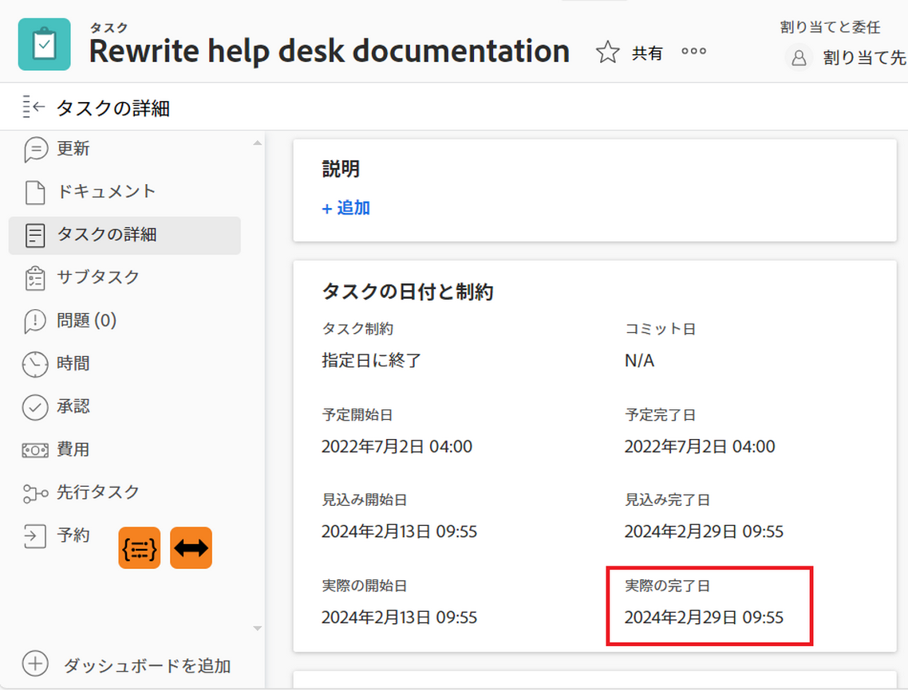

## 承認パス完了日

承認パス完了日は、プロジェクト、タスクまたはイシューの承認が付与され、アイテムのステータスが変更された日付です。

承認パスの完了日は、プロジェクト、タスク、イシューリストおよびレポートに表示されます。

## 承認パス開始日

承認パス開始日は、プロジェクト、タスク、または問題のステータスが「承認待ち」に変更され、プロジェクト承認リクエストが承認者に送信された日付です。

承認パスの開始日は、プロジェクト、タスク、イシューのリストおよびレポートに表示されます。

<!--## Auto Closure Date -->

## 予算計上完了日

これはプロジェクトの非推奨フィールドです。 このフィールドがリストまたはレポートに表示する可能性がある情報は、Workfrontが削除した機能に関連しています。 このフィールドは更新できません。

このフィールドは、プロジェクトレポートとリストに表示されます。

## 予算計上開始日

これはプロジェクトの非推奨フィールドです。 このフィールドに表示される可能性のある情報は、Workfrontが削除した機能に関連しています。 このフィールドは更新できません。

このフィールドは、プロジェクトレポートとリストに表示されます。

## [!UICONTROL コミット日]

[!UICONTROL &#x200B; コミット日]は、タスクまたはイシューに割り当てられたユーザーがタスクまたはイシューを完了するためにコミットする日付です。 これは[!UICONTROL 予定完了日]とは異なり、作業を担当するユーザーが設定する、より現実的な予定完了日です。 詳しくは、[[!UICONTROL コミット日]の概要](../../../manage-work/projects/updating-work-in-a-project/overview-of-commit-dates.md)を参照してください。

>[!NOTE]
>
>[!UICONTROL コミット日]を変更すると、タスクやイシューの[!UICONTROL 見込み完了日]には影響しますが、[!UICONTROL 予定完了日]には影響しません。 プロジェクトマネージャーは、担当者が変更した[!UICONTROL コミット日]を使用してタスクまたはイシューの[!UICONTROL 予定完了日]を更新します。

<!--## Completion Pending Date-->

## 制約の指定日

特定の日付に関連付けられたタスク制約を使用している場合、その特定の日付がタスクの制約の日付になります。

次のタスク制約は、「制約の日付」フィールドを更新します。

* 指定日に開始
* 指定日に終了
* 指定日までに開始
* 指定日以降に開始

>[!TIP]
>
>固定日付の制約を持つタスクには、制約の日付がありません。
>

制約の指定日は、タスクリストまたはレポートに表示されます。

## 変換済みイシューのエントリ日

プロジェクトまたはタスクに変換されたイシューが作成された日付。

変換済みイシューのエントリ日は、プロジェクトおよびタスクリストとレポートに表示されます。

## 期日

タスクまたはイシューを完了させる期限日。 タスクまたは問題の期日は、予定完了日と同じ日付です。

タスクとイシューの期限日は、タスクとイシューのリストおよびレポートに表示されます。

詳しくは、この記事の「[完了予定日](#planned-completion-date)」の節を参照してください。

## 期限

プロジェクトが完了する期日。 プロジェクトの「期日」は、プロジェクトの予定完了日と同じ日付になります。

プロジェクトの期日は、プロジェクトのリストとレポートに表示されます。

詳しくは、この記事の「[完了予定日](#planned-completion-date)」の節を参照してください。

## [!UICONTROL エントリ日]

[!UICONTROL 開始日]は、[!DNL Workfront]にプロジェクト、タスク、またはイシューが作成された日付です。

[!UICONTROL エントリ日]は、プロジェクト、タスクまたはイシューのタイムラインに影響しませんが、トラッキングやレポートの目的では重要です。 [!DNL Workfront] は、オブジェクトの作成時に[!UICONTROL エントリ日]を自動的に生成しますが、手動でこの日付を編集することはできません。

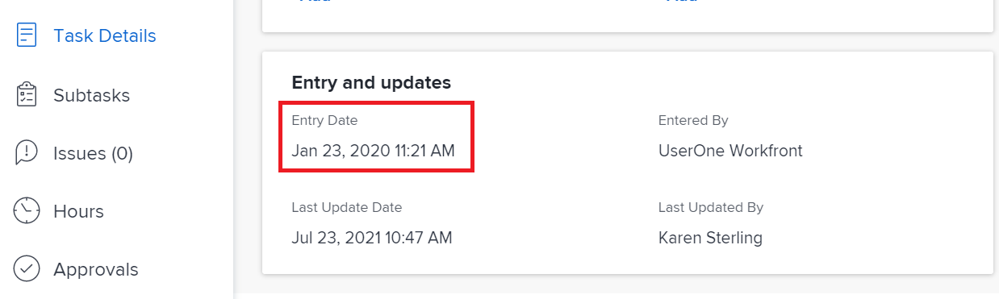

## 推定期限

タスクとプロジェクトの見積もり期日は、プロジェクトまたはタスクがいつ完了する必要があるかをより現実的な日付で示します。

見積もり日付は、プロジェクトやタスクの実際の完了に影響を与える要因を考慮するため、プロジェクトやタスクの現実により近いものになります。 予定完了日は、予定完了日と類似しています。

詳しくは、[予測日と推定日の概要](/help/quicksilver/manage-work/tasks/task-information/differentiate-projected-estimated-dates.md)を参照してください。

プロジェクトとタスクの見積もり期日は、プロジェクトとタスクのリストとレポートに表示されます。

## 推定開始日

タスクとプロジェクトの見積もり開始日は、プロジェクトまたはタスクを開始できる現実的な日付を示します。

見積もり日は、プロジェクトやタスクの実際の開始日に影響を与える要因を考慮するため、プロジェクトやタスクの現実により近いものになります。 開始予定日は、開始予定日と類似しています。

詳しくは、[予測日と推定日の概要](/help/quicksilver/manage-work/tasks/task-information/differentiate-projected-estimated-dates.md)を参照してください。

プロジェクトとタスクの予定開始日は、プロジェクトとタスクのリストとレポートに表示されます。

<!--## Exchange Rate Date-->

## 固定終了日

プロジェクトの依頼者または所有者は、ビジネスケースを完了する際に、プロジェクトの固定終了日を特定します。 これは、プロジェクトを完了する必要があることを推奨する日付です。

これは手作業による見積もりであり、プロジェクトのタスクの実際の進捗状況は考慮されていません。

プロジェクトの固定終了日は、プロジェクトの「ビジネスケース」セクションおよびプロジェクトリストとレポートに表示されます。

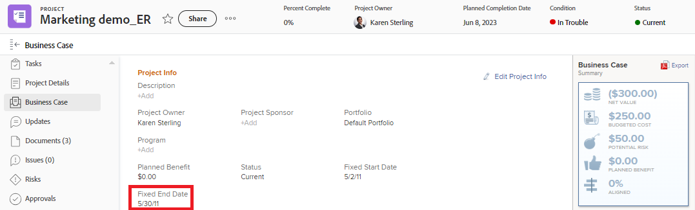

## 固定開始日

プロジェクトの依頼者または所有者は、ビジネスケースを完了する際に、プロジェクトの固定開始日を特定します。 プロジェクトの開始日を指定します。

これは手作業による見積もりであり、プロジェクトのタスクの実際の進捗状況は考慮されていません。

プロジェクトの固定開始日は、プロジェクトの「ビジネスケース」セクションおよびプロジェクトリストとレポートに表示されます。

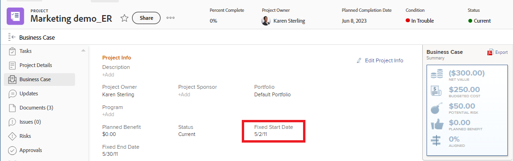

## ハンドオフ日

タスクが作業可能になる日付。 つまり、すべての制約、承認、依存関係が完了し、ユーザーがタスクに取り組めるようになります。

ハンドオフ日は計算であり、手動で設定することはできません。

ハンドオフ日について詳しくは、[&#x200B; タスクのハンドオフ日の概要](/help/quicksilver/manage-work/tasks/task-information/handoff-task-date.md)を参照してください。

タスクのハンドオフ日は、タスクリストとレポートに表示されます。

## 財務の最終更新日

プロジェクトの財務情報のいずれかが更新された日付。 これには、プロジェクトの「財務」セクションまたは「ビジネスケース」セクションの財務フィールドの更新が含まれます。

財務の最終更新日は、プロジェクトリストとレポートに表示されます。

## 最終更新日

プロジェクト、タスクまたはイシューが最後に更新された日付。 更新は、プロジェクト、タスク、またはイシューをトリガーして保存する変更と見なされます。 これには、ステータス、条件、タイムライン、財務などのフィールドの変更が含まれます。

最終更新日は、プロジェクト、タスク、イシューのリストおよびレポートに表示されます。

## [!UICONTROL 時間エントリ日]

プロジェクト、タスクまたはイシューに費やした実際の時間（時間単位）を表すためにプロジェクト、タスクまたはイシューの時間を記録すると、記録した時間がプロジェクト、タスクまたはイシューの[!UICONTROL 実際の時間]になります。

時間を記録した日付は、時間入力の「[!UICONTROL 時間エントリ日]」フィールドです。

時間入力日は、時間リストとレポートに表示されます。

>[!TIP]
>
>1時間の[!UICONTROL 開始日]は、別のWorkfront オブジェクトの[!UICONTROL 開始日]とは異なります。時間ログが作成された日付ではなく、時間を関連付ける日付です。
>
>例えば、9月5日にタスクの時間を記録し、その時間を9月1日に関連付けることができます。 入場日は9月1日。

Workfrontで時間を記録する方法について詳しくは、[時間を記録](../../../timesheets/create-and-manage-timesheets/log-time.md)を参照してください。

>[!TIP]
>
>親タスクやプロジェクトではなく、作業タスクまたはイシューに関する時間を記録することをお勧めします。 作業タスクに記録された時間は、親タスクとプロジェクトに[!UICONTROL 実際の時間]としてロールアップされます。 イシューに記録した時間は、プロジェクトの[!UICONTROL 実際の時間数]としてプロジェクトにロールアップされます。

## [!UICONTROL 予定完了日]

[!UICONTROL 予定完了日]または[!UICONTROL 期限]日とは、プロジェクト、タスク、またはイシューが完了する予定の日付です。

[!UICONTROL タスクの制約]によっては、タスクの[!UICONTROL 予定完了日]を編集できない場合があります。 プロジェクトの[!UICONTROL スケジュールモード]によっては、プジェクトの[!UICONTROL 予定完了日]を編集できない場合もあります。

[!UICONTROL 予定完了日]は、[!DNL Workfront] の一部のエリアでは、期限日として表示されます。

詳しくは、次の記事を参照してください。

* [タスクの[!UICONTROL 予定完了日]の概要](../../../manage-work/tasks/task-information/task-planned-completion-date.md)
* [プロジェクトの[!UICONTROL 予定完了日]を設定](../../../manage-work/projects/planning-a-project/project-planned-completion-date.md)
* [問題の概要[!UICONTROL 予定完了日]](../../../manage-work/issues/issue-information/issue-planned-completion-date.md)

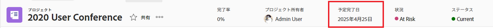

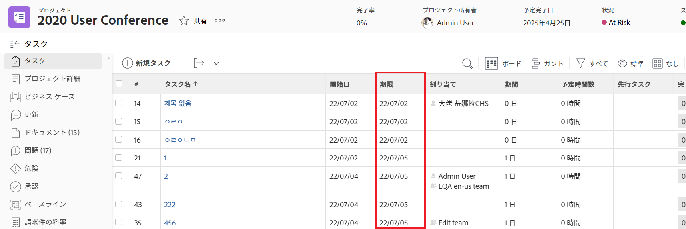

## 予定日付との整合性

これは、Workfront がプロジェクト、タスクおよびイシューを割り当て、予定完了日に対していつアイテムが完了するかを示す自動インジケーターです。

予定日付との整合性インジケーターに示される値は、次のとおりです。

* 計画完了日に完了します
* 計画完了日よりも前に完了します
* 計画完了日以降に完了します

予定日付との整合性は、プロジェクト、タスク、イシューのリストおよびレポートに表示されます。

## [!UICONTROL 予定開始日]

[!UICONTROL 予定開始日]は、プロジェクト、タスク、またはイシューが開始される予定の日付です。

[!UICONTROL タスクの制約]によっては、タスクの[!UICONTROL 予定開始日]を編集できない場合があります。 プロジェクトの[!UICONTROL スケジュールモード]によっては、プロジェクトの[!UICONTROL 予定開始日]を編集できない場合があります。

詳しくは、[プロジェクトの概要[!UICONTROL 予定開始日]](../../../manage-work/projects/planning-a-project/project-planned-start-date.md)を参照してください。

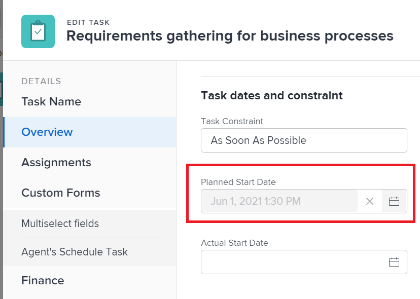

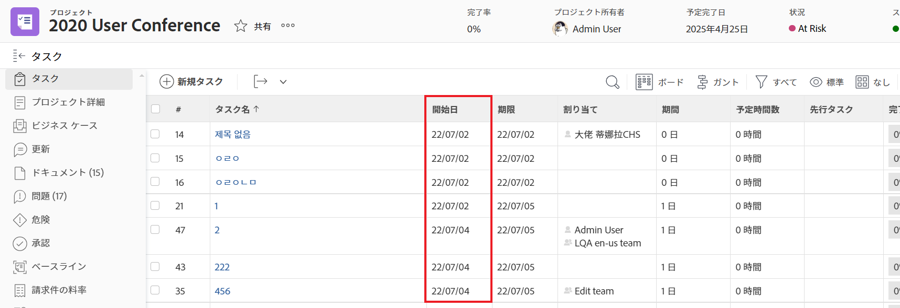

## [!UICONTROL 見込み完了日]

[!UICONTROL 見込み完了日]は、プロジェクト、タスクまたはイシューが完了する日時を示すリアルタイムの計算指標です。 プロジェクト、タスクまたはイシューが「完了」とマークされると、[!UICONTROL 見込み完了日]は[!UICONTROL 実際の完了日]の日付に変更されます。

すべてが円滑に進み、計画どおりに進んだ場合、[!UICONTROL 予定完了日]は[!UICONTROL 予定完了日]と一致する必要があります。 それ以外の場合、先行タスクの遅延により、[!UICONTROL 予定完了日]が[!UICONTROL 予定完了日]と異なる場合があります。

詳しくは、[プロジェクト、タスクおよびイシューの[!UICONTROL 見込み完了日]の概要](../../../manage-work/projects/planning-a-project/project-projected-completion-date.md)を参照してください。

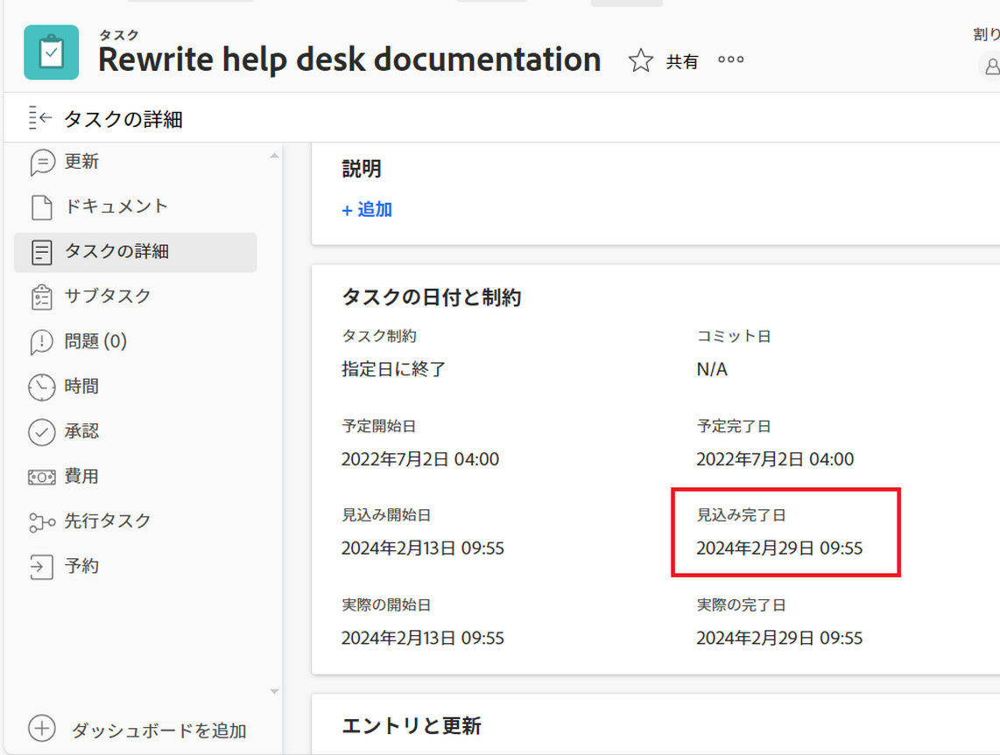

## [!UICONTROL 見込み開始日]

[!UICONTROL 予定開始日]は、プロジェクト、タスク、または問題が開始され、すべての遅延が考慮されるリアルタイムの日付です。 これは[!UICONTROL 予定開始日]よりも正確なプロジェクト、タスクまたはイシューの開始日です。 [!UICONTROL 予定開始日]では、遅延や過去の日付は考慮されません。

最初にプロジェクトを計画する際は、タスクとプロジェクトのタスクの[!UICONTROL 予定開始日]および[!UICONTROL 見込み開始日]は同じです。 遅延が発生したり、タスクが早く完了したりする可能性があるので、[!UICONTROL 見込み開始日]と[!UICONTROL 予定開始日]は異なる場合があります。

タスクでは、先行タスクが予定より遅れている場合も、[!UICONTROL 見込み開始日]が[!UICONTROL 予定開始日]と異なる場合があります。

>[!TIP]
>
>イシューの[!UICONTROL 見込み開始日]は、リストまたはレポートでのみ表示できます。

詳しくは、[プロジェクトの概要[!UICONTROL 見込み開始日]](../../../manage-work/projects/planning-a-project/project-projected-start-date.md)を参照してください。

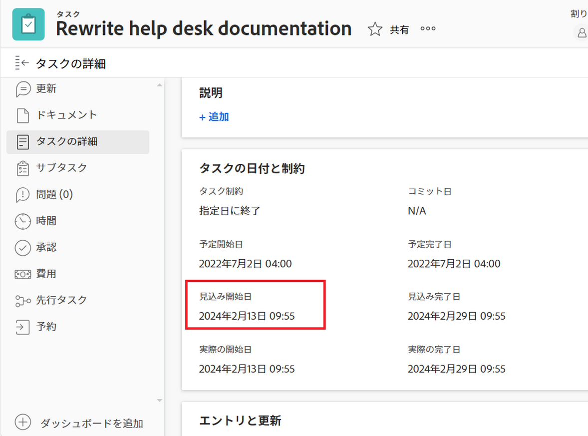

<!--## Rejection Date-->

## 余裕日

タスクの開始や完了が遅れても、プロジェクトの完了日に影響を及ぼさないことがあります。

余裕日には、タスクがプロジェクトの完了日に確実に影響を与える可能性がある正確な日付が表示されます。

タスクのSlack日について詳しくは、[&#x200B; タスクのSlack日の概要](/help/quicksilver/manage-work/tasks/task-information/task-slack-date.md)を参照してください。

タスクのSlack日は、タスクリストとレポートに表示されます。

## 開始日

プロジェクトを開始する予定の日付。 プロジェクトの開始日は、プロジェクトの予定開始日と同じ日付です。

このフィールドは、プロジェクトリストとレポートに表示されます。

詳しくは、この記事の「[予定開始日](#planned-start-date)」の節を参照してください。

