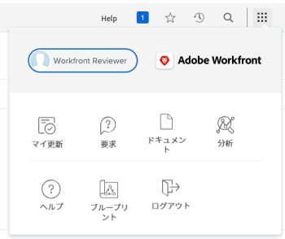

# [!UICONTROL レビュー]ライセンスを持つユーザーのナビゲーションについて

[!UICONTROL メインメニュー]は、[!DNL Adobe Workfront] 管理者に割り当てられたアクセスレベルに応じて変わります。デフォルトでは、自分のアクセスレベルで使用が許可される機能を含んだエリアへのアクセス権のみが付与されます。各アクセスレベルのデフォルトレイアウトのコンポーネントについては、[デフォルトの [!DNL Adobe Workfront] レイアウトについて](../../../administration-and-setup/customize-workfront/use-layout-templates/about-the-default-wf-layout.md)を参照してください。

## [!UICONTROL レビュアー]のデフォルトの[!UICONTROL メインメニュー]について

[!UICONTROL レビュアー]の主な責務は、作業をレビューし、コメントを付け、承認することです。[!UICONTROL メインメニュー]に表示されるエリアで、それが可能になります。

[!UICONTROL レビュアー]のデフォルトレイアウトには、以下のエリアが含まれています。

* **[!UICONTROL マイ更新]**：すべてのアクセスレベルのユーザーが使用できる&#x200B;**[!UICONTROL ホーム]**&#x200B;エリアは、デフォルトでは、レビューライセンスタイプを持つユーザー用の&#x200B;**[!UICONTROL マイ更新]**&#x200B;に置き換わります。[!UICONTROL レビュアー]は、作業を完了するわけではありません。レビュー、コメントまたは承認が必要な作業に関する情報のみが表示される必要があります。**[!UICONTROL マイ更新]**&#x200B;エリアでは、これらのアクションを実行できます。これは、新規レビューユーザーのデフォルトのランディングエリアになります。

  >[!TIP]
  >
  >担当の [!DNL Workfront] 管理者またはグループ管理者が、デフォルトのランディングページを変更する可能性のあるレイアウトテンプレートを割り当てる場合があります。レイアウトテンプレートを使用すると、[!UICONTROL レビュー]ライセンスのユーザーとして、[!UICONTROL ホーム]エリアと[!UICONTROL 更新]エリアの両方を表示することもできます。

* **[!UICONTROL リクエスト]**：このエリアでは、自分または会社の他のユーザーが送信したリクエストを送信およびレビューできます。
* **[!UICONTROL ドキュメント]**：ここでは、ドキュメントをアップロードしたり、自分と共有されているドキュメントをレビューしたりできます。
* **[!UICONTROL 分析]**：プロジェクトデータを調べ、計画と完了のトレンドを特定できます。このエリアには、表示アクセス権のあるプロジェクトに関するインサイトが表示されます。詳しくは、[拡張分析の概要](../../../enhanced-analytics/enhanced-analytics-overview.md)を参照してください。

* **[!UICONTROL ブループリント]**：システムの既存のブループリントをレビューし、[!DNL Workfront] 管理者がブループリントのリクエストキューを設定した場合は、ブループリントをインストールするように要求します。詳しくは、[ブループリントの概要](../../../administration-and-setup/blueprints/blueprints-overview.md)を参照してください。

## デフォルトの[!UICONTROL メインメニュー]のカスタマイズ

[!DNL Workfront] 管理者は、レイアウトテンプレートを割り当てることで、ユーザーの [!DNL Workfront] デフォルトレイアウトを変更できます。レイアウトテンプレートの使用について詳しくは、[レイアウトテンプレートを使用した[!UICONTROL メインメニュー]のカスタマイズ](../../../administration-and-setup/customize-workfront/use-layout-templates/customize-main-menu.md)を参照してください。
