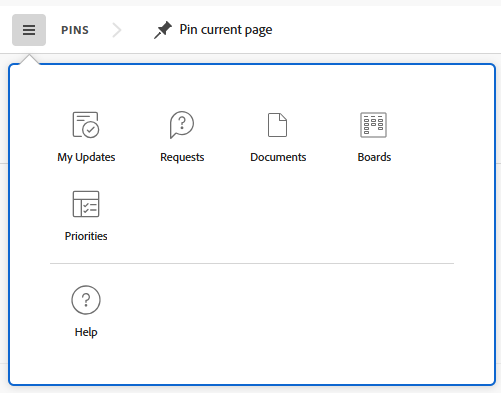

# [!UICONTROL Light] ライセンス ユーザーのナビゲーションについて

[!UICONTROL メインメニュー]は、[!DNL Adobe Workfront] 管理者に割り当てられたアクセスレベルに応じて変わります。デフォルトでは、自分のアクセスレベルで使用が許可される機能を含んだエリアへのアクセス権のみが付与されます。各アクセスレベルのデフォルトレイアウトのコンポーネントについては、[デフォルトの [!DNL Adobe Workfront] レイアウトについて](../../../administration-and-setup/customize-workfront/use-layout-templates/about-the-default-wf-layout.md)を参照してください。

## [!UICONTROL &#x200B; ライトユーザー]のデフォルトの[!UICONTROL &#x200B; メインメニュー]について

[!UICONTROL &#x200B; ライトユーザー]の主な責任は、作業のレビュー、コメント、承認です。 [!UICONTROL メインメニュー]に表示されるエリアで、それが可能になります。

[!UICONTROL &#x200B; ライトユーザー]のデフォルトレイアウトには、次の領域が含まれています。

* **[!UICONTROL マイアップデート]**：すべてのアクセスレベルのユーザーが利用できる&#x200B;**[!UICONTROL ホーム]**&#x200B;領域は、デフォルトで、ライトライセンスタイプを持つユーザーの&#x200B;**[!UICONTROL マイアップデート]**&#x200B;に置き換えられます。 [!UICONTROL &#x200B; ライトユーザー]として、作業を完了できません。 レビュー、コメント、承認が必要な作業に関する情報のみを表示する必要があります。 **[!UICONTROL マイ更新]**&#x200B;エリアでは、これらのアクションを実行できます。これは、新規Light ユーザーのデフォルトのランディングエリアです。

  >[!TIP]
  >
  >担当の [!DNL Workfront] 管理者またはグループ管理者が、デフォルトのランディングページを変更する可能性のあるレイアウトテンプレートを割り当てる場合があります。レイアウトテンプレートを使用すると、[!UICONTROL &#x200B; ホーム &#x200B;]と[!UICONTROL 更新]領域の両方を[!UICONTROL &#x200B; ライト &#x200B;] ライセンスユーザーとして表示することもできます。

* **[!UICONTROL リクエスト]**：このエリアでは、自分または会社の他のユーザーが送信したリクエストを送信およびレビューできます。
* **[!UICONTROL ドキュメント]**：ここでは、ドキュメントをアップロードしたり、自分と共有されているドキュメントをレビューしたりできます。
* **[!UICONTROL ボード]**：実行したい作業を反映した列とカードを含む共有ボードを使用して、チームメンバーと柔軟に共同作業を行います。 詳しくは、[ボードの基本を学ぶ：記事インデックス](../../../agile/get-started-with-boards/get-started-with-boards.md)を参照してください。
* **[!UICONTROL 優先度]**：作業の管理と優先順位付けをすばやく行うことができます。 詳しくは、[優先順位の基本を学ぶ](/help/quicksilver/workfront-basics/priorities/get-started-with-priorities.md)を参照してください。

## デフォルトの[!UICONTROL メインメニュー]のカスタマイズ

[!DNL Workfront] 管理者は、レイアウトテンプレートを割り当てることで、ユーザーの [!DNL Workfront] デフォルトレイアウトを変更できます。レイアウトテンプレートの使用について詳しくは、[レイアウトテンプレートを使用した[!UICONTROL メインメニュー]のカスタマイズ](../../../administration-and-setup/customize-workfront/use-layout-templates/customize-main-menu.md)を参照してください。
