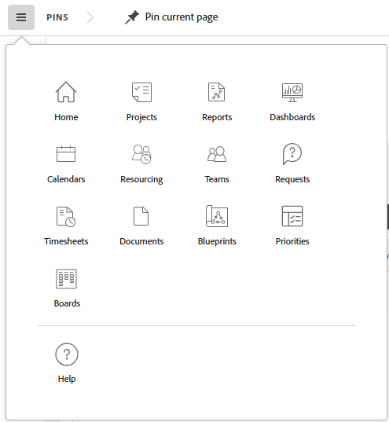

# [!UICONTROL ワーク]ライセンスを持つユーザーのナビゲーションについて

{{highlighted-preview}}

[!UICONTROL メインメニュー]は、[!DNL Adobe Workfront] 管理者に割り当てられたアクセスレベルによって異なります。 デフォルトでは、自分のアクセスレベルで使用が許可される機能を含んだエリアへのアクセス権のみが付与されます。 各アクセスレベルのデフォルトレイアウトのコンポーネントについては、[デフォルトの [!DNL Adobe Workfront] レイアウトについて](../../../administration-and-setup/customize-workfront/use-layout-templates/about-the-default-wf-layout.md)を参照してください。

## 作業者のデフォルト[!UICONTROL メインメニュー]について

[!UICONTROL 作業者]としての主な責任は、作業を完了することです。 表示される[!UICONTROL メインメニュー]のエリアで行うことができます。

次のエリアは、[!UICONTROL 作業者]のデフォルトレイアウトに含まれています。

* **[!UICONTROL ホーム]**：割り当てられたタスクやイシューはここに表示されます。 これはワーカーのデフォルトのランディングページですが、Workfront管理者がレイアウトテンプレートに追加しない限り、[!UICONTROL &#x200B; メインメニュー]には表示されません。  詳しくは、[[!UICONTROL ホーム]](../../../workfront-basics/using-home/using-the-home-area/get-started-with-home.md)の基本を学ぶを参照してください。

* **[!UICONTROL プロジェクト]**：自分と共有されているプロジェクトはここに表示されます。 詳しくは、[プロジェクト：記事インデックス](../../../manage-work/projects/projects-overview.md)を参照してください。

* **[!UICONTROL レポート]**：自分と共有されているレポートがここに表示されます。 詳しくは、[レポート](../../../reports-and-dashboards/reports/reports-overview.md)を参照してください。

* **[!UICONTROL ダッシュボード]**：自分と共有されているダッシュボードがここに表示されます。 詳しくは、[ダッシュボード](../../../reports-and-dashboards/dashboards/dashboards-overview.md)を参照してください。

* **[!UICONTROL カレンダー]**：共有されているカレンダーがここに表示されます。 詳しくは、[カレンダー：記事インデックス](../../../reports-and-dashboards/reports/calendars/calendars.md)を参照してください。

* **[!UICONTROL リソース]**：リソース割り当ては、リソース計画ツールおよびリソースプールは、ここで表示できます。 詳しくは、[リソースの管理](../../../resource-mgmt/manage-resources.md)を参照してください。

* **[!UICONTROL チーム]**：チームに割り当てられたタスクおよびイシューがこのエリアに表示されます。 作業者は、デフォルトで[!UICONTROL チーム]エリアが表示される唯一の [!DNL Workfront] ユーザーです。

  詳しくは、[チームの作成と管理](../../../people-teams-and-groups/create-and-manage-teams/create-and-mange-teams.md)を参照してください。

* **[!UICONTROL リクエスト]**：ここで、自分またはチームメンバーが送信したリクエストを送信し、レビューできます。 詳しくは、[リクエスト](../../../manage-work/requests/requests-overview.md)を参照してください。

* **[!UICONTROL タイムシート]**：現在、将来または過去のタイムシートには、ここからアクセスできます。 詳しくは、[タイムシート：記事インデックス](../../../timesheets/timesheets-all.md)を参照してください。

* **[!UICONTROL ドキュメント]**：ここで、自分と共有しているドキュメントをアップロードしたり、レビューしたりできます。 詳しくは、[ドキュメント](../../../documents/documents-overview.md)を参照してください。

* **[!UICONTROL ブループリント]**：システムの既存のブループリントをレビューし、[!DNL Workfront] 管理者がブループリントのリクエストキューを設定した場合は、ブループリントをインストールするように要求します。 詳しくは、[ブループリントの概要](../../../administration-and-setup/blueprints/blueprints-overview.md)を参照してください。

* **[!UICONTROL 優先度]**：作業の管理と優先順位付けをすばやく行うことができます。 詳しくは、[優先順位の基本を学ぶ](/help/quicksilver/workfront-basics/priorities/get-started-with-priorities.md)を参照してください。

* **[!UICONTROL ボード]**：目的の作業を反映した列とカードを含む共有ボードを使用して、チームメンバーとの柔軟性と共同作業を実現します。 詳しくは、[ボードの基本を学ぶ：記事インデックス](../../../agile/get-started-with-boards/get-started-with-boards.md)を参照してください。

 プレビュー環境のサンプル画像：

実稼動環境のサンプル画像：

## デフォルトの[!UICONTROL メインメニュー]のカスタマイズ

[!DNL Workfront] 管理者は、レイアウトテンプレートを割り当てることで、[!DNL Workfront] デフォルトレイアウトを変更できます。 レイアウトテンプレートの使用について詳しくは、[レイアウトテンプレートを使用した[!UICONTROL メインメニュー]のカスタマイズ](../../../administration-and-setup/customize-workfront/use-layout-templates/customize-main-menu.md)を参照してください。
