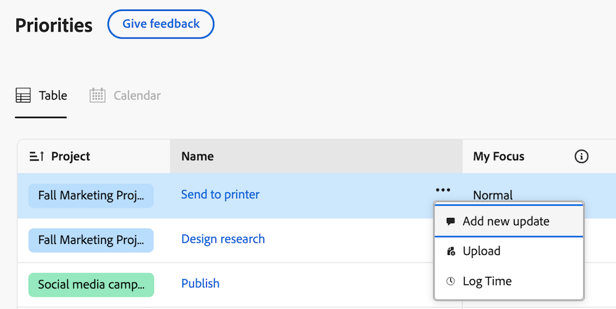
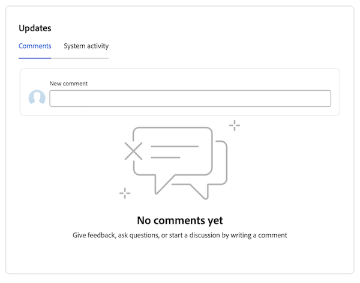
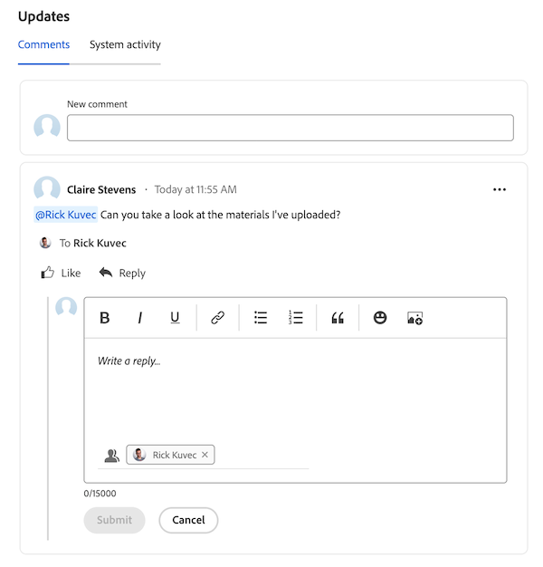

# 優先度でのコメントの追加と表示

タスクやイシューにアップデートを追加して、作業項目の進捗を他のユーザーに伝えることができます。

「優先度」には、割り当てられた作業項目が表示されます。 チームに割り当てられた作業項目を表示できません。

## アクセス要件

+++ 展開すると、この記事の機能のアクセス要件が表示されます。

<table style="table-layout:auto"> 
 <col> 
 </col> 
 <col> 
 </col> 
 <tbody> 
  <tr> 
   <td role="rowheader"><strong>Adobe Workfront パッケージ</strong></td> 
   <td> 
任意
 </td> 
  </tr> 
  <tr> 
   <td role="rowheader"><strong>Adobe Workfront プラン</strong></td> 
   <td> 
   
イシューとドキュメントについてはリクエスト以上、その他のすべてのオブジェクトについてはレビュー以上

   
問題とドキュメントのコントリビューター以上：他のすべてのオブジェクトの明るさ以上
 
   </td> 
  </tr> 
  <tr> 
   <td role="rowheader"><strong>アクセスレベル設定</strong></td> 
   <td> 
更新先のオブジェクトに対する表示または編集アクセス権
</td> 
  </tr> 
  <tr> 
   <td role="rowheader"><strong>オブジェクト権限</strong></td> 
   <td> 
オブジェクトに対する表示アクセス権
</td> 
  </tr> 
 </tbody> 
</table>

詳しくは、[Workfront ドキュメントのアクセス要件](/help/quicksilver/administration-and-setup/add-users/access-levels-and-object-permissions/access-level-requirements-in-documentation.md)を参照してください。

+++

## クイックコメントを追加

ワークリストからコメントを追加できます。

{{step1-to-priorities}}

1. 更新する作業項目を探します。
1. 名前にカーソルを合わせて、**新しい更新プログラムを追加**&#x200B;をクリックします。
   
   <!--new screen for prod -->
1. コメントの入力を開始します。
1. （オプション）「**ユーザーまたはチームにタグ付け**」ボックスで、ユーザーの名前または電子メール、またはこのコメントに含めるチームを入力し始め、リストに表示されたら選択します。
1. （オプション）リッチテキストツールバーのオプションを使用して、テキストの書式設定、絵文字、リンク、または画像をコメントに追加し、コンテンツを強化します。
1. 「**送信**」をクリックして、作業項目にコメントを追加します。

   >[!IMPORTANT]
   >
   >コメントは送信後の 15 分間のみ編集できます。 コメントを編集するには、コメントの右上隅にある&#x200B;**詳細** メニューをクリックし、**編集**&#x200B;をクリックします。

更新プログラムの追加について詳しくは、[作業項目に更新プログラムを追加する](/help/quicksilver/workfront-basics/updating-work-items-and-viewing-updates/update-work.md)を参照してください。

## 作業項目のコメントとシステム更新を表示および追加する

個々の作業項目にコメントを追加したり、コメントやシステムの更新を表示したりできます。

{{step1-to-priorities}}

1. 作業項目名をクリックして、**概要** ページを開きます。
1. 画面の右下隅にある&#x200B;**更新**&#x200B;領域を探します。
1. （オプション）「**コメント**」タブを使用して、他のユーザーが作業項目に対して行った更新を表示します。
1. （オプション）「**システムアクティビティ**」タブを使用して、作業項目に関連するシステムアクティビティを表示します。
1. （オプション）コメントを追加するには、**コメント** タブに移動し、**新規コメント** ボックスに入力を開始します。 完了したら、**送信**&#x200B;をクリックします。
   

## コメントへの返信

作業項目のコメントに返信できます。

{{step1-to-priorities}}

1. 作業項目名をクリックして、**概要** ページを開きます。
1. 画面の右下隅にある&#x200B;**更新**&#x200B;領域を探します。
1. 「**コメント**」タブで、返信するコメントを見つけて、**返信**&#x200B;をクリックします。
1. （条件付き）メッセージの内容を返信に取り込む場合は、メッセージの本文の横にある&#x200B;**詳細** メニューアイコン をクリックし、**見積もり返信**&#x200B;を選択します。

1. 返信を入力し、**送信**&#x200B;をクリックします。

   >[!IMPORTANT]
   >
   >コメントは送信後の 15 分間のみ編集できます。 コメントを編集するには、コメントの右上隅にある&#x200B;**詳細** メニューをクリックし、**編集**&#x200B;をクリックします。

   
