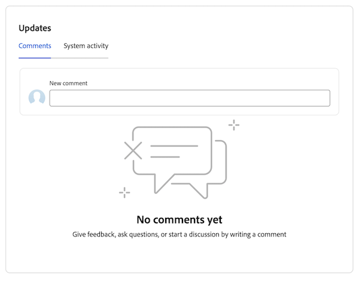

# 優先度のコメントの追加と表示

タスクまたはイシューに更新を追加して、作業項目の進捗について他のユーザーに伝えることができます。

## アクセス要件

+++ 展開すると、この記事の機能のアクセス要件が表示されます。

この記事の手順を実行するには、次のアクセス権が必要です。

<table style="table-layout:auto"> 
 <col> 
 </col> 
 <col> 
 </col> 
 <tbody> 
  <tr> 
   <td role="rowheader"><strong>Adobe Workfront プラン</strong></td> 
   <td> 
任意
 </td> 
  </tr> 
  <tr> 
   <td role="rowheader"><strong>Adobe Workfront プラン*</strong></td> 
   <td> 
   
現在：問題 <!--and documents--> に対してリクエストまたはそれ以上、他のすべてのオブジェクトに対してレビューまたはそれ以上

   
新規：問題 <!--and documents--> のコントリビューター以上：他のすべてのオブジェクトのライト以上
 
   </td> 
  </tr> 
  <tr> 
   <td role="rowheader"><strong>アクセスレベル設定</strong></td> 
   <td> 
更新先のオブジェクトに対する表示または編集アクセス権
</td> 
  </tr> 
  <tr> 
   <td role="rowheader"><strong>オブジェクト権限</strong></td> 
   <td> 
オブジェクトに対する表示アクセス権
</td> 
  </tr> 
 </tbody> 
</table>

*詳しくは、[Workfront ドキュメントのアクセス要件](/help/quicksilver/administration-and-setup/add-users/access-levels-and-object-permissions/access-level-requirements-in-documentation.md)を参照してください。

+++

## クイックコメントを追加

ワークリストからコメントを追加できます。

{{step1-to-priorities}}

1. 更新する作業項目を見つけます。
1. 名前の上にマウスポインターを置き、「**新しい更新を追加**」をクリックします。
   
1. コメントを入力してください。
1. （任意）「**ユーザーまたはチームのタグ付け**」ボックスに、このコメントに含めるユーザーまたはチームの名前またはメールの入力を開始し、リストに表示されたら選択します。
1. （オプション） リッチテキストツールバーのオプションを使用してテキストの書式を設定したり、コメントに絵文字、リンクまたは画像を追加してコンテンツを充実させることができます。
1. 「**送信**」をクリックして、作業項目にコメントを追加します。

   >[!IMPORTANT]
   >
   >コメントの編集は、送信後 15 分以内に完了します。 コメントを編集するには、コメントの右上隅にある **詳細** メニューをクリックしてから、「**編集** をクリックします。

更新の追加について詳しくは、[ 作業項目に更新を追加 ](/help/quicksilver/workfront-basics/updating-work-items-and-viewing-updates/update-work.md) を参照してください。

## 作業アイテムにコメントとシステム更新を表示して追加する

個々の作業項目にコメントを追加したり、コメントやシステムの更新を表示したりできます。

{{step1-to-priorities}}

1. 作業項目名をクリックして、**概要** ページを開きます。
1. 画面の右下隅にある **更新** 領域を見つけます。
1. （任意）「**コメント**」タブを使用して、他のユーザーが作業アイテムに加えた更新を更新します。
1. （オプション）「**システムアクティビティ**」タブを使用して、作業項目に関連するシステムアクティビティを表示します。
1. （オプション）コメントを追加するには、「**コメント**」タブに移動し、「新しいコメント」ボックスに入力を開始します。 完了したら、「**送信**」をクリックします。
   

## コメントに返信する

次の方法で作業項目のコメントに返信できます。

{{step1-to-priorities}}

1. 作業項目名をクリックして、**概要** ページを開きます。
1. 画面の右下隅にある **更新** 領域を見つけます。
1. [**コメント**] タブで、返信先のコメントを検索し、[**返信**] をクリックします。
1. （条件付き）返信する場合にメッセージの内容を返信に含めるには、メッセージの本文の横にある **詳細** メニューアイコン  をクリックし、「**引用返信**」を選択します。

1. 返信を入力し、「**送信**」をクリックします。

   >[!IMPORTANT]
   >
   >コメントの編集は、送信後 15 分以内に完了します。 コメントを編集するには、コメントの右上隅にある [ その他 ] メニューをクリックし、[ 編集 ] をクリックします。

   