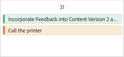

# 優先度カレンダーでの作業の管理

このページの情報は、まだ一般に提供されていない機能を指します。プレビューサンドボックス環境でのみ使用できます。

わかりやすい視覚的なカレンダーで、作業を簡単に追跡できます。 優先度カレンダーでは、次のことができます

* フィルターを使用した作業の検索
* ステータスやフォーカスレベルなどのカスタムフィールドを適用して、優先度の高い作業を特定する
* 色を適用して素早く整理

>[!IMPORTANT]
>
>プロジェクトとその子タスクおよび問題を表示するには、プロジェクトが現在ステータスまたは現在と等しいステータスである必要があります。

## アクセス要件

+++ 展開すると、この記事の機能のアクセス要件が表示されます。

この記事の手順を実行するには、次のアクセス権が必要です。

<table style="table-layout:auto"> 
 <col> 
 </col> 
 <col> 
 </col> 
 <tbody> 
  <tr> 
   <td role="rowheader"><strong>Adobe Workfront プラン</strong></td> 
   <td> 
任意
 </td> 
  </tr> 
  <tr> 
   <td role="rowheader"><strong>Adobe Workfront プラン*</strong></td> 
   <td> 
   
現在：レビュアーまたはそれ以上

   
新規：ライト以上
 
   </td> 
  </tr> 
  <tr> 
   <td role="rowheader"><strong>アクセスレベル設定</strong></td> 
   <td> 
更新先のオブジェクトに対する表示または編集アクセス権
</td> 
  </tr> 
  <tr> 
   <td role="rowheader"><strong>オブジェクト権限</strong></td> 
   <td> 
オブジェクトに対する表示アクセス権
</td> 
  </tr> 
 </tbody> 
</table>

*詳しくは、[Workfront ドキュメントのアクセス要件](/help/quicksilver/administration-and-setup/add-users/access-levels-and-object-permissions/access-level-requirements-in-documentation.md)を参照してください。

+++

## 作業をカレンダーに表示します

{{step1-to-priorities}}

1. 作業リストの上部にあるカレンダーアイコンをクリックします。
   
1. 1 つまたは複数のフィルターを選択して、作業アイテムを絞り込みます。

   +++展開すると、使用可能なフィルターの詳細情報が表示されます
   <table>
    <tbody>
    <tr>
    <th>フィルター</th>
    <th>説明</th>
    </tr>
        <tr>
        <td>作業中</td>
        <td>現在作業中の項目を表示します</td>
        </tr>
        <tr>
        <td>開始準備完了</td>
        <td>項目を次で表示 
        <ul>
        <li>未完了の先行タスクまたはタスク制約はありません</li>
        
および

        <li>予定開始日が過去または最大 2 週間以内です</li>
        </ul>
        </td>
        </tr>
        <tr>
        <td>準備未完了</td>
        <td>次を持つ項目を表示
        <ul>
        <li>不完全な先行タスクまたはタスクの制約により、このアイテムは作業できません</li>
        
または

        <li>予定開始日が 2 週間以上先の日付です</li>
        </ul>
        </td>
        </tr>
        <tr>
        <td>リクエスト日</td>
        <td>作業を開始していない問題を表示します</td>
        </tr>
        <td>完了</td>
        <td>過去 2 週間以内に完了した作業を表示します。 このフィルターオプションには、承認は含まれません。</td>
        </tr>
        <tr>
        <td>プロジェクト</td>
        <td>割り当てられたタスクまたは問題を含むプロジェクトを表示します</td>
        </tr>
        <tr>
        <td>期限日</td>
        <td>作業を予定完了日別に表示</td>
        </tr>
        <tr>
        <td>ステータス</td>
        <td>タスクまたは問題の状態（新規、進行中、完了）を表示します。</td>
        </tr>
        <tr>
        <td>マイフォーカス</td>
        <td>フォーカスレベルが割り当てられている内のタスクまたは問題を表示します。 フォーカスレベルの割り当てと管理は、個々のユーザーが行います。</td>
        </tr>
    </tbody>
    </table>

+++

1. カレンダーの作業項目バーをクリックして、横の概要を開きます。 横の概要では、次のことができます

* プロジェクトと作業項目の詳細の表示と編集
* コメントの作成と表示
* ドキュメントの表示とアップロード
* プルーフを作成
* Workfrontのプロジェクトページに移動します
* 優先度の作業項目の詳細ページに移動します
* 時間を記録
* クイックリンクの追加

1. （オプション）「**新規作成**」をクリックして、新しい作業項目をカレンダーに追加します。 詳しくは、[ 優先度で新しいタスクまたはイシューを作成する ](/help/quicksilver/workfront-basics/priorities/create-task-issue-priorities.md) を参照してください。

## カレンダーの設定

{{step1-to-priorities}}

1. 作業リストの上部にあるカレンダーアイコンをクリックします。
   
1. カレンダーの右隅にある **設定** アイコンをクリックします。

1. 「**バースタイル**」タブで、カレンダーの作業項目バーに表示するフィールドを最大 5 つ選択します。
   

1. **カラー** タブで、作業項目の表示方法を選択します。 例えば、「プロジェクト」を選択すると、作業項目は、作業リスト上のプロジェクトに割り当てられたカラーに従って表示されます。
   
