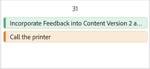

# 優先度カレンダーでの作業の管理

明確で視覚的なカレンダーにより、作業を簡単に追跡できます。 優先順位のカレンダーでは、次のことができます

* フィルターを使用した作業の検索
* ステータスやフォーカスレベルなどのカスタムフィールドを適用して、優先順位の高い作業を特定
* カラーを適用して素早く整理

>[!IMPORTANT]
>
>プロジェクトを現在のステータスまたは現在のステータスと同じステータスに設定して、プロジェクトとその子タスクおよび問題を表示する必要があります。

## アクセス要件

+++ 展開すると、この記事の機能のアクセス要件が表示されます。

<table style="table-layout:auto"> 
 <col> 
 </col> 
 <col> 
 </col> 
 <tbody> 
  <tr> 
   <td role="rowheader">Adobe Workfront パッケージ</td> 
   <td> 
任意
 </td> 
  </tr> 
  <tr> 
   <td role="rowheader">Adobe Workfront プラン</td> 
   <td> 
   
レビュアー以上

   
明るいまたはそれ以上
 
   </td> 
  </tr> 
  <tr> 
   <td role="rowheader">アクセスレベル設定</td> 
   <td> 
更新先のオブジェクトに対する表示または編集アクセス権
</td> 
  </tr> 
  <tr> 
   <td role="rowheader">オブジェクト権限</td> 
   <td> 
オブジェクトに対する表示アクセス権
</td> 
  </tr> 
 </tbody> 
</table>

詳しくは、[Workfront ドキュメントのアクセス要件](/help/quicksilver/administration-and-setup/add-users/access-levels-and-object-permissions/access-level-requirements-in-documentation.md)を参照してください。

+++

## カレンダーで作品を表示する

「優先度」には、割り当てられた作業項目が表示されます。 チームに割り当てられた作業項目は、優先順位カレンダーに表示できません。

{{step1-to-priorities}}

1. ワークリストの上部にある「**カレンダー**」アイコンをクリックします。
   
1. 1つ以上のフィルターを選択して、作業項目を絞り込みます。

   +++展開すると、使用可能なフィルターに関する詳細情報が表示されます
   <table>
    <tbody>
    <tr>
    <th>フィルター</th>
    <th>説明</th>
    </tr>
        <tr>
        <td>作業中</td>
        <td>現在作業中の項目を表示します。</td>
        </tr>
        <tr>
        <td>開始準備完了</td>
        <td>次の項目を表示 
        <ul>
        <li>不完全な先行タスクやタスクの制約はない</li>
        
and

        <li>予定開始日は過去または最大2週間後です</li>
        </ul>
        </td>
        </tr>
        <tr>
        <td>準備未完了</td>
        <td>を持つ項目を表示します
        <ul>
        <li>アイテムの作業を妨げる不完全な先行タスクまたはタスクの制約</li>
        
または

        <li>予定開始日は2週間以上前です。</li>
        </ul>
        </td>
        </tr>
        <tr>
        <td>リクエスト日</td>
        <td>作業を開始していないイシューを表示します。</td>
        </tr>
        <td>完了</td>
        <td>過去2週間以内に完了した作業を表示します。 このフィルターオプションには承認は含まれません。</td>
        </tr>
        <tr>
        <td>プロジェクト</td>
        <td>割り当てられたタスクまたはイシューを含むプロジェクトが表示されます。</td>
        </tr>
        <tr>
        <td>期日</td>
        <td>予定完了日別の作業を表示します。</td>
        </tr>
        <tr>
        <td>ステータス</td>
        <td>新規、進行中、完了の各ステータスのタスクまたはイシューを表示します。</td>
        </tr>
        <tr>
        <td>マイフォーカス</td>
        <td>フォーカスレベルが割り当てられているタスクまたはイシューが表示されます。 フォーカスレベルは、個々のユーザーが割り当て、管理します。</td>
        </tr>
    </tbody>
    </table>

   +++

1. カレンダーの作業項目バーをクリックして、サイドサマリーを開きます。 サイドサマリーでは、次のことが可能です

   * プロジェクトと作業項目の詳細の表示と編集
   * コメントの作成と表示
   * ドキュメントの表示とアップロード
   * プルーフを作成
   * Workfrontのプロジェクトページに移動します
   * 優先順位の作業項目詳細ページに移動します
   * 時間を記録
   * クイックリンクを追加

1. （オプション）「**新規作成**」をクリックして、新しい作業項目をカレンダーに追加します。 詳しくは、[優先度](/help/quicksilver/workfront-basics/priorities/create-task-issue-priorities.md)で新しいタスクまたは問題を作成するを参照してください。

## カレンダーの設定

{{step1-to-priorities}}

1. ワークリストの上部にある「**カレンダー**」アイコンをクリックします。
   
1. カレンダーの右隅にある&#x200B;**設定** アイコンをクリックします。

1. 「**バースタイル**」タブで、カレンダーの作業項目バーに表示する最大5つのフィールドを選択します。
   

1. 「**カラー**」タブで、作業項目の表示方法を選択します。 例えば、**プロジェクト**を選択した場合、作業項目は、ワークリスト上のプロジェクトに割り当てられた色に従って表示されます。
   
