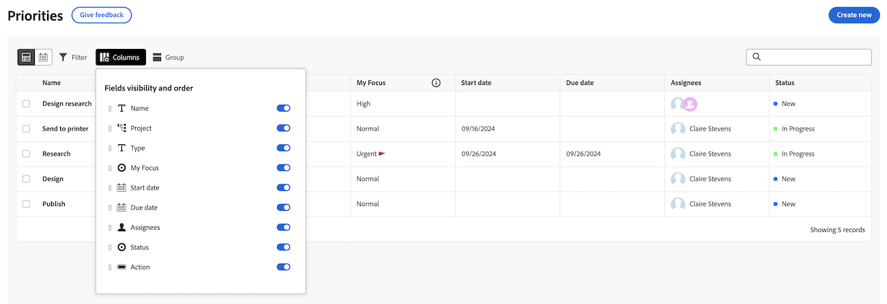
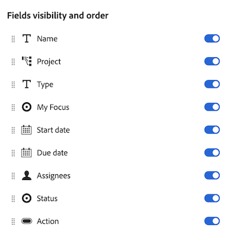

# 優先度ワークリストの列のカスタマイズ

作業リストの列を優先度でカスタマイズして、作業の方法をサポートできます。

優先度には、割り当てられた作業項目が表示されます。 チームに割り当てられた作業項目を表示できません。

>[!NOTE]
>
>現時点では、列にカスタムデータを追加できません。

## アクセス要件

+++ 展開すると、この記事の機能のアクセス要件が表示されます。

<table style="table-layout:auto"> 
 <col> 
 </col> 
 <col> 
 </col> 
 <tbody> 
  <tr> 
   <td role="rowheader"><strong>Adobe Workfront プラン</strong></td> 
   <td> 
任意
 </td> 
  </tr> 
  <tr> 
   <td role="rowheader"><strong>Adobe Workfront プラン*</strong></td> 
   <td> 
   
現在：レビュアーまたはそれ以上

   
新規：ライト以上
 
   </td> 
  </tr> 
  <tr> 
   <td role="rowheader"><strong>アクセスレベル設定</strong></td> 
   <td> 
更新先のオブジェクトに対する表示または編集アクセス権
</td> 
  </tr> 
  <tr> 
   <td role="rowheader"><strong>オブジェクト権限</strong></td> 
   <td> 
オブジェクトに対する表示アクセス権
</td> 
  </tr> 
 </tbody> 
</table>

この表の情報の詳細については、[Workfront ドキュメントのアクセス要件](/help/quicksilver/administration-and-setup/add-users/access-levels-and-object-permissions/access-level-requirements-in-documentation.md)を参照してください。

+++

## 優先度ワークリストの列のカスタマイズ

### 列を有効または無効にする

{{step1-to-priorities}}

1. 画面左側にある **列** をクリックします。
   
1. ワークリストの列の有効/無効を切り替えるには、を使用します。

### 列の並べ替え

{{step1-to-priorities}}

1. 画面左側にある **列** をクリックします。
1. **ドラッグ** アイコンをクリックし、列を目的の場所に移動します。 列を移動すると、ワークリスト内で自動的に更新されます。
   

>[!NOTE]
>
>名前列は固定されており、移動できません。
