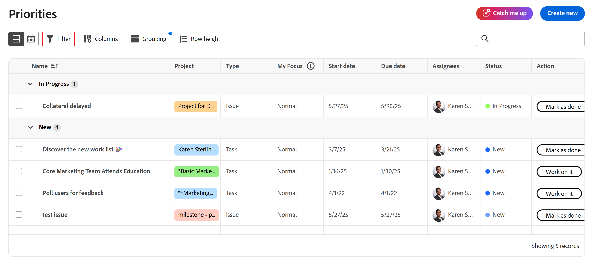
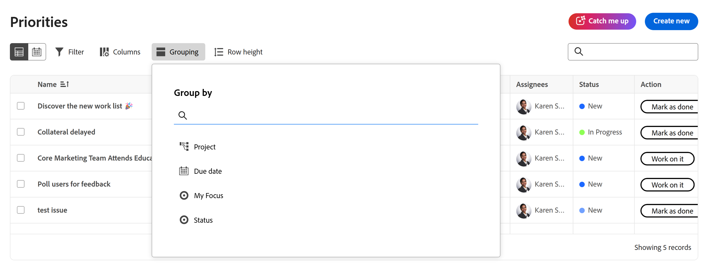
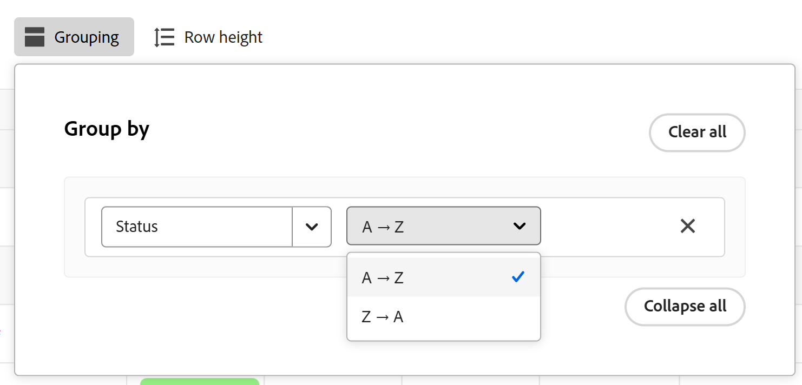
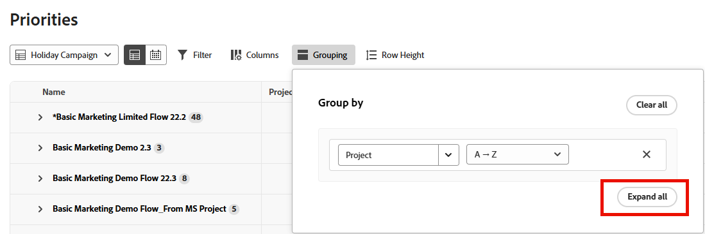

# 作業のフィルタリング、グループ化、並べ替えを優先度で行う

フィルターを使用して目的の作業を見つけ、グループ化を適用して整理することができます。

「優先度」には、割り当てられた作業項目が表示されます。 チームに割り当てられた作業項目は、優先順位ワークリストに表示できません。

## アクセス要件

+++ 展開すると、この記事の機能のアクセス要件が表示されます。

この記事の手順を実行するには、次のアクセス権が必要です。

<table style="table-layout:auto"> 
 <col> 
 </col> 
 <col> 
 </col> 
 <tbody> 
  <tr> 
   <td role="rowheader"><strong>Adobe Workfront パッケージ</strong></td> 
   <td> 
任意
 </td> 
  </tr> 
  <tr> 
   <td role="rowheader"><strong>Adobe Workfront プラン</strong></td> 
   <td> 
   
リクエスト以上

   
コントリビューター以上
 
   </td> 
  </tr> 
  <tr> 
   <td role="rowheader"><strong>アクセスレベル設定</strong></td> 
   <td> 
更新先のオブジェクトに対する表示または編集アクセス権
</td> 
  </tr> 
  <tr> 
   <td role="rowheader"><strong>オブジェクト権限</strong></td> 
   <td> 
オブジェクトに対する表示アクセス権
</td> 
  </tr> 
 </tbody> 
</table>

*詳しくは、[Workfront ドキュメントのアクセス要件](/help/quicksilver/administration-and-setup/add-users/access-levels-and-object-permissions/access-level-requirements-in-documentation.md)を参照してください。

+++

## 標準フィルターを使用した作業のフィルター

割り当てられたタスクやイシューは、フィルタリングすることができます。

{{step1-to-priorities}}

1. ワークリストの左上にある「**フィルター**」をクリックします。
1. **標準フィルター** セクションで、1つ以上のフィルターを選択して、作業項目を絞り込みます。
   

+++展開すると、使用可能なフィルターに関する詳細情報が表示されます
<table>
  <tbody>
   <tr>
   <th>フィルター</th>
   <th>説明</th>
   </tr>
    <tr>
      <td>作業中</td>
      <td>現在作業中の項目を表示</td>
    </tr>
    <tr>
      <td>開始準備完了</td>
      <td>次の項目を表示 
      <ul>
      <li>不完全な先行タスクやタスクの制約はない</li>
      
and

      <li>予定開始日は過去または最大2週間後です</li>
      </ul>
      </td>
    </tr>
    <tr>
      <td>準備未完了</td>
      <td>を持つ項目を表示します
       <ul>
      <li>アイテムの作業を妨げる不完全な先行タスクまたはタスクの制約</li></ul>
      
または

      <ul>
      <li>予定開始日から2週間以上経過した後</li>
      </ul>
       </td>
    </tr>
    <tr>
      <td>リクエスト日</td>
      <td>作業を開始していない問題を表示します</td>
    </tr>
      <td>完了</td>
      <td>過去2週間以内に完了した作業を表示します。 このフィルターオプションには承認は含まれません。</td>
    </tr>
    <tr>
    <td>プロジェクト</td>
    <td>割り当てられたタスクまたは問題を含むプロジェクトを表示します</td>
    </tr>
    <tr>
    <td>期日</td>
    <td>予定完了日別に作業を表示します</td>
    </tr>
    <tr>
    <td>マイフォーカス</td>
    <td>フォーカスレベルが割り当てられたタスクまたはイシューが表示されます。 フォーカスレベルは、個々のユーザーが割り当て、管理します。</td>
    </tr>
    <tr>
    <td>ステータス</td>
    <td>新規、進行中、完了の各ステータスのタスクまたはイシューを表示します。</td>
    </tr>
  </tbody>
</table>

+++

1. （オプション）「**デフォルトに戻る**」をクリックして、選択をリセットします。

## スマートフィルターを使用した作業のフィルタリング

自然言語を使用して作業をすばやくフィルターできます。

>[!NOTE]
>
>この機能は、AI アシスタントを使用して統合Adobe エクスペリエンスを利用しているお客様のみが利用できます。 AI アシスタントについて詳しくは、[AI アシスタントの概要](/help/quicksilver/workfront-basics/ai-assistant/ai-assistant-overview.md)を参照してください。

{{step1-to-priorities}}

1. ワークリストの左上にある「**フィルター**」をクリックします。
1. **スマートフィルター**&#x200B;をクリックします。
1. 作業をフィルタリングする方法を入力します。

   例えば、次のように入力できます。

   * *遅延タスクを表示*
   * *最重要課題を表示*
   * *本日期日の作業を表示*

## 作業のグループ化

{{step1-to-priorities}}

1. ワークリストの左上にある「**グループ化**」をクリックします。
1. グループ化を選択して、ワークリストを整理します。

+++展開すると、使用可能なグループに関する詳細情報が表示されます

| グループ | 説明 |
|-----------|-------------|
| プロジェクト | プロジェクトごとにアイテムをグループ化できます。 |
| 期日 | これにより、アイテムの期限にもとづいて分類できます。 期日は、予定完了日によって決まります。 |
| マイフォーカス | 割り当てたフォーカスレベルにもとづいてアイテムをグループ化できます。 |
| ステータス | これにより、アイテムが「新規」、「進行中」、「完了」などのステータスでグループ化されます。  <b> メモ </b>：現時点では、優先度でカスタムステータスを使用することはできません。 |

+++

### マイ優先度またはステータス別にグループ化する場合の作業項目のドラッグ&amp;ドロップ

マイ優先度またはステータスでグループ化する場合は、個々の作業項目をカテゴリ間でドラッグ&amp;ドロップできます。

1. **ステータス**&#x200B;または&#x200B;**自分のフォーカス**&#x200B;で作業をグループ化します。
2. 作業項目にカーソルを合わせて&#x200B;**ドラッグ** アイコンをクリックし、目的のカテゴリに移動します。
   

## 作品の並べ替え

### グループ化して並べ替え

グループ内で作業を並べ替えるには、**グループ化**&#x200B;を開き、昇順または降順で並べ替えるかどうかを選択します。

### 列を並べ替え

個々の列を並べ替えるには、列に移動し、下向き矢印をクリックします。

### すべてのグループセクションを展開または折りたたむ

すべてのグループセクションを展開または折りたたむには、**グループ**&#x200B;を開き、グループ化が折りたたまれている場合は「**すべて展開**」、グループ化が展開されている場合は「**すべて折りたたむ**」をクリックします。

