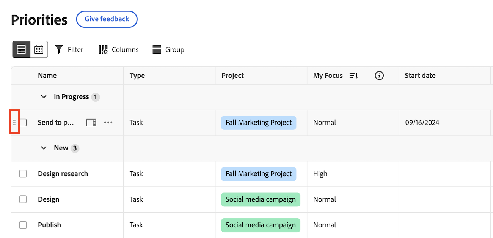

# 優先度を使用した作業のフィルタリングとグループ化

フィルターを使用して探している作業を見つけ、グループ化を適用して整理することができます。

優先度には、割り当てられた作業項目が表示されます。 チームに割り当てられた作業項目が「優先度」作業リストに表示されません。

## アクセス要件

+++ 展開すると、この記事の機能のアクセス要件が表示されます。

この記事の手順を実行するには、次のアクセス権が必要です。

<table style="table-layout:auto"> 
 <col> 
 </col> 
 <col> 
 </col> 
 <tbody> 
  <tr> 
   <td role="rowheader"><strong>Adobe Workfront プラン</strong></td> 
   <td> 
任意
 </td> 
  </tr> 
  <tr> 
   <td role="rowheader"><strong>Adobe Workfront プラン*</strong></td> 
   <td> 
   
現在：Request 以上

   
新規：Contributor 以上
 
   </td> 
  </tr> 
  <tr> 
   <td role="rowheader"><strong>アクセスレベル設定</strong></td> 
   <td> 
更新先のオブジェクトに対する表示または編集アクセス権
</td> 
  </tr> 
  <tr> 
   <td role="rowheader"><strong>オブジェクト権限</strong></td> 
   <td> 
オブジェクトに対する表示アクセス権
</td> 
  </tr> 
 </tbody> 
</table>

*詳しくは、[Workfront ドキュメントのアクセス要件](/help/quicksilver/administration-and-setup/add-users/access-levels-and-object-permissions/access-level-requirements-in-documentation.md)を参照してください。

+++

## 標準フィルターを使用した作業のフィルタリング

自分に割り当てられたタスクやイシューをフィルタリングできます。

{{step1-to-priorities}}

1. ワークリストの左上にある「**フィルター**」をクリックします。
1. 「**標準フィルター**」セクションで、1 つ以上のフィルターを選択して、作業項目を絞り込みます。
   

+++展開すると、使用可能なフィルターの詳細情報が表示されます
<table>
  <tbody>
   <tr>
   <th>フィルター</th>
   <th>説明</th>
   </tr>
    <tr>
      <td>作業中</td>
      <td>現在作業中の項目を表示します</td>
    </tr>
    <tr>
      <td>開始準備完了</td>
      <td>項目を次で表示 
      <ul>
      <li>未完了の先行タスクまたはタスク制約はありません</li>
      
および

      <li>予定開始日が過去または最大 2 週間以内です</li>
      </ul>
      </td>
    </tr>
    <tr>
      <td>準備未完了</td>
      <td>次を持つ項目を表示
       <ul>
      <li>不完全な先行タスクまたはタスクの制約により、このアイテムは作業できません</li></ul>
      
または

      <ul>
      <li>予定開始日が 2 週間以上先の日付です</li>
      </ul>
       </td>
    </tr>
    <tr>
      <td>リクエスト日</td>
      <td>作業を開始していない問題を表示します</td>
    </tr>
      <td>完了</td>
      <td>過去 2 週間以内に完了した作業を表示します。 このフィルターオプションには、承認は含まれません。</td>
    </tr>
    <tr>
    <td>プロジェクト</td>
    <td>割り当てられたタスクまたは問題を含むプロジェクトを表示します</td>
    </tr>
    <tr>
    <td>期日</td>
    <td>作業を予定完了日別に表示</td>
    </tr>
    <tr>
    <td>マイフォーカス</td>
    <td>フォーカスレベルが割り当てられているタスクまたは問題を表示します。 フォーカスレベルの割り当てと管理は、個々のユーザーが行います。</td>
    </tr>
    <tr>
    <td>ステータス</td>
    <td>タスクまたは問題の状態（新規、進行中、完了）を表示します。</td>
    </tr>
  </tbody>
</table>

+++

1. （任意）「**デフォルトに戻る**」をクリックして、選択をリセットします。

## スマートフィルターを使用した作業のフィルタリング

自然言語を使用して、作業をすばやくフィルタリングします。

>[!NOTE]
>
>この機能は、AI アシスタントを使用している統合Adobe エクスペリエンスの顧客のみが利用できます。 AI アシスタントの詳細については、「[AI アシスタントの概要 &#x200B;](/help/quicksilver/workfront-basics/ai-assistant/ai-assistant-overview.md)」を参照してください。

{{step1-to-priorities}}

1. ワークリストの左上にある「**フィルター**」をクリックします。
1. **スマートフィルター** をクリックします。
1. 作業をフィルターする方法を入力します。

   次のように入力できます。

   * *遅延タスクの表示*
   * *最優先事項を表示*
   * *今日が期限の作業を表示*

## 作業のグループ化

{{step1-to-priorities}}

1. ワークリストの左上にある「**グループ**」をクリックします。
1. グループを選択してワークリストを整理します。
   

+++展開すると、利用可能なグループの詳細情報が表示されます

| グループ | 説明 |
|-----------|-------------|
| プロジェクト | これにより、プロジェクトごとに項目がグループ化されます。 |
| 期日 | これにより、期限に基づいて項目がグループ化されます。 期限は予定完了日によって決定されます。 |
| マイフォーカス | これにより、割り当てたフォーカスレベルに基づいて項目がグループ化されます。 |
| ステータス | これは、新規、処理中、完了のステータスで項目をグループ化します。  <b> メモ </b>：現時点では、優先度にカスタムステータスを使用できません。 |

+++

### マイ優先度またはステータスでグループ化する場合の作業項目のドラッグ&amp;ドロップ

マイ優先度またはステータスでグループ化している場合は、カテゴリ間で個々の作業アイテムをドラッグ&amp;ドロップできます。

1. 作業内容を **ステータス** または **マイ優先度** でグループ化します。
2. 作業項目の上にマウスポインターを置いて「**ドラッグ**」アイコンをクリックし、目的のカテゴリに移動します。
   

## 作業の並べ替え

### グループで並べ替え

グループ内で作業を並べ替えるには、**グループ** を開き、昇順または降順で並べ替えるかどうかを選択します。

### 列を並べ替え

個々の列を並べ替えるには、列に移動して下矢印をクリックします。

### すべてのグループ セクションを展開または折りたたむ

すべてのグループセクションを展開または折りたたむには、**グループ** を開いて **すべて展開** または **すべて折りたたむ** をクリックします。

