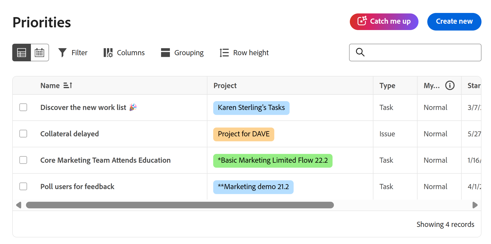
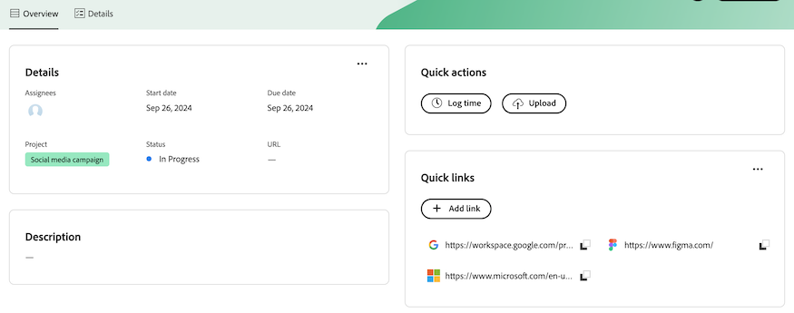
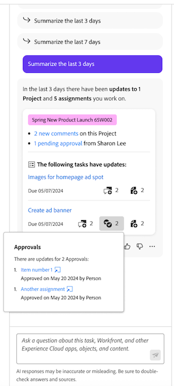

# [!DNL Priorities] の基本を学ぶ

{{preview-fast-release-general}}

「Priorities」は、タスクオーナー向けにカスタマイズされた、合理化された直感的なエクスペリエンスです。 優先順位は、ワークリストから順に段階的に公開されます。

優先順位を付けることで、次のことを実現できます

* 日々のタスクを管理、優先順位付け：統合されたナビゲーションで1日や1週間を整理し、より明確にします
* 生産性の向上：クリック数を減らしながらプロジェクトコンテキストにアクセスし、タスクをすばやく実行できます
* パーソナライズされた機能：タスクオーナー向けに独自に設計された機能の利点

「優先度」ワークリストおよびカレンダーには、割り当てられた作業項目が表示されます。 チームに割り当てられた作業項目を表示できません。

Workfront管理者は、レイアウト テンプレートでユーザーの優先度を有効にできます。 詳しくは、[&#x200B; レイアウトテンプレートを使用したメインメニューのカスタマイズ &#x200B;](/help/quicksilver/administration-and-setup/customize-workfront/use-layout-templates/customize-main-menu.md)を参照してください。

## 作業の検索と整理

「優先順位」では、作業をフィルタリングしてグループ化することができるため、期限を管理し、自分にとって重要なものを優先することができます。 また、「マイフォーカス」列を使用して、緊急性の高い作業を素早く特定することもできます。

### フィルターを使用した作業の検索

フィルターを使用して最も重要な作業を見つける。 自然言語を使用してスマートフィルターで作業を検索したり、
標準フィルターを使用して、割り当てられたタスクとイシューを検索できます。

<table>
  <tbody>
   <tr>
   <th>フィルター</th>
   <th>説明</th>
   </tr>
    <tr>
      <td>作業中</td>
      <td>現在作業中の項目を表示</td>
    </tr>
    <tr>
      <td>開始準備完了</td>
      <td>次の項目を表示 
      <ul>
      <li>不完全な先行タスクやタスクの制約はない</li>
      
and

      <li>予定開始日は過去または最大2週間後です</li>
      </ul>
      </td>
    </tr>
    <tr>
      <td>準備未完了</td>
      <td>を持つ項目を表示します
       <ul>
      <li>アイテムの作業を妨げる不完全な先行タスクまたはタスクの制約</li>
      
または

      <li>予定開始日から2週間以上経過した後</li>
      </ul>
       </td>
    </tr>
    <tr>
      <td>リクエスト日</td>
      <td>作業を開始していない問題を表示します</td>
    </tr>
      <td>完了</td>
      <td>過去2週間以内に完了した作業を表示します。 このフィルターオプションには承認は含まれません。</td>
    </tr>
    <tr>
    <td>プロジェクト</td>
    <td>割り当てられたタスクまたは問題を含むプロジェクトを表示します</td>
    </tr>
    <tr>
    <td>期日</td>
    <td>予定完了日別に作業を表示します</td>
    </tr>
    <tr>
    <td>ステータス</td>
    <td>新規、進行中、完了のステータスのタスクまたは問題を表示します</td>
    </tr>
     <tr>
    <td>マイフォーカス</td>
    <td>フォーカスレベルが割り当てられているタスクまたはイシューが表示されます。 フォーカスレベルは、個々のユーザーが割り当て、管理します。</td>
    </tr>
  </tbody>
</table>

### グループを使用した作業の整理

作業をフィルタリングした後、次の基準でアイテムをグループ化できます

* マイフォーカス
* 期限の週
* ステータス
* プロジェクト

詳しくは、[作業のフィルター、グループ化、優先度の並べ替え](/help/quicksilver/workfront-basics/priorities/filter-group-work-priorities.md)を参照してください。

### 「My Focus」で重要なタスクに優先順位を付ける

マイフォーカスは、作業の優先順位を付けるのに役立つワークリストの列です。 「自分のフォーカス」の値は個人用であり、プロジェクト、タスク、イシューのデータには影響しません。 次のフォーカスレベルを使用できます。

* 緊急
* 高
* 標準（デフォルト）
* 低

作業項目にフォーカスレベルを割り当てたら、列を並べ替えて、ワークリストの上部に緊急アイテムを表示できます。

詳しくは、[重要な作業項目の優先順位付け](/help/quicksilver/workfront-basics/priorities/prioritize-work-items.md)を参照してください。

### カレンダービューの使用

カレンダービューには、タスクやイシューが視覚的に表示されます。 日、週、月の表示のいずれかを選択できます。 また、ワークリストと同様の方法でアイテムをフィルタリングすることもできます。

## タスクと問題への取り組み

「優先順位」では、作業項目を更新して作業項目の詳細を最新の状態に保つことや、作業時間を正確に追跡するために作業時間を記録すること、プロジェクトに移動することなくアセットをアップロードすること、頻繁に使用するリソースに簡単にアクセスできるようにクイックリンクを追加することができます。

>[!NOTE]
>
>Light、Review、Contributor、およびRequestorのライセンスでは、優先度へのアクセスが制限されています。 これらのライセンスの種類がタスクや問題とどのように関係しているかについて詳しくは、を参照してください
>
>* [新しいライセンスによるオブジェクトと領域へのアクセス &#x200B;](/help/quicksilver/administration-and-setup/add-users/how-access-levels-work/access-to-objects-areas-license-types.md)
>* [新しいアクセス レベルの各オブジェクト タイプで使用できる機能](/help/quicksilver/administration-and-setup/add-users/how-access-levels-work/functionality-available-for-objects.md)
>* [ライセンスタイプ別のオブジェクトやエリアへのアクセス](/help/quicksilver/administration-and-setup/add-users/access-levels-and-object-permissions/access-to-objects-and-areas-by-license-type.md)
>* [各オブジェクトタイプで使用できる機能](/help/quicksilver/administration-and-setup/add-users/access-levels-and-object-permissions/functionality-available-for-each-object-type.md)

### 更新の追加と表示

タスクや問題に関する更新情報を追加して、進捗状況を他のユーザーに伝えます。

「更新」セクションには、システムの更新と、過去90日以内にユーザーが行った最新の更新のうち最大200件が表示されます。

詳しくは、[優先度](/help/quicksilver/workfront-basics/priorities/add-view-updates-priorities.md)でのコメントの追加と表示を参照してください。

### 時間を記録

作業項目の作業時間を記録し、作業に費やした時間数を示すことができます。 休暇、病気の時間、会議に費やした時間など、仕事に関係のない時間を記録することもできます。記録した時刻がタイムシートに表示されます。

詳しくは、[優先度に時間を記録する](/help/quicksilver/workfront-basics/priorities/log-time-priorities.md)を参照してください。

### ファイルのアップロード

プロジェクトに移動することなく、タスクまたはイシューの「ドキュメント」エリアにファイルを直接アップロードできます。 プライオリティからファイルをアップロードする場合、次のことができます

* 既存のフォルダーの選択
* 更新ストリームのコメントを含むファイルをアップロードする
* 追加ファイルの追加
* 接続されたドキュメント統合からファイルを読み込む

詳しくは、「[優先度でファイルをアップロード &#x200B;](/help/quicksilver/workfront-basics/priorities/upload-files-in-priorities.md)」を参照してください。

### クイックリンクを追加

頻繁に使用するリンクは、作業項目の詳細ページに埋め込むことができます。 クイックリンクを使用すると、リンクに素早くアクセスしたり、リンクをコピーしたりできます。

詳細については、[優先順位のクイックリンクの追加と管理](/help/quicksilver/workfront-basics/priorities/quick-links-priorities.md)を参照してください。

### ドキュメントを表示

「文書」タブでは、作業項目に関連するすべてのファイルを表示できます。 名前、ファイルタイプ、人物でドキュメントをフィルタリングし、名前とアップロード日で並べ替えることができます。

ドキュメントまたはプルーフを開くこともできます。

### アセットのレビューと承認

タスクまたはイシューの「ドキュメント」タブから、次のことができます

* シンプルまたは高度なプルーフの作成
* プルーフビューアを起動してコメントを残し、意思決定を行います

## [!DNL Catch me up]を使用して、見逃した内容を確認する

[!DNL Catch me up]機能を使用して、見逃した内容を確認します。 Catch me upは、24時間、3日、7日間の時間枠内に、更新、アップロードされたドキュメント、承認、およびプロジェクトに関するその他の重要な変更を要約します。

詳しくは、[優先度での作業の遅れの取り戻し](/help/quicksilver/workfront-basics/priorities/catch-me-up.md)を参照してください。

<!--need new screen for prod-->

## 詳細ページでリアルタイムの更新を表示する

タスクまたはイシューの詳細ページで、リアルタイムの更新を表示できます。 また、リアルタイムのプレゼンス指標を使用して、他のユーザーが同時にページを表示しているかどうかを確認することもできます。

<!--
## Considerations

* Accessing tasks in Priorities is across tabs. We plan to add additional tabs, like Documents, Subtasks, Approvals, etc, in the future. Let us know you need these items by submitting feedback using the **Give Feedback** button.
-->
