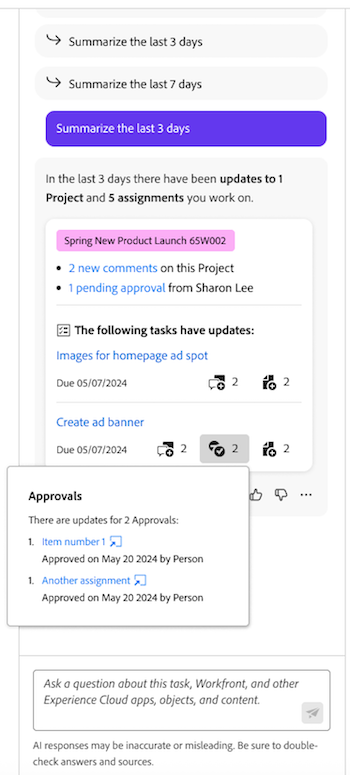

# [!DNL Priorities] の基本を学ぶ

{{preview-fast-release-general}}

優先度は、タスクの所有者に合わせて調整された、合理化された直感的なエクスペリエンスです。 優先度は、ワークリストから始めて、段階的にロールアウトされます。

優先度を使用すると、次のことが可能です

* 毎日のタスクの管理と優先順位付け：統合されたナビゲーションで日や週を整理し、わかりやすくします
* 生産性の向上：プロジェクトコンテキストにアクセスし、クリック数を減らしてタスクを迅速に実行します
* パーソナライズされた機能：タスクの所有者向けに独自に設計された機能を活用できます

「優先度」作業リストおよびカレンダには、自分に割り当てられた作業項目が表示されます。 チームに割り当てられた作業項目を表示できません。

Workfront管理者は、レイアウトテンプレートのユーザーの優先度を有効にすることができます。 詳しくは、[ レイアウトテンプレートを使用してメインメニューをカスタマイズする ](/help/quicksilver/administration-and-setup/customize-workfront/use-layout-templates/customize-main-menu.md) を参照してください。

## 作業の検索と整理

優先度では、作業をフィルタリングしてグループ化できるので、期限を管理し、重要な作業に優先順位を付けることができます。 また、マイフォーカス列を使用して、緊急の作業をすばやく特定することもできます。

### フィルターを使用した作業の検索

フィルターを使用して、最も重要な作業を見つけます。 自然言語を使用して、スマートフィルターでの作業を検索できます。または、
標準フィルターを使用して、自分に割り当てられたタスクとイシューを検索できます。

<table>
  <tbody>
   <tr>
   <th>フィルター</th>
   <th>説明</th>
   </tr>
    <tr>
      <td>作業中</td>
      <td>現在作業中の項目を表示します</td>
    </tr>
    <tr>
      <td>開始準備完了</td>
      <td>項目を次で表示 
      <ul>
      <li>未完了の先行タスクまたはタスク制約はありません</li>
      
and

      <li>予定開始日が過去または最大 2 週間以内です</li>
      </ul>
      </td>
    </tr>
    <tr>
      <td>準備未完了</td>
      <td>次を持つ項目を表示
       <ul>
      <li>不完全な先行タスクまたはタスクの制約により、このアイテムは作業できません</li>
      
または

      <li>予定開始日が 2 週間以上先の日付です</li>
      </ul>
       </td>
    </tr>
    <tr>
      <td>リクエスト日</td>
      <td>作業を開始していない問題を表示します</td>
    </tr>
      <td>完了</td>
      <td>過去 2 週間以内に完了した作業を表示します。 このフィルターオプションには、承認は含まれません。</td>
    </tr>
    <tr>
    <td>プロジェクト</td>
    <td>割り当てられたタスクまたは問題を含むプロジェクトを表示します</td>
    </tr>
    <tr>
    <td>期日</td>
    <td>作業を予定完了日別に表示</td>
    </tr>
    <tr>
    <td>ステータス</td>
    <td>タスクまたは問題の状態（新規、進行中、完了）を表示します。</td>
    </tr>
     <tr>
    <td>マイフォーカス</td>
    <td>フォーカスレベルが割り当てられている内のタスクまたは問題を表示します。 フォーカスレベルの割り当てと管理は、個々のユーザーが行います。</td>
    </tr>
  </tbody>
</table>

### グループを使用した作業の整理

作業をフィルターした後は、以下に基づいて項目をグループ化できます

* マイフォーカス
* 期限の週
* ステータス
* プロジェクト

詳しくは、[ 優先度での作業のフィルタリングとグループ化 ](/help/quicksilver/workfront-basics/priorities/filter-group-work-priorities.md) を参照してください。

### 重要な作業アイテムの優先順位付けに自分をフォーカス

マイフォーカスは、作業に優先順位を付けるのに役立つワークリストの列です。 マイフォーカスの値は個人的なもので、プロジェクト、タスク、イシューのデータには影響しません。 次のフォーカスレベルを使用できます。

* 緊急
* 高
* 標準（デフォルト）
* 低

作業アイテムにフォーカスレベルを割り当てたら、列を並べ替えて、ワークリストの上部に緊急のアイテムを表示できます。

詳しくは、[ 重要な作業項目の優先順位の設定 ](/help/quicksilver/workfront-basics/priorities/prioritize-work-items.md) を参照してください。

### カレンダービューの使用

カレンダー表示には、タスクとイシューが視覚的に表示されます。 日、週、または月のビューから選択できます。 また、ワークリストと同様の方法で項目をフィルタリングすることもできます。

## タスクとイシューの操作

優先度では、作業項目を更新して作業項目の詳細を最新の状態に保ったり、時間を記録して作業時間を正確に追跡したり、アセットをアップロードしてプロジェクトに移動しなくても済んだり、クイックリンクを追加して頻繁に使用するリソースに簡単にアクセスしたりできます。

>[!NOTE]
>
>ライト、レビュー、コントリビューター、リクエスターのライセンスでは、優先度へのアクセスが制限されています。 これらのライセンス タイプがタスクや問題とどのようにやり取りするかについての詳細は、を参照してください。
>
>* [ 新規ライセンスのためのオブジェクトおよび領域へのアクセス ](/help/quicksilver/administration-and-setup/add-users/how-access-levels-work/access-to-objects-areas-license-types.md)
>* [ 新しいアクセスレベル用にオブジェクトタイプごとに使用可能な機能 ](/help/quicksilver/administration-and-setup/add-users/how-access-levels-work/functionality-available-for-objects.md)
>* [ライセンスタイプ別のオブジェクトやエリアへのアクセス](/help/quicksilver/administration-and-setup/add-users/access-levels-and-object-permissions/access-to-objects-and-areas-by-license-type.md)
>* [各オブジェクトタイプで使用できる機能](/help/quicksilver/administration-and-setup/add-users/access-levels-and-object-permissions/functionality-available-for-each-object-type.md)

### 更新の追加と表示

タスクまたは問題に更新を追加して、進捗を他のユーザーに伝えます。

「更新」セクションには、システムの更新と、過去 90 日間にユーザーが行った最新の更新が最大 200 件表示されます。

詳しくは、[ 優先度でのコメントの追加と表示 ](/help/quicksilver/workfront-basics/priorities/add-view-updates-priorities.md) を参照してください。

### 時間を記録

作業アイテムの時間をログに記録して、そのアイテムに費やした時間数を示すことができます。 休暇、病気の時間、会議に費やした時間など、仕事に関係のない時間を記録することもできます。記録した時刻がタイムシートに表示されます。

詳しくは、「[ 優先度で時間を記録する ](/help/quicksilver/workfront-basics/priorities/log-time-priorities.md) を参照してください。

### ファイルのアップロード

プロジェクトに移動せずに、タスクまたは問題のドキュメント領域にファイルを直接アップロードします。 優先度からファイルをアップロードすると、次のことができます

* 既存のフォルダーを選択
* 更新ストリームのコメントを含んだファイルをアップロード
* 追加ファイル
* 接続されたドキュメント統合からのファイルの読み込み

詳しくは、[ 優先度でのファイルのアップロード ](/help/quicksilver/workfront-basics/priorities/upload-files-in-priorities.md) を参照してください。

### クイックリンクの追加

頻繁に使用するリンクを作業項目の詳細ページに埋め込むことができます。 クイックリンクを使用すると、リンクにすばやくアクセスまたはコピーできます。

詳しくは、[ 優先度でクイックリンクを追加および管理 ](/help/quicksilver/workfront-basics/priorities/quick-links-priorities.md) を参照してください。

### ドキュメントを表示

「ドキュメント」タブでは、作業項目に関連するすべてのファイルを表示できます。 ドキュメントを名前、ファイルタイプまたはユーザーでフィルタリングしたり、名前で並べ替えたり、アップロード日で並べ替えたりできます。

また、ドキュメントやプルーフを開くこともできます。

### アセットのレビューと承認

タスクまたは問題の「ドキュメント」タブから、次の操作を実行できます

* シンプルなプルーフまたは詳細プルーフの作成
* プルーフビューアを起動してコメントを残し、決定を行う

## [!DNL Catch me up] を使用して、見逃したものを確認する

[!DNL Catch me up] 機能を使用して、見逃した内容を確認します。 キャッチアップでは、24 時間、3 日、7 日以内に、プロジェクトに関する更新、アップロードされたドキュメント、承認、その他の注目すべき変更点をまとめます。

詳しくは、[ 優先度の作業のキャッチアップ ](/help/quicksilver/workfront-basics/priorities/catch-me-up.md) を参照してください。

<!--need new screen for prod-->

## 詳細ページでリアルタイムの更新を表示

タスクまたはイシューの詳細ページでリアルタイムの更新を表示できます。 また、リアルタイムプレゼンス指標を使用して、自分と同時に他のユーザーがページを表示しているかどうかを確認することもできます。

<!--
## Considerations

* Accessing tasks in Priorities is across tabs. We plan to add additional tabs, like Documents, Subtasks, Approvals, etc, in the future. Let us know you need these items by submitting feedback using the **Give Feedback** button.-->
