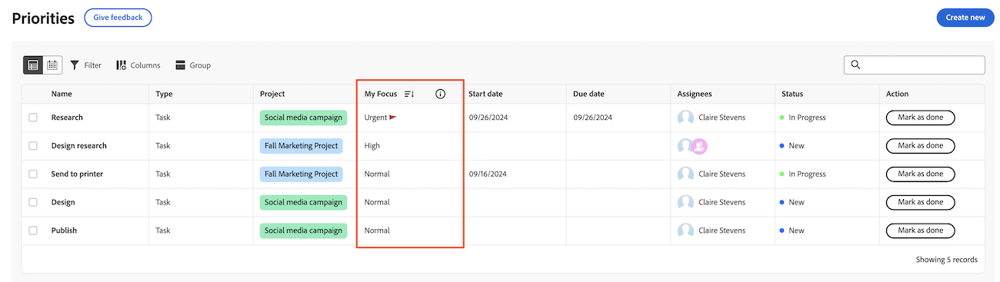

# 重要な作業アイテムの優先順位付け

マイフォーカス列を使用して、作業に優先順位を付けることができます。 「マイフォーカス」列は個人的な値であり、タスクまたは問題に設定された優先度には影響しません。

優先度には、割り当てられた作業項目が表示されます。 チームに割り当てられた作業項目を表示できません。

## アクセス要件

+++ 展開すると、この記事の機能のアクセス要件が表示されます。

<table style="table-layout:auto"> 
 <col> 
 </col> 
 <col> 
 </col> 
 <tbody> 
  <tr> 
   <td role="rowheader"><strong>Adobe Workfront パッケージ</strong></td> 
   <td> 
任意
 </td> 
  </tr> 
  <tr> 
   <td role="rowheader"><strong>Adobe Workfront プラン</strong></td> 
   <td> 
   
Reviewer 以上

   
ライト以上
 
   </td> 
  </tr> 
  <tr> 
   <td role="rowheader"><strong>アクセスレベル設定</strong></td> 
   <td> 
更新先のオブジェクトに対する表示または編集アクセス権
</td> 
  </tr> 
  <tr> 
   <td role="rowheader"><strong>オブジェクト権限</strong></td> 
   <td> 
オブジェクトに対する表示アクセス権
</td> 
  </tr> 
 </tbody> 
</table>

この表の情報の詳細については、[Workfront ドキュメントのアクセス要件](/help/quicksilver/administration-and-setup/add-users/access-levels-and-object-permissions/access-level-requirements-in-documentation.md)を参照してください。

+++

## マイフォーカス列を使用して作業の優先順位を付ける

{{step1-to-priorities}}

1. フォーカスする作業項目を見つけます。
1. **マイフォーカス** 列で、次のいずれかのフォーカスレベルを選択します。

   | Focus | 説明 |
   |-----------|-------------|
   | **緊急** | 至急対応が必要な作業アイテムは。 緊急の課題は他の課題よりも優先され、可及的速やかに対処されるべきである。 |
   | **高** | 緊急作業が完了した後に対処する予定の重要な作業項目には「高」が割り当てられます。 |
   | **標準** | 通常は、緊急および優先度の高い項目が完了した後に作業する日常的な作業アイテムに対して使用されます。 これは、タスクおよび問題に対するデフォルトです。 |
   | **低** | 「低」は、即時の注意を必要としない作業項目で、優先度の高い作業項目がすべて実行されるまで延期できます。 |

   

   >[!TIP]
   >
   >フォーカスレベルで作業をフィルタリングしてグループ化できます。
