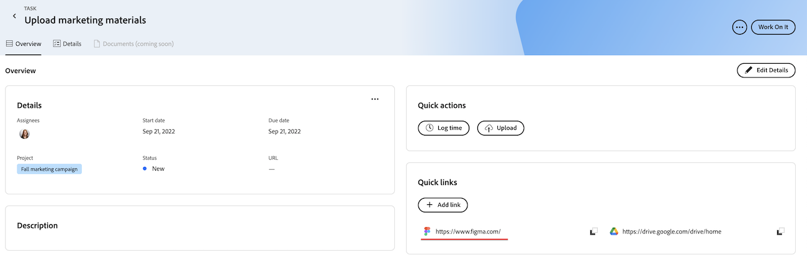

# 優先度でクイックリンクを追加および管理

タスクまたはイシューで頻繁に訪問するリンクを保存し、優先度の「概要」タブからアクセスできます。

優先度には、割り当てられた作業項目が表示されます。 チームに割り当てられた作業項目を表示できません。

## アクセス要件

+++ 展開すると、この記事の機能のアクセス要件が表示されます。

この記事の手順を実行するには、次のアクセス権が必要です。

<table style="table-layout:auto"> 
 <col> 
 </col> 
 <col> 
 </col> 
 <tbody> 
  <tr> 
   <td role="rowheader"><strong>Adobe Workfront プラン</strong></td> 
   <td> 
任意
 </td> 
  </tr> 
  <tr> 
   <td role="rowheader"><strong>Adobe Workfront プラン*</strong></td> 
   <td> 
   
現在：問題については要求以上、タスクについては作業以上

   
新規：コントリビューター以上またはイシュー、タスクはライト以上
 
   </td> 
  </tr> 
  <tr> 
   <td role="rowheader"><strong>アクセスレベル設定</strong></td> 
   <td> 
更新先のオブジェクトに対する表示または編集アクセス権
</td> 
  </tr> 
  <tr> 
   <td role="rowheader"><strong>オブジェクト権限</strong></td> 
   <td> 
オブジェクトに対する表示アクセス権
</td> 
  </tr> 
 </tbody> 
</table>

*詳しくは、[Workfront ドキュメントのアクセス要件](/help/quicksilver/administration-and-setup/add-users/access-levels-and-object-permissions/access-level-requirements-in-documentation.md)を参照してください。

+++

## 優先度にクイックリンクを追加

{{step1-to-priorities}}

1. 作業項目名をクリックして、概要ページを開きます。
1. [**クイック リンク**] セクションで、[**リンクの追加**] をクリックします。
1. URL を「**リンクを追加** ボックスに貼り付けます。
1. **保存**をクリックします。
   

## クリップボードへのクイックリンクのコピー

{{step1-to-priorities}}

1. 作業項目名をクリックして、概要ページを開きます。
1. [**クイック リンク**] セクションで、コピーするリンクを検索します。
1. コピーアイコン  をクリックします。
   

## クイックリンクを開く

{{step1-to-priorities}}

1. 作業項目名をクリックして、概要ページを開きます。
1. [**クイック リンク**] セクションで、開くリンクを探します。
1. リンクをクリックします。 リンクが新しいタブで開きます。
   

## クイックリンクの削除

{{step1-to-priorities}}

1. 作業項目名をクリックして、概要ページを開きます。
1. 画面の右上隅にある「**詳細を編集**」をクリックします。
   
1. 削除するリンクを見つけ、削除アイコン  をクリックします。
