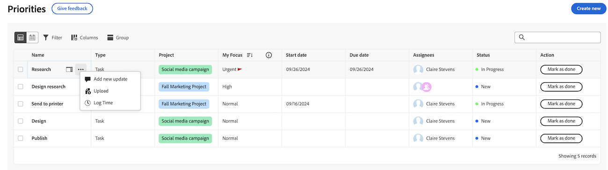

# 優先度のファイルのアップロード

優先度ワークリストまたは個々の作業項目からファイルをアップロードできます。 優先度からアップロードされたファイルは、作業項目の「ドキュメント」タブに表示されます。

優先度には、割り当てられた作業項目が表示されます。 チームに割り当てられた作業項目を表示できません。

## アクセス要件

+++ 展開すると、この記事の機能のアクセス要件が表示されます。

<table style="table-layout:auto"> 
 <col> 
 <col> 
 <tbody> 
  <tr> 
   <td role="rowheader">Adobe Workfront パッケージ</td> 
   <td> 
任意
 </td> 
  </tr> 
  <tr> 
   <td role="rowheader">Adobe Workfront ライセンス*</td> 
   <td> 
   
投稿者以上
 
   
リクエスト以上
 </td> 
  </tr> 
  <tr> 
   <td role="rowheader">アクセスレベル設定*</td> 
   <td> 
ドキュメントへのアクセスを編集
 
メモ：まだアクセス権がない場合は、アクセスレベルに追加の制限が設定されていないかどうか Workfront 管理者にお問い合わせください。Workfront 管理者がアクセスレベルを変更する方法について詳しくは、<a href="../../administration-and-setup/add-users/configure-and-grant-access/create-modify-access-levels.md" class="MCXref xref">カスタムアクセスレベルの作成または変更</a>を参照してください。
 </td> 
  </tr> 
 </tbody> 
</table>

詳しくは、[Workfront ドキュメントのアクセス要件](/help/quicksilver/administration-and-setup/add-users/access-levels-and-object-permissions/access-level-requirements-in-documentation.md)を参照してください。

+++

## 作業リストからのファイルのアップロード

{{step1-to-priorities}}

1. 名前の上にマウスポインターを置いて、**その他** アイコンをクリックします。
1. 「**アップロード**」をクリックします。
   
1. （オプション）「**ファイルをアップロード**」ボックスで、フォルダーを選択します。
1. ファイルをドラッグ&amp;ドロップするか、Cmd/Ctrl+V を押してクリップボードから貼り付け
または
**ファイルを追加** をクリックして、ファイルを参照するか、Document Cloud プロバイダーからファイルを読み込みます。
   
1. （任意）コメントを追加します。
1. （任意）ファイルをさらに追加します。

   >[!NOTE]
   >
   >追加のファイルは、別個のドキュメントとしてアップロードされます。
1. 「**アップロード**」をクリックします。

## 作業項目へのファイルのアップロード

{{step1-to-priorities}}

1. 作業項目名をクリックして、**概要** ページを開きます。
1. 「**クイックアクション**」セクションで「**アップロード**」をクリックし、「**ドキュメント**」を選択します。
1. （オプション）「**ファイルをアップロード**」ボックスで、フォルダーを選択します。
1. ファイルをドラッグ＆ドロップするか、Cmd/Ctrl+V を押してクリップボードから貼り付け

   または

   **ファイルを追加** をクリックして、ファイルを参照するか、Document Cloud プロバイダーからファイルを読み込みます。

   

1. （任意）コメントを追加します。
1. （任意）ファイルをさらに追加します。

   >[!NOTE]
   >
   >追加のファイルは、別個のドキュメントとしてアップロードされます。

1. 「**アップロード**」をクリックします。
