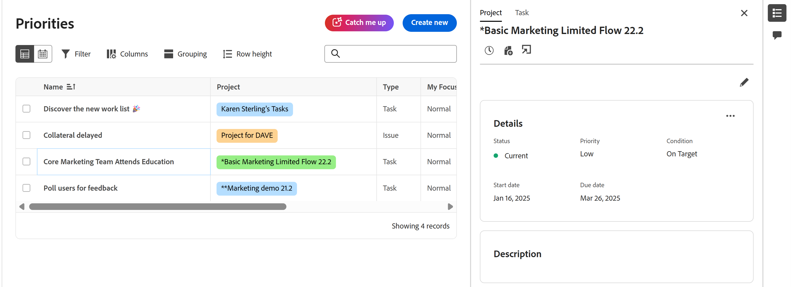
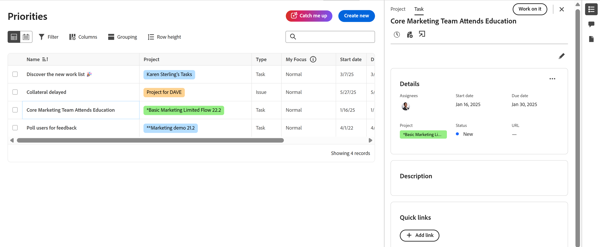
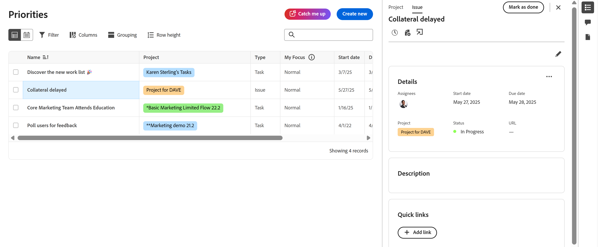

# 優先度でのプロジェクトと作業アイテムの詳細の表示

プロジェクト、タスク、イシューの詳細は、優先順位のワークリストで表示できます。

「優先度」には、割り当てられた作業項目が表示されます。 チームに割り当てられた作業項目を表示できません。

>[!IMPORTANT]
>
>プロジェクトを現在のステータスまたは現在のステータスと同じステータスに設定して、プロジェクトとその子タスクおよび問題を表示する必要があります。

## アクセス要件

+++ 展開すると、この記事の機能のアクセス要件が表示されます。

<table style="table-layout:auto"> 
 <col> 
 </col> 
 <col> 
 </col> 
 <tbody> 
  <tr> 
   <td role="rowheader"><strong>Adobe Workfront パッケージ</strong></td> 
   <td> 
任意
 </td> 
  </tr> 
  <tr> 
   <td role="rowheader"><strong>Adobe Workfront プラン</strong></td> 
   <td> 
   
レビュアー以上

   
明るいまたはそれ以上
 
   </td> 
  </tr> 
  <tr> 
   <td role="rowheader"><strong>アクセスレベル設定</strong></td> 
   <td> 
更新先のオブジェクトに対する表示または編集アクセス権
</td> 
  </tr> 
  <tr> 
   <td role="rowheader"><strong>オブジェクト権限</strong></td> 
   <td> 
オブジェクトに対する表示アクセス権
</td> 
  </tr> 
 </tbody> 
</table>

詳しくは、[Workfront ドキュメントのアクセス要件](/help/quicksilver/administration-and-setup/add-users/access-levels-and-object-permissions/access-level-requirements-in-documentation.md)を参照してください。

+++

## ワークリストサイドパネルでの詳細の表示

### プロジェクトの詳細を表示

{{step1-to-priorities}}

1. ワークリストで、作業項目名にカーソルを合わせ、**概要** アイコン をクリックします。
1. 概要パネルの上部にある「**プロジェクト**」をクリックします。 ここでは、次の操作を実行できます。
   * プロジェクトの詳細と説明を表示および編集する
   * プロジェクトに対するコメントの表示と追加
   * 時間を記録
   * ファイルを追加
   * プロジェクトに直接移動

   

### タスクの詳細の表示

{{step1-to-priorities}}

1. ワークリストで、作業名にカーソルを合わせ、**概要** アイコン をクリックします。
1. タスクはデフォルトで選択されています。 ここでは、次の操作を実行できます。
   * プロジェクトとタスクの詳細および説明の表示と編集
   * プロジェクトに対するコメントの表示と追加
   * ドキュメントの表示と追加
   * プルーフを作成
   * 時間を記録
   * ファイルを追加
   * クイックリンクを追加

   

### 問題の詳細の表示

{{step1-to-priorities}}

1. ワークリストで、作業名にカーソルを合わせ、**概要** アイコン をクリックします。

1. イシューはデフォルトで選択されています。 ここでは、次の操作を実行できます。
   * プロジェクトおよびイシューの詳細と説明を表示および編集する
   * プロジェクトに対するコメントの表示と追加
   * ドキュメントの表示と追加
   * プルーフを作成
      * 時間を記録
      * ファイルを追加
      * クイックリンクを追加

   

## 詳細ページで詳細を表示

タスクまたはイシューの詳細ページで、リアルタイムの更新を表示できます。 また、リアルタイムのプレゼンス指標を使用して、他のユーザーが同時にページを表示しているかどうかを確認することもできます。

### 作業項目の詳細の表示

{{step1-to-priorities}}

1. ワークリストで、作業項目名をクリックします。 「詳細」ページでは、次の操作を行うことができます。

* プロジェクトの詳細と説明を表示および編集する
* プロジェクトに対するコメントの表示と追加
* ドキュメントの表示と追加
* プルーフを作成
* 時間を記録
* ファイルを追加
* クイックリンクを追加

<!-- screenshot for prod-->
