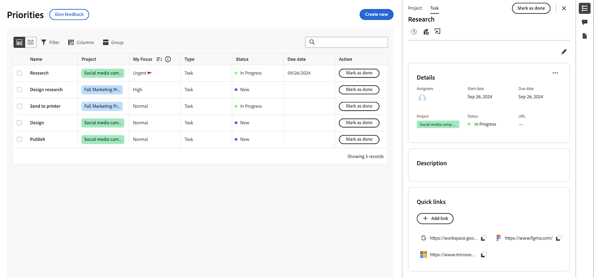

# 優先度ワークリストでのプロジェクトとタスクの詳細の表示

このページでハイライト表示されている情報は、まだ一般に利用できない機能を示します。プレビューサンドボックス環境でのみ使用できます。

プロジェクトとタスクの詳細は、優先度ワークリストに表示できます。

## アクセス要件

+++ 展開すると、この記事の機能のアクセス要件が表示されます。

この記事の手順を実行するには、次のアクセス権が必要です。

<table style="table-layout:auto"> 
 <col> 
 </col> 
 <col> 
 </col> 
 <tbody> 
  <tr> 
   <td role="rowheader"><strong>Adobe Workfront プラン</strong></td> 
   <td> 
任意
 </td> 
  </tr> 
  <tr> 
   <td role="rowheader"><strong>Adobe Workfront プラン*</strong></td> 
   <td> 
   
現在：レビュアーまたはそれ以上

   
新規：ライト以上
 
   </td> 
  </tr> 
  <tr> 
   <td role="rowheader"><strong>アクセスレベル設定</strong></td> 
   <td> 
更新先のオブジェクトに対する表示または編集アクセス権
</td> 
  </tr> 
  <tr> 
   <td role="rowheader"><strong>オブジェクト権限</strong></td> 
   <td> 
オブジェクトに対する表示アクセス権
</td> 
  </tr> 
 </tbody> 
</table>

*詳しくは、[Workfront ドキュメントのアクセス要件](/help/quicksilver/administration-and-setup/add-users/access-levels-and-object-permissions/access-level-requirements-in-documentation.md)を参照してください。

+++

## プロジェクトの詳細を表示

{{step1-to-priorities}}

1. 作業リストで、作業項目名にポインタを合わせ、**概要** アイコン  をクリックします。
1. 概要パネルの上部にある **プロジェクト** をクリックします。 ここで次のことができます
   * プロジェクトの詳細と説明の表示と編集
   * プロジェクトの表示とコメントの追加
   * 時間を記録
   * ファイルを追加
   *  プロジェクトに直接移動 

<!-- -->

## タスクの詳細の表示

{{step1-to-priorities}}

1. ワークリストで、作業名にポインタを合わせて、「概要 **アイコン** 「概要アイコンを開く  します。
1. デフォルトではタスクが選択されています。 ここで次のことができます
   * プロジェクトの詳細と説明の表示と編集
   * プロジェクトの表示とコメントの追加
   * ドキュメントの表示と追加
   * 時間を記録
   * ファイルを追加
   * クイックリンクの追加

   <!-- -->
