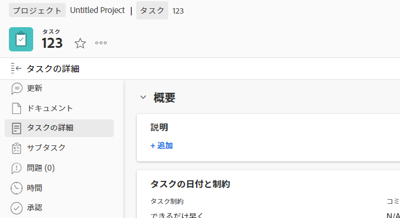
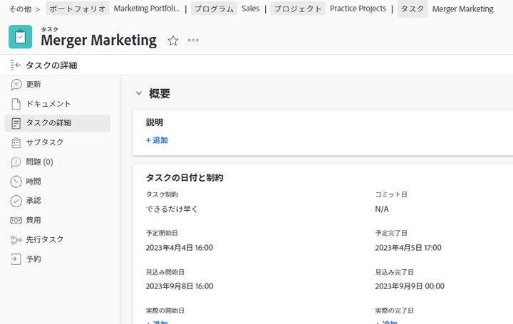
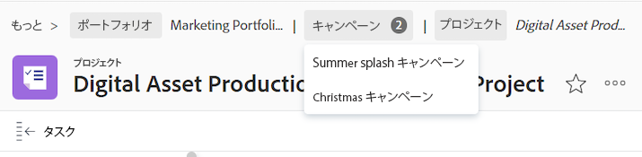

# パンくずリストの概要

パンくずリストには、すべてのオブジェクトタイプのナビゲーション階層がすべて表示されます。 パンくずパス内の各オブジェクトには、オブジェクトタイプを表示するラベルがあります。 現在表示しているページは、ページヘッダーとパンくずパスの最後の両方に斜体で表示されます。 以下の例では、これは「[!UICONTROL ブランドチームと共有]&quot;タスク。

パンくずパス内のオブジェクトが多すぎる場合や、画面の幅によってナビゲーション階層全体が表示されない場合、パスはパンくずリストの一部を折りたたみ、パンくずパスの先頭でこれらのオブジェクトをグループ化します。 プロジェクトと現在のオブジェクトページの両方が、パンくずパスに常に表示されます。

例えば、上の画像で「3 個以上」は、3 つのオブジェクトが表示されていないことを示しています。 これらの項目は、プロジェクトレベルの上、またはプロジェクトと現在のページの間に配置できます。

「[!UICONTROL 詳細]」をクリックすると、階層全体を展開できます。 「[!UICONTROL 低]」と入力します。

次のキーを使用してパンくずリストを移動することもできます。

<table style="table-layout:auto"> 
 <col> 
 <col> 
 <tbody> 
  <tr> 
   <td role="rowheader"><strong>タブ</strong> </td> 
   <td> 
パンくずリストの各項目に移動します
 </td> 
  </tr> 
  <tr> 
   <td role="rowheader"><strong>入力</strong> </td> 
   <td> 
折りたたまれたパンくずリストのパスを展開し、展開されたパンくずリストのパスを折りたたみ、オブジェクトリンク上で新しいページを開く
 </td> 
  </tr> 
 </tbody> 
</table>

+++アクセス要件

この記事の手順を実行するには、次のアクセス権が必要です。

<table style="table-layout:auto"> 
 <col> 
 </col> 
 <col> 
 </col> 
 <tbody> 
  <tr> 
   <td role="rowheader"><strong>[!DNL Adobe Workfront] 計画*</strong></td> 
   <td> 
任意
 </td> 
  </tr> 
  <tr> 
   <td role="rowheader"><strong>[!DNL Adobe Workfront] ライセンス*</strong></td> 
   <td> 
[!UICONTROL リクエスト ] 以降
 </td> 
  </tr> 
 </tbody> 
</table>

*お持ちのプランやライセンスの種類を確認するには、 [!DNL Workfront] 管理者。

+++

<!--drafted: this is no longer possible, since we removed Campaigns, but it might come back as part of Maestro: 

## Multi-object breadcrumbs

>[!NOTE]
>
>The information in this article is available only in the Preview environment when you participate in the [!UICONTROL Campaigns] beta program. The functionality described here might not be fully available yet. For more information about current available features and how to enroll, see [Campaigns beta].

Some objects can belong to multiple parent objects. For example, a project can belong to multiple campaigns. In this case, all the campaigns that the project belongs to display in the breadcrumb.

The multi-object listing in the breadcrumb (for example, the campaigns) displays the number of parent objects which expands into a list to display all the campaigns that the project is associated with. For more information, see [Add objects to a campaign](../../manage-work/campaigns/add-objects-to-a-campaign.md).

-->

## パンくずリストから親オブジェクトにアクセス

の親オブジェクトの詳細 [!DNL Workfront]を参照してください。 [でのオブジェクトについて [!DNL Adobe Workfront]](../../workfront-basics/navigate-workfront/workfront-navigation/understand-objects.md).

1. （条件付き）折りたたまれたパンくずリストのパスで移動先のオブジェクトが表示されない場合は、 **[!UICONTROL 詳細]**&#x200B;をクリックし、オブジェクトを探します。

   >[!NOTE]
   >
   >オブジェクトに対する権限がない場合、パンくずリストには表示されません。

1. パンくずパス内の任意のオブジェクトをクリックして、そのオブジェクトにアクセスします。

   オブジェクトページが開きます。
