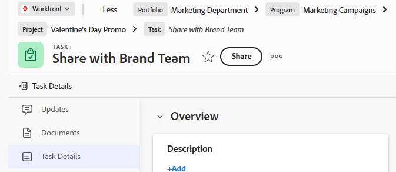
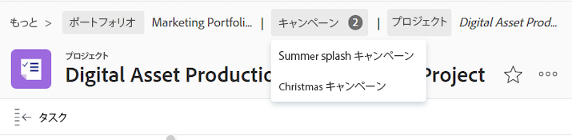

# パンくずリストの概要

パンくずリストには、すべてのオブジェクトタイプのナビゲーション階層がすべて表示されます。 パンくずリストパス内の各オブジェクトには、オブジェクトタイプを表示するラベルがあります。 現在表示しているページは、ページヘッダーとパンくずリストパスの最後の両方に斜体で表示されます。 以下の例では、これは「[!UICONTROL ブランドチームと共有]」タスクです。

パンくずリストパス内のオブジェクトが多すぎる場合や、画面の幅によってナビゲーション階層全体が表示されない場合、パスはパンくずリストの一部を折りたたみ、パンくずリストパスの先頭でこれらのオブジェクトをグループ化します。 プロジェクトと現在のオブジェクトページの両方が、パンくずリストパスに常に表示されます。

例えば、上の画像で「その他 3 個」は、3 つのオブジェクトが表示されていないことを示しています。 これらの項目は、プロジェクトレベルの上、またはプロジェクトと現在のページの間に配置できます。

「[!UICONTROL 詳細]」をクリックすると、階層全体を展開できます。 「[!UICONTROL 少なく表示]」をクリックし、パンくずリストパスを再び折りたたみます。

次のキーを使用してパンくずリストを移動することもできます。

<table style="table-layout:auto"> 
 <col> 
 <col> 
 <tbody> 
  <tr> 
   <td role="rowheader"><strong>Tab</strong> キー </td> 
   <td> 
パンくずリストの各項目に移動する
 </td> 
  </tr> 
  <tr> 
   <td role="rowheader"><strong>Enter</strong> キー </td> 
   <td> 
折りたたまれたパンくずリストパスを展開する、展開されたパンくずリストパスを折りたたむ、オブジェクトリンク上で新しいページを開く
 </td> 
  </tr> 
 </tbody> 
</table>

<!--
drafted: this is no longer possible, since we removed Campaigns, but it might come back as part of Maestro: 

## Multi-object breadcrumbs

>[!NOTE]
>
>The information in this article is available only in the Preview environment when you participate in the [!UICONTROL Campaigns] beta program. The functionality described here might not be fully available yet. For more information about current available features and how to enroll, see [Campaigns beta].

Some objects can belong to multiple parent objects. For example, a project can belong to multiple campaigns. In this case, all the campaigns that the project belongs to display in the breadcrumb.

The multi-object listing in the breadcrumb (for example, the campaigns) displays the number of parent objects which expands into a list to display all the campaigns that the project is associated with. For more information, see [Add objects to a campaign](../../manage-work/campaigns/add-objects-to-a-campaign.md).

-->

## パンくずリストからの親オブジェクトへのアクセス

[!DNL Workfront] での親オブジェクトの詳細については、[&#x200B; [!DNL Adobe Workfront]](../../workfront-basics/navigate-workfront/workfront-navigation/understand-objects.md)でのオブジェクトについて理解するを参照してください。

1. （条件付き）折りたたまれたパンくずリストのパスで移動したいオブジェクトが表示されない場合は、**[!UICONTROL 詳細]**&#x200B;をクリックし、オブジェクトを探します。

   >[!NOTE]
   >
   >オブジェクトに対する権限がない場合、パンくずリストには表示されません。

1. パンくずパス内の任意のオブジェクトをクリックして、そのオブジェクトにアクセスします。

   オブジェクトページが開きます。

   Workfront Planningのオブジェクト（キャンペーンなど）に接続されているプロジェクトを見ている場合は、パンくずリストからPlanningとWorkfrontの両方のオブジェクトタイプを切り替えることができます。 詳しくは、[階層とパンくずリストの概要](/help/quicksilver/planning/architecture/hierarchy-and-breadcrumb-overview.md)を参照してください。
