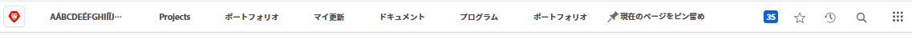
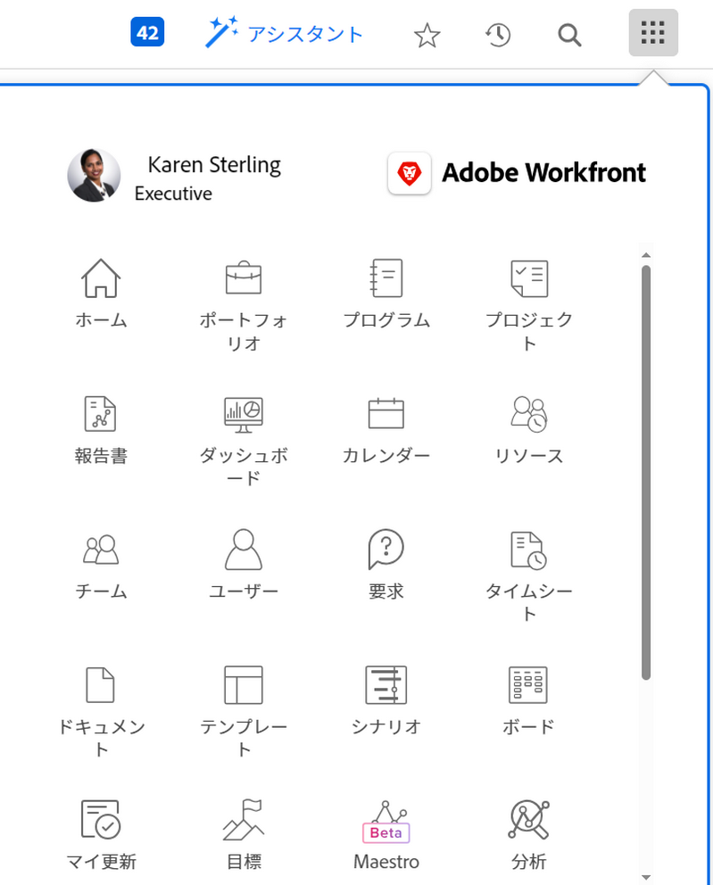

# 上部のナビゲーションバーの概要

<!--Audited: 01/2024-->

上部ナビゲーションバー — [!DNL Adobe Workfront] ：プラットフォームの他の領域を簡単に見つけて移動できます。

## [!UICONTROL ホーム]アイコン

The **[!UICONTROL ホーム]** アイコン  に移動します。 [!UICONTROL ホーム] ページ（デフォルトのランディングページ）。

デフォルトでは、ホームアイコンはホーム領域を開きます。 ホームについて詳しくは、 [以下を使用します。 [!UICONTROL ホーム] 領域](../../workfront-basics/using-home/using-the-home-area/use-the-home-area.md).

Workfront管理者は、レイアウトテンプレートを作成し、割り当てることで、ホームアイコンをカスタマイズして別のページを開くことができます。 詳しくは、 [レイアウトテンプレートを使用したランディングページのカスタマイズ](/help/quicksilver/administration-and-setup/customize-workfront/use-layout-templates/customize-landing-page.md).

## 固定されたページ

頻繁にアクセスするページを固定して、上部のナビゲーションバー内に表示されるようにすることができます。固定ページの詳細については、[ページを固定してワークスペースをカスタマイズ](../../workfront-basics/the-new-workfront-experience/pin-pages.md)を参照してください。

## [!UICONTROL ヘルプ]メニュー

**[!UICONTROL ヘルプ]**&#x200B;メニューを使用すると、特定のタスクに関するヘルプを検索したり、[!DNL Workfront] の使用に関する詳細情報を検索したり、現在表示しているページに関連するコンテンツを表示したり、エクスペリエンスに関するフィードバックを送信したりできます。

「ヘルプ」メニューの詳細については、](../../workfront-basics/navigate-workfront/workfront-navigation/access-workfront-help.md)ヘルプへの[アクセス [!DNL Adobe Workfront] を参照してください。

## [!UICONTROL 通知] メニュー

画面の右上隅にある青い数字のボックス  をクリックすると、通知のリストが開きます。

通知メニューから、次の項目にアクセスできます。

* **通知**：特定の条件が満たされた場合にWorkfrontによって生成されるアラートで、注意が必要な情報を通知します。

* **お知らせ**：重要なトピックに関してWorkfront管理者から送信されたお知らせ。

通知とお知らせについて詳しくは、 [アプリ内通知の表示と管理](../../workfront-basics/using-notifications/view-and-manage-in-app-notifications.md).

## [!UICONTROL お気に入り]メニュー

The **[!UICONTROL お気に入力]** アイコン  お気に入りとしてマークしたシステム内のページの一覧が開きます。 このメニュー内から、現在表示しているページを追加できます。

お気に入りの詳細については、[お気に入りの表示と管理](../../workfront-basics/navigate-workfront/recent-and-favorites/view-and-manage-favorites.md)を参照してください。

## [!UICONTROL 最近]メニュー

**[!UICONTROL 最近使用したもの]**&#x200B;アイコン ![[!UICONTROL 最近使用したもの]](assets/recents-icon-40x43.png) をクリックすると、最近アクセスしたページのリストが開きます。

最近のアイテムの詳細については、[最近のアイテムを表示](../../workfront-basics/navigate-workfront/recent-and-favorites/view-recent-items.md)を参照してください。

## [!UICONTROL 検索]メニュー

[!DNL Workfront] の右上隅にある&#x200B;**[!UICONTROL 検索]**&#x200B;アイコン  を使用すると、基本的な検索を実行したり、検索を特定のオブジェクトに制限したり、[!UICONTROL 高度な検索]を使用して特定のオブジェクトのキーワードを検索し、フィルターを使用して検索を特定のフィールドに制限します。

検索の詳細については、[検索 [!DNL Adobe Workfront]](../../workfront-basics/navigate-workfront/search/search-workfront.md)を参照してください。

## [!UICONTROL メインメニュー]

>[!IMPORTANT]
>
>このページで説明されているメイン メニューは、まだ [!DNL Adobe Experience Cloud] に登録されていない組織にのみ適用されます。
>
> 組織が [!DNL Adobe Experience Cloud] にオンボーディングされている場合は、 [!DNL Workfront]](/help/quicksilver/workfront-basics/navigate-workfront/workfront-navigation/adobe-unified-experience.md) の [[!DNL Adobe Unified Experience]  を参照してください。

The **[!UICONTROL メインメニュー]** アイコン  が開きます。 [!UICONTROL メインメニュー]Workfrontの別の領域に移動できる場所。

[!UICONTROL メインメニュー]で使用できるオプションは、以下に依存します。

* **レイアウト テンプレートの設定**：[!DNL Workfront]管理者がレイアウトテンプレートから[!UICONTROL メインメニュー]を変更する方法については、[レイアウトテンプレート](../../administration-and-setup/customize-workfront/use-layout-templates/customize-main-menu.md)を使用して、[!UICONTROL メインメニュー]をカスタマイズする方法を参照してください。

* **ライセンスタイプ**：様々なライセンスタイプのデフォルト設定については、[レビューライセンスユーザーのナビゲーションを理解する](../../workfront-basics/navigate-workfront/workfront-navigation/reviewer-global-navigation-bar.md)または[[!UICONTROL ワーク]ライセンスユーザー](../../workfront-basics/navigate-workfront/workfront-navigation/worker-global-navigation-bar.md)のナビゲーションを理解するを参照してください。

各アイコンを使用すると、Workfrontの異なる領域に移動します。

各領域の詳細については、次を参照してください。

<!--

(NOTE: Update screenshot and add icons for new products/features.)

-->

<table style="table-layout:auto"> 
 <col> 
 <col> 
 <tbody> 
  <tr> 
   <td> 
    <ul> 
     <li>[!UICONTROL Home]：<a href="../../workfront-basics/using-home/using-the-home-area/use-the-home-area.md" class="MCXref xref">[!UICONTROL Home] エリアを使用</a></li> 
     <li>[!UICONTROL Portfolios]：<a href="../../manage-work/portfolios/portfolio-management-overview.md" class="MCXref xref">ポートフォリオ管理</a></li> 
     <li>[!UICONTROL Programs]：<a href="../../manage-work/portfolios/create-and-manage-programs/create-and-manage-programs.md" class="MCXref xref">プログラムの作成と管理</a></li> 
     <li>[!UICONTROL プロジェクト ]: <a href="../../manage-work/projects/projects-overview.md" class="MCXref xref">プロジェクト：記事インデックス</a></li> 
     <li>[!UICONTROL Reports]：<a href="../../reports-and-dashboards/reports/reports-overview.md" class="MCXref xref">レポート</a></li> 
     <li>[!UICONTROL Dashboards]：<a href="../../reports-and-dashboards/dashboards/dashboards-overview.md" class="MCXref xref">ダッシュボード</a></li> 
     <li>[!UICONTROL カレンダー ]: <a href="../../reports-and-dashboards/reports/calendars/calendars.md" class="MCXref xref">カレンダー：記事のインデックス</a></li> 
     <li>[!UICONTROL Resourcing]：<a href="../../resource-mgmt/resource-mgmt-overview/resource-management-overview.md" class="MCXref xref">リソース管理</a></li> 
     <li>[!UICONTROL Teams]：<a href="../../people-teams-and-groups/create-and-manage-teams/create-and-mange-teams.md" class="MCXref xref">チームの作成と管理</a></li> 
     <li>[!UICONTROL Users]：<a href="../../administration-and-setup/add-users/create-and-manage-users/create-and-manage-users.md" class="MCXref xref">ユーザーの作成と管理</a></li> 
    </ul> </td> 
   <td> 
    <ul> 
     <li>[!UICONTROL Requests]：<a href="../../manage-work/requests/create-requests/create-requests.md" class="MCXref xref">リクエストの作成</a></li> 
     <li>[!UICONTROL タイムシート ]: <a href="../../timesheets/timesheets-all.md" class="MCXref xref">タイムシート：記事インデックス</a></li> 
     <li>[!UICONTROL Documents]：<a href="../../documents/documents-overview.md" class="MCXref xref">ドキュメント</a></li> 
     <li>[!UICONTROL テンプレート ]: <a href="../../manage-work/projects/create-and-manage-templates/create-manage-templates.md" class="MCXref xref">プロジェクトテンプレートの作成と管理：記事インデックス</a></li> 
     <li>[!UICONTROL Analytics]：<a href="../../enhanced-analytics/enhanced-analytics-overview.md" class="MCXref xref">拡張分析の概要</a></li> 
     <li>[!UICONTROL Goals]：<a href="../../workfront-goals/goal-management/wf-goals-overview.md" class="MCXref xref">[!DNL Adobe Workfront Goals] 概要</a></li> 
     <li>[!UICONTROL Scenarios]：<a href="../../scenario-planner/scenario-planner-overview.md" class="MCXref xref">シナリオプランナーの概要</a></li> 
     <li>[!UICONTROL 校正 ]: <a href="../../workfront-proof/workfront-proof.md" class="MCXref xref">[!DNL Workfront] 配達確認：記事インデックス</a></li> 
    </ul> </td> 
  </tr> 
 </tbody> 
</table>

メインメニューの下部では、次の項目にアクセスできます。

<table style="table-layout:auto"> 
 <col> 
 <col> 
 <tbody> 
  <tr> 
   <td> 
[!UICONTROL Setup]
 </td> 
   <td> 
<b>[!UICONTROL Setup]</b>をクリックすると、[!UICONTROL Setup]エリアに移動し、[!DNL Workfront] アカウントの別の側面を設定できます。アクセス設定によっては、設定できる内容が制限される場合があります。
 
[!UICONTROL 設定 ] 領域について詳しくは、 <a href="../../administration-and-setup/administration-and-setup.md" class="MCXref xref">管理と設定：記事のインデックス</a>.
 </td> 
  </tr> 
  <tr> 
   <td> 
[!UICONTROL Help]
 </td> 
   <td> 
「<b>[!UICONTROL Help]</b>」をクリックすると、[!DNL Adobe Experience League] に移動し、ヘルプ記事にアクセスしたり、トレーニングを検索したり、カスタマーサポートチケットを送信したりできます。
 
[!DNL Experience League] またはヘルプを表示するその他の方法については、<a href="../../workfront-basics/tips-tricks-and-troubleshooting/guide-for-help-in-workfront.md" class="MCXref xref">Adobe Workfront でヘルプを探すためのクイックガイド</a>を参照してください。
 </td> 
  </tr>

<tr> 
   <td> 
[!UICONTROL Logout]
 </td> 
   <td><b>[!UICONTROL Logout]</b>をクリックすると、[!DNL Workfront] からログアウトします。</td> 
  </tr> 
 </tbody> 
</table>
