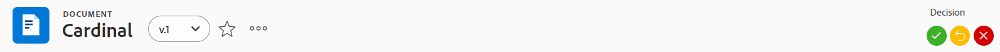
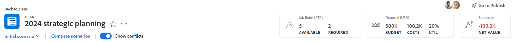

# オブジェクトヘッダーの概要

のオブジェクトに関する情報を一目で確認できます。 [!DNL Adobe Workfront] ヘッダーを確認する際に使用します。

ヘッダーには、オブジェクトの名前に加えて、オブジェクトの所有者、ステータスまたは完了率を含めることができます。

[!DNL Workfront] は、オブジェクトの名前を優先し、可能な限りヘッダー内に領域を割り当てます。 オブジェクト名が長すぎる場合は切り捨てられます。 オブジェクトのフルネームを表示するには、その上にマウスポインターを置きます。

## オブジェクトのヘッダーにアクセスする

内のオブジェクトのヘッダーへのアクセス [!DNL Workfront] は、そのオブジェクトを持つすべてのオブジェクトで同一です。

例えば、プロジェクトのヘッダーにアクセスするには、次のようにします。

1. プロジェクトに移動します。\
   ページの上部にヘッダーが表示され、プロジェクトの名前が含まれます。

   

## [!UICONTROL ホーム] ヘッダーの概要

ホームでは、次のヘッダーを使用できます。

* タスク：このヘッダーの使用方法について詳しくは、 [タスクヘッダーの概要](#task-header-overview) 」を参照してください。
* 問題：このヘッダーの使用方法について詳しくは、 [問題ヘッダーの概要](#issue-header-overview) 」を参照してください。

## カスタマイズ可能なヘッダー

お使いの [!DNL Workfront]  または、グループ管理者は、レイアウトテンプレートを使用して、プロジェクト、タスクおよびイシューのヘッダーをカスタマイズできます。

この記事では、プロジェクトとタスクおよび問題を含む、すべてのオブジェクトの既定のヘッダーについて説明します。

オブジェクトのヘッダーに関する情報のカスタマイズについて詳しくは、 [レイアウトテンプレートを使用したオブジェクトヘッダーのカスタマイズ](../../administration-and-setup/customize-workfront/use-layout-templates/customize-object-headers.md).

## プロジェクトヘッダーの概要

プロジェクトヘッダーには、デフォルトで次の情報が表示されます。

<table style="table-layout:auto"> 
 <col> 
 <col> 
 <thead> 
  <tr> 
   <th>ヘッダー情報</th> 
   <th>メモ</th> 
  </tr> 
 </thead> 
 <tbody> 
  <tr> 
   <td role="rowheader">親オブジェクトを含むパンくずリスト</td> 
   <td>プロジェクトがプログラムまたはポートフォリオに関連付けられている場合は、ヘッダーの左上隅のパンくずリストに表示されます。 親の名前をクリックすると、その親オブジェクトが開きます。</td> 
  </tr> 
  <tr data-mc-conditions=""> 
   <td role="rowheader">オブジェクトアイコン </td> 
   <td> 
紫色の [!UICONTROL Project] アイコン  プロジェクト名の左側に表示されます。
 </td> 
  </tr> 
  <tr> 
   <td role="rowheader">プロジェクトの名前</td> 
   <td>ヘッダーでプロジェクト名を編集できます。</td> 
  </tr> 
  <tr> 
   <td role="rowheader">オブジェクトタイプの名前</td> 
   <td> 
「[!UICONTROL PROJECT]」というテキストが、ヘッダー内のプロジェクト名の上に表示されます。
 </td> 
  </tr> 
  <tr> 
   <td role="rowheader">タスクの「アクション」領域</td> 
   <td> 
プロジェクト名の横に、「アクション」領域が表示されます。
 
  
  </td> 
  </tr> 
  <tr> 
   <td role="rowheader">[!UICONTROL 完了率 ]</td> 
   <td>ヘッダーのプロジェクト完了率を編集することはできません。</td> 
  </tr> 
  <tr> 
   <td role="rowheader">[!UICONTROL プロジェクト所有者 ]</td> 
   <td> 
[!UICONTROL プロジェクト所有者 ] は、ヘッダーで編集できます。
 </td> 
  </tr> 
  <tr> 
   <td role="rowheader">[!UICONTROL 計画完了日 ] </td> 
   <td> 
プロジェクトが [!UICONTROL 完了日 ] からスケジュールされている場合は、ヘッダーのプロジェクト [!UICONTROL 完了予定日 ] と時間を編集できます。 プロジェクトが [!UICONTROL 開始日 ] からスケジュールされている場合、この情報はプロジェクトのタスクから更新されます。
 </td> 
  </tr> 
  <tr> 
   <td role="rowheader">[!UICONTROL 条件 ] </td> 
   <td> 
プロジェクトの [!UICONTROL 条件タイプ ] を手動に設定すると、ヘッダーのプロジェクト [!UICONTROL 条件 ] を更新できます。
</td> 
  </tr> 
  <tr> 
   <td role="rowheader">[!UICONTROL ステータス ]</td> 
   <td>ヘッダーのプロジェクト [!UICONTROL Status] を編集できます。</td> 
  </tr> 
  <tr> 
   <td role="rowheader">[!UICONTROL 承認 ] 領域</td> 
   <td> 
承認者の 1 人である場合は、次のアイコンを使用して、プロジェクトの承認を管理します。
 
  </img> [!UICONTROL 承認 ]
 
  </img> [!UICONTROL 却下 ]
 
  </img> [!UICONTROL 再現率 ]
 
承認者でない場合は、[!UICONTROL 詳細 ] アイコンをクリックします。  をクリックして、現在の承認ステップに関する情報を表示します。
 
承認について詳しくは、 <a href="../../review-and-approve-work/manage-approvals/approval-process-in-workfront.md" class="MCXref xref">承認プロセスの概要</a>.
 </td> 
  </tr> 
 </tbody> 
</table>

## タスクヘッダーの概要

タスクヘッダーには、デフォルトで次の情報が含まれています。

<table style="table-layout:auto"> 
 <col> 
 <col> 
 <thead> 
  <tr> 
   <th>ヘッダー情報</th> 
   <th>メモ</th> 
  </tr> 
 </thead> 
 <tbody> 
  <tr> 
   <td role="rowheader">親オブジェクトを含むパンくずリスト</td> 
   <td> 
タスクの親オブジェクトがパンくずリストに表示されます。 親の名前をクリックすると、その親オブジェクトが開きます。
 
詳しくは、 <a href="../../workfront-basics/the-new-workfront-experience/breadcrumb-overview.md" class="MCXref xref">パンくずリストの概要</a>.
 </td> 
  </tr> 
  <tr data-mc-conditions=""> 
   <td role="rowheader">オブジェクトアイコン </td> 
   <td> 
緑の [!UICONTROL タスク ] アイコン  タスク名の左側に表示されます。
 </td> 
  </tr> 
  <tr> 
   <td role="rowheader">タスクの名前</td> 
   <td>ヘッダーのタスク名を編集できます。</td> 
  </tr> 
  <tr> 
   <td role="rowheader">オブジェクトタイプの名前</td> 
   <td> 
ヘッダー内のタスク名の上に「[!UICONTROL TASK]」というテキストが表示されます。
 </td> 
  </tr> 
  <tr> 
   <td role="rowheader">タスクの「アクション」領域</td> 
   <td> 
タスク名の横に、[!UICONTROL actions] 領域が表示されます。
 
  
 
[ 依存関係 ] アイコンが表示されている場合は、アイコンをクリックして、タスクの先行タスクまたは後続タスクを表示できます。
 </td> 
  </tr> 
  <tr> 
   <td role="rowheader">[!UICONTROL 完了率 ]</td> 
   <td>ヘッダーでタスクの完了率を編集できます。</td> 
  </tr> 
  <tr> 
   <td role="rowheader">[!UICONTROL 割り当て ]</td> 
   <td>タスクの割り当て先は、ヘッダーから編集できます。</td> 
  </tr> 
  <tr> 
   <td role="rowheader"> 
[!UICONTROL 作業 ] ボタン、[!UICONTROL 完了 ] ボタン、または [!UICONTROL タスクを開始 ] ボタン
 </td> 
   <td> 
タスクが割り当てられている場合は、[!UICONTROL 作業項目 ] または [!UICONTROL タスクを開始 ] ボタンをクリックして現在タスクの操作中であることを示します。または、[!UICONTROL 完了 ] ボタンをクリックして、タスクの完了を示します。
 
[!UICONTROL WORK ON IT] ボタンを [!UICONTROL Start Task] ボタンに置き換える方法については、 <a href="../../people-teams-and-groups/create-and-manage-teams/work-on-it-button-to-start-button.md" class="MCXref xref">[!UICONTROL Work On It] ボタンを [!UICONTROL Start] ボタンに置き換えます</a>.
 </td> 
  </tr> 
  <tr> 
   <td role="rowheader">[!UICONTROL 計画完了日 ]</td> 
   <td> 
タスク「[!UICONTROL 計画完了日 ]」を編集できます および時刻 」と入力します。
 
ヒント： [!UICONTROL コミット日 ] はヘッダーに表示されません。 このレポートは、 [!UICONTROL 詳細 ] ページで表示できます。
 </td> 
  </tr> 
  <tr> 
   <td role="rowheader">[!UICONTROL ステータス ]</td> 
   <td>ヘッダーのタスク [!UICONTROL Status] を編集できます。</td> 
  </tr> 
  <tr> 
   <td role="rowheader">[!UICONTROL 承認 ] 領域</td> 
   <td> 
承認者の 1 人である場合は、次のアイコンを使用してタスクの承認を管理します。
 
  </img> [!UICONTROL 承認 ]
 
  </img> [!UICONTROL 却下 ]
 
  </img> [!UICONTROL 再現率 ]
 
承認者でない場合は、[!UICONTROL 詳細 ] アイコンをクリックします。  をクリックして、現在の承認ステップに関する情報を表示します。
 
承認について詳しくは、 <a href="../../review-and-approve-work/manage-approvals/approval-process-in-workfront.md" class="MCXref xref">承認プロセスの概要</a>.
 </td> 
  </tr> 
 </tbody> 
</table>

## 問題ヘッダーの概要

問題ヘッダーには、デフォルトで次の情報が含まれています。

<table style="table-layout:auto"> 
 <col> 
 <col> 
 <thead> 
  <tr> 
   <th>ヘッダー情報</th> 
   <th>メモ</th> 
  </tr> 
 </thead> 
 <tbody> 
  <tr> 
   <td role="rowheader">親オブジェクトを含むパンくずリスト</td> 
   <td> 
問題の親オブジェクトがパンくずリストに表示されます。 親の名前をクリックすると、その親オブジェクトが開きます。
 
詳しくは、 <a href="../../workfront-basics/the-new-workfront-experience/breadcrumb-overview.md" class="MCXref xref">パンくずリストの概要</a>.
 </td> 
  </tr> 
  <tr> 
   <td role="rowheader">オブジェクトアイコン </td> 
   <td> 
ピンク色の [!UICONTROL Issue] アイコン  問題名の左側にが表示されます。
 </td> 
  </tr> 
  <tr> 
   <td role="rowheader">問題の名前</td> 
   <td>ヘッダーの問題名を編集できます。</td> 
  </tr> 
  <tr> 
   <td role="rowheader">オブジェクトタイプの名前</td> 
   <td> 
ヘッダー内の問題名の上に「[!UICONTROL ISSUE]」というテキストが表示されます。
 </td> 
  </tr> 
  <tr> 
   <td role="rowheader">問題の「アクション」領域</td> 
   <td> 
問題の名前の横に、[!UICONTROL actions] 領域が表示されます。
 
  
 
[!UICONTROL 依存関係 ] アイコンが表示された場合は、アイコンをクリックして、問題の先行タスクまたは後続タスクを表示できます。
  </td> 
  </tr> 
  <tr> 
   <td role="rowheader">[!UICONTROL 完了率 ]</td> 
   <td> 
ヘッダーから、問題の完了率を編集できます。
 </td> 
  </tr> 
  <tr> 
   <td role="rowheader">[!UICONTROL 割り当て ]</td> 
   <td>イシューの割り当て先は、ヘッダーで編集できます。</td> 
  </tr> 
  <tr> 
   <td role="rowheader">[!UICONTROL 作業 ]、[!UICONTROL 完了 ]、 または [!UICONTROL 問題の開始 ] ボタン</td> 
   <td>問題が割り当てられている場合は、[!UICONTROL 作業 ] または [!UICONTROL Start Issue] ボタンをクリックして現在問題の処理中であることを示します。または、[!UICONTROL 完了 ] ボタンをクリックして問題の完了を示します。[!UICONTROL WORK ON IT] ボタンを [!UICONTROL Start Task] ボタンに置き換える方法については、 <a href="../../people-teams-and-groups/create-and-manage-teams/work-on-it-button-to-start-button.md" class="MCXref xref">[!UICONTROL Work On It] ボタンを [!UICONTROL Start] ボタンに置き換えます</a>.</td> 
  </tr> 
  <tr> 
   <td role="rowheader">[!UICONTROL 計画完了日 ]</td> 
   <td> 
問題「[!UICONTROL 計画完了日 ]」を編集できます および時刻 」と入力します。
 
ヒント： [!UICONTROL コミット日 ] はヘッダーに表示されません。 このレポートは、 [!UICONTROL 詳細 ] ページで表示できます。
 </td> 
  </tr> 
  <tr> 
   <td role="rowheader">[!UICONTROL ステータス ]</td> 
   <td>[!UICONTROL Status] の問題はヘッダーで編集できます。</td> 
  </tr> 
  <tr> 
   <td role="rowheader">[!UICONTROL 承認 ] 領域</td> 
   <td> 
承認者の 1 人である場合は、次のアイコンを使用して、問題の承認を管理します。
 
  [!UICONTROL 承認 ]
 
  [!UICONTROL 却下 ]
 
  [!UICONTROL 再現率 ]
 
承認者でない場合は、[!UICONTROL 詳細 ] アイコンをクリックします。  をクリックして、現在の承認ステップに関する情報を表示します。
 
承認について詳しくは、 <a href="../../review-and-approve-work/manage-approvals/approval-process-in-workfront.md" class="MCXref xref">承認プロセスの概要</a>.
 </td> 
  </tr> 
 </tbody> 
</table>

## プログラムヘッダーの概要

プログラムヘッダーには、次の情報が表示されます。

<table style="table-layout:auto"> 
 <col> 
 <col> 
 <thead> 
  <tr> 
   <th>ヘッダー情報</th> 
   <th>メモ</th> 
  </tr> 
 </thead> 
 <tbody> 
  <tr> 
   <td role="rowheader">Portfolio名を含むパンくず</td> 
   <td> 
[!UICONTROLPortfolio] には、[!UICONTROL プログラム ] のヘッダーからアクセスできます。 親の名前をクリックすると、その親オブジェクトが開きます。
 
詳しくは、 <a href="../../workfront-basics/the-new-workfront-experience/breadcrumb-overview.md" class="MCXref xref">パンくずリストの概要</a>.
 </td> 
  </tr> 
  <tr> 
   <td role="rowheader">オブジェクトアイコン </td> 
   <td> 
オレンジ色の [!UICONTROL Program] アイコン  は、プログラム名の左側に表示されます。
 </td> 
  </tr> 
  <tr> 
   <td role="rowheader">プログラムの名前</td> 
   <td>ヘッダーでプログラム名を編集できます。</td> 
  </tr> 
  <tr> 
   <td role="rowheader">オブジェクトタイプの名前</td> 
   <td> 
プログラムが [!UICONTROL アクティブ ] とマークされている場合は、ヘッダーのプログラム名の上に「[!UICONTROL PROGRAM]」というテキストが表示されます。
 </td> 
  </tr> 
  <tr> 
   <td role="rowheader">アクティベーションステータス</td> 
   <td> 
プログラムが非アクティブ化されている場合、ヘッダー内のプログラム名の上に「[!UICONTROL PROGRAM DEACTIVATED]」というテキストが表示されます。
 </td> 
  </tr> 
  <tr> 
   <td role="rowheader">プログラムの「アクション」領域</td> 
   <td> 
プログラム名の横に、[!UICONTROL actions] 領域が表示されます。
 
  
 </td> 
  </tr> 
  <tr> 
   <td role="rowheader">[!UICONTROL 完了率 ]</td> 
   <td> 
ヘッダーのプログラムの [!UICONTROL 完了率 ] を編集することはできません。 この情報は、プログラムのプロジェクトから更新されます。
 
ヒント：デフォルトでは、プログラムの完了率は、そのプログラムに属する [!UICONTROL 現在 ] または [!UICONTROL 承認済みステータス ] 内のプロジェクトの完了率の値の平均です。
 </td> 
  </tr> 
  <tr> 
   <td role="rowheader">[!UICONTROL プログラムマネージャー ]</td> 
   <td> 
[!UICONTROL Program Manager] は、ヘッダーで編集できます。 これは、[!UICONTROL プログラム所有者 ] と同じです。
 </td> 
  </tr> 
  <tr> 
   <td role="rowheader">[!UICONTROL 計画完了日 ]</td> 
   <td>ヘッダーのプログラム [!UICONTROL 計画完了日 ] は編集できません。 この情報は、プログラム内のプロジェクトの [!UICONTROL 計画完了日 ] から更新されます。</td> 
  </tr> 
  <tr> 
   <td role="rowheader">[!UICONTROL アクティブプロジェクト条件 ]</td> 
   <td>これは、[!UICONTROL Condition] が [!UICONTROL On Target]、[!UICONTROL At Risk]、[!UICONTROL In Trable] のいずれかに設定されている、プログラム内のアクティブなプロジェクトの割合を計算したものです。</td> 
  </tr> 
 </tbody> 
</table>

## Portfolioヘッダーの概要 {#portfolio-header-overview}

ポートフォリオヘッダーには、次の情報が含まれます。

<table style="table-layout:auto"> 
 <col> 
 <col> 
 <thead> 
  <tr> 
   <th>ヘッダー情報</th> 
   <th>メモ</th> 
  </tr> 
 </thead> 
 <tbody> 
  <tr> 
   <td role="rowheader">オブジェクトアイコン </td> 
   <td> 
青い [!UICONTROLPortfolio] アイコン ポートフォリオ名の左側に表示されます。
 </td> 
  </tr> 
  <tr> 
   <td role="rowheader">ポートフォリオの名前</td> 
   <td>ヘッダーでポートフォリオ名を編集できます。</td> 
  </tr> 
  <tr> 
   <td role="rowheader">オブジェクトタイプの名前</td> 
   <td> 
ポートフォリオがアクティブとマークされている場合、ヘッダー内のポートフォリオ名の上に「[!UICONTROLPORTFOLIO]」というテキストが表示されます。
 </td> 
  </tr> 
  <tr> 
   <td role="rowheader">アクティベーションステータス</td> 
   <td> 
ポートフォリオが非アクティブ化されている場合、ヘッダー内のポートフォリオ名の上に「[!UICONTROLPORTFOLIO非アクティブ化済み ]」というテキストが表示されます。
 </td> 
  </tr> 
  <tr> 
   <td role="rowheader">ポートフォリオの [!UICONTROL アクション ] 領域</td> 
   <td> 
ポートフォリオ名の横に、[!UICONTROL actions] 領域が表示されます。
 
  
</td> 
  </tr> 
  <tr> 
   <td role="rowheader">[!UICONTROLPortfolioマネージャー ]</td> 
   <td>[!UICONTROLPortfolioマネージャー ] は、ヘッダーで編集できます。 これは、[!UICONTROLPortfolio所有者 ] と同じです。</td> 
  </tr> 
  <tr> 
   <td role="rowheader">[!UICONTROL オンタイム ]</td> 
   <td>これは、ポートフォリオ内の現在のプロジェクトの時間に対する割合の計算です。</td> 
  </tr> 
  <tr> 
   <td role="rowheader">[!UICONTROL 予算 ]</td> 
   <td>これは、ポートフォリオ内の現在予算中のプロジェクトの割合の計算です。</td> 
  </tr> 
  <tr> 
   <td role="rowheader">[!UICONTROL 整列 ]</td> 
   <td>これは、ポートフォリオ内のプロジェクトのどの割合がポートフォリオと一致しているかを計算したものです。</td> 
  </tr> 
  <tr> 
   <td role="rowheader">[!UICONTROL ROI]</td> 
   <td>これは、ポートフォリオ内のすべてのプロジェクトの [!UICONTROL 投資利益率 ] の計算です。</td> 
  </tr> 
  <tr> 
   <td role="rowheader">[!UICONTROL 正味値 ]</td> 
   <td>これは、ポートフォリオ内のすべてのプロジェクトの [!UICONTROL 正味値 ] の計算です。</td> 
  </tr> 
 </tbody> 
</table>

## テンプレートヘッダーの概要 {#template-header-overview}

テンプレートヘッダーには、次の情報が表示されます。

<table style="table-layout:auto"> 
 <col> 
 <col> 
 <thead> 
  <tr> 
   <th>ヘッダー情報</th> 
   <th>メモ</th> 
  </tr> 
 </thead> 
 <tbody> 
  <tr> 
   <td role="rowheader">オブジェクトアイコン </td> 
   <td> 
緑の [!UICONTROL テンプレート ] アイコン テンプレート名の左側に表示されます。
 </td> 
  </tr> 
  <tr> 
   <td role="rowheader">テンプレートの名前</td> 
   <td>ヘッダーでテンプレート名を編集できます。</td> 
  </tr> 
  <tr> 
   <td role="rowheader">オブジェクトタイプの名前</td> 
   <td> 
テンプレートがアクティブとマークされている場合、ヘッダーのテンプレート名の上に「[!UICONTROL TEMPLATE]」というテキストが表示されます。
 </td> 
  </tr> 
  <tr> 
   <td role="rowheader">アクティベーションステータス</td> 
   <td> 
テンプレートが非アクティブ化されている場合、ヘッダー内のテンプレート名の上に「[!UICONTROL TEMPLATE DEACTIVATED]」というテキストが表示されます。
 </td> 
  </tr> 
  <tr> 
   <td role="rowheader">テンプレートの「アクション」領域</td> 
   <td> 
テンプレート名の横に、「アクション」領域が表示されます。
 
  
 </td> 
  </tr> 
  <tr> 
   <td role="rowheader">[!UICONTROL テンプレート所有者 ]</td> 
   <td>[!UICONTROL テンプレート所有者 ] フィールドは、ヘッダーで編集できます。</td> 
  </tr> 
  <tr> 
   <td role="rowheader">[!UICONTROL 期間 ]</td> 
   <td>テンプレートの期間。 ヘッダーでこのフィールドを編集することはできません。</td> 
  </tr> 
 </tbody> 
</table>

## テンプレートタスクヘッダーの概要

テンプレートタスクヘッダーには、次の情報が表示されます。

<table style="table-layout:auto"> 
 <col> 
 <col> 
 <thead> 
  <tr> 
   <th>ヘッダー情報</th> 
   <th>メモ</th> 
  </tr> 
 </thead> 
 <tbody> 
  <tr> 
   <td role="rowheader">親オブジェクトに対するパンくずリスト</td> 
   <td> 
テンプレートタスクの親オブジェクトがパンくずリストに表示されます。 親オブジェクトの名前をクリックすると、その親オブジェクトが開きます。
 
詳しくは、 <a href="../../workfront-basics/the-new-workfront-experience/breadcrumb-overview.md" class="MCXref xref">パンくずリストの概要</a>.
 </td> 
  </tr> 
  <tr> 
   <td role="rowheader">オブジェクトアイコン </td> 
   <td> 
緑の [!UICONTROL タスク ] アイコン テンプレートタスク名の左側に表示されます。
 </td> 
  </tr> 
  <tr> 
   <td role="rowheader">テンプレートタスクの名前</td> 
   <td>ヘッダーのテンプレートタスク名を編集できます。</td> 
  </tr> 
  <tr> 
   <td role="rowheader">オブジェクトタイプの名前</td> 
   <td> 
「[!UICONTROL TEMPLATE TASK]」というテキストが、ヘッダー内のテンプレートタスク名の上に表示されます。
 </td> 
  </tr> 
  <tr> 
   <td role="rowheader">テンプレートタスクの「アクション」領域</td> 
   <td> 
テンプレートタスクの名前の横に、「アクション」領域が表示されます。
 
  
 </td> 
  </tr> 
  <tr> 
   <td role="rowheader">[!UICONTROL 割り当て ]</td> 
   <td>ヘッダーでテンプレートタスクの [!UICONTROL 割り当て ] を編集できます。</td> 
  </tr> 
  <tr> 
   <td role="rowheader">[!UICONTROL 完了日 ]</td> 
   <td>テンプレートタスクが完了する必要があるテンプレート期間の日です。</td> 
  </tr> 
 </tbody> 
</table>

## 請求レコードヘッダーの概要

請求レコードのヘッダーには、次の情報が表示されます。

<table style="table-layout:auto"> 
 <col> 
 <col> 
 <thead> 
  <tr> 
   <th>ヘッダー情報</th> 
   <th>メモ</th> 
  </tr> 
 </thead> 
 <tbody> 
  <tr> 
   <td role="rowheader">親オブジェクトに対するパンくずリスト</td> 
   <td> 
請求レコードの親オブジェクトがパンくずリストに表示されます。 親オブジェクトの名前をクリックすると、その親オブジェクトが開きます。
 
詳しくは、 <a href="../../workfront-basics/the-new-workfront-experience/breadcrumb-overview.md" class="MCXref xref">パンくずリストの概要</a>.
 </td> 
  </tr> 
  <tr> 
   <td role="rowheader">オブジェクトアイコン </td> 
   <td> 
青い [!UICONTROL Billing Record] アイコン  請求レコード名の左側に表示されます。
 </td> 
  </tr> 
  <tr> 
   <td role="rowheader">請求レコードの名前</td> 
   <td>ヘッダーの請求レコード名を編集できます。</td> 
  </tr> 
  <tr> 
   <td role="rowheader">オブジェクトタイプの名前</td> 
   <td> 
「[!UICONTROL BILLING RECORD]」というテキストが、ヘッダー内の請求レコード名の上に表示されます。
 </td> 
  </tr> 
  <tr> 
   <td role="rowheader">請求レコードのアクション領域</td> 
   <td> 
請求レコード名の横にある [!UICONTROL 詳細情報 ] メニュー  が表示され、次のオプションを選択できます。
 
    <ul> 
     <li> 
[!UICONTROL 編集 ]
 </li> 
     <li> 
 
 </li> 
    </ul> </td> 
  </tr> 
  <tr> 
   <td role="rowheader">[!UICONTROL 請求レコード合計 ]</td> 
   <td>請求レコードの合計金額です。 このフィールドは編集できません。</td> 
  </tr> 
  <tr> 
   <td role="rowheader">[!UICONTROL 請求日 ]</td> 
   <td>請求レコードの作成時に手動で変更された場合を除き、請求レコードが作成された日付です。 [!UICONTROL Billing Date] のヘッダーを編集できます。</td> 
  </tr> 
  <tr> 
   <td role="rowheader">[!UICONTROL ステータス ]</td> 
   <td> 
請求レコードのステータスが [!UICONTROL 請求 ] の場合、そのレコードは編集できなくなります。
 
ヘッダーの請求レコードのステータスを編集できます。
 </td> 
  </tr> 
 </tbody> 
</table>

## ユーザーヘッダーの概要

ユーザーヘッダーには、次の情報が表示されます。

<table style="table-layout:auto"> 
 <col> 
 <col> 
 <thead> 
  <tr> 
   <th>ヘッダー情報</th> 
   <th>メモ</th> 
  </tr> 
 </thead> 
 <tbody> 
  <tr> 
   <td role="rowheader">ユーザーのプロフィール画像</td> 
   <td>ヘッダーのプロファイル画像を更新することはできません。</td> 
  </tr> 
  <tr> 
   <td role="rowheader">ユーザー名とタイトル</td> 
   <td> 
 ユーザーのタイトルは、名前の上にすべて大文字で表示されます。 ヘッダーのユーザー名は編集できません。
 </td> 
  </tr> <!--
   <tr> 
    <td role="rowheader">Name of the object type</td> 
    <td> 
The name of the object type does not display.
 </td> 
   </tr>
  --> 
  <tr> 
   <td role="rowheader">アクティベーションステータス</td> 
   <td> 
ユーザーがアクティベートを解除した場合、ヘッダー内のすべてのテキストとプロファイル画像が淡色表示になります。
 </td> 
  </tr> 
  <tr> 
   <td role="rowheader">ユーザーのアクション領域</td> 
   <td> 
ユーザー名の横に、アクション領域が表示されます。
 
  
</td> 
  </tr> 
  <tr> 
   <td role="rowheader">メールアドレス</td> 
   <td>ヘッダーの電子メールアドレスは編集できません。 これは通常、ユーザー名でもあります。</td> 
  </tr> 
  <tr> 
   <td role="rowheader">電話番号</td> 
   <td>ヘッダーの電話番号は編集できません。</td> 
  </tr> 
  <tr> 
   <td role="rowheader">チーム</td> 
   <td> 
ユーザーが所属するチームを表示できます。 チームのアバターの上にマウスを置くと、チームの名前が表示されます。 ヘッダーのチームは編集できません。
 </td> 
  </tr> 
 </tbody> 
</table>

## チームヘッダーの概要

チームのヘッダーには、次の情報が表示されます。

<table style="table-layout:auto"> 
 <col> 
 <col> 
 <thead> 
  <tr> 
   <th>ヘッダー情報</th> 
   <th>メモ</th> 
  </tr> 
 </thead> 
 <tbody> 
  <tr> 
   <td role="rowheader">オブジェクトアイコン </td> 
   <td> 
紫色の [!UICONTROL チーム ] アイコン  チーム名の左側にが表示されます。
 </td> 
  </tr> 
  <tr> 
   <td role="rowheader">チームの名前</td> 
   <td>ヘッダーでチーム名を編集できます。</td> 
  </tr> 
  <tr> 
   <td role="rowheader">オブジェクトタイプの名前</td> 
   <td> 
「[!UICONTROL TEAM]」というテキストがヘッダー内のチーム名の上に表示されます。
 </td> 
  </tr> 
  <tr> 
   <td role="rowheader">チームのアクション領域</td> 
   <td> 
チーム名の横に、[!UICONTROL actions] 領域が表示されます。
 
  
</td> 
  </tr> 
  <tr> 
   <td role="rowheader">チームメンバーのプロファイル画像</td> 
   <td>チームメンバーのプロフィール写真。 画像の上にマウスを移動すると、ユーザーの名前が表示されます。</td> 
  </tr> 
  <tr> 
   <td role="rowheader">説明</td> 
   <td>これは、チームのメンバーに関する簡単な説明です。 ヘッダーのチームの説明は編集できません。</td> 
  </tr> 
 </tbody> 
</table>

## 反復ヘッダーの概要

繰り返しヘッダーには、次の情報が表示されます。

<table style="table-layout:auto"> 
 <col> 
 <col> 
 <thead> 
  <tr> 
   <th>ヘッダー情報</th> 
   <th>メモ</th> 
  </tr> 
 </thead> 
 <tbody> 
  <tr> 
   <td role="rowheader">オブジェクトアイコン </td> 
   <td> 
オレンジ色の [!UICONTROL 反復処理 ] アイコン  繰り返し名の左側に表示されます。
 </td> 
  </tr> 
  <tr> 
   <td role="rowheader">反復の名前</td> 
   <td>ヘッダーで繰り返しの名前を編集できます。</td> 
  </tr> 
  <tr> 
   <td role="rowheader">オブジェクトタイプの名前</td> 
   <td> 
「[!UICONTROL ITERATION]」というテキストは、ヘッダー内の繰り返し名の上に表示されます。
 </td> 
  </tr> 
  <tr> 
   <td role="rowheader">反復のアクション領域</td> 
   <td> 
ヘッダーの右上隅に、「アクション」領域が表示されます。
 
  
</td> 
  </tr> 
  <tr> 
   <td role="rowheader">所有者</td> 
   <td>これは、反復の [!UICONTROL Owner] です。 ヘッダーの [!UICONTROL Owner] は編集できません。</td> 
  </tr> 
  <tr> 
   <td role="rowheader">[!UICONTROL タイムライン ]</td> 
   <td>[!UICONTROL タイムライン ] は、この反復の開始日と終了日を示します。 ヘッダーの [!UICONTROL タイムライン ] は編集できません。</td> 
  </tr> 
  <tr> 
   <td role="rowheader">[!UICONTROL チーム ]</td> 
   <td>ヘッダー内の繰り返しのチームは編集できません。 チーム名をクリックすると、チームページに移動します。</td> 
  </tr> 
 </tbody> 
</table>

## グループヘッダーの概要

グループのヘッダーには、次の情報が表示されます。

<table style="table-layout:auto"> 
 <col> 
 <col> 
 <thead> 
  <tr> 
   <th>ヘッダー情報</th> 
   <th>メモ</th> 
  </tr> 
 </thead> 
 <tbody> 
  <tr> 
   <td role="rowheader">オブジェクトアイコン </td> 
   <td> 
オレンジ色の [!UICONTROL Group] アイコン  グループ名の左側にが表示されます。
 </td> 
  </tr> 
  <tr> 
   <td role="rowheader">グループの名前</td> 
   <td>ヘッダーでグループ名を編集できます。</td> 
  </tr> 
  <tr> 
   <td role="rowheader">オブジェクトタイプの名前</td> 
   <td> 
ヘッダー内のグループ名の上に、「[!UICONTROL GROUP]」というテキストが表示されます。
 </td> 
  </tr> 
  <tr> 
   <td role="rowheader">グループの [!UICONTROL アクション ] 領域</td> 
   <td> 
グループ名の横にある [!UICONTROL その他 ] メニュー  が表示され、次のオプションを選択できます。
 
    <ul> 
     <li> 
[!UICONTROL 編集 ]
 </li> 
     <li> 
[!UICONTROL コピー ]
 </li> 
     <li> 
[!UICONTROL 削除 ]
 </li> 
    </ul> </td> 
  </tr> 
  <tr> 
   <td role="rowheader">[!UICONTROL ビジネスリーダー ]</td> 
   <td>[!UICONTROL ビジネスリーダー ] のヘッダーを編集できます。</td> 
  </tr> 
  <tr> 
   <td role="rowheader">[!UICONTROL ライセンスは使用中です ] </td> 
   <td> 
[!UICONTROL 使用中のライセンス ] ボックスに、グループおよびそのサブグループ内の [!UICONTROL Plan] および [!UICONTROL Work] ライセンスユーザーの数が表示されます。 数字をクリックすると、5 種類のライセンスに関する情報が表示されます。
 
詳しくは、 <a href="../../administration-and-setup/manage-groups/create-and-manage-groups/view-number-licenses-allocated-used-group.md" class="MCXref xref">新しいグループ内で割り当てられ、使用されているライセンス数を表示します [!DNL Adobe Workfront] エクスペリエンス</a>.
 </td> 
  </tr> 
  <tr> 
   <td role="rowheader">[!UICONTROL グループ管理者 ]</td> 
   <td>ヘッダーでグループ管理者を編集できます。</td> 
  </tr> 
 </tbody> 
</table>

## ドキュメントヘッダーの概要

ドキュメントヘッダーには、次の情報が表示されます。

<table style="table-layout:auto"> 
 <col> 
 <col> 
 <thead> 
  <tr> 
   <th>ヘッダー情報</th> 
   <th>メモ</th> 
  </tr> 
 </thead> 
 <tbody> 
  <tr> 
   <td role="rowheader">親オブジェクトを含むパンくずリスト</td> 
   <td> 
ドキュメントの親オブジェクトがパンくずリストに表示されます。 親オブジェクトの名前をクリックすると、その親オブジェクトが開きます。
 
詳しくは、 <a href="../../workfront-basics/the-new-workfront-experience/breadcrumb-overview.md" class="MCXref xref">パンくずリストの概要</a>.
 </td> 
  </tr> 
  <tr> 
   <td role="rowheader">オブジェクトアイコン </td> 
   <td> 
青い [!UICONTROL Document] アイコン  は、ドキュメント名の左側に表示されます。
 </td> 
  </tr> 
  <tr> 
   <td role="rowheader">ドキュメントの名前</td> 
   <td>ヘッダーでドキュメント名を編集できます。</td> 
  </tr> 
  <tr> 
   <td role="rowheader">オブジェクトタイプの名前</td> 
   <td> 
「[!UICONTROL DOCUMENT]」というテキストは、ヘッダー内のドキュメント名の上に表示されます。
 </td> 
  </tr> 
  <tr> 
   <td role="rowheader">ドキュメントの「アクション」領域</td> 
   <td> 
ドキュメント名の横に、「アクション」領域が表示されます。
 
  
</td> 
  </tr> 
  <tr> 
   <td role="rowheader">[!UICONTROL 決定 ] の承認領域</td> 
   <td> [!UICONTROL 決定 ] 領域は、ドキュメントヘッダーの右上隅に表示されます。この領域は、承認フェーズと、承認者、レビュー担当者、またはその両方によって異なります。 <ul><li> 
承認者の場合は、次のアイコンを使用してドキュメントの承認を管理できます。
 
  [!UICONTROL 承認 ]
 
  [!UICONTROL 再現率 ]
 
  [!UICONTROL 却下 ]
 
承認の決定について詳しくは、 <a href="../../review-and-approve-work/manage-approvals/approving-work.md" class="MCXref xref">作業の承認</a>.</li><li>
レビュー担当者の場合は、「レビューを完了」ボタンをクリックして、ドキュメントをレビューしたことを示すことができます。

ドキュメントのレビューについて詳しくは、 <a href="../../review-and-approve-work/document-reviews-and-approvals/review-and-approve-documents/review-a-document.md" class="MCXref xref">ドキュメントのレビュー</a>.
</li><li>それ以外の場合は、この領域にはドキュメントの現在のレビューおよび承認ステータスが表示されます。</li><ul>
 </td> 
  </tr> 
 </tbody> 
</table>

## 会社ヘッダーの概要 {#company-header-overview}

会社のヘッダーには、次の情報が表示されます。

<table style="table-layout:auto"> 
 <col> 
 <col> 
 <thead> 
  <tr> 
   <th>ヘッダー情報</th> 
   <th>メモ</th> 
  </tr> 
 </thead> 
 <tbody> 
  <tr> 
   <td role="rowheader">オブジェクトアイコン </td> 
   <td> 
青い [!UICONTROL 会社 ] アイコン  会社名の左側にが表示されます。
 </td> 
  </tr> 
  <tr> 
   <td role="rowheader">会社の名前</td> 
   <td>ヘッダーで会社の名前を編集できます。</td> 
  </tr> 
  <tr> 
   <td role="rowheader">オブジェクトタイプの名前</td> 
   <td> 
「[!UICONTROL COMPANY]」というテキストが、ヘッダー内の会社名の上に表示されます。
 </td> 
  </tr> 
  <tr> 
   <td role="rowheader">会社のアクション領域</td> 
   <td> 
会社名の横にある [!UICONTROL 詳細情報 ] メニュー  が表示され、次のオプションを選択できます。
 
    <ul> 
     <li> 
[!UICONTROL 編集 ]
 </li> 
     <li> 
[!UICONTROL 会社を削除 ]
 </li> 
    </ul> </td> 
  </tr> 
 </tbody> 
</table>

## プランヘッダーの概要

プランは、 [!DNL Workfront Scenario Planner]. 詳しくは、 [!DNL Scenario Planner]を参照してください。 [The [!DNL Scenario Planner] 概要](../../scenario-planner/scenario-planner-overview.md).

プラン・ヘッダーには、次の情報が表示されます。

<table style="table-layout:auto"> 
 <col> 
 <col> 
 <thead> 
  <tr> 
   <th>ヘッダー情報</th> 
   <th>メモ</th> 
  </tr> 
 </thead> 
 <tbody> 
  <tr> 
   <td role="rowheader">計画に戻る</td> 
   <td>このリンクをクリックすると、「[!UICONTROL プラン ]」リストに移動します。</td> 
  </tr> 
  <tr> 
   <td role="rowheader">オブジェクトアイコン </td> 
   <td> 
青い [!UICONTROL プラン ] アイコン プラン名の左側にが表示されます。
 </td> 
  </tr> 
  <tr> 
   <td role="rowheader">プランの名前</td> 
   <td>ヘッダーでプラン名を編集できます。</td> 
  </tr> 
  <tr> 
   <td role="rowheader">オブジェクトタイプの名前</td> 
   <td> 
ヘッダー内のプラン名の上に「[!UICONTROL PLAN]」というテキストが表示されます。
 </td> 
  </tr> 
  <tr> 
   <td role="rowheader">プランのアクション領域</td> 
   <td> 
プランの名前の横に、アクション領域が表示されます。
 
  
</td> 
  </tr> 
  <tr> 
   <td role="rowheader">追加のプランアクション</td> 
   <td> 
プラン名とアクション領域の下で、次の操作を実行できます。
 
    <ul> 
     <li> 
<strong>[!UICONTROL 競合を表示 ]</strong>：この切り替えをクリックすると、イニシアチブ内の競合の表示と非表示が切り替わります。
 </li> 
     <li> 
<strong>[!UICONTROL シナリオの比較 ]</strong>：このリンクをクリックすると、作成したシナリオの比較が並んで表示されます。
 </li> 
     <li> 
<strong>[!UICONTROL シナリオの選択 ]</strong>：このドロップダウンメニューでは、シナリオをコピーするか、「 」を選択して別のシナリオを表示できます。
 </li> 
    </ul> </td> 
  </tr> 
  <tr> 
   <td role="rowheader">ジョブの役割の情報</td> 
   <td>「[!UICONTROL ジョブの役割 ]」ボックスで、必要なジョブの数と比較して、プランで使用可能なジョブの役割の数を確認できます。 ボックスをクリックすると、使用可能なジョブの役割を調整できます。</td> 
  </tr> 
  <tr> 
   <td role="rowheader">[!UICONTROL Financial] 情報</td> 
   <td>「[!UICONTROL Financial]」ボックスに、プランの予算、コストおよび使用率の割合が表示されます。 「 」ボックスをクリックすると、予算金額を調整し、個人のコストをプランに含めるかどうかを決定できます。</td> 
  </tr> 
  <tr> 
   <td role="rowheader">[!UICONTROL 正味値 ]</td> 
   <td>「[!UICONTROL 正味値 ]」ボックスに、プランに入力した予算とコストに基づいて、プランの正味値が表示されます。</td> 
  </tr> 
  <tr> 
   <td role="rowheader">[!UICONTROL 共有先 ] 情報</td> 
   <td>プランの表示や管理を行うアクセス権を持つユーザーは、ヘッダーの右上隅に表示されます。 プロフィール画像の上にマウスポインターを置くと、名前が表示されます。</td> 
  </tr> 
  <tr> 
   <td role="rowheader">[!UICONTROL 公開に移動 ]</td> 
   <td>[!UICONTROL 公開に移動 ] をクリックすると、表示中のシナリオのイニシアチブにリンクされたプロジェクトを作成または更新できます。</td> 
  </tr> 
 </tbody> 
</table>

## 目標ヘッダーの概要

会社がWorkfront目標にアクセスできる場合は、戦略目標を作成できます。 詳しくは、 [!DNL Workfront Goals]を参照してください。 [の基本を学ぶ [!DNL Adobe Workfront Goals]](../../workfront-goals/goal-management/getting-started-with-wf-goals.md).

目標ヘッダーには、次の情報が表示されます。

<table style="table-layout:auto"> 
 <col> 
 <col> 
 <thead> 
  <tr> 
   <th>ヘッダー情報</th> 
   <th>メモ</th> 
  </tr> 
 </thead> 
 <tbody> 
  <tr> 
   <td role="rowheader">オブジェクトアイコン </td> 
   <td> 
紫色の [!UICONTROL 目標 ] アイコン  が目標名の左側に表示されます。
 </td> 
  </tr> 
  <tr> 
   <td role="rowheader">目標の名前</td> 
   <td>ヘッダーの目標名を編集できます。</td> 
  </tr> 
  <tr> 
   <td role="rowheader">オブジェクトタイプの名前</td> 
   <td> 
ヘッダーの目標名の上に、「[!UICONTROL GOAL]」というテキストが表示されます。
 </td> 
  </tr> 
  <tr> 
   <td role="rowheader">目標のアクション領域</td> 
   <td> 
目標の名前の横に、アクション領域が表示されます。
 
  

   目標の「アクション」領域で、次の操作を実行できます。
   <ul><li>[!UICONTROL 編集 ]</li>
   <li>[!UICONTROL 目標をコピー ]</li>
   <li>[!UICONTROL 目標の削除 ]</li>
   <li>[!UICONTROL 共有 ]</li>
   <li>[!UICONTROL アクティベート ] または [!UICONTROL アクティベート解除 ]</li>
   <li>[!UICONTROL 閉じる ] または [!UICONTROL 再度開く ]</li>
   </td> 
  </tr> 
  <tr> 
   <td role="rowheader">[!UICONTROL Progress]</td> 
   <td>目標の達成率を示し、目標の達成率を示します。 目標の進行状況を更新することはできません。 Workfrontは、目標に関する各進捗状況インジケーターの進捗状況に基づいて計算します。</td> 
  </tr> 
  <tr> 
   <td role="rowheader">[!UICONTROL 所有者 ]</td> 
   <td>これは目標の所有者です。 目標所有者は手動で更新できます。 ユーザー、チーム、グループまたは組織を目標所有者にすることができます。</td> 
  </tr> 
  <tr> 
   <td role="rowheader">[!UICONTROL 期間 ]</td> 
   <td>目標を完了する必要がある期間。 </td> 
  </tr> 
  <tr> 
   <td role="rowheader">[!UICONTROL 条件 ]</td> 
   <td>目標条件は、目標がターゲット上で時間通りに完了するか、遅れているかを示します </td> 
  </tr> 
  <tr> 
   <td role="rowheader">[!UICONTROL ステータス ]</td> 
   <td>目標がアクティブ、新規またはクローズのどれであるかを示します。 目標のステータスは手動で更新できません。 詳しくは、 <a href="../../workfront-goals/goal-management/goal-status-overview.md" class="MCXref xref">の目標ステータスの概要 [!DNL Adobe Workfront Goals]</a></td> 
  </tr> 
 </tbody> 
</table>