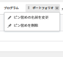

# ページを固定してワークスペースをカスタマイズ

可視性の向上、適切な整理、迅速なアクセスを実現するために、[!DNL Adobe Workfront] の最も重要な作業をピン留めすることができます。ピン留めされたページは、Workfront の任意のページの上部から常にアクセスできます。

ページが既にピン留めされているレイアウトテンプレートに割り当てられる場合があります（[レイアウトテンプレートを使用してピン留めされたページをカスタマイズ](../../administration-and-setup/customize-workfront/use-layout-templates/customize-pinned-pages.md)で説明されています）。これらの事前定義済みピンは、名前の変更や削除はできません。ピン留めしたページは、事前定義済みピンの右側に表示されます。

## アクセス要件

この記事の手順を実行するには、次のアクセス権が必要です。

<table style="table-layout:auto"> 
 <col> 
 </col> 
 <col> 
 </col> 
 <tbody> 
  <tr> 
   <td role="rowheader"><strong>[!DNL Adobe Workfront] プラン*</strong></td> 
   <td> 
任意
 </td> 
  </tr> 
  <tr> 
   <td role="rowheader"><strong>[!DNL Adobe Workfront] ライセンス*</strong></td> 
   <td> 
[!UICONTROL Request] 以降
 </td> 
  </tr> 
 </tbody> 
</table>

&#42;保有しているプランやライセンスの種類については、[!DNL Workfront] 管理者にお問い合わせください。

## ページのピン留め

1. ピン留めするページに移動します。

   プロジェクト、タスク、リクエストキューなど、任意の作業アイテムにすることができます。

1. ページ上部の「**[!UICONTROL 現在のページをピン留め]**」をクリックします。

   ピン留めされたページは、[!DNL Workfront] の任意のページの上部からアクセスできるようになりました。

## ピン留めされたページにアクセスする

1. ページの上部で、表示するピン留めされたページをクリックします。

   >[!TIP]
   >
   >ピン留めされたページの上にポインタを合わせると、完全な名前と説明が表示されます。

   または

   多数のページをピン留めしている場合は、**[!UICONTROL その他] メニュー**  をクリックして、追加のピン留めされたページを表示します。

   ピン留めされたページが表示されます。

## ピン留めされたページの名前を変更する

ピン留めされたページの名前を変更して、より意味のある名前にすることができます。

1. 上部のナビゲーションまたは&#x200B;**[!UICONTROL その他メニュー]**&#x200B;でピン留めされたページにポインタを合わせます。
1. ピン留め名の横の矢印をクリックし、「**[!UICONTROL ピン留めの名前を変更]**」を選択します。

   

1. 新しいピン留め名を入力し、「チェックマーク」アイコンをクリックするか、Enter を押します。

   

   チェックマークをクリックした後、または Enter を押した後、小さなポップアップウィンドウが数秒間表示され、保存する前にピン留め名の変更を元に戻すことができます。

## ピン留めされたページを並べ替える

ピン留めされたページの表示順を並べ替えることができます。

1. 上部のナビゲーションまたは&#x200B;**[!UICONTROL その他メニュー]**&#x200B;でピン留めされたページにポインタを合わせます。手のカーソルが表示されたら、ピンをクリックし、目的の順序にドラッグします。

   変更内容は自動的に保存され、次回 Workfront にアクセスしたときに記憶されます。

## ピン留めされているページを削除する

1. ピン留めされたページのピン留めを解除するページをクリックします。
1. 画面上部の「**[!UICONTROL 現在のページをピン留めを解除]**」をクリックします。

   または

   ピン留め名の横の矢印をクリックし、「**[!UICONTROL ピン留めを削除]**」を選択します。

   

   このページは、[!DNL Workfront] のどのページの上部からもアクセスできなくなります。
