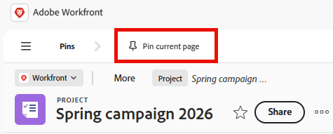
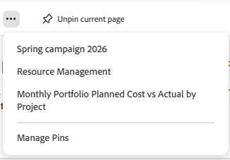

# ページを固定してワークスペースをカスタマイズ

<!-- Audited: 4/2025 -->

可視性の向上、適切な整理、迅速なアクセスを実現するために、[!DNL Adobe Workfront] の最も重要な作業をピン留めすることができます。 ピン留めされたページは、Workfront の任意のページの上部から常にアクセスできます。

ページが既にピン留めされているレイアウトテンプレートに割り当てられる場合があります（[レイアウトテンプレートを使用してピン留めされたページをカスタマイズ](../../administration-and-setup/customize-workfront/use-layout-templates/customize-pinned-pages.md)で説明されています）。 これらの事前定義済みピンは、名前の変更や削除はできません。 ピン留めしたページは、事前定義済みピンの右側に表示されます。

## アクセス要件

+++ 展開すると、この記事の機能のアクセス要件が表示されます。

<table style="table-layout:auto"> 
 <col> 
 </col> 
 <col> 
 </col> 
 <tbody> 
  <tr> 
   <td role="rowheader"><strong>[!DNL Adobe Workfront] パッケージ</strong></td> 
   <td> 
任意
 </td> 
  </tr> 
  <tr> 
   <td role="rowheader"><strong>[!DNL Adobe Workfront] ライセンス</strong></td> 
   <td> 
コントリビューター
 
     
リクエスト

   </td> 
  </tr> 
 </tbody> 
</table>

詳しくは、[Workfront ドキュメントのアクセス要件](/help/quicksilver/administration-and-setup/add-users/access-levels-and-object-permissions/access-level-requirements-in-documentation.md)を参照してください。

+++

## ページのピン留め

1. 固定するページに移動します。 プロジェクト、タスク、リクエストキューなど、任意の作業アイテムにすることができます。

1. ページの左上隅にある「**[!UICONTROL 現在のページをピン留め]**」をクリックします。 ピン留めされたページは、[!DNL Workfront] の任意のページの上部からアクセスできるようになりました。

   

## ピン留めされたページにアクセスする

1. ページの上部で、表示するピン留めされたページをクリックします。

   >[!TIP]
   >
   >ピン留めされたページの上にポインタを合わせると、完全な名前と説明が表示されます。

   または

   多数のページをピン留めしている場合は、**[!UICONTROL 詳細]** アイコン をクリックして、ピン留めされた追加のページを表示します。

   

   ピン留めされたページが表示されます。

## ピンの管理

ピン留めされたページの名前の変更、並べ替え、削除を1か所で行うことができます。

1. **[!UICONTROL 詳細]** アイコン をクリックし、**ピンの管理**&#x200B;を選択します。
1. **ピンの管理** ボックスで、次の1つ以上の操作を行います。

   * ピン留めされたページの名前を変更するには、**編集** アイコンをクリックします。 新しい名前を入力し、チェックマークアイコンをクリックして確認します。
   * ピン留めしたページを表示する順序でドラッグ&amp;ドロップします。
   * **削除** アイコンをクリックして、ピン留めされたページをリストから削除します。

   

1. ピンの編集が終了したら、**閉じる**&#x200B;をクリックします。

<!--
## Rename a pinned page

1. Hover over the pinned page in the top navigation.
1. Click the **More** icon  that appears next to the pin name and select **[!UICONTROL Rename pin]**.

   

1. Type the new pin name, then click **Save**.

   

## Reorder pinned pages

You can rearrange the order that pinned pages appear.

1. Hover over the pinned page you want to move, then click the **More** icon .
1. Choose **Move left** or **Move right** to move your pin. 
1. (Optional) Choose **Move to front** to move your pin to the far-left position of the pin bar. 

   

   Your changes automatically save and are remembered the next time you access Workfront.

## Remove a pinned page

1. Click the **More** icon  next to the pin you want to remove.
1. Click **Remove pin**. The page is no longer accessible from the top of any page in [!DNL Workfront].

   
-->

