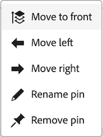

# ページを固定してワークスペースをカスタマイズ

可視性の向上、適切な整理、迅速なアクセスを実現するために、[!DNL Adobe Workfront] の最も重要な作業をピン留めすることができます。ピン留めされたページは、Workfront の任意のページの上部から常にアクセスできます。

ページが既にピン留めされているレイアウトテンプレートに割り当てられる場合があります（[レイアウトテンプレートを使用してピン留めされたページをカスタマイズ](../../administration-and-setup/customize-workfront/use-layout-templates/customize-pinned-pages.md)で説明されています）。これらの事前定義済みピンは、名前の変更や削除はできません。ピン留めしたページは、事前定義済みピンの右側に表示されます。

## アクセス要件

+++ 展開すると、この記事の機能のアクセス要件が表示されます。

この記事の手順を実行するには、次のアクセス権が必要です。

<table style="table-layout:auto"> 
 <col> 
 </col> 
 <col> 
 </col> 
 <tbody> 
  <tr> 
   <td role="rowheader"><strong>[!DNL Adobe Workfront] プラン*</strong></td> 
   <td> 
任意
 </td> 
  </tr> 
  <tr> 
   <td role="rowheader"><strong>[!DNL Adobe Workfront] ライセンス</strong></td> 
   <td> 
新規：コントリビューター
 
   
または

     
現在：リクエスト

   </td> 
  </tr> 
 </tbody> 
</table>

この表の情報について詳しくは、[Workfront ドキュメントのアクセス要件](/help/quicksilver/administration-and-setup/add-users/access-levels-and-object-permissions/access-level-requirements-in-documentation.md)を参照してください。

+++

## ページのピン留め

1. ピン留めするページに移動します。 プロジェクト、タスク、リクエストキューなど、任意の作業アイテムにすることができます。

1. ページの左上隅にある「**[!UICONTROL 現在のページをピン留め]**」をクリックします。 ピン留めされたページは、[!DNL Workfront] の任意のページの上部からアクセスできるようになりました。

## ピン留めされたページにアクセスする

1. ページの上部で、表示するピン留めされたページをクリックします。

   >[!TIP]
   >
   >ピン留めされたページの上にポインタを合わせると、完全な名前と説明が表示されます。

   または

   多数のページがピン留めされている場合は、**[!UICONTROL その他]** アイコン  をクリックして、追加のピン留めページを表示します。

   

   ピン留めされたページが表示されます。

## ピン留めされたページの名前を変更

1. 上部のナビゲーションのピン留めされたページの上にマウスポインターを置きます。
1. ピン名の横に表示されている **その他** アイコン  をクリックし、「**[!UICONTROL ピン留めの名前を変更]**」を選択します。

   

1. 新しいピン名を入力し、「**保存**」をクリックします。

   

## ピン留めされたページを並べ替える

ピン留めされたページの表示順を並べ替えることができます。

1. 移動するピン留めされたページにポインタを合わせ、「その他 **アイコン  す。
1. **左に移動** または **右に移動** を選択して、ピンを移動します。
1. （オプション）「**前面に移動**」を選択して、ピンをピンバーの左端の位置に移動します。

   

   変更内容は自動的に保存され、次回 Workfront にアクセスしたときに記憶されます。

## ピン留めされているページを削除する

1. 削除するピンの横にある **その他** アイコン  をクリックします。
1. **ピン留めを削除** をクリックします。 このページは、[!DNL Workfront] のどのページの上部からもアクセスできなくなります。

   

