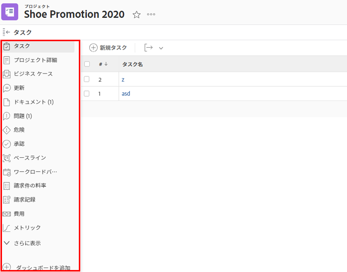
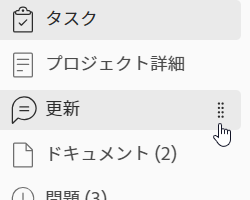

# 左側のナビゲーション [!DNL Adobe Workfront]

WF のほとんどの領域とオブジェクトは、画面の左側にある単純なナビゲーションパネルを使用します。 左側のパネルナビゲーションには次の利点があります。

* 画面領域の管理が改善されました。
* お使いの [!DNL Workfront] 管理者は、レイアウトテンプレートを使用して、オブジェクトの詳細を除く、左側のパネルの任意のセクションを非表示にできます。

   レイアウトテンプレートの使用について詳しくは、 [レイアウトテンプレートの作成と管理](../../administration-and-setup/customize-workfront/use-layout-templates/create-and-manage-layout-templates.md).

* 画面を必要な順序でドラッグ&amp;ドロップすることで、追加の画面を開かずに、左側のナビゲーションでセクションの順序を簡単に変更できます。

   詳しくは、この記事の次の節を参照してください。 [左側のナビゲーションパネルを使用します。](#use-the-left-navigation-panel).

* ダッシュボードを追加して、左側のパネルをカスタマイズできます。

## アクセス要件

この記事の手順を実行するには、次のアクセス権が必要です。

<table style="table-layout:auto"> 
 <col> 
 </col> 
 <col> 
 </col> 
 <tbody> 
  <tr> 
   <td role="rowheader"><strong>[!DNL Adobe Workfront] 計画*</strong></td> 
   <td> 
任意
 </td> 
  </tr> 
  <tr> 
   <td role="rowheader"><strong>[!DNL Adobe Workfront] ライセンス*</strong></td> 
   <td> 
[!UICONTROL リクエスト ] 以降
 </td> 
  </tr> 
 </tbody> 
</table>

&#42;保有するプランやライセンスの種類を確認するには、 [!DNL Workfront] 管理者。

## 左側のナビゲーションパネルのデフォルトのセクション

左側のパネルから、Adobe Workfrontの様々なオブジェクトや領域に関するオブジェクトや領域の詳細情報にアクセスできます。

オブジェクトまたは移動先の領域に応じて、左側のパネルに表示されるセクションが異なります。

左側のパネルは、次のオブジェクトで使用できます。

* プロジェクト
* タスク
* 問題
* ポートフォリオ
* プログラム
* テンプレート
* テンプレート タスク
* 反復
* ユーザー
* チーム
* グループ
* 目標

>[!IMPORTANT]
>
>左のパネルにデフォルトで 1 つのセクションのみが表示される場合 ( 例： **[!UICONTROL すべてのプロジェクト]** 内 **[!UICONTROL プロジェクト]** 面積 [!DNL Workfront] 管理者は、レイアウトテンプレートを作成する際に、この領域にカスタムセクションを少なくとも 1 つ追加し、左のパネルがその領域に表示される前に、そのテンプレートに割り当てる必要があります。\
>を [!DNL Workfront] 管理者は、レイアウトテンプレートの左側のパネルをカスタマイズします。詳しくは、 [レイアウトテンプレートを使用して左のパネルをカスタマイズする](../../administration-and-setup/customize-workfront/use-layout-templates/customize-left-panel.md).

左側のパネルは、次の領域で使用できます。

* [のデフォルトのセクション [!UICONTROL ダッシュボード] 領域](#default-sections-in-the-dashboards-area)
* [のデフォルトのセクション [!UICONTROL リクエスト] 領域](#default-sections-in-the-requests-area)
* [のデフォルトのセクション [!UICONTROL リソース] 領域](#default-sections-in-the-resourcing-area)
* [のデフォルトのセクション [!UICONTROL プロジェクト] 領域](#default-sections-in-the-projects-area)
* [のデフォルトのセクション [!UICONTROL タイムシート] 領域](#default-sections-in-the-timesheets-area)
* [のデフォルトのセクション [!DNL Goals] 領域](#default-sections-in-the-goals-area)

### のデフォルトのセクション [!UICONTROL ダッシュボード] 領域

次のセクションは、 **[!UICONTROL ダッシュボード]** 領域：

<table style="table-layout:auto">
    <tr>
        <td><strong>[!UICONTROL マイダッシュボード ]</strong></td>
        <td>作成したダッシュボードが表示されます。</td>
    </tr>
    <tr>
        <td><strong>[!UICONTROL 共有ダッシュボード ]</strong></td>
        <td>他のユーザーが作成し、自分と共有しているダッシュボードが表示されます。</td>
    </tr>
    <tr>
        <td><strong>[!UICONTROL すべてのダッシュボード ]</strong></td>
        <td>自分または他のユーザーが作成したダッシュボードと、少なくとも表示する権限を持つダッシュボードが表示されます。</td>
    </tr>
</table>

ダッシュボード領域の左側のパネルの使用方法については、「 [左側のナビゲーションパネルを使用します。](#use-the-left-navigation-panel) 」を参照してください。

### のデフォルトのセクション [!UICONTROL リクエスト] 領域

<table style="table-layout:auto">
    <tr>
        <td><strong>[!UICONTROL 送信済み ]</strong></td>
        <td>自分または他のユーザーが送信したリクエストと、少なくとも表示する権限を持つリクエストを表示します。 リクエストリストの右上隅にあるフィルターを使用して、自分のリクエストや、他のユーザーが送信したリクエスト、および表示するアクセス権を持っているリクエストを表示します。</td>
    </tr>
    <tr>
        <td><strong>[!UICONTROL ドラフト ]</strong></td>
        <td>開始したがまだ送信していないリクエストを表示します。 [!DNL Workfront] キュートピックを選択した後、[ 下書き ] フォルダに新しい要求が自動的に保存されます。</td>
    </tr>
</table>

左側のパネルを使用する方法については、 [!UICONTROL リクエスト] 領域（「セクション」を参照） [左側のナビゲーションパネルを使用します。](#use-the-left-navigation-panel) 」を参照してください。

### のデフォルトのセクション [!UICONTROL リソース] 領域

次のセクションは、 **[!UICONTROL リソース]** 領域：

<table style="table-layout:auto"> 
 <col> 
 <col> 
 <tbody> 
  <tr> 
   <td role="rowheader"><strong>計画担当者</strong></td> 
   <td>リソース・プランナを表示します。 この領域を使用して、複数のプロジェクトにわたってリソースを計画します。 リソース・プランナの使用に関する詳細は、 <a href="../../resource-mgmt/resource-planning/get-started-resource-planning.md" class="MCXref xref">リソース計画の概要</a>.</td> 
  </tr> 
  <tr> 
   <td role="rowheader"><strong>[!UICONTROL ワークロードバランサー ]</strong></td> 
   <td>ワークロード・バランサを表示します。 この領域を使用して、リソースに実績作業時間を割り当てます。  
   リソースのスケジュール設定について詳しくは、 <a href="../../resource-mgmt/workload-balancer/assign-work-in-workload-balancer.md" class="MCXref xref">ワークロードバランサーでの作業割り当ての概要</a>.</td> 
  </tr> 
  <tr> 
   <td role="rowheader"><strong>稼働率</strong></td> 
   <td>稼働状況レポートを表示します。 使用率レポートの読み取り方法については、 <a href="../../reports-and-dashboards/reports/using-built-in-reports/resource-utilization-report.md" class="MCXref xref">リソース使用率レポートの概要</a>.</td> 
  </tr> 
  <tr> 
   <td role="rowheader"><strong>リソース プール</strong></td> 
   <td>Workfrontのすべてのリソースプールを表示します。 リソースプールの詳細については、 <a href="../../resource-mgmt/resource-planning/resource-pools/work-with-resource-pools.md" class="MCXref xref"> リソースプールの概要 </a>.</td>
  </tr> 
 </tbody> 
</table>

左側のパネルを使用する方法については、 [!UICONTROL リソース] 領域（「セクション」を参照） [左側のナビゲーションパネルを使用します。](#use-the-left-navigation-panel) 」を参照してください。

### のデフォルトのセクション [!UICONTROL プロジェクト] 領域

次のセクションは、 **[!UICONTROL プロジェクト]** 領域：

<table style="table-layout:auto">
    <tr>
        <td><strong>[!UICONTROL すべてのプロジェクト ]</strong></td>
        <td>表示するアクセス権のあるすべてのプロジェクトを表示します。 [!UICONTROL フィルター ] ドロップダウンメニューを使用して、表示するプロジェクトを変更します</td>
    </tr>
    <tr>
        <td><strong>[!UICONTROL カスタムセクション ]</strong></td>
        <td>この [!DNL Workfront] 管理者が、レイアウトテンプレートの [!UICONTROL プロジェクト ] 領域の左側のパネルに追加されました。 カスタムセクションには、お使いの環境用にカスタマイズされた名前が付けられます。</td>
    </tr>
</table>

左側のパネルを使用する方法については、 [!UICONTROL プロジェクト] 領域（「セクション」を参照） [左側のナビゲーションパネルを使用します。](#use-the-left-navigation-panel) 」を参照してください。

### のデフォルトのセクション [!UICONTROL タイムシート] 領域

次のセクションは、 **[!UICONTROL タイムシート]** 領域：

<table style="table-layout:auto">
    <tr>
        <td><strong>[!UICONTROL マイタイムシート ]</strong></td>
        <td>既定でアクティブなタイムシートがすべて表示されます。 送信済みまたは終了済みのタイムシートを表示するには、[!UICONTROL フィルター ] ドロップダウンメニューから [!UICONTROL 送信済み ] または [!UICONTROL すべて ] を選択します。</td>
    </tr>
    <tr>
        <td><strong>[!UICONTROL タイムシート [ 承認 ]]</strong></td>
        <td>既定で、承認用に送信されたタイムシートを表示します。 承認者であるアクティブなタイムシートまたはすべてのタイムシートを表示するには、[ フィルタ ] ドロップダウンメニューから [!UICONTROL アクティブ ] または [ アプリ ] を選択します。</td>
    </tr>
    <tr>
        <td><strong>[!UICONTROL すべてのタイムシート ]</strong></td>
        <td>左側の [ フィルタ ] 領域で選択したフィルタに基づいて、表示するアクセス権のあるすべてのタイムシートを表示します。</td>
    </tr>
</table>

左側のパネルを使用する方法については、 [!UICONTROL タイムシート] 領域（「セクション」を参照） [左側のナビゲーションパネルを使用します。](#use-the-left-navigation-panel) 」を参照してください。

### のデフォルトのセクション [!DNL Goals] 領域

>[!NOTE]
>
>目標にアクセスするには、追加のライセンスが必要です。 詳しくは、 [!DNL Workfront Goals]を参照してください。 [[!DNL Adobe Workfront Goals] 概要](../../workfront-goals/goal-management/wf-goals-overview.md).

次のセクションは、 **[!UICONTROL 目標]** 領域：

<table style="table-layout:auto">
    <tr>
        <td><strong>[!UICONTROL 目標リスト ]</strong></td>
        <td>表示するアクセス権のあるすべての目標が表示されます。 詳しくは、 <a href="../../workfront-goals/goal-review-and-workfront-goals-sections/manage-goals-in-goal-list.md">次の [!UICONTROL 目標リスト ] で目標を管理 [!DNL Adobe Workfront Goals]</a>.</td>
    </tr>
    <tr>
        <td><strong>[!UICONTROL グラフ ]</strong></td>
        <td>目標の効果をグラフで表示します。 詳しくは、 <a href="../../workfront-goals/goal-review-and-workfront-goals-sections/review-goal-graphs.md">グラフを確認しての目標の進行傾向を理解する [!DNL Adobe Workfront] 目標</a>.</td>
    </tr>
    <tr>
        <td><strong>[!UICONTROL 目標の整列 ]</strong></td>
        <td>階層内で目標の配置を表示します。 詳しくは、 <a href="../../workfront-goals/goal-alignment/goal-alignment-overview.md">の目標の整合の概要 [!DNL Adobe Workfront Goals]</a>.</td>
    </tr>
    </table>

<!--
   Drafted - removed from UI 
   <table>
    <tr>
        <td><strong>[!UICONTROL Pulse]</strong></td>
        <td>Displays a quick overview of all active goals and their progress. For more information, see <a href="../../workfront-goals/goal-review-and-workfront-goals-sections/review-goals-in-pulse.md">Review goals in the [!UICONTROL [!DNL Adobe Workfront Goals] Pulse] section</a>.
        
This section has been removed from the Preview environment.

        </td>
    </tr>
    <tr>
        <td><strong>[!UICONTROL Check-in]</strong></td>
        <td>Displays a quick overview of your active goals and their progress. For more information, see <a href="../../workfront-goals/goal-review-and-workfront-goals-sections/check-in-goals.md">Update goal progress in [!DNL Adobe Workfront Goals]</a>.
        
This section has been removed from the Preview environment.

        </td>
    </tr>
</table>
-->
左側のパネルを使用する方法については、 [!UICONTROL 目標] 領域（「セクション」を参照） [左側のナビゲーションパネルを使用します。](#use-the-left-navigation-panel) 」を参照してください。

## 左側のナビゲーションパネルを使用します。

左側のパネルでの情報の検索と編集は、これらのオブジェクトに似ています。 左側のパネルで使用できるオプションは、アクセスするオブジェクトによって異なります。

特定の領域で利用できるセクションについては、 [[!UICONTROL デフォルトのセクション] （左側のナビゲーションパネル）](#default-sections-in-the-left-navigation-panel).

1. 次をクリック： **[!UICONTROL メインメニュー]** アイコン をクリックしてから、オブジェクトの名前をクリックしてアクセスします。

   オブジェクトページが表示されます。

1. （条件付き）オブジェクトのリストを含む領域を選択した場合、 **[!UICONTROL プロジェクト]** または **[!UICONTROL Portfolio]** — 左側のパネルナビゲーションにアクセスするには、次の操作を行う必要があります。

   1. リスト内のオブジェクトをクリックします。
   1. （オプション）左側のパネルナビゲーションで、別のオブジェクト ( 例： **[!UICONTROL タスク]** または **[!UICONTROL 問題]** プロジェクト内 — 左パネルでオブジェクトのリストにアクセスし、特定のオブジェクトの名前をクリックします。\

      オブジェクトページが表示されます。

1. オブジェクトページで、左側のパネルの任意のセクションをクリックして、そのセクションの情報を表示または編集します。

   情報を編集するには、その前にオブジェクトを編集する権限が必要です。

   

1. （オプション）「 **[!UICONTROL さらに表示]** をクリックして、さらにセクションを表示します。

   >[!NOTE]
   >
   >デフォルトですべてのセクションが左側のパネルに表示されている場合、このオプションは使用できません。

1. （オプション）ダッシュボードのクイックリンクを追加するには、 **[!UICONTROL ダッシュボードを追加]** 左のパネルの下部で、次の操作を行います。

   1. ダッシュボードの名前を **[!UICONTROL クイックリンク名]** フィールドに入力します。
   1. 既存のダッシュボードの名前を **[!UICONTROL ダッシュボードを選択]** 「 」フィールドを選択し、リストに表示されたらダッシュボードをクリックします。

      >[!TIP]
      >
      >ダッシュボードをリストに表示する前に、作成する必要があります。

   1. クリック **[!UICONTROL 追加]**.

      左側のパネルの下部にダッシュボードのリンクが表示されます。

1. （オプション）左側のパネルでセクションの順序を変更するには、 **[!UICONTROL ドラッグ]** アイコン  セクションの右にドラッグし、上下にドラッグします。

   

1. （オプション）左のパネルを閉じるには、 **[!UICONTROL 折りたたむ]** アイコン .

   >[!NOTE]
   >
   >左のパネルを折りたたむと、 [!DNL Workfront] 別の場所に移動しても、好みを保持します [!DNL Workfront] オブジェクト。 左側のパネルを再度展開するには、 **[!UICONTROL 展開]** アイコン .
