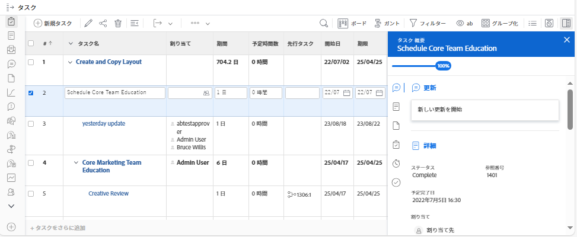
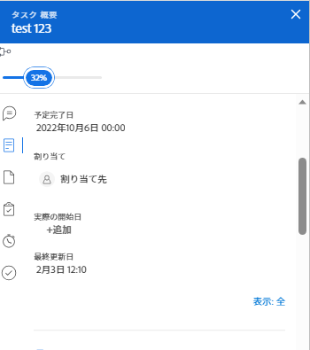
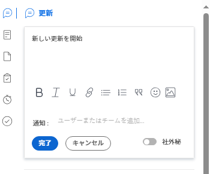
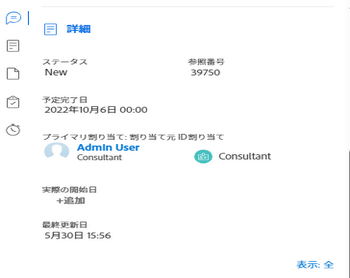
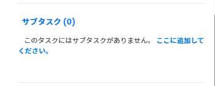
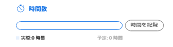

# [!UICONTROL 概要] 概要

以下を使用して、 [!UICONTROL 概要] タスクの問題、ドキュメント、またはタスクの他の領域から直接作業項目情報を確認し、更新するパネル [!DNL Adobe Workfront] タスクと問題を表示する

次の表に、 [!UICONTROL 概要] パネル：

<table style="table-layout:auto"> 
 <col data-mc-conditions=""> 
 <tbody> 
  <tr> 
   <td>タスク</td> 
  </tr> 
  <tr> 
   <td> 
タスクリスト内の
 
    <ul> 
     <li>プロジェクト</li> 
     <li>サブタスク</li> 
    </ul> </td> 
  </tr> 
  <tr> 
   <td>[!UICONTROL Unassigned] および [!UICONTROL Assigned] [!UICONTROL Workload Balancer] の作業領域のタスク</td> 
  </tr> 
  <tr data-mc-conditions=""> 
   <td>問題</td> 
  </tr> 
  <tr data-mc-conditions=""> 
   <td> 
問題リストの
 
    <ul> 
     <li>プロジェクト</li> 
     <li>タスク</li> 
     <li>サブタスク</li> 
    </ul> </td> 
  </tr> 
  <tr data-mc-conditions=""> 
   <td>[!UICONTROL ワークロードバランサー ] の [!UICONTROL 割り当て済み作業領域の問題</td> 
  </tr> 
  <tr data-mc-conditions=""> 
   <td>[!UICONTROL 要求 ] 領域の [!UICONTROL Submitted] セクションの問題</td> 
  </tr> 
  <tr data-mc-conditions=""> 
   <td>ドキュメント</td> 
  </tr> 
  <tr data-mc-conditions=""> 
   <td>[!UICONTROL ドキュメント ] 領域</td> 
  </tr> 
  <tr data-mc-conditions=""> 
   <td>[!UICONTROL ドキュメント ] セクション（プロジェクト、タスク、イシュー、プログラム、ポートフォリオ、テンプレート、テンプレートタスク、ユーザー）</td> 
  </tr> 
 </tbody> 
</table>

<!--

Workfront administrators can customize the Summary in the Layout Template. For more information, see <a href="../../administration-and-setup/customize-workfront/use-layout-templates/create-and-manage-layout-templates.md" class="MCXref xref">Create and manage layout templates</a>.

-->

この記事では、 [!UICONTROL 概要] リストのタスクと問題に関するパネル

にアクセスする方法について詳しくは、 [!UICONTROL 概要] 内 [!UICONTROL ワークロードバランサー]を参照してください。 [の作業項目を更新 [!UICONTROL ワークロードバランサー] の使用 [!UICONTROL 概要]](../../resource-mgmt/workload-balancer/update-items-in-summary-panel-in-workload-balancer.md).

にアクセスする方法について詳しくは、 [!UICONTROL 概要] ドキュメントについては、 [[!UICONTROL 概要] ドキュメントの概要](../../documents/managing-documents/summary-for-documents.md).

## アクセス要件

この記事の手順を実行するには、次のアクセス権が必要です。

<table style="table-layout:auto"> 
 <col> 
 <col> 
 <tbody> 
  <tr> 
   <td role="rowheader"><strong>[!DNL Adobe Workfront] 計画*</strong></td> 
   <td> 
任意
 </td> 
  </tr> 
  <tr> 
   <td role="rowheader"><strong>[!DNL Adobe Workfront] ライセンス*</strong></td> 
   <td> 
[!UICONTROL リクエスト ] 以降
 </td> 
  </tr> 
  <tr> 
   <td role="rowheader"><strong>アクセスレベル設定*</strong></td> 
   <td> 
[!UICONTROL 表示 ] 以降のタスク、問題、ドキュメントへのアクセス権
 
[!UICONTROL View] またはそれ以降のバージョンから、ドキュメントの [!UICONTROL Summary] を表示する任意のオブジェクトへのアクセス権が与えられます
 
注意：まだアクセス権がない場合は、 [!DNL Workfront] 管理者（アクセスレベルに追加の制限を設定している場合） を参照してください。 [!DNL Workfront] 管理者はアクセスレベルを変更できます。詳しくは、 <a href="../../administration-and-setup/add-users/configure-and-grant-access/create-modify-access-levels.md" class="MCXref xref">カスタムアクセスレベルの作成または変更</a>.
 </td> 
  </tr> 
  <tr> 
   <td role="rowheader"><strong>オブジェクト権限</strong></td> 
   <td> 
タスク、イシューまたはドキュメントに対する [!UICONTROL 表示 ] 以上の権限
 
追加のアクセス権のリクエストについて詳しくは、 <a href="../../workfront-basics/grant-and-request-access-to-objects/request-access.md" class="MCXref xref">オブジェクトへのアクセスのリクエスト </a>.
 </td> 
  </tr> 
 </tbody> 
</table>

&#42;ご利用のプラン、ライセンスの種類、アクセス権を確認するには、 [!DNL Workfront] 管理者。

## 次を表示： [!UICONTROL 概要] タスクまたは問題のリストのパネル

1. タスクまたはイシューに移動し、リストから項目を選択します。
1. 次をクリック： **[!UICONTROL 概要]** アイコン 

   または

   次をクリック： **[!UICONTROL 概要を開く]** アイコン  内 [!UICONTROL 送信済み] セクション [!UICONTROL リクエスト] 領域

   サマリーを開いた後も、他のタスクやイシューをクリックまたは選択しても開いたままになり、手動で閉じるまで開いたままになります。

   >[!TIP]
   >
   >タスクの詳細を表示するには、一度に 1 つのタスクまたは 1 つのタスクのみを選択できます。詳細は、 [!UICONTROL 概要] パネル。

   

1. （オプション）を閉じるには、 [!UICONTROL 概要] パネルで、次のいずれかの操作を行います。

   * タスクまたはタスクの一覧で、 **[!UICONTROL 概要を開く]** アイコン 

     または

     次をクリック： **X** アイコン [!UICONTROL 概要] パネル。

   * 内 [!UICONTROL 送信済み] セクション [!UICONTROL リクエスト] 」領域で、 **[!UICONTROL 概要を閉じる]** アイコン 

     または

     次をクリック： **X** アイコンをクリックします。

## [!UICONTROL 完了率]

の上部にあるプログレスバーを使用します。 [!UICONTROL 概要] ：選択したタスクまたはタスクの完了率を更新します。 数値を入力するか、バーを正しい割合にドラッグします。

## [!UICONTROL アップデート]

以下を使用： [!UICONTROL 更新] セクション [!UICONTROL 概要] 最近の更新を表示し、選択したタスクまたは問題を更新する場合。 クリック **[!UICONTROL すべてを表示]** 直接に [!UICONTROL 更新] 」タブをクリックします。

## [!UICONTROL ドキュメント]

以下を使用： [!UICONTROL ドキュメント] セクション [!UICONTROL 概要] 選択したタスクまたは問題に添付されたドキュメントを表示するには、次の手順に従います。 サムネールをクリックして、ドキュメントのプレビューを開きます。 直接 [!UICONTROL ドキュメント] タスクまたはイシューのタブで、 **[!UICONTROL ドキュメント]** タイトル。

## [!UICONTROL 詳細]

以下を使用： [!UICONTROL 詳細] セクション [!UICONTROL 概要] 作業項目の詳細を表示するには、割り当てを行うか、開始日を追加します。 クリック **[!UICONTROL すべてを表示]** 直接に [!UICONTROL 詳細] タスクまたはイシューのタブ

>[!NOTE]
>
>このセクションに表示されるフィールドは、ホームの右側のパネルに表示されるフィールドと同じです。 これらのフィールドはカスタマイズできます [カスタマイズ [!UICONTROL ホーム] および [!UICONTROL 概要] レイアウトテンプレートの使用](../../administration-and-setup/customize-workfront/use-layout-templates/customize-home-summary-layout-template.md).

## [!UICONTROL サブタスク]

このセクションは、タスクに対してのみ使用できます。 以下を使用： [!UICONTROL サブタスク] セクション [!UICONTROL 概要] 見る [!UICONTROL 新規], [!UICONTROL 処理中]、および [!UICONTROL クローズ] 選択したタスクのサブタスク。 次をクリック： **[!UICONTROL ステータス]** ドロップダウンメニューを使用して、ステータスを切り替えることができます。 直接 [!UICONTROL サブタスク] タスクの「 」タブで、 **[!UICONTROL サブタスク]**&#x200B;タイトル

タスクにサブタスクを追加していない場合は、 **[!UICONTROL ここに追加]** 直接に [!UICONTROL サブタスク] 」タブをクリックします。

## [!UICONTROL 時間]

以下を使用： [!UICONTROL 時間] セクション [!UICONTROL 概要] 選択したタスクまたは問題に関する時間を記録します。 クリック **[!UICONTROL ログ時間]** 時間を入力します。 タスクまたはイシューの「時間」タブに直接移動するには、 **[!UICONTROL 時間]** タイトル。

時間数： [!UICONTROL 概要] には、ログに記録した時間が表示されます。 他のユーザーの合計時間は [!UICONTROL 概要] タスクにログオンする時間に応じて異なります。

予定がない場合 [!UICONTROL 時間] タスクまたはイシューで、時間をログに記録した場合、時間バーは赤で表示されます。

## 承認

以下を使用： [!UICONTROL 承認] セクション [!UICONTROL 概要] ：選択したタスクまたは問題に関連付けられている承認を表示します。 承認を追加していない場合、ドロップダウンメニューから既存の承認を選択するか、 **[!UICONTROL 単一使用の承認プロセスの作成]** 直接に [!UICONTROL 承認] タスクまたはイシューのタブ

直接 [!UICONTROL 承認] タスクまたはイシューのタブで、 **[!UICONTROL 承認]** タイトル。

